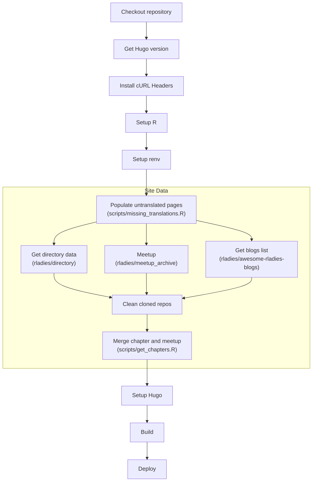

# Repository for the R-Ladies website

<!-- badges: start -->

<!-- badges: end -->

This repository contains the source files for the R-Ladies website. 
The site is built with [hugo](https://gohugo.io/) and [netlify](www.netlify.com)

Information about the site internals and setup can be found in the repo [wiki](https://github.com/rladies/website/wiki)

## Contribute to the site development
There are many types of contributions we are happy to receive, for instance:
- [Site and page translations](https://github.com/rladies/website/wiki/Adding-a-new-language)   
- [Bug reports](https://github.com/rladies/website/issues/new)  
- Responding to and/or fixing [issues](https://github.com/rladies/website/issues)  

If you want to contribute to the site, the best option is to branch the repo if you have access. 
PRs from branches will render previews, while PRs from forks will not. 
If you do not have access to branch the repo, fork and PR when ready, and tag @drmowinckels for review. 
She will get to it asap.

### Reports of bugs
Please report any bugs or issues on the page on [github issues](https://github.com/rladies/website/issues).
You can also use this same link to request content you feel is missing. 
If you would like to give us a hand at fixing some of the issues listed, we would greatly appreciate that.

## Visualisation of build process

