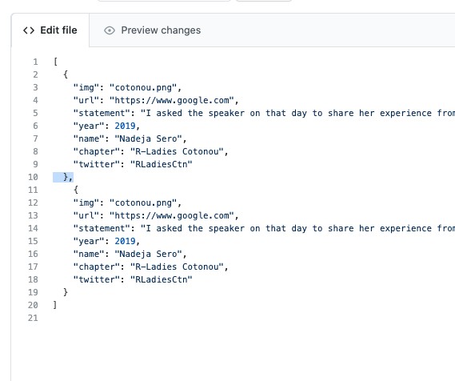
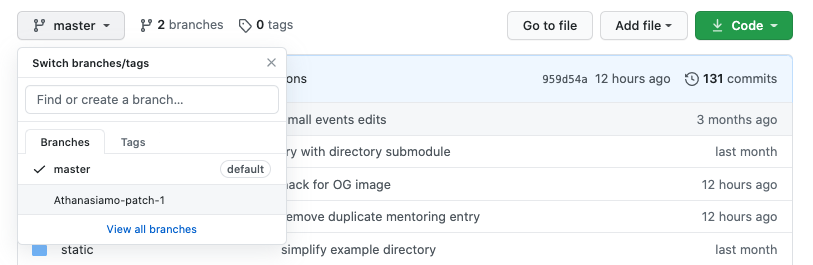
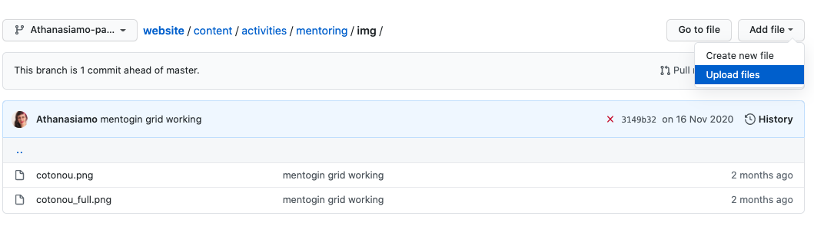
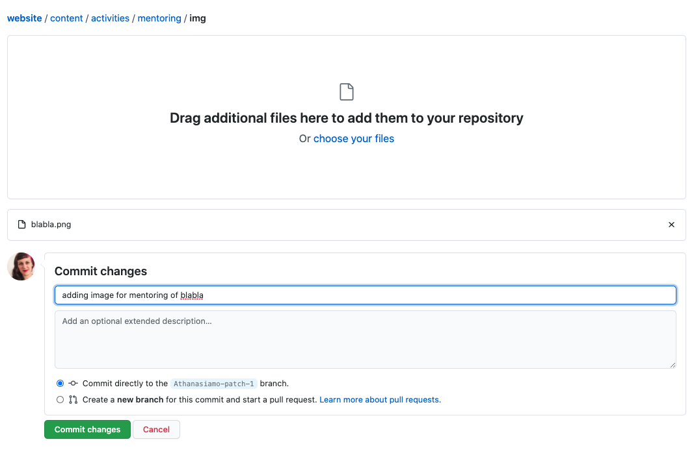
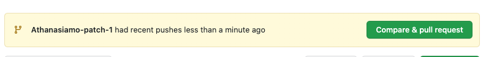
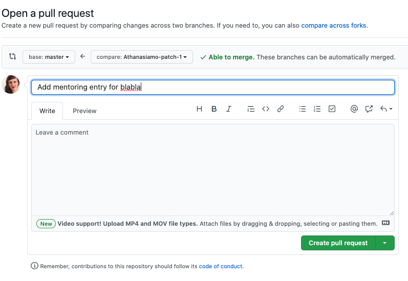

# Repository for the R-Ladies website

<!-- badges: start -->

[](https://app.netlify.com/sites/pensive-babbage-969fad/deploys)
<!-- badges: end -->

This repository contains the source files for the R-Ladies website. 
The site is built with [hugo](https://gohugo.io/) and [netlify](www.netlify.com)

## Setup information
This hugo site is setup as made possible within the hugo framework.
The following information should give you a general idea of how the website is configured and setup.

### Config
The site is configured using a [config directory](https://gohugo.io/getting-started/configuration/#configuration-directory) rather than a single config-file. 
This makes is easier to create large custom configurations but keep the structure clean.

### Content
The content folder has all the content for the website.
Unlike Hugo content made from R-packages, this site does not use `Rmd` as content source, which 
is why the site should not be rendered with R-packages. 

The content also uses [page bundles](https://gohugo.io/content-management/page-bundles/) to make it easier to keep files organised together neatly.
A bundled page means that the page has all its content in a folder (where the folder name is the page name/slug), an `index.md` which is the main content file and all secondary files (images etc.) are nested within this page. 
This makes it possible to use relative paths in the `index.md` to the secondary files, while also keeping a neat file structure. 

### Data
The site used hugo [data templates](https://gohugo.io/templates/data-templates/#readout) for three of the site pages.

- Mentoring program
- Directory 
- Events (coming)

Hugo data template source data are found in the `data` folder, where we have chosen to use `.json` files for this purpose. 

Of these, only the mentoring program has a file that is updated manually by R-Ladies global team members working with the mentoring program. 
The data for the directory contained in this repository is merely a dummy file for local development previews of the directory page. 
The online directory data source is in a private github directory and is only accessed during production rendering of the online webpage. 
The events data is still under development, but this will be updated periodically using github actions and information from [Meetup](https://www.meetup.com/pro/rladies/).

### Static
In the static folder, all files that should be globally accessible to the content files can be placed.
Currently, this only contains images. 
If a file is specifically used for a single content file, it should be bundled with the page, rather than placed in static. 
If is a more general purpose file (like R-ladies logo etc) to be used in multiple files, it is best to place it in static and refer to it by its relative path to the base-url of the page.

```
/images/logo.png  # Looks for the image as placed in static/images/logo.png
images/logo.png   # Looks for the image as relative to the content index.md file
```

### Themes
The theme for the website is an adaptation of the [hugo-initio](https://miguelsimoni.github.io/hugo-initio-site/) theme specifically for this website.

## Contribute to the site development
There are many types of contributions we are happy to receive, for instance:
- Site and page translations   
- Bug reports  
- Responding to and fixing [issues](https://github.com/rladies/website/issues)  

If you want to contribute to the site, the best option is to fork (button to the top right) the repository to your own github, and work with it in the medium you are most comfortable with.
If you are doing simple changes to text-files, you may also do this entirely in the main repository in github, if you are comfortable with that.

### Reports of bugs
Please report any bugs or issues on the page on [github issues](https://github.com/rladies/website/issues).
You can also use this same link to request content you feel is missing. 
If you would like to give us a hand at fixing some of the issues listed, we would grately appreciate that.

### Working on a local copy
If you are working on your own local copy (either as a clone of the main repository [remember to make your own branch!] or as a local fork), the site should be rendered with hugo directly.
This website is developed for hugo, and not R-packages like blogdown or hugodown. 

To render the site locally, open a terminal and use: 

```bash
hugo serve
```
Open a browser and enter the localhost address to see the rendered page.

If you are working from RStudio, the project can be opened in Rstudio as you would normally a blogdown/hugodown site, but instead of serving the site through the R console, open a terminal-tab in the console panel and type the above command. 

### Adding a new language
We hope to be able to translate the site into different key languages. 
There are several steps needed to add a global support for a new language to the site (in contrast to translating a single page).
First, the 2 or 3 [letter language code](https://www.science.co.il/language/Codes.php) for the new language should be established, and used consistently in the translation file contents and names. 

- Add new language to `config/_default/languages.toml`
- Copy and edit `config/_default/menu.en.toml` to the new language
- Copy and edit `themes/hugo-initio-rladies/i18n/en.toml` to the new language

Serve the site and see how the new site language looks.

### Adding entries to the mentoring program page
The data for the mentoring program is updated bu adding new entries to the mentoring program `json`-file.
This can be done directly in github, rather than forking or working on a local copy.
Go to the [mentoring data edit page](https://github.com/rladies/website/edit/master/data/mentoring.json), copy a previous entry (the main bulk between two curly braces), paste it below the last entry (with a comma between entries, i.e. before your `{`), and edit the information. 
Once you are satisfied with the new data you've entered, write a message, make sure to create a new branch, and propose the changes.





Once the changes have been proposed, you will need to add an image to go along with your new entry.
In the previous step, you made a new branch of the repository, a temporary copy that you will ask to be merged into the main repository later.
You will add your image to this branch, so that the image and the new entry come together.
**Note**: the image file name needs to match _exactly_ to the name you wrote in the `json`-file.

In the example images, a branch named `Athanasiamo-patch-1` was made. 
Go to the main [repository page](https://github.com/rladies/website), and look for your new branch in the dropdown meny at the top left of the file contents table.



The site should look more or less the same to you. 
Navigate to [content/activities/mentoring/img/](content/activities/mentoring/img/), and select `Add file` then `Upload files` 


Drag and drop the image for your entry, write a commit message, and make sure it is committed to the branch you are on (should be selected by default).


Once this is done, you are redirected to the main repository page of your current branch, where a message that your branch has recently been pushed to. 
Click the `Compare & pull request` button that appears next to this message.


Change the head message for the pull request to clearly state what the proposed change is about. 
Click on the `Create pull request` button.


Once this is done, someone on the website team will review your proposed changes and make sure that everything is working as expected.
If something needs changing, you will be contacted with information on what needs fixing.
Once everything looks fine, your changes will be merged into the main repository and will appear on the website.
