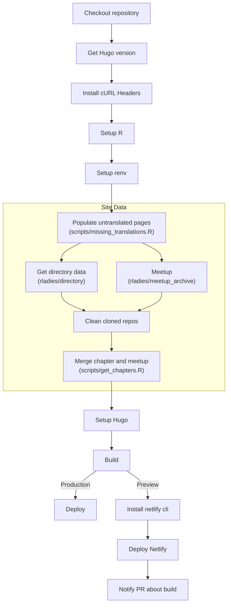

# Repository for the R-Ladies website

<!-- badges: start -->

[](https://app.netlify.com/sites/rladies-dev/deploys)
<!-- ALL-CONTRIBUTORS-BADGE:START - Do not remove or modify this section -->
[](#contributors)
<!-- ALL-CONTRIBUTORS-BADGE:END -->

<!-- badges: end -->

This repository contains the source files for the R-Ladies website.
The site is built with [hugo](https://gohugo.io/) and [netlify](www.netlify.com)

Information about the site internals and setup can be found in the [R-Ladies Organisational Guide](https://guide.rladies.org/website/)

### Reports of bugs

Please report any bugs or issues on the page on [github issues](https://github.com/rladies/rladies.github.io/issues).
You can also use this same link to request content you feel is missing.
If you would like to give us a hand at fixing some of the issues listed, we would greatly appreciate that.

## Visualisation of build process


```mermaid
graph TB

A[Checkout repository] --> B[Get Hugo version]
B --> C[Install cURL Headers]
C --> D[Setup R]
D --> E[Setup renv]
E --> F["Populate untranslated pages\n(scripts/missing_translations.R)"]

subgraph Site Data
  F --> G["Get directory data\n(rladies/directory)"]
  F --> H["Meetup\n(rladies/meetup_archive)"]
  G --> J["Clean cloned repos"]
  J --> K["Merge chapter and meetup\n(scripts/get_chapters.R)"]
end

H --> J
K --> L[Setup Hugo]
L --> M[Build]

M -->|Production| N[Deploy]

M -->|Preview| O[Install netlify cli]
O --> P[Deploy Netlify]
P --> Q["Notify PR about build"]

```

## Contributors

Thanks goes to these wonderful people ([emoji key](https://allcontributors.org/docs/en/emoji-key)):

<!-- ALL-CONTRIBUTORS-LIST:START - Do not remove or modify this section -->
<!-- prettier-ignore-start -->
<!-- markdownlint-disable -->
<!-- markdownlint-restore -->
<!-- prettier-ignore-end -->

<!-- ALL-CONTRIBUTORS-LIST:END -->

This project follows the [all-contributors](https://allcontributors.org) specification. Contributions of any kind welcome!

To add yourself or someone else as a contributor, comment on an issue or PR with:

```
@all-contributors please add @username for code, doc, design
```

See the [emoji key](https://allcontributors.org/docs/en/emoji-key) for the full list of contribution types.
