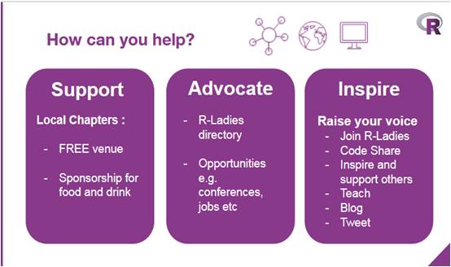

There are many ways to contribute to the RLadies+ community, whether you are here as an individual or representing an organisation.

## For Individuals

### Getting started

- **Update your directory profile.** Make sure your details are current in the [RLadies+ directory](/directory) so others can connect with you.
- **Join the community Slack.** Engage in discussions, ask questions, and stay informed by joining the [community Slack](https://rladies.org/form/community-slack).
- **Follow us on social media.** Keep up with news, events, and activities by following us on [Mastodon](https://hachyderm.io/@RLadiesGlobal).
- **Connect with your local chapter.** Join your regional [RLadies+ chapter](https://www.meetup.com/pro/rladies/) or the remote chapter to connect with people in your area or online.
- **Attend events.** Upcoming events are listed on our [events page](/activities/events/) and on [Meetup](https://www.meetup.com/pro/rladies/). Past recordings and materials are on our [YouTube channel](https://www.youtube.com/@RLadiesGlobal).

### Making a difference

- **Propose a talk.** Share your knowledge by proposing a talk for a local meetup, event, or conference.
- **Write for the blog.** Share insights, tutorials, or experiences on the [website](https://rladies.org/). We are happy to help develop your ideas.
- **Become a chapter organiser.** Volunteer with your local chapter or start a new one — read the [Organiser Guide](https://guide.rladies.org/organization/) and reach out at [chapters@rladies.org](mailto:chapters@rladies.org).
- **Curate for WeAreRLadies.** Generate awareness of RLadies+ expertise by curating [@weare.rladies.org](https://bsky.app/profile/weare.rladies.org) on Bluesky (see the [RoCur Guide](https://guide.rladies.org/rocur/about/)).
- **Join the global team.** Help shape the direction of RLadies+ by joining the [global team](/about-us/global-team/).
- **Contribute to open source.** Create issues or submit pull requests on [GitHub](https://github.com/rladies) for our [website](https://github.com/rladies/rladies.github.io) and [guide](https://github.com/rladies/rladiesguide). Open issues tagged _help wanted_ are listed below.
- **Support our infrastructure.** Make a personal donation via [PayPal](https://www.paypal.com/donate/?hosted_button_id=VB4EK67MJ373E).

## For Organisations

We value the support of organisations that help us grow and sustain the community.

- **Sponsor a local chapter.** Provide financial or in-kind support — venue space, food, beverages — for local meetups and events. Contact chapter organisers directly to discuss sponsorship.
- **Host events.** Offer your venue for RLadies+ meetups or workshops. Reach out to your local chapter organisers.
- **Nominate speakers and workshop leaders.** Encourage employees who use R to volunteer their time and expertise at RLadies+ events.
- **Make a financial contribution.** Donate to RLadies+ Global via [PayPal](https://www.paypal.com/donate/?hosted_button_id=VB4EK67MJ373E) to support infrastructure and global initiatives.
- **Partner with us.** Explore collaborations on events, workshops, or initiatives aligned with our mission. Contact the global team at [info@rladies.org](mailto:info@rladies.org).
- **Promote RLadies+ internally.** Share information about RLadies+ with your employees and encourage participation.
- **Support open source contributions.** Encourage and support your employees in contributing to RLadies+ projects on [GitHub](https://github.com/rladies).

Take a look at open issues tagged with [help wanted](#github-issues).
