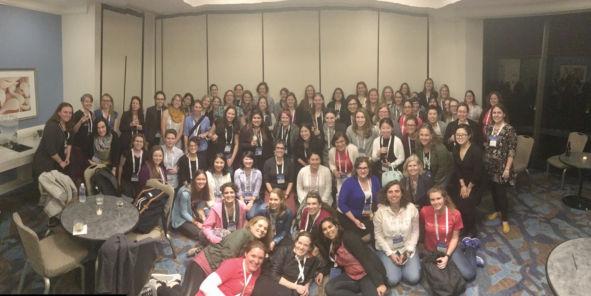
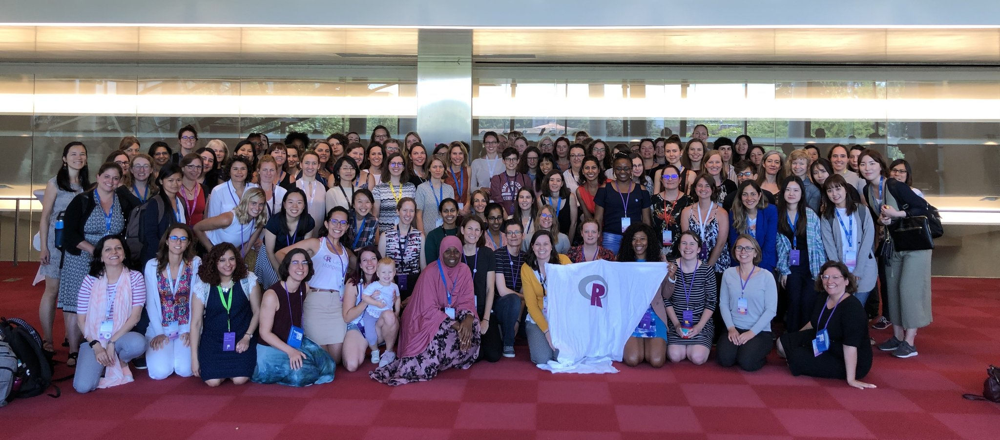

RLadies+ is a worldwide organization whose mission is to promote gender diversity in the R community.
The R community suffers from an under-representation of minority genders — including but not limited to cis/trans women, trans men, non-binary, genderqueer, and agender individuals — in every role and area of participation, whether as leaders, package developers, conference speakers, educators, or users ([see recent stats](https://forwards.github.io/data.html)).

As a diversity initiative, RLadies+ works to achieve proportionate representation by encouraging, inspiring, and empowering people of genders currently under-represented in the R community.
Our primary focus is supporting minority gender R enthusiasts to reach their programming potential — through a collaborative global network of R leaders, mentors, learners, and developers that facilitates individual and collective progress worldwide.

{}

## How we got here

[Gabriela de Queiroz](https://rladies.org/united-states-rladies/name/gabriela-de-queiroz/) founded RLadies+ on October 1, 2012.
She had been attending meetups and learning for free, and wanted to give something back.
The first meetup was held in San Francisco, California.

In the following years, two more chapters started: Twin Cities and Taipei.
RLadies+ London launched in March 2016 — the fourth chapter, and the one that would spark something larger.

Each chapter had been running independently, but at useR! 2016 the San Francisco and London groups met, and the gap between what was possible alone versus together became obvious.
After the conference, Gabriela de Queiroz and Erin LeDell (RLadies+ San Francisco), alongside Chiin-Rui Tan, Alice Daish, Hannah Frick, Rachel Kirkham, Claudia Vitolo (RLadies+ London), and Heather Turner applied for an R-Consortium [grant to support and encourage the global expansion of the organisation](https://github.com/rladies/global/blob/master/rconsortium/FINAL%20-%20201607-%20rconsortiumproposalr-ladiesalignmentandglobalexpansion-july2016.pdf).
The grant was awarded in September 2016.
RLadies+ Global was born.

Since then, the community has grown to [200+ chapters across 60+ countries with 100,000+ members](https://benubah.github.io/r-community-explorer/rladies.html) — built and maintained by the organisers and members who write, teach, code, and show up for each other every day.

