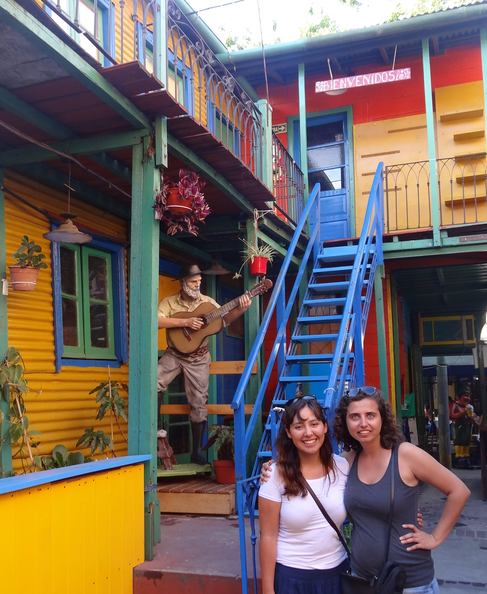
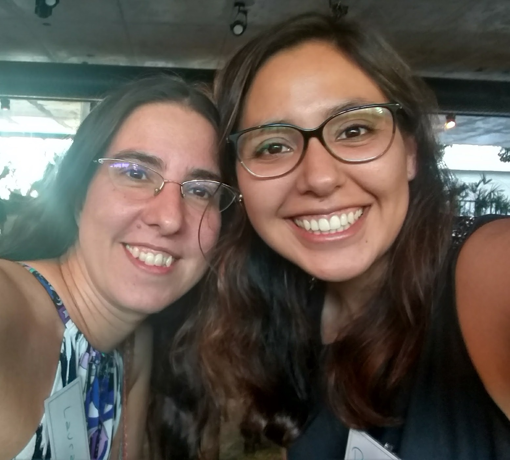

*Nous aimerions vous raconter comment des vacances ont conduit à la croissance d'une communauté de femmes en Amérique du Sud. L'histoire implique plusieurs pays et des chemins qui se croisent au bon moment de la vie.*

#### [Mine Dogucu](https://twitter.com/MineDogucu)

Je suis originaire de Turquie, mais j'ai vécu aux États-Unis pendant la majeure partie de ma vie d'adulte.
En décembre 2014, j'ai décidé de faire un voyage en Amérique du Sud - au Chili, en Uruguay et en Argentine.
En tant qu'étudiante diplômée à l'époque, j'avais besoin de réduire mes frais de voyage.
J'avais déjà des amis au Chili et en Uruguay, mais je ne connaissais personne en Argentine.
J'ai fait mes études de premier cycle au Smith College.
L'avantage d'être un étudiant international à Smith College est d'avoir une famille éparpillée dans le monde entier.
(Une amie bolivienne de l'université m'a suggéré de rencontrer son amie, Paloma, qui était originaire de Bolivie mais vivait en Argentine à l'époque.
J'ai virtuellement rencontré Paloma avant mon voyage et elle m'a généreusement offert sa maison pendant mon séjour à Buenos Aires, en Argentine, en janvier 2015.

Paloma a été une hôte formidable.
Non seulement elle m'a hébergé mais elle m'a aussi emmené dans les meilleurs endroits de la ville.
Nous avons dîné et bu ensemble.
Comme j'étais en vacances, nous n'avons pas beaucoup parlé de travail.
Étant donné que notre amie commune avait une formation d'anthropologue, Paloma et moi n'avons même pas réalisé que nous avions des intérêts professionnels similaires jusqu'à ce que je voie un livre de statistiques sur sa table.
Paloma avait une formation de médecin, mais elle effectuait un stage de recherche à l'Hospital Italiano de Buenos Aires.
Nous nous sommes tellement intéressées à nos travaux respectifs que le dernier jour de mon séjour à Buenos Aires, au lieu de faire du tourisme, je me suis rendue à l'hôpital où travaillait Paloma.
C'est ainsi qu'est née notre amitié professionnelle et personnelle.

#### [Paloma Rojas-Saunero](https://twitter.com/palolili23)

Je vivais à Buenos Aires depuis deux ans, je suivais un programme de maîtrise en recherche clinique et, au fil du temps, j'ai commencé à vouloir en savoir plus sur les biostatistiques.
Mon amie bolivienne est presque comme ma famille, alors quand elle m'a parlé de Mine et de l'importance qu'elle avait pour elle, j'ai tout de suite pensé que je devais la traiter comme une famille moi aussi.
Lorsque j'ai pris contact avec Mine, je lui ai demandé d'annuler sa réservation à l'auberge de jeunesse et de rester avec moi.
Lorsque Mine est arrivée chez moi, elle a regardé mes livres et m'a posé des questions à leur sujet, et comme elle s'en souvient, c'est à ce moment-là que la conversation est devenue plus que passionnante.
C'était la première fois de ma vie que je rencontrais une femme ayant fait carrière dans les statistiques, j'étais tellement impressionnée.

J'étais intéressée par l'apprentissage de R, mais mes pairs me décourageaient.
Lorsque j'en ai parlé à Mine, elle a partagé avec moi le document de son atelier pour apprendre les bases de R en quelques heures.
Ces quelques jours ont été déterminants pour ma vie professionnelle. Je ne m'étais jamais sentie aussi encouragée à continuer à apprendre la biostatistique et à poursuivre un doctorat à l'étranger.
Mine m'a même promis de m'aider à rédiger ma lettre de motivation dans le cadre du processus de candidature.
*Je me suis sentie extrêmement motivée et aussi soutenue, je savais que j'avais trouvé une amie, une grande sœur, un mentor. C'est difficile à définir (je pense que je n'étais même pas consciente de la signification du terme "sororité" jusqu'à ce moment-là). J'avais trouvé quelqu'un qui partageait mes intérêts, que j'admirais et sur qui je pouvais compter.*

À la fin de cette année-là, après avoir terminé mon programme de maîtrise, j'ai décidé de m'inscrire au programme de spécialisation en biostatistique de l'Institut de calcul de l'Université de Buenos Aires, le programme de maîtrise en biostatistique le plus proche de la ville.
C'est là que j'ai enfin rencontré d'autres femmes ayant une formation en mathématiques et en statistiques et que j'ai fait la connaissance de Laura.

Laura était l'assistante d'enseignement pour l'un des cours.
Comme je suis une étudiante timide, je ne me souviens pas avoir interagi avec elle.
Mais j'ai beaucoup aimé ses cours, alors j'ai parlé à mes camarades à l'hôpital de ma joie de suivre mes nouveaux cours et de l'excellente assistante d'enseignement que j'avais.
La même année, Laura a été invitée à enseigner la recherche clinique dans le cadre de mon ancien programme de maîtrise et allait travailler dans le même hôpital ; au même moment, j'ai été invitée à être son assistante pour certains de ses cours.
C'était un sentiment étrange, car j'étais son assistante pour un cours, puis nous avons voyagé ensemble à l'autre bout de la ville où elle enseignait et où j'étais son étudiante.
C'est au cours de ces trajets en bus que Laura m'a dit qu'elle était revenue des États-Unis et que nous avons partagé nos histoires.
J'ai ressenti pour la deuxième fois le même sentiment que celui que j'avais éprouvé avec Mine.
Nous partagions toutes deux des intérêts et des motivations similaires et nous nous sentions un peu seules dans notre environnement de travail.
Nous sommes très vite devenues des amies proches, Laura m'a également beaucoup encouragée à postuler pour un doctorat et à continuer à apprendre le R.

Un soir, j'ai réalisé à quel point Mine et Laura avaient des points communs et que je devais les mettre en contact.
Quelques jours plus tard, Laura m'a envoyé un e-mail pour me dire qu'elle avait parlé à Mine et que cette dernière l'avait encouragée à lancer R-Ladies à Buenos Aires, mais qu'elle ne le ferait que si je me joignais à elle dans le projet.
C'est ainsi que tout s'est passé.

#### [Laura Acion](https://twitter.com/_lacion_)

Mon histoire remonte au premier semestre 2015, alors que je me réinsérais lentement mais sûrement dans le système de recherche argentin.
Jusque-là, la majeure partie de ma vie professionnelle s'était déroulée aux États-Unis (soit en personne à l'Université de l'Iowa de 2002 à 2005, soit à distance pour l'Iowa depuis Buenos Aires).
Le stéréotype selon lequel les statisticiens appliqués travaillent généralement seuls a été renforcé dans mon cas.
J'étais assez isolé à l'époque, car non seulement j'étais un biostatisticien travaillant essentiellement comme consultant, mais je travaillais aussi à domicile et je n'avais pas les moyens de participer à des conférences ou d'adhérer à des associations professionnelles (nationales ou internationales).

Au milieu de l'année 2015, j'ai accepté un poste d'assistant scientifique et j'ai eu Paloma comme étudiante.
Je savais qui elle était parce que les rares fois où elle a posé des questions, elles étaient profondes, le genre qui enrichit énormément mon expérience d'enseignement.
Au second semestre, en août 2015, lorsque j'ai commencé à enseigner en tant que professeur assistant à l'Hospital Italiano de Buenos Aires, dès que je suis entrée dans ma salle de classe et que je me suis présentée à l'un de mes collègues, il m'a dit "Oh !
Vous êtes la célèbre Laura !
Ma pensée à ce moment-là était un mélange de bonheur, "OMG, je veux courir !!!", et d'embarras.
La vie a voulu que Paloma finisse par être l'une de mes assistantes techniques au cours du second semestre 2015 et 2016.
Au même moment, j'ai été promu professeur associé pour enseigner un cours dans la spécialisation que Paloma suivait à l'université de Buenos Aires.
Comme elle l'a dit, nous avons partagé un certain nombre de trajets dans les transports publics autour de la ville et une tonne d'heures de cours dans des rôles différents.
Elle était à la fois mon bras droit à l'hôpital Italiano et mon étudiante à l'université.
Nous sommes devenues amies et je n'ai pas pu m'empêcher de donner autant de conseils que possible à cette amie brillante, travailleuse et géniale.
Un jour, alors que nous terminions nos cours, elle m'a dit : "Au fait, tu connais R-Ladies ?
Je lui ai répondu : "R-quoi ? "Elle m'a parlé de R-Ladies and Mine et nous a mis en contact.

La mienne et moi avons skypé à la fin de l'année 2016.
Elle a dit très clairement à quel point R-Ladies était un réseau fantastique.
C'était difficile à croire pour moi, mais quelque chose me disait que c'était vrai et que je devais poursuivre dans cette voie.
La mienne a dû m'expliquer ce qu'était meetup.com et j'étais plutôt sceptique quant à l'utilité d'une telle plateforme à Buenos Aires (nous avons plus de 600 membres à R-Ladies Buenos Aires aujourd'hui).
J'étais également sceptique quant au succès d'un groupe R qui oriente ses efforts vers la réduction de l'écart entre les hommes et les femmes.
Je ne me considère pas comme une activiste et, à l'époque, je ne me considérais pas non plus comme une féministe.
En fait, le concept même d'un groupe de femmes était plutôt effrayant - je savais qu'un tel groupe se heurterait à une résistance locale de la part de nombreuses personnes.
Je savais que je ne pourrais pas le faire seule.
J'ai donc demandé à Paloma si elle voulait m'aider à faire avancer R-Ladies Buenos Aires et elle a immédiatement accepté.
[R-Ladies Buenos Aires](https://www.meetup.com/es-ES/rladies-buenos-aires/) est née le 3 janvier 2017 et c'est ainsi qu'a commencé une chaîne d'événements très fructueux. [Dani Vázquez](https://twitter.com/d4tagirl) est arrivée à bord en tant que cofondatrice de R-Ladies Buenos Aires (elle vous raconte comment cela s'est passé...). [ici](https://d4tagirl.com/2017/01/the-r-ladies-way)).
Cette première étape a ensuite conduit à la création de Dani [R-Ladies Montevideo](https://www.meetup.com/es-ES/rladies-montevideo/)(Uruguay).
Ensuite, [Yani Bellini](https://twitter.com/yabellini) a lu l'article de Dani et a décidé de contacter R-Ladies Buenos Aires via Twitter où nous l'avons encouragée à obtenir [R-Ladies Santa Rosa](https://www.meetup.com/es-ES/rladies-santa-rosa/)(Argentine).
Entre-temps, j'ai remarqué que de nombreuses personnes rejoignant R-Ladies Buenos Aires sur meetup.com étaient originaires d'autres villes que Buenos Aires.
J'ai commencé à les contacter.
Cela m'a permis de trouver des organisateurs intéressés par le lancement de [R-Ladies Natal](https://www.meetup.com/es-ES/rladies-natal/) (Brésil) et [R-Ladies Santiago](https://www.meetup.com/es-ES/rladies-scl/)(Chili).
À la fin de l'année 2017, des R-Ladies ont déménagé de Buenos Aires et ont souhaité emmener l'expérience R-Ladies avec elles dans d'autres régions d'Argentine (par ex, [R-Ladies Córdoba](https://www.meetup.com/es-ES/rladies-cordoba/), [La Plata](https://www.meetup.com/es-ES/rladies-la-plata/) et [Ushuaia](https://www.meetup.com/es-ES/rladies-ushuaia/)) et dans le monde.
C'est ainsi que Paloma a cofondé [R-Ladies Rotterdam](https://www.meetup.com/es-ES/rladies-rotterdam/) (Pays-Bas).

La communauté s'est développée si rapidement qu'en moins de deux ans, presque tous les pays d'Amérique du Sud ont créé au moins une section R-Ladies.
La cerise sur le gâteau a été [LatinR](http://latin-r.com/en) une conférence latino-américaine sur l'utilisation de R dans la recherche et le développement, créée par un groupe de femmes latino-américaines spécialistes de R et qui a permis de rassembler la communauté régionale.
LatinR n'est qu'une initiative parmi d'autres, dont nous vous parlerons dans de prochains articles.

Il est difficile de croire que tout cela a commencé en surfant sur le canapé de la mine en Amérique du Sud, mais c'est pourtant ce qui s'est passé.

