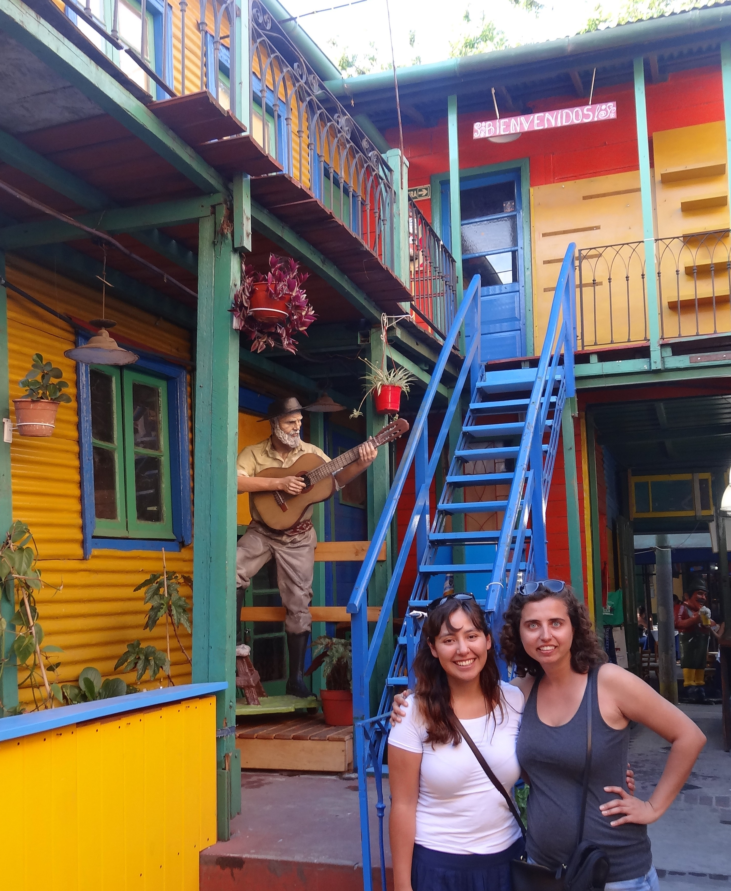
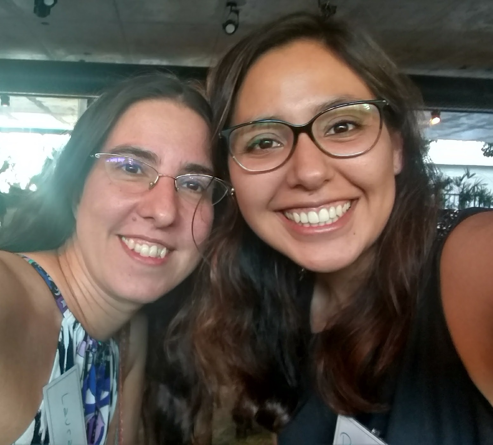

*Gostaríamos de vos contar como umas férias levaram ao crescimento da comunidade R Ladies na América do Sul. A história envolve vários países e caminhos cruzados na altura certa da vida.*

#### [Mine Dogucu](https://twitter.com/MineDogucu)

Sou natural da Turquia, mas vivi nos Estados Unidos durante a maior parte da minha vida adulta.
Em dezembro de 2014, decidi fazer uma viagem à América do Sul - ao Chile, Uruguai e Argentina.
Na altura, como era estudante de pós-graduação, precisava de reduzir os custos da viagem.
Eu já tinha amigos no Chile e no Uruguai, mas não conhecia ninguém na Argentina.
Estudei no Smith College durante a minha licenciatura.
A vantagem de ser um estudante internacional no Smith College é basicamente ter uma família espalhada por todo o mundo.
(Isto também pode ser um problema quando nos apercebemos das saudades que temos deles.)Uma colega de faculdade da Bolívia sugeriu-me que conhecesse a sua amiga, Paloma, que é originária da Bolívia mas que na altura vivia na Argentina.
Conheci a Paloma virtualmente antes da minha viagem e ela ofereceu-me generosamente a sua casa durante a minha estadia em Buenos Aires, Argentina, em janeiro de 2015.

Paloma foi uma óptima anfitriã.
Não só me hospedou como também me levou aos melhores lugares da cidade.
Jantámos e bebemos juntos.
Como eu estava de férias, não falámos muito de trabalho.
Tendo em conta que a nossa amiga comum tinha formação em antropologia, Paloma e eu nem sequer nos apercebemos que tínhamos interesses profissionais semelhantes até eu ver um livro de estatística na sua mesa.
Paloma era formada em medicina, mas estava a fazer uma bolsa de investigação no Hospital Italiano de Buenos Aires.
Ficámos tão interessados no trabalho um do outro que, no meu último dia em Buenos Aires, em vez de fazer turismo, fui ao hospital onde Paloma trabalhava.
Foi assim que começou a nossa amizade profissional e pessoal.

#### [Paloma Rojas-Saunero](https://twitter.com/palolili23)

Era o meu segundo ano a viver em Buenos Aires, estava a fazer um mestrado em investigação clínica e, com o passar do tempo, estava a ficar muito interessada em aprender mais sobre bioestatística.
A minha amiga boliviana é quase como uma família para mim, por isso, quando me falou da Mine e de como ela era importante para ela, pensei imediatamente que também a devia tratar como família.
Quando entrei em contacto com a Mine, pedi-lhe que cancelasse a reserva do hostel e ficasse comigo.
Quando a Mine chegou a minha casa, olhou para os meus livros e perguntou-me sobre eles e, como ela recorda, foi aí que a conversa se tornou mais do que excitante.
Era a primeira vez na minha vida que estava a conhecer uma mulher com uma carreira em estatística, fiquei tão impressionada.

Estava interessada em aprender R, mas era desencorajada pelos meus colegas.
Quando contei isto à Mine, ela partilhou comigo o folheto do seu workshop para aprender as bases do R em poucas horas.
Esses dias foram fundamentais na minha vida profissional, nunca me tinha sentido tão encorajada a continuar a aprender bioestatística e a fazer um doutoramento no estrangeiro.
A Mine até me prometeu ajudar-me a escrever a minha carta de motivação como parte do processo de candidatura.
*Senti-me extremamente motivada e também apoiada, sabia que tinha encontrado uma amiga, uma irmã mais velha, uma mentora. É difícil de definir (acho que até então nem sequer tinha consciência do significado de sororidade). Tinha encontrado alguém que partilhava os meus interesses, que eu admirava e em quem podia confiar.*

No final desse ano, depois de terminar o meu mestrado, decidi entrar no Programa de Especialização em Bioestatística do Instituto de Cálculo da Universidade de Buenos Aires, o mais próximo de um programa de mestrado em bioestatística na cidade.
Foi lá que finalmente encontrei mais mulheres com formação em matemática e estatística e onde conheci Laura.

Laura era a assistente de ensino (TA) de um dos cursos.
Como sou uma aluna tímida, não me lembro de ter interagido com ela.
Mas gostei muito das aulas dela, por isso falei com os meus colegas no hospital sobre como estava contente com as minhas novas aulas e com a maravilhosa assistente pedagógica que tinha.
Nesse mesmo ano, Laura foi convidada para dar aulas no meu anterior programa de mestrado sobre investigação clínica e ia trabalhar no mesmo hospital; ao mesmo tempo, fui convidada para ser sua assistente em algumas das suas aulas.
Foi uma sensação estranha, porque fui seu assistente numa aula e depois viajámos juntos para o outro lado da cidade onde ela estava a dar aulas e eu era seu aluno.
Foi durante essas viagens de autocarro que Laura me contou que tinha voltado a viver nos Estados Unidos e partilhámos as nossas histórias.
Experimentei pela segunda vez a mesma sensação que tive com a minha.
Ambos partilhávamos interesses e motivações semelhantes e sentíamo-nos um pouco sozinhos no nosso ambiente de trabalho.
Tornámo-nos amigas íntimas muito rapidamente e a Laura também me encorajou muito a candidatar-me a um doutoramento e a continuar a aprender R.

Uma noite, apercebi-me do quanto a minha e a Laura tinham em comum e que tinha de as pôr em contacto.
Alguns dias depois, a Laura enviou-me um e-mail a dizer que tinha falado com a Mine e que esta a tinha encorajado a começar o R-Ladies em Buenos Aires, mas que só o faria se eu me juntasse a ela no projeto.
Foi assim que tudo aconteceu.

#### [Laura Acion](https://twitter.com/_lacion_)

A minha história remonta ao primeiro semestre de 2015, quando estava a regressar lenta mas seguramente ao sistema de investigação argentino.
Até essa altura, a maior parte da minha vida profissional tinha acontecido nos EUA (quer presencialmente na Universidade de Iowa, de 2002 a 2005, quer remotamente para Iowa a partir de Buenos Aires).
O estereótipo de que os estatísticos aplicados geralmente trabalham sozinhos foi reforçado no meu caso.
Na altura, encontrava-me bastante isolado, pois não só era um bioestatístico que trabalhava sobretudo como consultor, como também trabalhava a partir de casa e não dispunha de fundos para estabelecer contactos em conferências ou aderir a associações profissionais (nacionais ou internacionais).

Em meados de 2015, aceitei um lugar de assistente técnico e tive a Paloma como aluna.
Eu sabia quem ela era porque as poucas vezes que ela fez perguntas eram profundas, do tipo que enriquece enormemente a minha experiência de ensino.
No segundo semestre, em agosto de 2015, quando comecei como professor assistente no Hospital Italiano de Buenos Aires, assim que entrei na minha sala de aula e me apresentei a um dos meus colegas, ele disse "Oh!
Tu és a famosa Laura!
A pessoa de quem Paloma tem falado tão maravilhosamente!"O meu pensamento naquele momento foi uma mistura de felicidade, "OMG, quero correr!!!", e embaraço.
Quis a vida que Paloma acabasse por ser uma das minhas assistentes técnicas durante o segundo semestre de 2015 e 2016.
Ao mesmo tempo, fui promovido a Professor Associado para lecionar um curso na especialização que a Paloma estava a fazer na Universidade de Buenos Aires.
Como ela disse, partilhámos muitas viagens nos transportes públicos da cidade e muitas horas de aulas em diferentes funções.
Ela era o meu braço direito no Hospital Italiano e, ao mesmo tempo, minha aluna na Universidade.
Tornámo-nos amigas e não pude deixar de dar todos os conselhos possíveis a esta brilhante, trabalhadora e grande amiga.
Um dia, quando estávamos a terminar as nossas aulas, ela disse: "Já agora, conheces a R-Ladies?
Respondi-lhe: "R-quê?" Ela falou-me do R-Ladies and Mine e pôs-nos em contacto.

Eu e a minha filha encontrámo-nos no final de 2016.
Ela foi muito clara sobre como o R-Ladies era fantástico em termos de rede.
Custava-me a acreditar, mas algo me dizia que era verdade e que eu tinha de seguir este caminho.
A minha teve de me explicar o que era o meetup.com e eu estava bastante cética quanto à utilidade de tal plataforma em Buenos Aires (hoje temos mais de 600 membros no R-Ladies Buenos Aires).
Também estava cética quanto ao sucesso de um grupo de R que orienta os seus esforços para diminuir a diferença de género.
Não me considero uma ativista e, na altura, também não me considerava feminista.
De facto, todo o conceito de um grupo de mulheres era um pouco assustador - sabia que um grupo deste tipo encontraria resistência local por parte de muitos.
Sabia que não o conseguiria fazer sozinha.
Assim, perguntei à Paloma se queria juntar-se a mim e ajudar-me a fazer avançar o R-Ladies Buenos Aires e ela disse imediatamente que sim.
[R-Ladies Buenos Aires](https://www.meetup.com/es-ES/rladies-buenos-aires/) nasceu no dia 3 de janeiro de 2017 e assim começou uma cadeia de eventos muito frutífera. [Dani Vázquez](https://twitter.com/d4tagirl) entrou a bordo como co-fundadora da R-Ladies Buenos Aires (ela conta como aconteceu [aqui](https://d4tagirl.com/2017/01/the-r-ladies-way)).
Este primeiro passo conduziu mais tarde à fundação da Dani [R-Ladies Montevideo](https://www.meetup.com/es-ES/rladies-montevideo/)(Uruguai).
Depois, [Yani Bellini](https://twitter.com/yabellini) leu o post da Dani e decidiu contactar as R-Ladies Buenos Aires através do Twitter, onde a encorajámos a obter [R-Ladies Santa Rosa](https://www.meetup.com/es-ES/rladies-santa-rosa/)(Argentina).
Entretanto, reparei que muitas das pessoas que se juntaram às R-Ladies Buenos Aires no meetup.com eram de locais fora de Buenos Aires.
Comecei a entrar em contacto com elas.
Isso ajudou a encontrar organizadores interessados em começar [R-Ladies Natal](https://www.meetup.com/es-ES/rladies-natal/) (Brasil) e [R-Ladies Santiago](https://www.meetup.com/es-ES/rladies-scl/)(Chile).
No final de 2017, havia R-Ladies que se mudaram de Buenos Aires e queriam levar a experiência R-Ladies para outras partes da Argentina (por exemplo, [R-Ladies Córdoba](https://www.meetup.com/es-ES/rladies-cordoba/), [La Plata](https://www.meetup.com/es-ES/rladies-la-plata/), e [Ushuaia](https://www.meetup.com/es-ES/rladies-ushuaia/)) e do mundo.
Foi assim que Paloma co-fundou [R-Ladies Roterdão](https://www.meetup.com/es-ES/rladies-rotterdam/) (Países Baixos).

A comunidade expandiu-se tão rapidamente que, em menos de dois anos, quase todos os países da América do Sul criaram pelo menos um capítulo das R-Ladies.
A cereja no topo do bolo foi [LatinR](http://latin-r.com/en) uma conferência latino-americana para a utilização do R em I+D, criada por um grupo de R-Ladies latino-americanas, que ajudou a reunir a comunidade regional.
O LatinR é apenas uma de muitas outras grandes iniciativas sobre as quais vos falaremos em futuros posts.

É difícil acreditar que tudo isto tenha começado com o meu couch surfing na América do Sul, mas começou.

