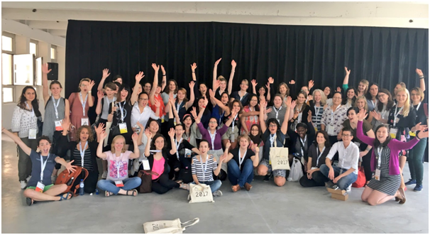

<<<<<<< HEAD:content/blog/2018-02-24-history/index.en.md
R-Ladies was founded by [Gabriela de Queiroz](https://rladies.org/united-states-rladies/name/gabriela-de-queiroz/).
She wanted to do something to give back to the R learning community after going to several meetups and learning a lot for free.
The first meetup took place in San Francisco, California (United States) on October 1, 2012.

<!-- I think it would be great here to talk a bit about what an R-ladies meetup initially involved eg mentoring, training, guest speakers?  -->

In the following years two more R-Ladies chapters launched independently around the world <!--who by?-->: Twin Cities, USA and Taipei.
R-Ladies London launched in March 2016.
=======
R-Ladies was founded by [Gabriela de Queiroz](https://rladies.org/united-states-rladies/name/gabriela-de-queiroz/). She wanted to do something to give back to the R learning community after going to several meetups and learning a lot for free. The first meetup took place in San Francisco, California (United States) on October 1, 2012. <!-- I think it would be great here to talk a bit about what an R-ladies meetup initially involved eg mentoring, training, guest speakers?  -->

In the following years two more R-Ladies chapters launched independently around the world <!--who by?-->: Twin Cities, USA and Taipei. R-Ladies London launched in March 2016. <!--I don't really understand this bit - did Gabriella initiate the other R ladies groups or did they all start organically? was it a coincidence that they were all called R-Ladies? Who set up these groups?--> Although each chapter started working independently,<!-- ~~the need for high-level coordination and support became evident at useR! 2016 where the San Francisco and London chapters met.~~ -->all this changed at useR! 2016, when the organisers of the global R-ladies chapters met in person for the first time.

The R-ladies meeting at useR! realised the importance of a global R-ladies to support local chapters and help new R-ladies chapters form anywhere in the world. [Gabriela de Queiroz](https://rladies.org/united-states-rladies/name/gabriela-de-queiroz/) and [Erin LeDell](https://rladies.org/r-speakers/name/erin-ledell/) from R-Ladies San Francisco and [Chiin-Rui Tan](https://rladies.org/r-speakers/name/chiin-rui-tan/), [Alice Daish](https://rladies.org/ladies-complete-list/name/alice-daish/), [Hannah Frick](https://rladies.org/ladies-complete-list/name/hannah-frick/), [Rachel Kirkham](https://rladies.org/ladies-complete-list/name/rachel-kirkham/) and [Claudia Vitolo](https://rladies.org/r-speakers/name/claudia-vitolo/) from R-Ladies London as well as Heather Turner teamed up to apply for an R-Consortium [grant to support and encourage the global expansion of the R-Ladies organisation](https://github.com/rladies/global/blob/master/rconsortium/FINAL%20-%20201607-%20rconsortiumproposalr-ladiesalignmentandglobalexpansion-july2016.pdf).
>>>>>>> main:content/blog/2018/02-24-history/index.en.md

<!--I don't really understand this bit - did Gabriella initiate the other R ladies groups or did they all start organically? was it a coincidence that they were all called R-Ladies? Who set up these groups?--> Although each chapter started working independently,<!-- ~~the need for high-level coordination and support became evident at useR! 2016 where the San Francisco and London chapters met.~~ -->all this changed at useR!

2016, when the organisers of the global R-ladies chapters met in person for the first time.

The R-ladies meeting at useR!
realised the importance of a global R-ladies to support local chapters and help new R-ladies chapters form anywhere in the world.
[Gabriela de Queiroz](https://rladies.org/united-states-rladies/name/gabriela-de-queiroz/) and [Erin LeDell](https://rladies.org/r-speakers/name/erin-ledell/) from R-Ladies San Francisco and [Chiin-Rui Tan](https://rladies.org/r-speakers/name/chiin-rui-tan/), [Alice Daish](https://rladies.org/ladies-complete-list/name/alice-daish/), [Hannah Frick](https://rladies.org/ladies-complete-list/name/hannah-frick/), [Rachel Kirkham](https://rladies.org/ladies-complete-list/name/rachel-kirkham/) and [Claudia Vitolo](https://rladies.org/r-speakers/name/claudia-vitolo/) from R-Ladies London as well as Heather Turner teamed up to apply for an R-Consortium [grant to support and encourage the global expansion of the R-Ladies organisation](https://github.com/rladies/global/blob/master/rconsortium/FINAL%20-%20201607-%20rconsortiumproposalr-ladiesalignmentandglobalexpansion-july2016.pdf).

R-Ladies Global was born at useR 2016 and the grant was susequently awarded in September 2016.
Since then, R-Ladies has grown to 63 chapters<!-- there should be a link here to a list of every chapter -->and over 13000 members.
We have chapters across every continent, and many of the world's major cities.
We recently launched [R-Ladies remote](https://twitter.com/RLadiesRemote) for R-Ladies who don't currently live somewhere large enough for a chapter, or our restricted from attending meetups due to family concerns.

<!-- I'd love to say something here about R-ladies impact now. ie our events serve all R users from absolute beginners to experienced users. Some of the most respected R-users in both industry and academia are involved in R-ladies eg ... Some examples of some events that we have had or more obscure places R ladies are being formed, etc?-->

<<<<<<< HEAD:content/blog/2018-02-24-history/index.en.md
Thanks to our amazing organisers and R-Ladies who helped build and maintain our official website ( [rladies.org](https://rladies.org/)), engage with the larger community via social media - ( [@RLadiesGlobal](https://twitter.com/rladiesglobal?lang=en)) and help each-other every day in millions of different ways.
=======
Thanks to our amazing organisers and R-Ladies who helped build and maintain our official website ([rladies.org](https://rladies.org/)), engage with the larger community via social media - ([\@RLadiesGlobal](https://twitter.com/rladiesglobal?lang=en)) and help each-other every day in millions of different ways.
>>>>>>> main:content/blog/2018/02-24-history/index.en.md

