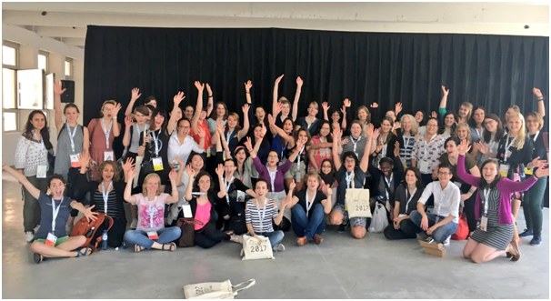

R-Ladies a été fondée par [Gabriela de Queiroz](https://rladies.org/united-states-rladies/name/gabriela-de-queiroz/).
Elle voulait faire quelque chose pour rendre à la communauté d'apprentissage R après avoir participé à plusieurs meetups et appris beaucoup de choses gratuitement.
Le premier meetup a eu lieu à San Francisco, en Californie (États-Unis), le 1er octobre 2012.

<Je pense qu'il serait bon de parler un peu de ce qu'un meetup R-ladies impliquait initialement : mentorat, formation, conférenciers invités ?  -->

Dans les années qui ont suivi, deux autres chapitres de R-Ladies ont été lancés indépendamment dans le monde. <!--qui par?-->: Twin Cities, USA et Taipei.
Le chapitre R-Ladies de Londres a été lancé en mars 2016.

<Je ne comprends pas vraiment ce passage - Gabriella a-t-elle initié les autres groupes de R-Ladies ou ont-ils tous démarré organiquement ? Est-ce une coïncidence qu'ils se soient tous appelés R-Ladies ? Bien que chaque chapitre ait commencé à travailler indépendamment, le besoin d'une coordination et d'un soutien de haut niveau est devenu évident lors de l'useR ! 2016, où les chapitres de San Francisco et de Londres se sont rencontrés.~~ --> Tout cela a changé lors de l'useR !

2016, lorsque les organisatrices des chapitres mondiaux de R-ladies se sont rencontrées en personne pour la première fois.

La réunion des R-ladies à useR !
a permis de réaliser l'importance d'un chapitre R-ladies mondial pour soutenir les chapitres locaux et aider à la création de nouveaux chapitres R-ladies partout dans le monde.
[Gabriela de Queiroz](https://rladies.org/united-states-rladies/name/gabriela-de-queiroz/) et [Erin LeDell](https://rladies.org/r-speakers/name/erin-ledell/) de R-Ladies San Francisco et [Chiin-Rui Tan](https://rladies.org/r-speakers/name/chiin-rui-tan/), [Alice Daish](https://rladies.org/ladies-complete-list/name/alice-daish/), [Hannah Frick](https://rladies.org/ladies-complete-list/name/hannah-frick/), [Rachel Kirkham](https://rladies.org/ladies-complete-list/name/rachel-kirkham/) et [Claudia Vitolo](https://rladies.org/r-speakers/name/claudia-vitolo/) de R-Ladies London ainsi que Heather Turner se sont associées pour poser leur candidature à un R-Consortium. [afin de soutenir et d'encourager l'expansion mondiale de l'organisation R-Ladies.](https://github.com/rladies/global/blob/master/rconsortium/FINAL%20-%20201607-%20rconsortiumproposalr-ladiesalignmentandglobalexpansion-july2016.pdf).

R-Ladies Global a vu le jour en 2016 et la subvention a été accordée en septembre 2016.
Depuis lors, R-Ladies s'est développée et compte aujourd'hui 63 sections.<!-- il devrait y avoir un lien ici pour une liste de tous les chapitres -->et plus de 13 000 membres.
Nous avons des sections sur tous les continents et dans de nombreuses grandes villes du monde.
Nous avons récemment lancé [R-Ladies à distance](https://twitter.com/RLadiesRemote) pour les R-Ladies qui n'habitent pas dans un endroit suffisamment grand pour accueillir un chapitre, ou qui ne peuvent pas participer à des réunions pour des raisons familiales.

<J'aimerais dire quelque chose à propos de l'impact de R-Ladies : nos événements s'adressent à tous les utilisateurs de R, des débutants aux utilisateurs expérimentés. Certaines des utilisatrices de R les plus respectées, tant dans l'industrie que dans le monde universitaire, sont impliquées dans R-ladies, par exemple ... Quelques exemples d'événements que nous avons organisés ou d'endroits plus obscurs où les R-ladies sont en train de se former, etc...

Merci à nos formidables organisatrices et R-Ladies qui ont aidé à construire et à maintenir notre site web officiel ( [rladies.org](https://rladies.org/)), à s'engager avec l'ensemble de la communauté via les médias sociaux ( [@RLadiesGlobal](https://twitter.com/rladiesglobal?lang=en)) et s'entraident chaque jour de millions de façons différentes.

