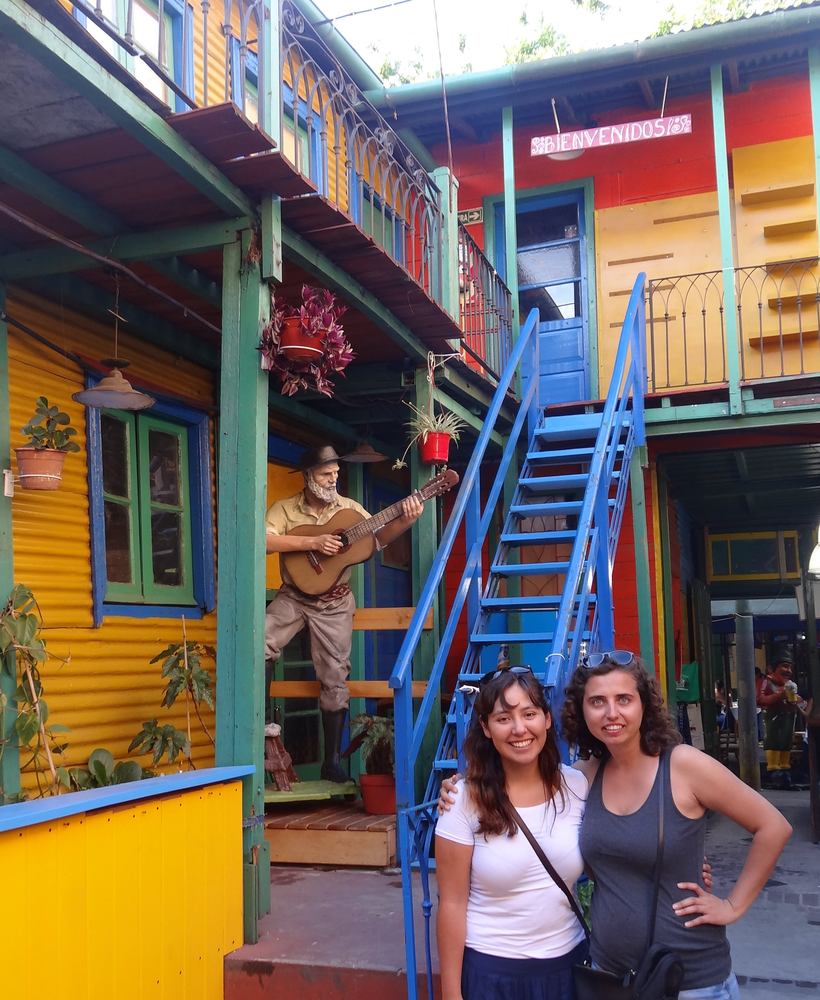
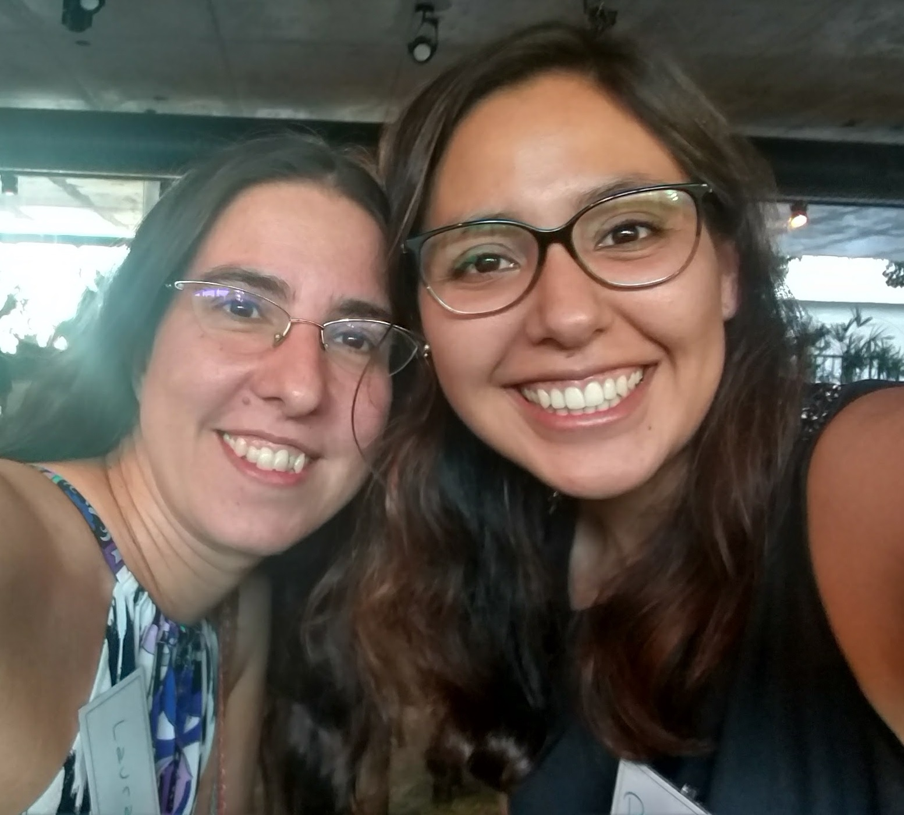

<<<<<<< HEAD:content/blog/2018-10-27-vacation_grow_rladiesnetwork/index.en.md
*We would like to tell you how one vacation lead to growth of R Ladies community in South America. The story involves multiple countries and crossing paths at the right time in life.*

#### [Mine Dogucu](https://twitter.com/MineDogucu)

I am from Turkey but I lived in the United States most of my adulthood.
In December 2014, I decided to take a trip to South America - to Chile, Uruguay, and Argentina.
Being a graduate student at the time put me in a need to lower my travel costs.
I already had friends in Chile and Uruguay but I did not know anyone in Argentina.
I went to Smith College for my undergraduate education.
The perk of being an international student at Smith College is basically having a family scattered all over the globe.
(This can also be a problem when you realize how much you miss them.)A college friend from Bolivia suggested that I meet her friend, Paloma, who is originally from Bolivia but was living in Argentina at the time.
I virtually met Paloma before my trip and she generously offered her home to me during my stay in Buenos Aires, Argentina during January 2015.

Paloma was a great host.
Not only she hosted me but she also took me to the best spots in the city.
We dined and wined together.
Since I was on holiday, we did not talk much about work.
Considering that our mutual friend was trained as an anthropologist, Paloma and I did not even realize we had similar professional interests until I saw a statistics book on her table.
Paloma was trained as a medical doctor but was doing a research fellowship at Hospital Italiano de Buenos Aires.
We got so interested in each other's work that on my last day in Buenos Aires, instead of actually sightseeing, I went to the hospital that Paloma was working at.
This is how our professional and personal friendship started.
=======
_We would like to tell you how one vacation lead to growth of R Ladies community in South America. The story involves multiple countries and crossing paths at the right time in life._

#### [Mine Dogucu](https://twitter.com/MineDogucu)

I am from Turkey but I lived in the United States most of my adulthood. In December 2014, I decided to take a trip to South America - to Chile, Uruguay, and Argentina. Being a graduate student at the time put me in a need to lower my travel costs. I already had friends in Chile and Uruguay but I did not know anyone in Argentina. I went to Smith College for my undergraduate education. The perk of being an international student at Smith College is basically having a family scattered all over the globe. (This can also be a problem when you realize how much you miss them.) A college friend from Bolivia suggested that I meet her friend, Paloma, who is originally from Bolivia but was living in Argentina at the time. I virtually met Paloma before my trip and she generously offered her home to me during my stay in Buenos Aires, Argentina during January 2015.

Paloma was a great host. Not only she hosted me but she also took me to the best spots in the city. We dined and wined together. Since I was on holiday, we did not talk much about work. Considering that our mutual friend was trained as an anthropologist, Paloma and I did not even realize we had similar professional interests until I saw a statistics book on her table. Paloma was trained as a medical doctor but was doing a research fellowship at Hospital Italiano de Buenos Aires. We got so interested in each other’s work that on my last day in Buenos Aires, instead of actually sightseeing, I went to the hospital that Paloma was working at. This is how our professional and personal friendship started.
>>>>>>> main:content/blog/2018/10-27-vacation_grow_rladiesnetwork/index.en.md

#### [Paloma Rojas-Saunero](https://twitter.com/palolili23)

<<<<<<< HEAD:content/blog/2018-10-27-vacation_grow_rladiesnetwork/index.en.md
It was my second year living in Buenos Aires, I was doing a master's program in clinical research and, as time went by, I was getting really interested in learning more about biostatistics.
My Bolivian friend is almost like family to me, so when she told me about Mine and how important she was for her, I immediately considered that I should treat her as family, too.
When I got in touch with Mine, I asked her to cancel her hostel booking and stay with me.
When Mine arrived to my place, she looked to my books and asked me about them, and as she recalls, this was when the conversation got more than exciting.
It was the first time in my life I was meeting a woman with a career in statistics, I was so impressed.

I was interested in learning R, but was discouraged by my peers.
When I told this to Mine, she shared with me her workshop handout to learn the basics of R in a few hours.
Those few days were key in my professional life, I had never felt so encouraged to keep learning biostatistics and pursue a PhD abroad.
Mine even promised me to help me write my motivation letter as part of the application process.
*I felt extremely motivated and also supported, I knew that I had found a friend, an older sister, a mentor. It's hard to define (I guess I wasn't even aware of the meaning of sorority until then). I had found someone that shared my interests, that I looked up to and in whom I could rely on.*

At the end of that year, after finishing my master's program, I decided to enter the Specialization Program on Biostatistics from the Institute of Calculus at Universidad de Buenos Aires, the closest to a master program in biostatistics in the city.
It was there where I finally met more women that had a background on mathematics and statistics and where I met Laura.
=======
It was my second year living in Buenos Aires, I was doing a master’s program in clinical research and, as time went by, I was getting really interested in learning more about biostatistics. My Bolivian friend is almost like family to me, so when she told me about Mine and how important she was for her, I immediately considered that I should treat her as family, too. When I got in touch with Mine, I asked her to cancel her hostel booking and stay with me. When Mine arrived to my place, she looked to my books and asked me about them, and as she recalls, this was when the conversation got more than exciting. It was the first time in my life I was meeting a woman with a career in statistics, I was so impressed.

I was interested in learning R, but was discouraged by my peers. When I told this to Mine, she shared with me her workshop handout to learn the basics of R in a few hours. Those few days were key in my professional life, I had never felt so encouraged to keep learning biostatistics and pursue a PhD abroad. Mine even promised me to help me write my motivation letter as part of the application process. _I felt extremely motivated and also supported, I knew that I had found a friend, an older sister, a mentor. It’s hard to define (I guess I wasn’t even aware of the meaning of sorority until then). I had found someone that shared my interests, that I looked up to and in whom I could rely on._
>>>>>>> main:content/blog/2018/10-27-vacation_grow_rladiesnetwork/index.en.md

Laura was the teaching assistant (TA)  for one of the courses.
I am a shy student so I don't remember interacting with her.
But I liked her classes a lot, so I talked to my peers at the hospital about how happy I was about my new classes and the wonderful TA I had.
That same year, Laura got invited to teach at my previous master's program on clinical research and was going to work at the same hospital; at the same time I got invited to be her TA for some of her classes.
It was a weird feeling, because I was her TA in one lecture and then we travelled together to the other side of the city where she was teaching and I was her student.
It was during those bus rides that Laura told me that she had moved back from the US and we shared our stories.
I experienced for the second time the same feeling that I had with Mine.
We both shared similar interests and motivations and felt a little lonely in our working environment.
We became close friends very fast, Laura was also very encouraging about my application for a PhD and about keep learning R.

<<<<<<< HEAD:content/blog/2018-10-27-vacation_grow_rladiesnetwork/index.en.md
One night I realized how much Mine and Laura had in common and that I had to put them in touch.
A few days later Laura send me an email saying that she had talked to Mine and that Mine encouraged her to start R-Ladies in Buenos Aires, but she was only going to do it if I joined her on the project.
That's how it all happened.

#### [Laura Acion](https://twitter.com/_lacion_)

My story goes all the way back to the first semester of 2015 when I was slowly but surely getting back into the Argentinean research system.
Up to that point, most of my professional life had happened in the US (either in person at the University of Iowa from 2002 to 2005 or remotely for Iowa from Buenos Aires).
The stereotype that applied statisticians usually work alone was reinforced in my case.
I was quite isolated at the time because not only I was a biostatistician working mostly as a consultant, but I worked from home, and I had no funding to network at conferences or join professional associations (national or international).

By mid 2015 I accepted a TA position and had Paloma as a student.
I knew who she was because the few times she asked questions, they were deep ones, the kind that enriches my teaching experience enormously.
By the second semester in August 2015, when I started as an Assistant Professor at the Hospital Italiano de Buenos Aires, the very minute I step in my classroom and introduced myself to one of my colleagues, he said "Oh!
You are the famous Laura!
The person Paloma has been talking so wonderfully about!"My thought that moment was a mix of happiness, "OMG, I want to run!!!", and embarrassment.
Life wanted that Paloma ended up being one of my TAs during the second semester of 2015 and 2016.
At the same time, I got promoted to Associate Professor to teach a course in the Specialization Paloma was taking at the University of Buenos Aires.
As she said, we shared a number of rides in the public transportation around the city and a ton of classroom hours in different roles.
She was my right hand at Hospital Italiano and my student at the University at the same time.
We became friends and I could not keep myself from giving as much as advice as I could to this brilliant, hardworking, and great friend.
One day, while finishing our teaching duties, she said "by the way, do you know R-Ladies?".
I answered: "R-What?"She told me about R-Ladies and Mine and she put us in touch.

Mine and I skyped at the end of 2016.
She was very clear about how fantastic R-Ladies was in terms of a network.
It was hard to believe to me, but something told me it was true and that I had to pursue this path.
Mine had to explain what meetup.com was to me and I was rather skeptic that such platform was going to be of any use in Buenos Aires (we have 600+ members in R-Ladies Buenos Aires today).
I was also skeptic about the success of an R group directing its efforts to decrease the gender gap.
I do not consider myself an activist and, at the time, I did not consider myself feminist either.
Indeed, the whole concept of a women group was kind of scary - I knew such a group would find local resistance from many.
I knew I could not do it alone.
Thus, I asked Paloma if she wanted to join and help me move R-Ladies Buenos Aires forward and she said yes immediately.
[R-Ladies Buenos Aires](https://www.meetup.com/es-ES/rladies-buenos-aires/) was born on January 3, 2017 and that started a very fruitful chain of events. [Dani Vázquez](https://twitter.com/d4tagirl) came on board as a co-founder of R-Ladies Buenos Aires (she tells you how it happened [here](https://d4tagirl.com/2017/01/the-r-ladies-way)).
This first step later lead to Dani founding [R-Ladies Montevideo](https://www.meetup.com/es-ES/rladies-montevideo/)(Uruguay).
Then, [Yani Bellini](https://twitter.com/yabellini) read Dani's post and decided to contact R-Ladies Buenos Aires through Twitter where we encouraged her to get [R-Ladies Santa Rosa](https://www.meetup.com/es-ES/rladies-santa-rosa/)(Argentina) started.
In the meantime, I noticed many people joining R-Ladies Buenos Aires at meetup.com were from places outside Buenos Aires.
I started reaching out to them.
This helped finding organizers interested in starting [R-Ladies Natal](https://www.meetup.com/es-ES/rladies-natal/) (Brazil) and [R-Ladies Santiago](https://www.meetup.com/es-ES/rladies-scl/)(Chile).
By the end of 2017, there were R-Ladies moving out of Buenos Aires who wanted to take the R-Ladies experience with them to other parts of Argentina (e.g., [R-Ladies Córdoba](https://www.meetup.com/es-ES/rladies-cordoba/), [La Plata](https://www.meetup.com/es-ES/rladies-la-plata/), and [Ushuaia](https://www.meetup.com/es-ES/rladies-ushuaia/)) and the world.
That is how Paloma co-founded [R-Ladies Rotterdam](https://www.meetup.com/es-ES/rladies-rotterdam/) (Netherlands).
=======
Laura was the teaching assistant (TA) for one of the courses. I am a shy student so I don’t remember interacting with her. But I liked her classes a lot, so I talked to my peers at the hospital about how happy I was about my new classes and the wonderful TA I had. That same year, Laura got invited to teach at my previous master’s program on clinical research and was going to work at the same hospital; at the same time I got invited to be her TA for some of her classes. It was a weird feeling, because I was her TA in one lecture and then we travelled together to the other side of the city where she was teaching and I was her student. It was during those bus rides that Laura told me that she had moved back from the US and we shared our stories. I experienced for the second time the same feeling that I had with Mine. We both shared similar interests and motivations and felt a little lonely in our working environment. We became close friends very fast, Laura was also very encouraging about my application for a PhD and about keep learning R.

One night I realized how much Mine and Laura had in common and that I had to put them in touch. A few days later Laura send me an email saying that she had talked to Mine and that Mine encouraged her to start R-Ladies in Buenos Aires, but she was only going to do it if I joined her on the project. That’s how it all happened.

#### [Laura Acion](https://twitter.com/_lacion_)

My story goes all the way back to the first semester of 2015 when I was slowly but surely getting back into the Argentinean research system. Up to that point, most of my professional life had happened in the US (either in person at the University of Iowa from 2002 to 2005 or remotely for Iowa from Buenos Aires). The stereotype that applied statisticians usually work alone was reinforced in my case. I was quite isolated at the time because not only I was a biostatistician working mostly as a consultant, but I worked from home, and I had no funding to network at conferences or join professional associations (national or international).

By mid 2015 I accepted a TA position and had Paloma as a student. I knew who she was because the few times she asked questions, they were deep ones, the kind that enriches my teaching experience enormously. By the second semester in August 2015, when I started as an Assistant Professor at the Hospital Italiano de Buenos Aires, the very minute I step in my classroom and introduced myself to one of my colleagues, he said “Oh! You are the famous Laura! The person Paloma has been talking so wonderfully about!” My thought that moment was a mix of happiness, “OMG, I want to run!!!”, and embarrassment. Life wanted that Paloma ended up being one of my TAs during the second semester of 2015 and 2016. At the same time, I got promoted to Associate Professor to teach a course in the Specialization Paloma was taking at the University of Buenos Aires. As she said, we shared a number of rides in the public transportation around the city and a ton of classroom hours in different roles. She was my right hand at Hospital Italiano and my student at the University at the same time. We became friends and I could not keep myself from giving as much as advice as I could to this brilliant, hardworking, and great friend. One day, while finishing our teaching duties, she said “by the way, do you know R-Ladies?”. I answered: “R-What?” She told me about R-Ladies and Mine and she put us in touch.

Mine and I skyped at the end of 2016. She was very clear about how fantastic R-Ladies was in terms of a network. It was hard to believe to me, but something told me it was true and that I had to pursue this path. Mine had to explain what meetup.com was to me and I was rather skeptic that such platform was going to be of any use in Buenos Aires (we have 600+ members in R-Ladies Buenos Aires today). I was also skeptic about the success of an R group directing its efforts to decrease the gender gap. I do not consider myself an activist and, at the time, I did not consider myself feminist either. Indeed, the whole concept of a women group was kind of scary - I knew such a group would find local resistance from many. I knew I could not do it alone. Thus, I asked Paloma if she wanted to join and help me move R-Ladies Buenos Aires forward and she said yes immediately.
[R-Ladies Buenos Aires](https://www.meetup.com/es-ES/rladies-buenos-aires/) was born on January 3, 2017 and that started a very fruitful chain of events. [Dani Vázquez](https://twitter.com/d4tagirl) came on board as a co-founder of R-Ladies Buenos Aires (she tells you how it happened [here](https://d4tagirl.com/2017/01/the-r-ladies-way)). This first step later lead to Dani founding [R-Ladies Montevideo](https://www.meetup.com/es-ES/rladies-montevideo/) (Uruguay). Then, [Yani Bellini](https://twitter.com/yabellini) read Dani’s post and decided to contact R-Ladies Buenos Aires through Twitter where we encouraged her to get [R-Ladies Santa Rosa](https://www.meetup.com/es-ES/rladies-santa-rosa/) (Argentina) started. In the meantime, I noticed many people joining R-Ladies Buenos Aires at meetup.com were from places outside Buenos Aires. I started reaching out to them. This helped finding organizers interested in starting [R-Ladies Natal](https://www.meetup.com/es-ES/rladies-natal/) (Brazil) and [R-Ladies Santiago](https://www.meetup.com/es-ES/rladies-scl/) (Chile). By the end of 2017, there were R-Ladies moving out of Buenos Aires who wanted to take the R-Ladies experience with them to other parts of Argentina (e.g., [R-Ladies Córdoba](https://www.meetup.com/es-ES/rladies-cordoba/), [La Plata](https://www.meetup.com/es-ES/rladies-la-plata/), and [Ushuaia](https://www.meetup.com/es-ES/rladies-ushuaia/)) and the world. That is how Paloma co-founded [R-Ladies Rotterdam](https://www.meetup.com/es-ES/rladies-rotterdam/) (Netherlands).
>>>>>>> main:content/blog/2018/10-27-vacation_grow_rladiesnetwork/index.en.md

The community expanded so fast that in less than two years almost every country in South America created at least one R-Ladies chapter.
The cherry on top was [LatinR](http://latin-r.com/en), a Latin American Conference for the Use of R in R+D that was created by a group of Latin American R-Ladies and helped gather the regional community together.
LatinR is only one of a lot of other great initiatives about which we will tell you in future posts.

It is difficult to believe all of this started with Mine couch surfing in South America, but it did.

<<<<<<< HEAD:content/blog/2018-10-27-vacation_grow_rladiesnetwork/index.en.md

=======
It is difficult to believe all of this started with Mine couch surfing in South America, but it did.
>>>>>>> main:content/blog/2018/10-27-vacation_grow_rladiesnetwork/index.en.md
