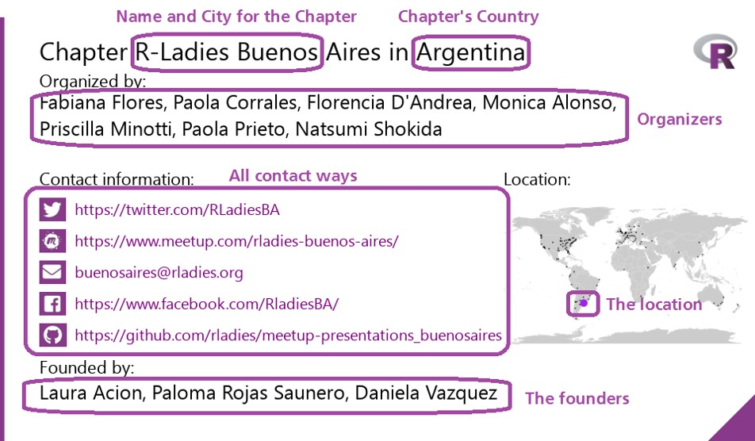

Todos os anos, a 8 de março, o mundo celebra o Dia Internacional da Mulher (DIM).
Embora esta data tenha diferentes formas de celebração, tem um ponto em comum - a luta pela igualdade de género.
O [ano anterior](http://blog.rladies.org/post/ideation_and_creation/) Em 2018, um grupo de entusiastas do R-Ladies tomou a iniciativa de um grande projeto de tweet sobre todos os perfis registados no diretório R-ladies, durante todo o dia 8 de março de 2018.
Em fevereiro deste ano, o ano de 2019, Yanina propôs seguir o seu exemplo e tweetar sobre todos os Capítulos R-Ladies, durante todo o dia 8 de março de 2019.

O apelo de Yanina a voluntários foi respondido de imediato.
Em poucos dias, tínhamos uma equipa de R-Ladies brilhantes e conhecedoras, constituída por [Yanina](https://twitter.com/yabellini), [Gabriela](https://twitter.com/gdequeiroz), [Patrícia](https://twitter.com/patriloto), [Roxana](https://twitter.com/data_datum), e [Divya](https://twitter.com/DSeernani).
Yanina assumiu o comando deste fantástico projeto, fazendo uma lista de tarefas a realizar e todos se ofereceram como voluntários para fazer o que podiam.
Yanina propôs a utilização da conta de twitter do IWD de 2018, continuando o que tinham construído na altura, mas concentrando-se em aumentar a visibilidade dos capítulos este ano.
Os capítulos do R-Ladies são a base do R-Ladies porque é aqui que a comunidade se reúne, ensina e aprende; onde as experiências são trocadas em todas as partes do mundo.
Os capítulos sustentam e ampliam a comunidade.
Era lógico utilizá-los para celebrar o IWD2019, e toda a gente aderiu imediatamente.

O mês seguinte e, em particular, os dias que antecederam o evento foram uma experiência de aprendizagem profunda para todos, à medida que trabalhámos e ajudámos de todas as formas possíveis.
Esta publicação do blogue conta-lhe o que foi feito nos bastidores para tornar o IWD 2019 um enorme sucesso para as R-Ladies.

## Antes do IWD.

Em primeiro lugar, convidámos todas as fundadoras e organizadoras dos capítulos R-Ladies a actualizarem as informações sobre os seus capítulos no GitHub.
Todas as organizadoras de todo o mundo estiveram à altura desta ocasião e a Gabriela recebeu pedidos de atualização quase diariamente!

Depois, era importante pôr a conta do Twitter em ordem, actualizando a sua identidade visual e convidando as R-ladies a seguirem a conta. [A conta IWD](https://twitter.com/rladies_iwd)começou a seguir todos os capítulos de R-Ladies existentes.
As contas de Twitter das secções de todo o mundo, da R-Ladies Global e até de outras organizações de mulheres que souberam desta iniciativa, seguiram a conta do IWD, divulgando ativamente o que esperar do IWD 2019.

Por último, nos dias que antecederam o IWD, foi realizada uma campanha com imagens criadas na ferramenta canva.com por Patricia e Yanina.
A primeira destas imagens foi tweetada a 17 de fevereiro, tendo sido enviados quase 25 tweets desde esse dia até 7 de março.
As imagens informavam as pessoas sobre o evento IWD que se aproximava e convidavam-nas a seguir a conta do Twitter da IWD.
Foram utilizadas etiquetas de propriedade para que os leitores com deficiência visual pudessem saber o que a imagem associada ao tweet estava a dizer.
Todos estes esforços aumentaram em 53% o número de utilizadores da conta do Twitter do R-Ladies IWD.
Estávamos prontos para lançar a campanha IWD!

## A campanha IWD

A campanha IWD consistiu em 256 tweets programados para serem publicados a cada 12 minutos, desde a primeira hora do IWD na parte mais oriental do mundo até à última hora do IWD na parte mais ocidental do mundo.
A campanha começou por destacar a equipa global da R-Ladies.
Seguiram-se tweets em quatro grandes categorias: informações sobre as secções existentes, novas secções que vão começar em breve, como iniciar uma nova secção na sua cidade e informações sobre o R-Ladies Remote, ao qual se podem juntar pessoas que não querem estar sujeitas a restrições geográficas.
Uma vez que uma imagem vale mais do que mil palavras, todas estas informações foram apresentadas de forma pictórica com textos para realçar a mensagem.
Mais uma vez, a maior parte deste trabalho de base foi feito por Yanina, Patricia e Roxana, e o texto para acompanhar as imagens foi escrito por Divya.
As duas primeiras categorias de imagens incluíam até um mapa-mundo para indicar onde se situavam os capítulos e uma ligação para a conta do encontro, para que as pessoas pudessem aderir imediatamente.
As imagens para Remote, Leadership Team e Global Masters foram criadas utilizando o Canvas e Yanina deu um passo em frente para fazer um vídeo a explicar como começar um novo capítulo utilizando Doodly.
Um jogo de "etiquetar se conhecer alguém" iniciado pela conta do Twitter da IWD rapidamente se espalhou pelos capítulos, todos se etiquetando uns aos outros, as senhoras por detrás dos capítulos e a conta do Twitter da IWD das R-Ladies, alimentando toda a excitação!
A excitação levou a muitas perguntas e actualizações de capítulos antigos e novos, a maioria das quais foi resolvida pela Gabriela.
Se estão a pensar quem ganhou este jogo, a conta R\_Forwards teve o maior número de RT e a nossa própria R-Lady Laura Aci?
n foi a mais etiquetada!

## O que alcançámos

No IWD2019, a conta IWD das R-Ladies enviou 417 tweets e retweets em 48 horas, anunciando 231 capítulos novos e existentes, a Equipa de Liderança, a Equipa Global, o Capítulo Remoto das RLadies e informações sobre como iniciar um novo capítulo.
Através de fotografias, tweets, partilha de ligações para encontros, marcação e elogios a outras R-Ladies, as experiências partilhadas de #rladies e #IWD2019 aproximaram a rede global de R-Ladies numa única plataforma do Twitter do IWD.
Ao fazê-lo, atingimos três objectivos principais.
Em primeiro lugar, apresentámos todos os capítulos em todo o mundo, para que os interessados em participar ou ajudar saibam qual o local mais próximo onde se podem juntar.
Em segundo lugar, destacámos os RLadies Remote como uma opção para aqueles que não podem participar nas reuniões locais.
Em terceiro lugar, explicámos como criar uma nova secção.
No processo, aprendemos muito mais do que pretendíamos e, agora, o R-Ladies tem uma lista de capítulos actualizada para todos explorarem!

## O que aprendemos como Voluntários neste projeto?

Em primeiro lugar, uma equipa animada com um objetivo comum pode trabalhar de forma eficiente e harmoniosa para atingir grandes objectivos.
Em segundo lugar, as equipas não têm de ser homogéneas.
Os voluntários para este projeto estavam espalhados por todo o mundo, trabalhando em diferentes fusos horários e falando diferentes línguas.
Este facto contribuiu para aumentar a atmosfera de compreensão e deu a todos a oportunidade de aprender mais.
Em terceiro lugar, todos os membros podem contribuir e todas as contribuições, grandes ou pequenas, são valiosas.
Uma tarefa gigantesca pode ser realizada trabalhando progressivamente para a concretizar.
Finalmente, tivemos a alegria de aprender com e sobre outras R-ladies em diferentes partes do mundo; e a satisfação de contribuir para uma comunidade que se esforça por dar a cada membro o reconhecimento e o apoio necessários para crescer.

## A Ação R!

Nós somos as R-Ladies!
Assim, a utilização do R era obviamente uma parte integrante de todo o projeto.
Fornecemos os scripts que utilizámos na caixa abaixo, juntamente com algumas ligações úteis que ajudaram a guiar os bastidores do Twitter.
A ligação mais importante foi [o blogue R-Ladies](http://blog.rladies.org/post/ideation_and_creation/) que explica a ação do Twitter do IWD 2018.
Aprender a usar Magick [aqui](https://ropensci.org/blog/2016/08/23/z-magick-release/) e [aqui](https://ropensci.org/tutorials/magick_tutorial/).
A [blogue](https://d4tagirl.com/2017/05/how-to-fetch-twitter-users-with-r) que explica como fazer mapas.
O processamento de texto (incluindo caracteres não ingleses) é explicado [aqui](https://www.gastonsanchez.com/r4strings/stringr-basics.html) e [aqui](https://appsilon.com/writing-excel-formatted-csv-using-readrwrite_excel_csv2/).

## Como foram criadas as imagens

A lista de capítulos actuais contém informações sobre o país, a cidade, o nome, as organizadoras, o estatuto e todas as formas de contacto (correio, Internet, encontros, redes sociais) de todos os capítulos do R-Ladies.
Tornou-se a nossa principal fonte de dados.
Também utilizámos uma lista de cidades geolocalizadas para fazer os mapas.
O nosso objetivo era obter uma imagem com os seguintes componentes:



```r
library(readxl)
library(magick)
library(purrr)
library(dplyr)
library(tidyr)
library(ggplot2)
library(maps)
library(ggthemes)
library(stringr)
 
#R-Ladies Current Chapter
CCRL <- read_excel("D:/Rladies/IWD019/IWD2019/CCRL2.xlsx")
#-List of Latitude and Longitude for Cities of the world
LatLong <- read_excel("D:/Rladies/IWD019/IWD2019/LatLong.xlsx")
 
#Join for City and State and Country because we have cities with the same name
CCRL <- CCRL %>% inner_join(LatLong, by = c("City", "State/Region", "Country"))
 
 
#We have prospective chapters that are being organised so they do not have official accounts yet. We need filter Chapters without Data because the picture will be different
SinData <- CCRL %>%
  filter (is.na(CCRL$Meetup)& is.na(CCRL$Twitter) & is.na(CCRL$Email) & is.na(CCRL$Facebook) &
    	   	is.na(CCRL$Instagram) & is.na(CCRL$Periscope) & is.na(CCRL$Youtube) & is.na(CCRL$GitHub) &
    	   	is.na(CCRL$Website) & is.na(CCRL$Slack))
 
#Filter Chapters with Data
CCRL <- CCRL %>%
  filter(CCRL$Country !='Remote') %>%
  anti_join(SinData, by = c("City", "State/Region", "Country"))
 
 
#For loop for every row in Current Chapter
#Add 30-40 pixel for each column only in the cases that have data, have to choose the correct logo
#Make a map highlighting the place of the Chapter in the world
 
#I could not find a way to avoid the for loop
 
for (i in 1:nrow(CCRL)) { #Line for all the chapters
 
  #We used an R-Ladies template for start the picture
  template <- image_read("D:/Rladies/IWD019/IWD2019/RLTemplate.png")
 
  #Add the chapter map
  #The world map is generated with all the chapters marked with black dots. The current chapter is marked #with a larger purple dot R-Ladies.
 
  world <- ggplot() +
            	borders("world", colour = "gray85", fill = "gray80") +
            	theme_map()
 
  #We have some chapters that belong to two cities, like Resistencia-Corrientes in Argentina, in that case, we must draw two points and not one.
 
  if(!is.na(CCRL$Lat[i])){
            	map <- world +
           	geom_point(aes(x = Longitude, y = Latitude, size = 1),
         	 data = CCRL, colour = 'black', alpha = .5) +
           	geom_point(aes(x = Longitude[i], y = Latitude[i], size = 10),
         	 data= CCRL, colour= 'purple', alpha = .5) +
           	geom_point(aes(x = Lon[i], y = Lat[i], size = 10),
         	 data= CCRL, colour= 'purple', alpha = .5) +
           	theme(legend.position="none")
	
	
  } else {
            	map <- world +
           	geom_point(aes(x = Longitude, y = Latitude, size = 1),
         	 data = CCRL, colour = 'black', alpha = .5) +
           	geom_point(aes(x = Longitude[i], y = Latitude[i], size = 10),
         	 data= CCRL, colour= 'purple', alpha = .5) +
           	theme(legend.position="none")
	
            
  }
 
  #Save the map
  ggsave("map.png", width = 7, height = 4)
 
  #Read the map
  map <- image_read("D:/Rladies/IWD019/IWD2019/map.png")
 
  #Indicate the place in the image where to place the map
  place = 230
 
  #Add the map to the template
  template <- image_composite(template, image_scale(map, 'x200'), offset = paste("+620+", as.character(place))) 
 
  #Ad the rest of the info
  #Indicate the place in the image where to place the data
  place=190 
 
  #Add text and data
  template <- image_annotate(template, paste("Chapter R-Ladies",CCRL$City[i],'in',CCRL$Country[i]), font = 'helvetica', size = 32, location = "+50+20") %>%
            	image_annotate( "Organized by:", font = 'helvetica', size = 22, location = "+50+65", color = "black") %>%
            	image_annotate("Contact information:", font = 'helvetica', size = 22, location = paste("+50+", as.character(place)), color = "black") %>%														
            	image_annotate("Location:", font = 'helvetica', size = 22, location = paste("+640+", as.character(place)), color = "black")
 
  #There are chapters with several organizers (Yay!) And the string with their names may be longer than the template. Therefore, the text must be cut to the appropriate length.
  org <-str_wrap(CCRL$Organizers[i], width = 70)
  #Add the organizers names with the appropriate length.
  template <- image_annotate(template, org, font = 'helvetica', size = 25, location = "+50+90", color = "black")
 
  #We add the info of each communication channel and social network only if the chapter has an active account.
 
  #Maybe I should have made a function for this part .
 
  #Cheking for Twitter
  if (!is.na(CCRL$Twitter[i])){
            	place=place+40 #Add some lines
            	pic <- image_read("D:/Rladies/IWD019/IWD2019/twitter.png") #Read the corresponding logo
            	template <- image_composite(template, image_scale(pic, "x30"), offset = paste("+50+", as.character(place))) #Add the logo
            	template <- image_annotate(template, CCRL$Twitter[i] , font = 'helvetica', size = 20, location = paste ("+95+", as.character(place)), color = "purple") #Add the URL or account
  }
 
 
  #Cheking for Meetup
  if (!is.na(CCRL$Meetup[i])){
            	place=place+40
            	pic <- image_read("D:/Rladies/IWD019/IWD2019/meetup.png")
            	template <- image_composite(template, image_scale(pic, "x30"), offset = paste("+50+", as.character(place)))
            	template <- image_annotate(template, CCRL$Meetup[i] , font = 'helvetica', size = 20, location = paste ("+95+", as.character(place)), color = "purple")
 
  }
 
 
  #Cheking for Mail 
  if (!is.na(CCRL$Email[i])){
            	place=place+40
            	pic <- image_read("D:/Rladies/IWD019/IWD2019/mail.png")
            	template <- image_composite(template, image_scale(pic, "x30"), offset = paste("+50+", as.character(place)))
            	template <- image_annotate(template, CCRL$Email[i] , font = 'helvetica', size = 20, location = paste ("+95+", as.character(place)), color = "purple")
 
  }
 
  #Cheking for Facebook
  if (!is.na(CCRL$Facebook[i])){
            	place=place+40
            	pic <- image_read("D:/Rladies/IWD019/IWD2019/facebook.png")
            	template <- image_composite(template, image_scale(pic, "x30"), offset = paste("+50+", as.character(place)))
 
            	template <- image_annotate(template, CCRL$Facebook[i] , font = 'helvetica', size = 20, location = paste ("+95+", as.character(place)), color = "purple")
 
 
  }
 
  #Cheking for Instagram
  if (!is.na(CCRL$Instagram[i])){
            	place=place+40
            	pic <- image_read("D:/Rladies/IWD019/IWD2019/instagram.png")
            	template <- image_composite(template, image_scale(pic, "x30"), offset = paste("+50+", as.character(place)))
	
            	template <- image_annotate(template, CCRL$Instagram[i] , font = 'helvetica', size = 20, location = paste ("+95+", as.character(place)), color = "purple")
 
  }
 
  #Cheking for Periscope
  if (!is.na(CCRL$Periscope[i])){
            	place=place+40
	
            	pic <- image_read("D:/Rladies/IWD019/IWD2019/periscope.png")
            	template <- image_composite(template, image_scale(pic, "x30"), offset = paste("+50+", as.character(place)))
	
            	template <- image_annotate(template, CCRL$Periscope[i] , font = 'helvetica', size = 20, location = paste ("+95+", as.character(place)), color = "purple")
 
  }
 
  #Cheking for YouTube
  if (!is.na(CCRL$Youtube[i])){
            	place=place+40
            	pic <- image_read("D:/Rladies/IWD019/IWD2019/youtube.png")
            	template <- image_composite(template, image_scale(pic, "x30"), offset = paste("+50+", as.character(place)))
	
            	template <- image_annotate(template, CCRL$Youtube[i] , font = 'helvetica', size = 20, location = paste ("+95+", as.character(place)), color = "purple")
 
  }
 
  #Cheking for GitHub
  if (!is.na(CCRL$GitHub[i])){
            	place=place+40
	
            	pic <- image_read("D:/Rladies/IWD019/IWD2019/github.png")
            	template <- image_composite(template, image_scale(pic, "x30"), offset = paste("+50+", as.character(place)))
	
            	template <- image_annotate(template, CCRL$GitHub[i] , font = 'helvetica', size = 20, location = paste ("+95+", as.character(place)), color = "purple")
 
  }
 
  #Cheking for WebSite
  if (!is.na(CCRL$Website[i])){
            	place=place+40
	
            	pic <- image_read("D:/Rladies/IWD019/IWD2019/web.png")
            	template <- image_composite(template, image_scale(pic, "x30"), offset = paste("+50+", as.character(place)))
	
            	template <- image_annotate(template, CCRL$Website[i] , font = 'helvetica', size = 20, location = paste ("+95+", as.character(place)), color = "purple")
 
  }
 
  #Cheking for Slack
  if (!is.na(CCRL$Slack[i])){
            	place=place+40
	
            	pic <- image_read("D:/Rladies/IWD019/IWD2019/slack.png")
            	template <- image_composite(template, image_scale(pic, "x30"), offset = paste("+50+", as.character(place)))
	
	
            	template <- image_annotate(template, CCRL$Slack[i] , font = 'helvetica', size = 20, location = paste ("+95+", as.character(place)), color = "purple")
 
  }
 
  #Add Founders
   if (!is.na(CCRL$Founders[i])){
            	place=place+40
            	 
            	template <- image_annotate(template, "Founded by:", font = 'helvetica', size = 22, location = paste ("+50+", as.character(place)), color = "black")
            	place=place+30
 
            	template <- image_annotate(template, CCRL$Founders[i], font = 'helvetica', size = 25, location = paste ("+50+", as.character(place)), color = "black")
            	 
   }
 
  #Save the final picture
  image_write(template, paste("Chapter",str_replace_all(CCRL$City[i], fixed(" "), ""),".png"), format= "png")
 
}
```

Para os capítulos em processo de criação, não dispomos de informações de contacto, pelo que substituímos essas informações por algumas imagens agradáveis sobre a R-Ladies e a sua rede.
O objetivo era produzir esta imagem:


```r
#Chapters without data

# We dont have contact information for this chapter, so we replace the info with a picture
#Pictures
pics <- c('meme', 'walk', 'group3','group4','future3')

set.seed(42)
# the first one is chosen, this way it's not "another" or "one more"

pics <- c(pics[1],
           	sample(pics, nrow(SinData) - 1, replace = TRUE))


for (i in 1:nrow(SinData)) { #Line for all the chapters

  template <- image_read("D:/Rladies/IWD019/IWD2019/RLTemplate.png")
  qr <- image_read("D:/Rladies/IWD019/IWD2019/qrcode_rladiesorg.png")
 
  #Add the pic
  place = 170
  file <- paste("D:/Rladies/IWD019/IWD2019/",str_trim(as.character(pics[i])),".png")
  pic <- image_read(str_replace_all(file," ",""))
 
  template <- image_composite(template, image_scale(pic, 'x250'), offset = paste("+75+", as.character(place)))  
 
  #Add the chapter map
 
  world <- ggplot() +
	borders("world", colour = "gray85", fill = "gray80") +
	theme_map()
 
 
  if(!is.na(SinData$Lat[i])){
	map <- world +
  	geom_point(aes(x = Longitude, y = Latitude, size = 1),
             	data = SinData, colour = 'black', alpha = .5) +
  	geom_point(aes(x = Longitude[i], y = Latitude[i], size = 10),
             	data= SinData, colour= 'purple', alpha = .5) +
  	geom_point(aes(x = Lon[i], y = Lat[i], size = 10),
             	data= SinDataL, colour= 'purple', alpha = .5) +
  	theme(legend.position="none")
    
   
  } else {
	map <- world +
  	geom_point(aes(x = Longitude, y = Latitude, size = 1),
             	data = SinData, colour = 'black', alpha = .5) +
  	geom_point(aes(x = Longitude[i], y = Latitude[i], size = 10),
             	data= SinData, colour= 'purple', alpha = .5) +
  	theme(legend.position="none")
    
  }
 
  ggsave("map.png", width = 7, height = 4)
 
  map <- image_read("D:/Rladies/IWD019/IWD2019/map.png")
 
  template <- image_composite(template, image_scale(map, 'x250'), offset = paste("+550+", as.character(place)))  
 
 
  #Add the rest of the info
  place=190  
 
  template <- image_annotate(template, paste("Chapter R-Ladies",SinData$City[i],'in',SinData$Country[i]), font = 'helvetica', size = 32, location = "+50+20") %>%
	image_annotate( "Organized by:", font = 'helvetica', size = 22, location = "+50+65", color = "black")

  org <-str_wrap(SinData$Organizers[i], width = 70)
 
  template <- image_annotate(template, org, font = 'helvetica', size = 25, location = "+50+90", color = "black")
 

 
  #Add the QR
  place=440
 
  template <- image_annotate(template, "+Info:", font = 'helvetica', size = 22, location = paste("+50+", as.character(place)), color = "black")
 
  place=place + 10
 
  template <- image_composite(template, image_scale(qr, "x70"), offset = paste("+125+", as.character(place)))
 
  #Save the final picture
  image_write(template, paste("Chapter",str_replace_all(SinData$City[i], fixed(" "), ""),".png"), format= "png")
}
```

## Como foram criados os Tweets

```r
#Base code from Ma?lle and the post in R-Ladies blog
 
# templates
 
templates <- c("Did you know that there is an adjective chapter in X? They'd love for you to visit!",
       	   "Hop over and join this adjective group of #rladies in X!",
       	   "Do you like #rstats? Looking for like-minded people? Come to have fun with us in X!",
       	   "Do you like #rstats? Looking to learn more? Come to share with us in X!",
       	   "Celebrate woman's day with our adjective chapter in X",
       	   "Looking for something to inspire you? Meet our adjective chapter in X",
       	   "Learn all about what this adjective chapter X is up to this Women's day!",
       	   "We are so proud of our adjective chapter in X!",
       	   "Nourish your mind today! Join adjective chapter X!",
       	   "We are privileged to have adjective chapter X in our network!",
       	   "We are privileged to feature adjective chapter X this women's day!")
 
Chapter_adjectives <- c("awesome", "fantastic", "wonderful", "amazing", "brilliant", "phenomenal", "remarkable", "talented", "incredible", "top-notch", "magnificent", "marvelous", "insightful", "capable", "admirable", "outstanding", "splendid", "exceptional")
 
 
# get as many sentences as there are Chapters
combinations <- expand.grid(templates, Chapter_adjectives)
combinations <- dplyr::mutate_all(combinations, as.character)
 
create_sentence <- function(template, adjective){
  stringr::str_replace(template, "adjective", adjective)
}
 
sentences <- purrr::map2_chr(combinations$Var1, combinations$Var2,
                     		create_sentence)
set.seed(42)
# the first one is chosen, this way it's not "another" or "one more"
sentences <- c(sentences[1],
       	   sample(sentences, nrow(CCRL) - 1, replace = TRUE))
 
# add actual tweet text
CCRLTw <- dplyr::mutate(CCRL,
                	     	tweet = stringr::str_replace(sentences,"X",CCRL$City),
                	     	tweet = ifelse(!is.na(CCRL$Meetup),
                      	             	paste0(tweet, " Meetups here: ", CCRL$Meetup), tweet),
                	     	tweet = paste(tweet, "#rladies #iwd2018"),
                	     	picture=paste("Chapter",str_replace_all(CCRL$City, fixed(" "), ""),".png"))
 
# save tweets
tweets <- dplyr::select(CCRLTw, City, tweet, picture) %>%
  arrange(City)
#We used csv2 because we have some encode issues (windows and/or non english characters)
readr::write_excel_csv2(tweets, path = "ready_tweets.csv")


#Text for new chapters
templates <- c(
"We have plans for a chapter in X, are you close? Come closer!",

"In and around X? Interested in #rstats? We have just the thing for you!",

"Want to share with like minded R-ladies in X? Stay tuned for this new chapter!",

"R-ladies in X are gearing up for a new chapter...hop over to help them out!",

"Good news for X! An R-ladies chapter is starting right in your city!",

"#RLadies continues expanding and is reaching X!!, Stay tuned for this new chapter!")

# Get as many sentences as there are Chapters
set.seed(42)
# the first one is chosen, this way it's not "another" or "one more"

templates <- c(templates[1],
      	sample(templates, nrow(SinData) - 1, replace = TRUE))

# add actual tweet text
CCRLTw <- dplyr::mutate(SinData,
                    	tweet = stringr::str_replace(templates,"X",SinData$City),
                   	 
                    	tweet = paste(tweet, "#rladies #iwd2018"),
                   	 
                    	picture=paste("Chapter",str_replace_all(SinData$City, fixed(" "), ""),".png"))

# save tweets
tweets <- dplyr::select(CCRLTw, City, tweet, picture) %>%
  arrange(City)
readr::write_excel_csv2(tweets, path = "ready_tweets_nodata.csv")
```

Autoras: "Contado por Yanina Bellini, Patricia Loto e Divya Seernani; com notas de Roxana Noelia Villafane e Gabriela De Queiroz"


