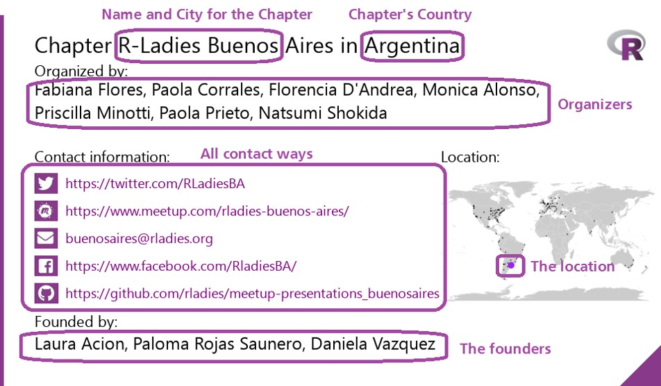
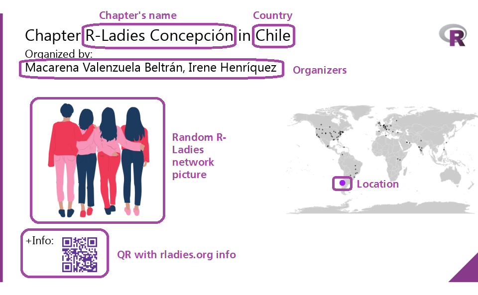

<<<<<<< HEAD:content/blog/2019-03-25-blog_iwdtwitter_2019/index.en.md
Every year on March 8th, the world celebrates International Women's Day (IWD).
Although this date has different ways of celebration, it has one point in common - the fight for gender equality.
The [previous year](http://blog.rladies.org/post/ideation_and_creation/), in 2018, an enthusiast R-Ladies' group took the initiative for a massive project to tweet about all the profiles registered in the R-ladies directory, throughout 8th March 2018.
In February this year, the year 2019, Yanina proposed to follow their lead and tweet about all the R-Ladies Chapters, throughout 8th March 2019.

Yanina's call for volunteers was responded to instantly.
In a matter of days, we had a team of brilliant, knowledgeable R-Ladies consisting of [Yanina](https://twitter.com/yabellini), [Gabriela](https://twitter.com/gdequeiroz), [Patricia](https://twitter.com/patriloto), [Roxana](https://twitter.com/data_datum), and [Divya](https://twitter.com/DSeernani).
Yanina took the wheel of this fantastic project, making a list of tasks to be done and everyone stepped up to volunteer for what they could do.
Yanina proposed using the IWD twitter account from 2018, continuing what they had built then, but focusing on increasing visibility for chapters this year.
R-Ladies chapters are the foundation of R-Ladies because this is where the community gathers, teaches and learns; where experiences are exchanged in every part of the world.
The chapters sustain and magnify the community.
It was logical to use these to celebrate IWD2019, and everyone was immediately on board.

The next month and particularly days leading up to the event was a profound learning experience for everyone as we worked and helped in whichever ways we could.
This blog post tells you what was done behind the scenes to make IWD 2019 an immense success for R-Ladies.

## Leading up to IWD.
=======
Every year on March 8th, the world celebrates International Women's Day (IWD). Although this date has different ways of celebration, it has one point in common - the fight for gender equality. The [previous year](http://blog.rladies.org/post/ideation_and_creation/), in 2018, an enthusiast R-Ladies' group took the initiative for a massive project to tweet about all the profiles registered in the R-ladies directory, throughout 8th March 2018. In February this year, the year 2019, Yanina proposed to follow their lead and tweet about all the R-Ladies Chapters, throughout 8th March 2019.

Yanina's call for volunteers was responded to instantly. In a matter of days, we had a team of brilliant, knowledgeable R-Ladies consisting of [Yanina](https://twitter.com/yabellini), [Gabriela](https://twitter.com/gdequeiroz), [Patricia](https://twitter.com/patriloto), [Roxana](https://twitter.com/data_datum), and [Divya](https://twitter.com/DSeernani). Yanina took the wheel of this fantastic project, making a list of tasks to be done and everyone stepped up to volunteer for what they could do. Yanina proposed using the IWD twitter account from 2018, continuing what they had built then, but focusing on increasing visibility for chapters this year. R-Ladies chapters are the foundation of R-Ladies because this is where the community gathers, teaches and learns; where experiences are exchanged in every part of the world. The chapters sustain and magnify the community. It was logical to use these to celebrate IWD2019, and everyone was immediately on board.

The next month and particularly days leading up to the event was a profound learning experience for everyone as we worked and helped in whichever ways we could. This blog post tells you what was done behind the scenes to make IWD 2019 an immense success for R-Ladies.

## Leading up to IWD.

First, we invited all the R-Ladies Chapter founders and organisers to update their chapter information on GitHub. All organisers from all over the world rose to this occasion with Gabriela getting pull requests on an almost daily basis!
>>>>>>> main:content/blog/2019/03-25-blog_iwdtwitter_2019/index.en.md

First, we invited all the R-Ladies Chapter founders and organisers to update their chapter information on GitHub.
All organisers from all over the world rose to this occasion with Gabriela getting pull requests on an almost daily basis!

Then it was important to put the Twitter account in order by updating its visual identity and inviting R-ladies to follow the account. [The IWD account](https://twitter.com/rladies_iwd)started following all the existing R-Ladies chapters.
Twitter accounts of chapters all over the world, R-Ladies Global and even other women organisations that heard about this stepped up to the occasion and followed the IWD account, actively spreading the word about what to look forward to on IWD 2019.

Finally, on the days leading up to IWD, a campaign was carried out using images created in the tool canva.com by Patricia and Yanina.
The first of these images was tweeted on 17th Feb, and almost 25 tweets were sent from this day on, till 7th March.
The images informed people about the upcoming IWD event and invited them to follow the IWD Twitter account.
Property tags were used for visually challenged readers to know what the image associated with the tweet was saying.
All these efforts increased the users of the R-Ladies IWD Twitter account by 53%.
We were ready to roll out the IWD Campaign!

<<<<<<< HEAD:content/blog/2019-03-25-blog_iwdtwitter_2019/index.en.md
## The IWD Campaign

The IWD Campaign consisted of 256 tweets programmed to be set out every 12 minutes from the first hour of IWD in the east-most part of the world, till the last hour of IWD in the west-most part of the world.
The Campaign started out by highlighting the R-Ladies Global Team.
This was followed by tweets in 4 broad categories - information about existing chapters, new chapters that would be starting soon, how to start a new chapter in your city, and information about R-Ladies Remote that people not wanting to be bound to geographic restriction could join.
Since a picture speaks a thousand words, all this info was presented pictorially with texts to highlight the message.
Again, most of this groundwork was done by Yanina, Patricia and Roxana, and the text to go with the pictures was written by Divya.
The first two categories of pictures even came with a world map to point out where the chapters were and a link to the meetup account so people could join instantly.
The images for Remote, Leadership Team and Global Masters was created using Canvas and Yanina went a step further to make a video explaining how to start a new chapter was using Doodly.
A 'tag-if-you-know-someone' game initiated by the IWD twitter account soon swooped through the chapters all tagging each other, the Ladies behind the Chapters and R-Ladies IWD Twitter account fueling all the excitement!
The excitement led to a lot of queries and updates from chapters old and new, most of which were resolved by Gabriela.
If you are wondering who won this game, the R\_Forwards account had the most number of RTs and our very own R-Lady Laura Aci?
n was tagged the most!

## What we achieved

On IWD2019, the R-Ladies IWD Account sent out 417 tweets and retweets across 48 hours, advertising 231 new and existing chapters, the Leadership Team, Global Team, RLadies Remote Chapter and info about how to start a new chapter.
Through pictures, tweets, sharing meetup links, tagging and complimenting fellow R-Ladies, the shared experiences of #rladies and #IWD2019 brought the global R-Ladies Network closer, onto one IWD Twitter platform.
We achieved three main goals by doing this.
First, we presented all the chapters around the world so that those interested in participating or helping know the closest place to join.
Second, we highlighted RLadies Remote as the option for those who cannot attend local meetings.
Third, we explained how to create a new chapter.
In the process, we learnt so much more than we intended to, and hey, R-Ladies now has an up-to-date Chapters List for everyone to explore!

## What we learnt as Volunteers on this project?

First of all, an animate team with a shared aim can work efficiently and harmoniously to achieve big goals.
Secondly, teams do now have to be homogeneous.
The volunteers for this project were all across the world, working in different time zones and speaking different languages.
This just added to the understanding atmosphere and gave everyone an opportunity to learn more.
Third, Every member can contribute and every contribution, big and small, is valuable.
A mammoth task can be realised by working incrementally towards it.
Finally, we had the joy of learning from and about other R-ladies in different parts of the world; and the satisfaction of contributing to a community striving to give every member recognition and the support required to grow.

## The R Action!

We are R-Ladies!
So, using R was obviously an integral part of the whole project.
We provide the scripts we used in the box below, along with some useful links to that helped guide behind the scenes of Twitter.
=======
Finally, on the days leading up to IWD, a campaign was carried out using images created in the tool canva.com by Patricia and Yanina. The first of these images was tweeted on 17th Feb, and almost 25 tweets were sent from this day on, till 7th March. The images informed people about the upcoming IWD event and invited them to follow the IWD Twitter account. Property tags were used for visually challenged readers to know what the image associated with the tweet was saying. All these efforts increased the users of the R-Ladies IWD Twitter account by 53%. We were ready to roll out the IWD Campaign!

## The IWD Campaign

The IWD Campaign consisted of 256 tweets programmed to be set out every 12 minutes from the first hour of IWD in the east-most part of the world, till the last hour of IWD in the west-most part of the world. The Campaign started out by highlighting the R-Ladies Global Team. This was followed by tweets in 4 broad categories - information about existing chapters, new chapters that would be starting soon, how to start a new chapter in your city, and information about R-Ladies Remote that people not wanting to be bound to geographic restriction could join. Since a picture speaks a thousand words, all this info was presented pictorially with texts to highlight the message. Again, most of this groundwork was done by Yanina, Patricia and Roxana, and the text to go with the pictures was written by Divya. The first two categories of pictures even came with a world map to point out where the chapters were and a link to the meetup account so people could join instantly. The images for Remote, Leadership Team and Global Masters was created using Canvas and Yanina went a step further to make a video explaining how to start a new chapter was using Doodly.
A 'tag-if-you-know-someone' game initiated by the IWD twitter account soon swooped through the chapters all tagging each other, the Ladies behind the Chapters and R-Ladies IWD Twitter account fueling all the excitement! The excitement led to a lot of queries and updates from chapters old and new, most of which were resolved by Gabriela. If you are wondering who won this game, the R_Forwards account had the most number of RTs and our very own R-Lady Laura Aci?n was tagged the most!

## What we achieved

On IWD2019, the R-Ladies IWD Account sent out 417 tweets and retweets across 48 hours, advertising 231 new and existing chapters, the Leadership Team, Global Team, RLadies Remote Chapter and info about how to start a new chapter. Through pictures, tweets, sharing meetup links, tagging and complimenting fellow R-Ladies, the shared experiences of #rladies and #IWD2019 brought the global R-Ladies Network closer, onto one IWD Twitter platform. We achieved three main goals by doing this. First, we presented all the chapters around the world so that those interested in participating or helping know the closest place to join. Second, we highlighted RLadies Remote as the option for those who cannot attend local meetings. Third, we explained how to create a new chapter. In the process, we learnt so much more than we intended to, and hey, R-Ladies now has an up-to-date Chapters List for everyone to explore!

## What we learnt as Volunteers on this project?

First of all, an animate team with a shared aim can work efficiently and harmoniously to achieve big goals. Secondly, teams do now have to be homogeneous. The volunteers for this project were all across the world, working in different time zones and speaking different languages. This just added to the understanding atmosphere and gave everyone an opportunity to learn more. Third, Every member can contribute and every contribution, big and small, is valuable. A mammoth task can be realised by working incrementally towards it. Finally, we had the joy of learning from and about other R-ladies in different parts of the world; and the satisfaction of contributing to a community striving to give every member recognition and the support required to grow.

## The R Action!

We are R-Ladies! So, using R was obviously an integral part of the whole project. We provide the scripts we used in the box below, along with some useful links to that helped guide behind the scenes of Twitter.
>>>>>>> main:content/blog/2019/03-25-blog_iwdtwitter_2019/index.en.md
The most important link was [the R-Ladies Blog](http://blog.rladies.org/post/ideation_and_creation/) explaining IWD 2018 Twitter Action.
Learn how to use Magick [here](https://ropensci.org/blog/2016/08/23/z-magick-release/) and [here](https://ropensci.org/tutorials/magick_tutorial/).
A [blog](https://d4tagirl.com/2017/05/how-to-fetch-twitter-users-with-r) explaining how to make Maps.
Text Processing (including non-English charectors) is explained [here](https://www.gastonsanchez.com/r4strings/stringr-basics.html) and [here](https://appsilon.com/writing-excel-formatted-csv-using-readrwrite_excel_csv2/).

## How the Pictures were created

<<<<<<< HEAD:content/blog/2019-03-25-blog_iwdtwitter_2019/index.en.md
The Current Chapter list contains the information of the country, city, name, organisers, status and all forms of contact (mail, web, meetup, social networks) of all chapters of R-Ladies.
It became our primary data source.
We also used a list of cities geolocated for made the maps.
Our goal was to achieve an image with the following components:
=======
The Current Chapter list contains the information of the country, city, name, organisers, status and all forms of contact (mail, web, meetup, social networks) of all chapters of R-Ladies. It became our primary data source. We also used a list of cities geolocated for made the maps. Our goal was to achieve an image with the following components:
>>>>>>> main:content/blog/2019/03-25-blog_iwdtwitter_2019/index.en.md



```r
library(readxl)
library(magick)
library(purrr)
library(dplyr)
library(tidyr)
library(ggplot2)
library(maps)
library(ggthemes)
library(stringr)

#R-Ladies Current Chapter
CCRL <- read_excel("D:/Rladies/IWD019/IWD2019/CCRL2.xlsx")
#-List of Latitude and Longitude for Cities of the world
LatLong <- read_excel("D:/Rladies/IWD019/IWD2019/LatLong.xlsx")

#Join for City and State and Country because we have cities with the same name
CCRL <- CCRL %>% inner_join(LatLong, by = c("City", "State/Region", "Country"))


#We have prospective chapters that are being organised so they do not have official accounts yet. We need filter Chapters without Data because the picture will be different
SinData <- CCRL %>%
  filter (is.na(CCRL$Meetup)& is.na(CCRL$Twitter) & is.na(CCRL$Email) & is.na(CCRL$Facebook) &
    	   	is.na(CCRL$Instagram) & is.na(CCRL$Periscope) & is.na(CCRL$Youtube) & is.na(CCRL$GitHub) &
    	   	is.na(CCRL$Website) & is.na(CCRL$Slack))

#Filter Chapters with Data
CCRL <- CCRL %>%
  filter(CCRL$Country !='Remote') %>%
  anti_join(SinData, by = c("City", "State/Region", "Country"))


#For loop for every row in Current Chapter
#Add 30-40 pixel for each column only in the cases that have data, have to choose the correct logo
#Make a map highlighting the place of the Chapter in the world

#I could not find a way to avoid the for loop

for (i in 1:nrow(CCRL)) { #Line for all the chapters

  #We used an R-Ladies template for start the picture
  template <- image_read("D:/Rladies/IWD019/IWD2019/RLTemplate.png")

  #Add the chapter map
  #The world map is generated with all the chapters marked with black dots. The current chapter is marked #with a larger purple dot R-Ladies.

  world <- ggplot() +
            	borders("world", colour = "gray85", fill = "gray80") +
            	theme_map()

  #We have some chapters that belong to two cities, like Resistencia-Corrientes in Argentina, in that case, we must draw two points and not one.

  if(!is.na(CCRL$Lat[i])){
            	map <- world +
           	geom_point(aes(x = Longitude, y = Latitude, size = 1),
         	 data = CCRL, colour = 'black', alpha = .5) +
           	geom_point(aes(x = Longitude[i], y = Latitude[i], size = 10),
         	 data= CCRL, colour= 'purple', alpha = .5) +
           	geom_point(aes(x = Lon[i], y = Lat[i], size = 10),
         	 data= CCRL, colour= 'purple', alpha = .5) +
           	theme(legend.position="none")


  } else {
            	map <- world +
           	geom_point(aes(x = Longitude, y = Latitude, size = 1),
         	 data = CCRL, colour = 'black', alpha = .5) +
           	geom_point(aes(x = Longitude[i], y = Latitude[i], size = 10),
         	 data= CCRL, colour= 'purple', alpha = .5) +
           	theme(legend.position="none")


  }

  #Save the map
  ggsave("map.png", width = 7, height = 4)

  #Read the map
  map <- image_read("D:/Rladies/IWD019/IWD2019/map.png")

  #Indicate the place in the image where to place the map
  place = 230

  #Add the map to the template
  template <- image_composite(template, image_scale(map, 'x200'), offset = paste("+620+", as.character(place)))

  #Ad the rest of the info
  #Indicate the place in the image where to place the data
  place=190

  #Add text and data
  template <- image_annotate(template, paste("Chapter R-Ladies",CCRL$City[i],'in',CCRL$Country[i]), font = 'helvetica', size = 32, location = "+50+20") %>%
            	image_annotate( "Organized by:", font = 'helvetica', size = 22, location = "+50+65", color = "black") %>%
            	image_annotate("Contact information:", font = 'helvetica', size = 22, location = paste("+50+", as.character(place)), color = "black") %>%
            	image_annotate("Location:", font = 'helvetica', size = 22, location = paste("+640+", as.character(place)), color = "black")

  #There are chapters with several organizers (Yay!) And the string with their names may be longer than the template. Therefore, the text must be cut to the appropriate length.
  org <-str_wrap(CCRL$Organizers[i], width = 70)
  #Add the organizers names with the appropriate length.
  template <- image_annotate(template, org, font = 'helvetica', size = 25, location = "+50+90", color = "black")

  #We add the info of each communication channel and social network only if the chapter has an active account.

  #Maybe I should have made a function for this part .

  #Cheking for Twitter
  if (!is.na(CCRL$Twitter[i])){
            	place=place+40 #Add some lines
            	pic <- image_read("D:/Rladies/IWD019/IWD2019/twitter.png") #Read the corresponding logo
            	template <- image_composite(template, image_scale(pic, "x30"), offset = paste("+50+", as.character(place))) #Add the logo
            	template <- image_annotate(template, CCRL$Twitter[i] , font = 'helvetica', size = 20, location = paste ("+95+", as.character(place)), color = "purple") #Add the URL or account
  }


  #Cheking for Meetup
  if (!is.na(CCRL$Meetup[i])){
            	place=place+40
            	pic <- image_read("D:/Rladies/IWD019/IWD2019/meetup.png")
            	template <- image_composite(template, image_scale(pic, "x30"), offset = paste("+50+", as.character(place)))
            	template <- image_annotate(template, CCRL$Meetup[i] , font = 'helvetica', size = 20, location = paste ("+95+", as.character(place)), color = "purple")

  }


  #Cheking for Mail
  if (!is.na(CCRL$Email[i])){
            	place=place+40
            	pic <- image_read("D:/Rladies/IWD019/IWD2019/mail.png")
            	template <- image_composite(template, image_scale(pic, "x30"), offset = paste("+50+", as.character(place)))
            	template <- image_annotate(template, CCRL$Email[i] , font = 'helvetica', size = 20, location = paste ("+95+", as.character(place)), color = "purple")

  }

  #Cheking for Facebook
  if (!is.na(CCRL$Facebook[i])){
            	place=place+40
            	pic <- image_read("D:/Rladies/IWD019/IWD2019/facebook.png")
            	template <- image_composite(template, image_scale(pic, "x30"), offset = paste("+50+", as.character(place)))

            	template <- image_annotate(template, CCRL$Facebook[i] , font = 'helvetica', size = 20, location = paste ("+95+", as.character(place)), color = "purple")


  }

  #Cheking for Instagram
  if (!is.na(CCRL$Instagram[i])){
            	place=place+40
            	pic <- image_read("D:/Rladies/IWD019/IWD2019/instagram.png")
            	template <- image_composite(template, image_scale(pic, "x30"), offset = paste("+50+", as.character(place)))

            	template <- image_annotate(template, CCRL$Instagram[i] , font = 'helvetica', size = 20, location = paste ("+95+", as.character(place)), color = "purple")

  }

  #Cheking for Periscope
  if (!is.na(CCRL$Periscope[i])){
            	place=place+40

            	pic <- image_read("D:/Rladies/IWD019/IWD2019/periscope.png")
            	template <- image_composite(template, image_scale(pic, "x30"), offset = paste("+50+", as.character(place)))

            	template <- image_annotate(template, CCRL$Periscope[i] , font = 'helvetica', size = 20, location = paste ("+95+", as.character(place)), color = "purple")

  }

  #Cheking for YouTube
  if (!is.na(CCRL$Youtube[i])){
            	place=place+40
            	pic <- image_read("D:/Rladies/IWD019/IWD2019/youtube.png")
            	template <- image_composite(template, image_scale(pic, "x30"), offset = paste("+50+", as.character(place)))

            	template <- image_annotate(template, CCRL$Youtube[i] , font = 'helvetica', size = 20, location = paste ("+95+", as.character(place)), color = "purple")

  }

  #Cheking for GitHub
  if (!is.na(CCRL$GitHub[i])){
            	place=place+40

            	pic <- image_read("D:/Rladies/IWD019/IWD2019/github.png")
            	template <- image_composite(template, image_scale(pic, "x30"), offset = paste("+50+", as.character(place)))

            	template <- image_annotate(template, CCRL$GitHub[i] , font = 'helvetica', size = 20, location = paste ("+95+", as.character(place)), color = "purple")

  }

  #Cheking for WebSite
  if (!is.na(CCRL$Website[i])){
            	place=place+40

            	pic <- image_read("D:/Rladies/IWD019/IWD2019/web.png")
            	template <- image_composite(template, image_scale(pic, "x30"), offset = paste("+50+", as.character(place)))

            	template <- image_annotate(template, CCRL$Website[i] , font = 'helvetica', size = 20, location = paste ("+95+", as.character(place)), color = "purple")

  }

  #Cheking for Slack
  if (!is.na(CCRL$Slack[i])){
            	place=place+40

            	pic <- image_read("D:/Rladies/IWD019/IWD2019/slack.png")
            	template <- image_composite(template, image_scale(pic, "x30"), offset = paste("+50+", as.character(place)))


            	template <- image_annotate(template, CCRL$Slack[i] , font = 'helvetica', size = 20, location = paste ("+95+", as.character(place)), color = "purple")

  }

  #Add Founders
   if (!is.na(CCRL$Founders[i])){
            	place=place+40

            	template <- image_annotate(template, "Founded by:", font = 'helvetica', size = 22, location = paste ("+50+", as.character(place)), color = "black")
            	place=place+30

            	template <- image_annotate(template, CCRL$Founders[i], font = 'helvetica', size = 25, location = paste ("+50+", as.character(place)), color = "black")

   }

  #Save the final picture
  image_write(template, paste("Chapter",str_replace_all(CCRL$City[i], fixed(" "), ""),".png"), format= "png")

}
```

<<<<<<< HEAD:content/blog/2019-03-25-blog_iwdtwitter_2019/index.en.md
For the chapters in the process of creation, we do not have contact information, so we replace that information with some nice images about R-Ladies and its network.
The objective was to produce this image:
=======
For the chapters in the process of creation, we do not have contact information, so we replace that information with some nice images about R-Ladies and its network. The objective was to produce this image:
>>>>>>> main:content/blog/2019/03-25-blog_iwdtwitter_2019/index.en.md



```r
#Chapters without data

# We dont have contact information for this chapter, so we replace the info with a picture
#Pictures
pics <- c('meme', 'walk', 'group3','group4','future3')

set.seed(42)
# the first one is chosen, this way it's not "another" or "one more"

pics <- c(pics[1],
           	sample(pics, nrow(SinData) - 1, replace = TRUE))


for (i in 1:nrow(SinData)) { #Line for all the chapters

  template <- image_read("D:/Rladies/IWD019/IWD2019/RLTemplate.png")
  qr <- image_read("D:/Rladies/IWD019/IWD2019/qrcode_rladiesorg.png")

  #Add the pic
  place = 170
  file <- paste("D:/Rladies/IWD019/IWD2019/",str_trim(as.character(pics[i])),".png")
  pic <- image_read(str_replace_all(file," ",""))

  template <- image_composite(template, image_scale(pic, 'x250'), offset = paste("+75+", as.character(place)))

  #Add the chapter map

  world <- ggplot() +
	borders("world", colour = "gray85", fill = "gray80") +
	theme_map()


  if(!is.na(SinData$Lat[i])){
	map <- world +
  	geom_point(aes(x = Longitude, y = Latitude, size = 1),
             	data = SinData, colour = 'black', alpha = .5) +
  	geom_point(aes(x = Longitude[i], y = Latitude[i], size = 10),
             	data= SinData, colour= 'purple', alpha = .5) +
  	geom_point(aes(x = Lon[i], y = Lat[i], size = 10),
             	data= SinDataL, colour= 'purple', alpha = .5) +
  	theme(legend.position="none")


  } else {
	map <- world +
  	geom_point(aes(x = Longitude, y = Latitude, size = 1),
             	data = SinData, colour = 'black', alpha = .5) +
  	geom_point(aes(x = Longitude[i], y = Latitude[i], size = 10),
             	data= SinData, colour= 'purple', alpha = .5) +
  	theme(legend.position="none")

  }

  ggsave("map.png", width = 7, height = 4)

  map <- image_read("D:/Rladies/IWD019/IWD2019/map.png")

  template <- image_composite(template, image_scale(map, 'x250'), offset = paste("+550+", as.character(place)))


  #Add the rest of the info
  place=190

  template <- image_annotate(template, paste("Chapter R-Ladies",SinData$City[i],'in',SinData$Country[i]), font = 'helvetica', size = 32, location = "+50+20") %>%
	image_annotate( "Organized by:", font = 'helvetica', size = 22, location = "+50+65", color = "black")

  org <-str_wrap(SinData$Organizers[i], width = 70)

  template <- image_annotate(template, org, font = 'helvetica', size = 25, location = "+50+90", color = "black")


  #Add the QR
  place=440

  template <- image_annotate(template, "+Info:", font = 'helvetica', size = 22, location = paste("+50+", as.character(place)), color = "black")

  place=place + 10

  template <- image_composite(template, image_scale(qr, "x70"), offset = paste("+125+", as.character(place)))

  #Save the final picture
  image_write(template, paste("Chapter",str_replace_all(SinData$City[i], fixed(" "), ""),".png"), format= "png")
}
```

## How the Tweets were created

```r
#Base code from Ma?lle and the post in R-Ladies blog

# templates

templates <- c("Did you know that there is an adjective chapter in X? They'd love for you to visit!",
       	   "Hop over and join this adjective group of #rladies in X!",
       	   "Do you like #rstats? Looking for like-minded people? Come to have fun with us in X!",
       	   "Do you like #rstats? Looking to learn more? Come to share with us in X!",
       	   "Celebrate woman's day with our adjective chapter in X",
       	   "Looking for something to inspire you? Meet our adjective chapter in X",
       	   "Learn all about what this adjective chapter X is up to this Women's day!",
       	   "We are so proud of our adjective chapter in X!",
       	   "Nourish your mind today! Join adjective chapter X!",
       	   "We are privileged to have adjective chapter X in our network!",
       	   "We are privileged to feature adjective chapter X this women's day!")

Chapter_adjectives <- c("awesome", "fantastic", "wonderful", "amazing", "brilliant", "phenomenal", "remarkable", "talented", "incredible", "top-notch", "magnificent", "marvelous", "insightful", "capable", "admirable", "outstanding", "splendid", "exceptional")


# get as many sentences as there are Chapters
combinations <- expand.grid(templates, Chapter_adjectives)
combinations <- dplyr::mutate_all(combinations, as.character)

create_sentence <- function(template, adjective){
  stringr::str_replace(template, "adjective", adjective)
}

sentences <- purrr::map2_chr(combinations$Var1, combinations$Var2,
                     		create_sentence)
set.seed(42)
# the first one is chosen, this way it's not "another" or "one more"
sentences <- c(sentences[1],
       	   sample(sentences, nrow(CCRL) - 1, replace = TRUE))

# add actual tweet text
CCRLTw <- dplyr::mutate(CCRL,
                	     	tweet = stringr::str_replace(sentences,"X",CCRL$City),
                	     	tweet = ifelse(!is.na(CCRL$Meetup),
                      	             	paste0(tweet, " Meetups here: ", CCRL$Meetup), tweet),
                	     	tweet = paste(tweet, "#rladies #iwd2018"),
                	     	picture=paste("Chapter",str_replace_all(CCRL$City, fixed(" "), ""),".png"))

# save tweets
tweets <- dplyr::select(CCRLTw, City, tweet, picture) %>%
  arrange(City)
#We used csv2 because we have some encode issues (windows and/or non english characters)
readr::write_excel_csv2(tweets, path = "ready_tweets.csv")


#Text for new chapters
templates <- c(
"We have plans for a chapter in X, are you close? Come closer!",

"In and around X? Interested in #rstats? We have just the thing for you!",

"Want to share with like minded R-ladies in X? Stay tuned for this new chapter!",

"R-ladies in X are gearing up for a new chapter...hop over to help them out!",

"Good news for X! An R-ladies chapter is starting right in your city!",

"#RLadies continues expanding and is reaching X!!, Stay tuned for this new chapter!")

# Get as many sentences as there are Chapters
set.seed(42)
# the first one is chosen, this way it's not "another" or "one more"

templates <- c(templates[1],
      	sample(templates, nrow(SinData) - 1, replace = TRUE))

# add actual tweet text
CCRLTw <- dplyr::mutate(SinData,
                    	tweet = stringr::str_replace(templates,"X",SinData$City),

                    	tweet = paste(tweet, "#rladies #iwd2018"),

                    	picture=paste("Chapter",str_replace_all(SinData$City, fixed(" "), ""),".png"))

# save tweets
tweets <- dplyr::select(CCRLTw, City, tweet, picture) %>%
  arrange(City)
readr::write_excel_csv2(tweets, path = "ready_tweets_nodata.csv")
```

Authors: "As told by Yanina Bellini, Patricia Loto and Divya Seernani; with notes from Roxana Noelia Villafane and Gabriela De Queiroz"


