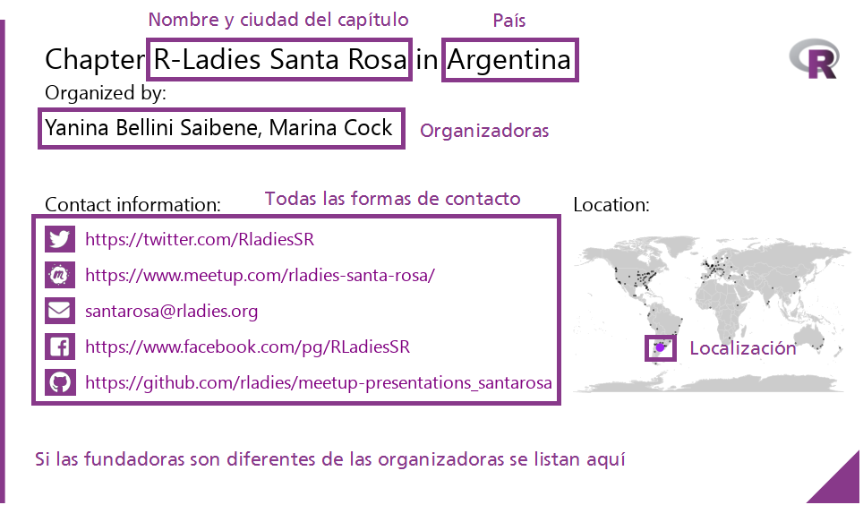
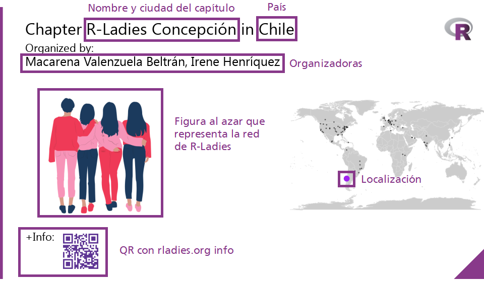

Como cada 8 de marzo, una vez más se celebra el _Día Internacional de la Mujer (IWD/8M)_. Aunque dicha fecha tiene distintas formas de celebración, mantiene un punto en común: la lucha por la igualdad de género. El año pasado, en 2018, un grupo de entusiastas R-Ladies tuvo la idea de visibilizar a las grandes mujeres que forman parte del directorio de R-Ladies, mediante tweets posteados durante todo el 8 de marzo. Por lo que, en Febrero de este año, 2019, Yanina propuso continuar esta gran iniciativa, pero en esta oportunidad twittear sobre cada uno de los capítulos de R-Ladies.

La respuesta al llamado por voluntarias, hecho por Yanina, para el 8M fue inmediata. Y en cuestión de días, tuvimos un equipo de grandiosas/brillantes y expertas R-Ladies, compuesto por [Yanina](https://twitter.com/yabellini), [Gabriela](https://twitter.com/gdequeiroz), [Patricia](https://twitter.com/patriloto), [Roxana](https://twitter.com/data_datum), and [Divya](https://twitter.com/DSeernani).

Yanina tomó el timón de este hermoso proyecto, haciendo una lista de tareas pendientes y cada miembro se ofreció para colaborar en lo que podía. Yanina propuso usar la cuenta de twitter del IWD del año anterior, aprovechando el camino recorrido pero concentrándose este año, en incrementar la visibilidad de los capítulos porque son la base de R-Ladies; gracias a ellos la comunidad se reúne, enseña y aprende; y es dónde se intercambian experiencias en cada lugar del mundo. Los capítulos son los que sustentan y potencian la comunidad. Por lo que, era lógico invitarlos para celebrar el IWD2019, y obviamente cada uno apoyó inmediatamente la iniciativa.

Durante el mes siguiente, particularmente los días previos al evento fueron una experiencia de profundo aprendizaje para cada una de nosotras, ya que trabajamos y nos ayudamos de diferentes maneras en todo lo que pudimos. El presente blog trata sobre lo hecho detrás de escena para lograr que el ‘Día Internacional de la Mujer’ de este año sea un éxito total para la comunidad de R-Ladies.

## Camino al Día Internacional de la Mujer/8M…

En primer lugar, invitamos a las fundadoras y organizadoras de todos los capítulos de R-Ladies para que actualicen la información de sus respectivos capítulos en Github. ¡Las organizadoras, de los diferentes capítulos de todas partes del mundo, estuvieron a la altura de la ocasión y Gabriela recibió los pull requests casi a diario!

Luego, un paso importante fue organizar la cuenta de Twitter mediante la actualización de su identidad visual e invitando a las R-Ladies de todo el mundo a seguir dicha cuenta. [Esta cuenta](https://twitter.com/rladies_iwd), a su vez, comenzó a seguir a los capítulos de R-Ladies existentes. Las cuentas de twitter de los capítulos de todo el mundo, la cuenta de R-Ladies Global, incluso la de otras organizaciones de mujeres que se enteraron acerca de la iniciativa, se sumaron y comenzaron a seguir la cuenta @rladies_iwd, difundiendo activamente la noticia de lo que se estaba preparando para celebrar el Día Internacional de la Mujer 2019.

Finalmente, los días previos al Día Internacional de la Mujer (IWD), se realizó una pre-campaña con imágenes diseñados por Patricia y Yanina con la herramienta canva.com. El primer flyer fue twitteado el 17 de Febrero, y fueron enviados casi 25 tweets desde ese día hasta el 7 de Marzo. Los flyers informaban acerca de lo programado para el Día Internacional de la Mujer e invitaban a seguir la cuenta. La propiedad de etiquetados de imágenes ofrecida por twitter, fue utilizada para llegar a los lectores con visión disminuida, lo cual permite que dichas personas tengan acceso a lo que la imágen asociada al twitter quiere transmitir. Todos estos esfuerzos incrementaron los seguidores de la cuenta de R-Ladies IWD en un 53 %. Para este entonces, ¡Estábamos listas para comenzar con la campaña por el Día Internacional de la Mujer!

## ¡La campaña por el Día Internacional de la Mujer!

La campaña por el Día Internacional de la mujer consistió en 256 tweets programados que fueron publicados cada 12 minutos desde la primer hora del 8M en la parte más al este del mundo, hasta la última hora del 8M en la parte más oeste del mundo. La campaña comenzó destacando al Equipo Global de R-Ladies. A esto le siguieron los tweets en 4 amplias categorías: información sobre los capítulos existentes, capítulos nuevos que comenzarán pronto con sus meetups, cómo comenzar un nuevo capítulo en tu ciudad e información sobre R-Ladies Remote para que aquellas personas que están limitadas por restricciones geográficas puedan unirse. Dado que una imágen vale más que mil palabras, toda esta información se presentó gráficamente con textos para resaltar el mensaje que se deseaba transmitir.

Una vez más, la mayor parte de este trabajo preliminar fue realizado por Yanina, Patricia y Roxana, y el texto que acompañaba a las imágenes fue escrito por Divya. Las dos primeras categorías de imágenes difundidas incluían un mapa mundial identificando la ubicación geográfica de cada capítulo y un enlace a su cuenta de Meetup así las personas podían unirse al instante. Las imágenes para R-Ladies Remote, Leadership y el Equipo Global se crearon con Canvas, y Yanina fue un paso más allá creando un video, con la herramienta Doodly, donde se explicaba cómo comenzar un nuevo capítulo.

El juego ‘etiquetala si la conoces’ iniciado por la cuenta de Twitter del IWD rápidamente contagió a los capítulos que se etiquetaron entre sí, a las R-Ladies detrás de cada Capítulo y a la cuenta de Twitter de IWD, los cuales alimentaron la emoción. Debido a lo anterior, se lograron muchas consultas y actualizaciones de información de capítulos antiguos y nuevos, la mayoría de los cuales fueron resueltos por Gabriela. ¡Si te estás preguntando quién ganó este juego, te contamos que la cuenta _R_Forwards_ tuvo la mayor cantidad de RT y nuestra R-Lady _Laura Ación_ fue la más etiquetada!

## Lo que logramos…

En el Día Internacional de la Mujer Edición 2019, la cuenta de Twitter IWD envió 417 tweets y retweets en 48 horas, publicando 231 tweets con info sobre capítulos nuevos y existentes, Leadership, el Equipo Global, el capítulo Remoto de R-Ladies e información acerca de cómo iniciar un capítulo nuevo. A través de imágenes, tweets, compartiendo enlaces de reuniones, etiquetando y felicitando a las R-Ladies, las experiencias compartidas de #rladies y #IWD2019 acercaron la Red Global de R-Ladies en un sólo IWD en la plataforma Twitter.

Logramos tres objetivos principales al hacer esto. En primer lugar, presentamos los capítulos de todo el mundo para que aquellos interesados en participar o ayudar conozcan el capítulo más cercano y puedan unirse. En segundo lugar, destacamos R-Ladies Remote como la opción para aquellos que no pueden asistir a reuniones locales. En tercer lugar, explicamos cómo crear un nuevo capítulo. En el proceso, aprendimos mucho más de lo que pretendíamos, y ey, ¡R-Ladies ahora tiene una lista actualizada de capítulos para que todos puedan explorar!

##¿Qué aprendimos como voluntarias en este proyecto?
En primer lugar, que un equipo animado con un objetivo compartido puede trabajar de manera eficiente y armoniosa para lograr grandes objetivos. En segundo lugar, los equipos no tienen que ser homogéneos. Ya que los voluntarios para este proyecto eran de distintos lugares geográficos, trabajando en diferentes zonas horarias y hablando diferentes idiomas. Esto sumado a la atmósfera de comprensión existente, nos brindó la oportunidad de aprender mucho más. Tercero, cada miembro puede contribuir y cada contribución, por más grande o pequeña que sea, es valiosa. Y una tarea gigantesca se puede realizar trabajando de manera incremental. Finalmente, tuvimos la alegría de aprender de y sobre otras R-ladies de diferentes partes del mundo; y la satisfacción de contribuir a una comunidad que se esfuerza por dar a cada miembro el reconocimiento y el apoyo requerido para crecer.

## ¡La acción R!

Somos R-Ladies, por esta razón el uso de R fue obviamente una parte integral de todo el proyecto. Los scripts usados son provistos a continuación, junto con algunos enlaces útiles que ayudaron a guiarnos en el detrás de escena de Twitter.

El enlace más importante fue el [Blog de R-Ladies que explica la Acción de Twitter de IWD 2018](/blog/2018-03-26-ideation_and_creation/). Aprende a usar Magick [aquí](https://ropensci.org/blog/2016/08/23/z-magick-release/) y [aquí](https://ropensci.org/tutorials/magick_tutorial/). Un [blog](https://d4tagirl.com/2017/05/how-to-fetch-twitter-users-with-r) que explica cómo hacer mapas. El procesamiento de texto (incluidos caracteres de otros idiomas diferentes al Inglés) se explica [aquí](https://www.gastonsanchez.com/r4strings/stringr-basics.html) y [aquí](https://appsilon.com/writing-excel-formatted-csv-using-readrwrite_excel_csv2/).

##¿Cómo fueron creadas las imágenes?
La lista de los capítulos actuales contenía la información del país, ciudad, nombre, organizadores, estado (activo o no) y las formas de contacto (correo, sitio web, meetup y redes sociales) de todos los capítulos de R-ladies.
Esta lista se convirtió en nuestra fuente de datos primarios. También usamos una conjunto de datos de ciudades geolocalizadas para hacer los mapas. Nuestro objetivo era lograr una imágen con los siguientes componentes:



```r
library(readxl)
library(magick)
library(purrr)
library(dplyr)
library(tidyr)
library(ggplot2)
library(maps)
library(ggthemes)
library(stringr)

# Capítulos actuales de R-Ladies
CCRL <- read_excel("CCRL2.xlsx")

#Lista de latitud y longitud para ciudades del mundo
LatLong <- read_excel("LatLong.xlsx")

# Unión por ciudad, estado y país porque existen ciudades con el mismo nombre
CCRL <- CCRL %>% inner_join(LatLong, by = c("City", "State/Region", "Country"))


# Existen capítulos en proceso de inicarse y no tienen cuentas oficiales aún. Necesitamos filtrar los capítulos sin datos porque las imágenes serán diferentes
SinData <- CCRL %>%
  filter (is.na(CCRL$Meetup)& is.na(CCRL$Twitter) & is.na(CCRL$Email) & is.na(CCRL$Facebook) &
               is.na(CCRL$Instagram) & is.na(CCRL$Periscope) & is.na(CCRL$Youtube) & is.na(CCRL$GitHub) &
               is.na(CCRL$Website) & is.na(CCRL$Slack))

# Filtra los capítulos con datos
CCRL <- CCRL %>%
  filter(CCRL$Country !='Remote') %>%
  anti_join(SinData, by = c("City", "State/Region", "Country"))


# Un loop para cada fila de cada capítulo existente
# Agrega de 30 a 40 píxeles para cada columna sólo en los casos en que el capítulo no disponga de información, elegir el logo correcto
# Elabora un mapa resaltando la ubicación de cada capítulo en el mundo

#No pude encontrar una manera de evitar el bucle for ... aún

for (i in 1:nrow(CCRL)) { #Para todos los capítulos

  # Usamos un  template de R-ladies al principio de la imágen
  template <- image_read("RLTemplate.png")

  # Agrega el mapa del capítulo
  # El mapa mundial es generado con los capítulos marcados con puntos negros. EL capítulo existente es marcado con un punto más grande de color púrpura, igual al color del Logo de R-Ladies.

  world <- ggplot() +
                borders("world", colour = "gray85", fill = "gray80") +
                theme_map()

  # Existen capítulos pertenecientes a dos ciudades, como Resistencia-Corriente en Argentina, en este caso, debemos graficar dos puntos en lugar de uno.

  if(!is.na(CCRL$Lat[i])){
          map <- world +
               geom_point(aes(x = Longitude, y = Latitude, size = 1),
                              data = CCRL, colour = 'black', alpha = .5) +
               geom_point(aes(x = Longitude[i], y = Latitude[i], size = 10),
                             data= CCRL, colour= 'purple', alpha = .5) +
               geom_point(aes(x = Lon[i], y = Lat[i], size = 10),
                             data= CCRL, colour= 'purple', alpha = .5) +
               theme(legend.position="none")


  } else {
           map <- world +
                  geom_point(aes(x = Longitude, y = Latitude, size = 1),
                                data = CCRL, colour = 'black', alpha = .5) +
                  geom_point(aes(x = Longitude[i], y = Latitude[i], size = 10),
                                data= CCRL, colour= 'purple', alpha = .5) +
                  theme(legend.position="none")


  }

  #Guarda el mapa
  ggsave("map.png", width = 7, height = 4)

  #Lee el mapa
  map <- image_read("map.png")

  #Indicar el lugar en la imágen donde se ubicará el mapa
  place = 230

  #Agrega el mapa al template
  template <- image_composite(template, image_scale(map, 'x200'), offset = paste("+620+", as.character(place)))

  #Agrega el resto de la información
  #Indica el lugar en la imagen donde colocar los datos
  place=190


 #Agrega el texto y los datos del capítulo

  template <- image_annotate(template, paste("Chapter R-Ladies",CCRL$City[i],'in',CCRL$Country[i]), font = 'helvetica', size = 32, location = "+50+20") %>%
              image_annotate( "Organized by:", font = 'helvetica', size = 22, location = "+50+65", color = "black") %>%
              image_annotate("Contact information:", font = 'helvetica', size = 22, location = paste("+50+", as.character(place)), color = "black") %>%
              image_annotate("Location:", font = 'helvetica', size = 22, location = paste("+640+", as.character(place)), color = "black")

 #Existen capítulos con varias organizadoras. Y el string con sus nombres será más largo que el ancho del template. Por lo tanto, el texto debe ser cortado con la longitud apropiada.
  org <-str_wrap(CCRL$Organizers[i], width = 70)

  #Agregar los nombres de los organizadores con la longitud apropiada.
  template <- image_annotate(template, org, font = 'helvetica', size = 25, location = "+50+90", color = "black")

 #Agrega  la información de cada canal de comunicación y red social sólo si el capítulo tienen activa la cuenta.
 #Maybe I should have made a function for this part …

  #Chequea la cuenta de Twitter
  if (!is.na(CCRL$Twitter[i])){
                place=place+40 #Add some lines
                pic <- image_read("D:/Rladies/IWD019/IWD2019/twitter.png") #Read the corresponding logo
                template <- image_composite(template, image_scale(pic, "x30"), offset = paste("+50+", as.character(place))) #Add the logo
                template <- image_annotate(template, CCRL$Twitter[i] , font = 'helvetica', size = 20, location = paste ("+95+", as.character(place)), color = "purple") #Add the URL or account
  }


 #Chequea  la cuenta de  Meetup
  if (!is.na(CCRL$Meetup[i])){
                place=place+40
                pic <- image_read("D:/Rladies/IWD019/IWD2019/meetup.png")
                template <- image_composite(template, image_scale(pic, "x30"), offset = paste("+50+", as.character(place)))
                template <- image_annotate(template, CCRL$Meetup[i] , font = 'helvetica', size = 20, location = paste ("+95+", as.character(place)), color = "purple")

  }


  #Chequear  la cuenta de correo
  if (!is.na(CCRL$Email[i])){
                place=place+40
                pic <- image_read("D:/Rladies/IWD019/IWD2019/mail.png")
                template <- image_composite(template, image_scale(pic, "x30"), offset = paste("+50+", as.character(place)))
                template <- image_annotate(template, CCRL$Email[i] , font = 'helvetica', size = 20, location = paste ("+95+", as.character(place)), color = "purple")

  }

 #Chequea  la cuenta de Facebook
  if (!is.na(CCRL$Facebook[i])){
                place=place+40
                pic <- image_read("D:/Rladies/IWD019/IWD2019/facebook.png")
                template <- image_composite(template, image_scale(pic, "x30"), offset = paste("+50+", as.character(place)))

                template <- image_annotate(template, CCRL$Facebook[i] , font = 'helvetica', size = 20, location = paste ("+95+", as.character(place)), color = "purple")


  }

 #Chequea  la cuenta de Instagram
  if (!is.na(CCRL$Instagram[i])){
                place=place+40
                pic <- image_read("D:/Rladies/IWD019/IWD2019/instagram.png")
                template <- image_composite(template, image_scale(pic, "x30"), offset = paste("+50+", as.character(place)))

                template <- image_annotate(template, CCRL$Instagram[i] , font = 'helvetica', size = 20, location = paste ("+95+", as.character(place)), color = "purple")

  }

  #Chequea  la cuenta de Periscope
  if (!is.na(CCRL$Periscope[i])){
                place=place+40

                pic <- image_read("D:/Rladies/IWD019/IWD2019/periscope.png")
                template <- image_composite(template, image_scale(pic, "x30"), offset = paste("+50+", as.character(place)))

                template <- image_annotate(template, CCRL$Periscope[i] , font = 'helvetica', size = 20, location = paste ("+95+", as.character(place)), color = "purple")

  }


  #Chequea  la cuenta de YouTube
  if (!is.na(CCRL$Youtube[i])){
                place=place+40
                pic <- image_read("D:/Rladies/IWD019/IWD2019/youtube.png")
                template <- image_composite(template, image_scale(pic, "x30"), offset = paste("+50+", as.character(place)))

                template <- image_annotate(template, CCRL$Youtube[i] , font = 'helvetica', size = 20, location = paste ("+95+", as.character(place)), color = "purple")

  }


  #Chequea  la cuenta de GitHub
  if (!is.na(CCRL$GitHub[i])){
                place=place+40

                pic <- image_read("D:/Rladies/IWD019/IWD2019/github.png")
                template <- image_composite(template, image_scale(pic, "x30"), offset = paste("+50+", as.character(place)))

                template <- image_annotate(template, CCRL$GitHub[i] , font = 'helvetica', size = 20, location = paste ("+95+", as.character(place)), color = "purple")

  }


 #Chequea  la cuenta de Sitio Web
  if (!is.na(CCRL$Website[i])){
                place=place+40

                pic <- image_read("D:/Rladies/IWD019/IWD2019/web.png")
                template <- image_composite(template, image_scale(pic, "x30"), offset = paste("+50+", as.character(place)))

                template <- image_annotate(template, CCRL$Website[i] , font = 'helvetica', size = 20, location = paste ("+95+", as.character(place)), color = "purple")

  }


 #Chequea  la cuenta de Slack
  if (!is.na(CCRL$Slack[i])){
                place=place+40

                pic <- image_read("D:/Rladies/IWD019/IWD2019/slack.png")
                template <- image_composite(template, image_scale(pic, "x30"), offset = paste("+50+", as.character(place)))


                template <- image_annotate(template, CCRL$Slack[i] , font = 'helvetica', size = 20, location = paste ("+95+", as.character(place)), color = "purple")

  }


 #Agrega a las fundadoras
   if (!is.na(CCRL$Founders[i])){
                place=place+40

                template <- image_annotate(template, "Founded by:", font = 'helvetica', size = 22, location = paste ("+50+", as.character(place)), color = "black")
                place=place+30

                template <- image_annotate(template, CCRL$Founders[i], font = 'helvetica', size = 25, location = paste ("+50+", as.character(place)), color = "black")

   }


 #Guarda la imágen final
  image_write(template, paste("Chapter",str_replace_all(CCRL$City[i], fixed(" "), ""),".png"), format= "png")

}
```

For the chapters in the process of creation, we do not have contact information, so we replace that information with some nice images about R-Ladies and its network. The objective was to produce this image:



```r
#Capítulos sin datos


#No tenemos información sobre este capítulo, entonces reemplazamos la información en la imágen

#Vector de Imágenes
pics <- c('meme', 'walk', 'group3','group4','future3')

set.seed(42)

pics <- c(pics[1],
               sample(pics, nrow(SinData) - 1, replace = TRUE))


for (i in 1:nrow(SinData)) { #Line for all the chapters

  template <- image_read("RLTemplate.png")
  qr <- image_read("qrcode_rladiesorg.png")

  #Agrega la imágen
  place = 170
  file <- paste(str_trim(as.character(pics[i])),".png")
  pic <- image_read(str_replace_all(file," ",""))

  template <- image_composite(template, image_scale(pic, 'x250'), offset = paste("+75+", as.character(place)))

  #Agrega el mapa del capítulo

  world <- ggplot() +
    borders("world", colour = "gray85", fill = "gray80") +
    theme_map()


  if(!is.na(SinData$Lat[i])){
    map <- world +
      geom_point(aes(x = Longitude, y = Latitude, size = 1),
                 data = SinData, colour = 'black', alpha = .5) +
      geom_point(aes(x = Longitude[i], y = Latitude[i], size = 10),
                 data= SinData, colour= 'purple', alpha = .5) +
      geom_point(aes(x = Lon[i], y = Lat[i], size = 10),
                 data= SinDataL, colour= 'purple', alpha = .5) +
      theme(legend.position="none")


  } else {
    map <- world +
      geom_point(aes(x = Longitude, y = Latitude, size = 1),
                 data = SinData, colour = 'black', alpha = .5) +
      geom_point(aes(x = Longitude[i], y = Latitude[i], size = 10),
                 data= SinData, colour= 'purple', alpha = .5) +
      theme(legend.position="none")

  }

  ggsave("map.png", width = 7, height = 4)

  map <- image_read("map.png")

  template <- image_composite(template, image_scale(map, 'x250'), offset = paste("+550+", as.character(place)))


 #Agrega el resto de la información
  place=190

  template <- image_annotate(template, paste("Chapter R-Ladies",SinData$City[i],'in',SinData$Country[i]), font = 'helvetica', size = 32, location = "+50+20") %>%
    image_annotate( "Organized by:", font = 'helvetica', size = 22, location = "+50+65", color = "black")

  org <-str_wrap(SinData$Organizers[i], width = 70)

  template <- image_annotate(template, org, font = 'helvetica', size = 25, location = "+50+90", color = "black")

 #Agrega el código QR
  place=440

  template <- image_annotate(template, "+Info:", font = 'helvetica', size = 22, location = paste("+50+", as.character(place)), color = "black")

  place=place + 10

  template <- image_composite(template, image_scale(qr, "x70"), offset = paste("+125+", as.character(place)))

 #Guarda la imágen final
  image_write(template, paste("Chapter",str_replace_all(SinData$City[i], fixed(" "), ""),".png"), format= "png")
}
```

## Cómo fueron creados los tweets

Este código para generar el texto de los tweets se basa en el código de Maëlle Salmon utilizado durante la primeta campaña realizada durante el 2018 presente en el blog de R-Ladies que mencionamos al inicio de este post.

```r
# Plantillas

templates <- c("Did you know that there is an adjective chapter in X? They’d love for you to visit!",
              "Hop over and join this adjective group of #rladies in X!",
              "Do you like #rstats? Looking for like-minded people? Come to have fun with us in X!",
              "Do you like #rstats? Looking to learn more? Come to share with us in X!",
              "Celebrate woman’s day with our adjective chapter in X",
              "Looking for something to inspire you? Meet our adjective chapter in X",
              "Learn all about what this adjective chapter X is up to this Women’s day!",
              "We are so proud of our adjective chapter in X!",
              "Nourish your mind today! Join adjective chapter X!",
              "We are privileged to have adjective chapter X in our network!",
              "We are privileged to feature adjective chapter X this women’s day!")

Chapter_adjectives <- c("awesome", "fantastic", "wonderful", "amazing", "brilliant", "phenomenal", "remarkable", "talented", "incredible", "top-notch", "magnificent", "marvelous", "insightful", "capable", "admirable", "outstanding", "splendid", "exceptional")


#Genera tantas oraciones/frases como capítulos activos existan
combinations <- expand.grid(templates, Chapter_adjectives)
combinations <- dplyr::mutate_all(combinations, as.character)

create_sentence <- function(template, adjective){
  stringr::str_replace(template, "adjective", adjective)
}

sentences <- purrr::map2_chr(combinations$Var1, combinations$Var2,
                             create_sentence)
set.seed(42)
# the first one is chosen, this way it's not "another" or "one more"
sentences <- c(sentences[1],
              sample(sentences, nrow(CCRL) - 1, replace = TRUE))

#Agrega texto actual para twitter
CCRLTw <- dplyr::mutate(CCRL,
                             tweet = stringr::str_replace(sentences,"X",CCRL$City),
                             tweet = ifelse(!is.na(CCRL$Meetup),
                                           paste0(tweet, " Meetups here: ", CCRL$Meetup), tweet),
                             tweet = paste(tweet, "#rladies #iwd2018"),
                             picture=paste("Chapter",str_replace_all(CCRL$City, fixed(" "), ""),".png"))


#Guarda tweets
tweets <- dplyr::select(CCRLTw, City, tweet, picture) %>%
  arrange(City)

#Utilizamos csv2 porque tenemos algunos problemas de codificación (en windows y/o caracteres que no están en inglés)
readr::write_excel_csv2(tweets, path = "ready_tweets.csv")


#Texto para los nuevos capítulos
templates <- c(
"We have plans for a chapter in X, are you close? Come closer!",

"In and around X? Interested in #rstats? We have just the thing for you!",

"Want to share with like minded R-ladies in X? Stay tuned for this new chapter!",

"R-ladies in X are gearing up for a new chapter...hop over to help them out!",

"Good news for X! An R-ladies chapter is starting right in your city!",

"#RLadies continues expanding and is reaching X!!, Stay tuned for this new chapter!")

# Obten tantas oraciones como capítulos
set.seed(42)


templates <- c(templates[1],
          sample(templates, nrow(SinData) - 1, replace = TRUE))

# agregar texto de tweet real
CCRLTw <- dplyr::mutate(SinData,
                        tweet = stringr::str_replace(templates,"X",SinData$City),

                        tweet = paste(tweet, "#rladies #iwd2018"),

                        picture=paste("Chapter",str_replace_all(SinData$City, fixed(" "), ""),".png"))

# guardar tweets
tweets <- dplyr::select(CCRLTw, City, tweet, picture) %>%
  arrange(City)
readr::write_excel_csv2(tweets, path = "ready_tweets_nodata.csv")
```

Autoras: "Como fue contado por Yanina Bellini, Patricia Loto y Divya Seernani; con notas de Roxana Noelia Villafañe y Gabriela De Queiroz"
