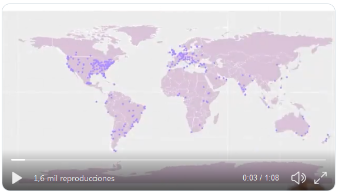
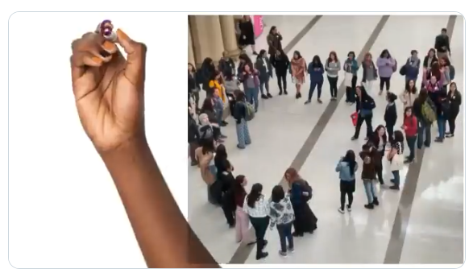
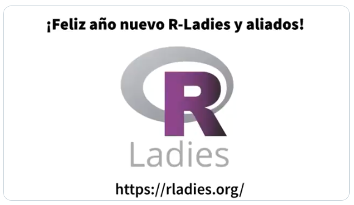

```{r setup, include=FALSE}
knitr::opts_chunk$set(echo = TRUE, eval = FALSE)
```

To close the awesome R-Ladies 2019 year we made a video, if you haven't seen it yet, here it is:

<blockquote class="twitter-tweet"><p lang="en" dir="ltr">Happy New Year to all <a href="https://twitter.com/hashtag/rladies?src=hash&amp;ref_src=twsrc%5Etfw">#rladies</a> and allies! 🎉🎉🎉<br><br>Video put together by <a href="https://twitter.com/yabellini?ref_src=twsrc%5Etfw">@yabellini</a> &amp; <a href="https://twitter.com/_lacion_?ref_src=twsrc%5Etfw">@_lacion_</a> , voice <a href="https://twitter.com/AlejaBellini?ref_src=twsrc%5Etfw">@AlejaBellini</a> 💜💜💜 <a href="https://t.co/QRxuJxLugj">pic.twitter.com/QRxuJxLugj</a></p>&mdash; R-Ladies Global (@RLadiesGlobal) <a href="https://twitter.com/RLadiesGlobal/status/1212451523655065605?ref_src=twsrc%5Etfw">January 1, 2020</a></blockquote> <script async src="https://platform.twitter.com/widgets.js" charset="utf-8"></script>  


Did you like it? Do you want to know how we did it? Here we will give you all the details:

## What story are we going to tell?

The first step is to decide what story the video is going to tell. An "end-of-the-year" message generally has three parts: 

1) what the year has brought,   
2) giving thanks for the year's achievements, and  
3) well-wishes to those who accompanied us during our promenade around the sun.  

R-Ladies' story would be to highlight global achievements _with numbers_ (after all we are people who are dedicated to #rstats and R-Ladies numbers are wonderful) and _to thank those who accompanied us_.

## Generating the script and the raw material for the video

The second step is to assemble the script for the video, which will have three scenes.

### Scene one: the global reach

Numbers for global R-Ladies chapters are shown in a way to highlight how we organize ourselves. We also visualise what was done and how much we grew in 2019. To be able to express that idea we chose concrete indicators of our activities:

  * the number of chapters, 
  * the number of countries, 
  * the number of members, and 
  * the total number of events held in the year 2019 
  
The first three numbers were extracted from the [R-Ladies Community Board](https://benubah.github.io/r-community-explorer/rladies.html). The number of events was calculated using the [meetupr](https://github.com/rladies/meetupr) package, developed by R-Ladies.

To follow our steps, the first thing is to load the necessary packages and generate the necessary variables and functions:

```{r}
# API KEY of Meetup
# The API keys is soon deprecated more info here: https://www.meetup.com/meetup_api/auth/
Sys.setenv(MEETUP_KEY = "your API Key")

# Packages needed to work
library(meetupr)
library(purrr)
library(dplyr)
library(tidyr)
library(lubridate)

```

Now we have to get all the meetup groups that correspond to R-Ladies:

```{r}
# Getting all the R-Ladies groups
all_rladies_groups <- find_groups(text = "r-ladies")

# Cleaning the list
rladies_groups <- all_rladies_groups[
  grep(
    pattern = "rladies|r-ladies",
    x = all_rladies_groups$name,
    ignore.case = TRUE
  ),
]
```

With the groups list, we search for all the events carried out by each of these groups and calculate the number of events:

```{r}
# We get all the events that already took place.

eventos <- rladies_groups$urlname %>%
  map(purrr::slowly(safely(get_events)), event_status = 'past') %>%
  transpose()

# In eventos we have a list with all the event data: name, date,
# place, description and several more columns of data.
# At the moment the list has two elements: a list with the correct results
# and another with errors. It gives an error when there are no past events in the group.

# We are only interested in the information we had in results. So we keep that information
# The results list has one tibble per group with the events held for that group
# We will put together a single tibble with all the events together

# We create a logical vector with events where there is an error

eventos_con_datos <- eventos$result %>%
  map_lgl(is_null)

# Filter the correct events with the previous logical vector and then bind all the tibbles
# for their rows in one tibble/list using the map_dfr function of the purrr package

eventos_todos_juntos <- eventos$result[!eventos_con_datos] %>%
  map_dfr(~.)

# We then count the number of events held per year

eventos_todos_juntos %>%
  group_by(year(time)) %>%
  summarise(cantidad = n())

``` 

With all the calculated data, the text of that scene is as follows:

_"R-Ladies 2019 in numbers: More than 60,000 members from 50 countries around the world, organized in 182 chapters that held 858 events."_

To illustrate this part of the message, the world map with the location of all the chapters is a powerful image, one we have already used in other campaigns. We really liked the [map](https://github.com/rladiescolombo/R-Ladies_world_map) that [R-Ladies Colombo](https://rladiescolombo.netlify.com/) made to present their chapter, so we took their base map to assemble the map on the video. We updated the information to 12/27/2019 and made sure that all the chapters had Latitude and Longitude to be mapped.




This is the complete code to do it:

```{r}
library(ggplot2)
library(maptools)
library(tibble)
library(readxl)
library(readr)
data(wrld_simpl)

# This code generates the world map and is taken from the R-Ladies Colombo code
p <- ggplot() +
  geom_polygon(
    data = wrld_simpl,
    aes(x = long, y = lat, group = group),
    fill = "thistle",
    colour = "white"
  ) +
  coord_cartesian(xlim = c(-180, 180), ylim = c(-90, 90)) +
  scale_x_continuous(breaks = seq(-180, 180, 120)) +
  scale_y_continuous(breaks = seq(-90, 90, 100))

# R-Ladies Current Chapters: https://github.com/rladies/starter-kit/blob/master/Current-Chapters.csv
# I read the current R-Ladies chapters after downloading it from the web
Current_Chapters <- read_csv(here::here("Current-Chapters.csv"))

# We read a file with the cities of the chapters with the latitude and longitude data
LatLong <- read_excel(here::here("LatLong2019.xlsx"))

# Join the chapter data with latitude and longitude data
Current_Chapters <- Current_Chapters %>%
  left_join(LatLong, by = c("City", "State.Region", "Country")) %>%
  filter(!str_detect(Status, 'Retired.*'))

# We add the points of each chapter to the world map
p <- p +
  geom_point(
    data = Current_Chapters,
    aes(x = Longitude, y = Latitude),
    color = "mediumpurple1",
    size = 3
  )
```

### Scene two: 100% volunteer work

The objective is also to present _the number of other R-Ladies initiatives_ in addition to the chapters and events, so we focus on our _communication media, our directory of experts, our review network and the generation of educational material_ for our meetups, conferences, events with other organizations, etc. Highlighting the effort of volunteer work to achieve all these results. The [R-Ladies Global Team](https://rladies.org/about-us/team/) provided us with the numbers referred to the [R-Ladies directory](https://rladies.org/directory/) and from the [review network](tinyurl.com/rladiesrevs). To calculate the number of followers of our twitter accounts, we use  the `rtweet` package with the following code:

```{r}
# We load the necessary packages
library(dplyr)
library(lubridate)
library(stringr)
library(tidyr)
library(rtweet)

# Get all twitter users that use the the string RLadies
users <- search_users(q = 'RLadies', n = 1000, parse = TRUE)

# Then we must keep the unique users
rladies <- unique(users) %>%
  # The regular expression searches for a string containing the word RLadies or rladies, anywhere
  # in the string
  filter(
    str_detect(screen_name, '[R-r][L-l](adies).*') &
      # Filter users who meet the condition of the regular expression but are not accounts
      # related to R-Ladies
      !screen_name %in%
        c(
          'RLadies',
          'RLadies_LF',
          'Junior_RLadies',
          'QueensRLadies',
          'WomenRLadies',
          'Rstn_RLadies13',
          'RnRladies'
        )
  ) %>%
  # We keep these three variables that allow us to identify each account
  # with the number of followers each one has
  select(screen_name, location, followers_count)

# We calculate the total number of followers for all accounts
rladies %>%
  summarise(sum(followers_count))

```

The image selected for this part of the video was taken in LatinR 2019. We were preparing for the R-Ladies group photo and, without realizing it, we formed a heart!! (which was captured by [TuQmano´s](https://twitter.com/TuQmano) eye and camera). The image represents the growth of R-Ladies, also beyond North-America and Europe, and the code that moves us to work as a team for the well-being of R-Ladies and the community in general.




The final text of the scene was:

_We have more than 65,000 followers in our Twitter accounts, 940 experts in the R-Ladies directory, 80 international reviewers in our review network and we produce more than 600 documents with teaching materials. All done with 100% volunteer work_


### Scene three: good wishes!

Here we wanted to wish a happy year for all R-Ladies, and also for all the allies who accompanied us during the year. The selected image is our logo and our wesite address.

The text for this scene is:

_Happy New Year to all R-Ladies and allies! More information at rladies dot org_

 


### Language

R-Ladies is a global community, the video had to be in English, the language the world speaks. But why not also in Spanish? The R Latin-American Community has grown a lot during this time and it has been largely thanks to the effort and work of the R-Ladies in this region of the world. Thus, we decided to generate the video in both languages to celebrate this hard work. [Laura Acion](https://twitter.com/_lacion_/) was responsible for correcting and translating the text of each scene.

### Text, images ... audio?

Now, a video with only letters, numbers, and images would leave many people out of our message, so we decided to record the audio of the message. For that, we got the help from the genius of [Alejandra Bellini](https://twitter.com/AlejaBellini), who recorded the audio in Spanish and English. She recorded it using WhatsApp with a cell phone, then we used [Zamzar](https://www.zamzar.com) to transform the audio to MP3 and [Mp3cut](https://mp3cut.net/en/) to cut the audio in the parts necessary to be able to synchronize the audio with the text and the video images.

## Third step: editing ...

With this plan in mind, it was time to edit the video. We used the software Doodly, providing music and fonts, for the drawing-hand effects. The most laborious part was the synchronization of the audio with the drawing of the numbers and letters.

The result was two videos, one in Spanish and one in English, where we tell in one minute what R-Ladies did during 2019. It was a very fun task, with many laughs and attempts, especially recording the audio in English.

The final video was sent to the Global team for dissemination through social networks on December 31, 2019.


Authors: Yanina Bellini Saibene, Alejandra Bellini y Laura Acion

