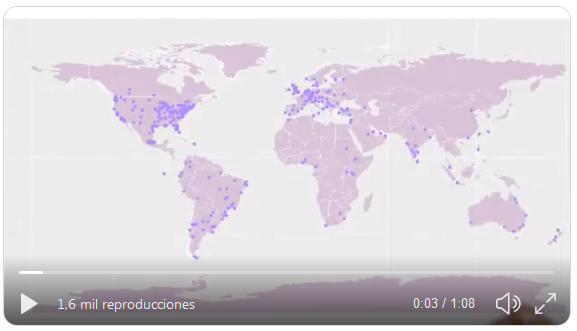
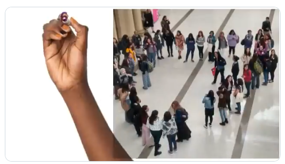
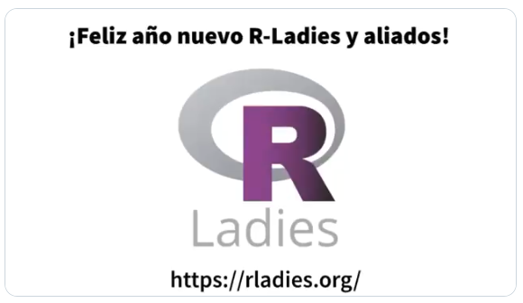

```{r setup, include=FALSE}
knitr::opts_chunk$set(echo = TRUE, eval = FALSE)
```

Para cerrar el 2019 desde R-Ladies hicimos un video, si aún no lo viste, aquí está:

<blockquote class="twitter-tweet"><p lang="es" dir="ltr">Feliz año nuevo <a href="https://twitter.com/hashtag/rladies?src=hash&amp;ref_src=twsrc%5Etfw">#rladies</a> y aliados! 🎉🎉🎉<br><br>Video preparado por <a href="https://twitter.com/yabellini?ref_src=twsrc%5Etfw">@yabellini</a> y <a href="https://twitter.com/_lacion_?ref_src=twsrc%5Etfw">@_lacion_</a>. Locución <a href="https://twitter.com/AlejaBellini?ref_src=twsrc%5Etfw">@alejabellini</a> 💜💜💜 <a href="https://t.co/Bw9aRkaErj">pic.twitter.com/Bw9aRkaErj</a></p>&mdash; R-Ladies Global (@RLadiesGlobal) <a href="https://twitter.com/RLadiesGlobal/status/1212453642416078853?ref_src=twsrc%5Etfw">January 1, 2020</a></blockquote> <script async src="https://platform.twitter.com/widgets.js" charset="utf-8"></script> 


¿Te gustó?, ¿Querés saber cómo lo hicimos?, aquí te cuento los detalles:

## ¿Qué historia vamos a contar?

El _primer paso_ es decidir _la historia a contar en el video_; los mensajes de fin de año, generalmente tienen tres partes: se repasa lo hecho, se agradece por los logros obtenidos y se dan buenos deseos para aquellos que nos acompañaron en la vuelta al sol que termina.

Así que la historia de R-Ladies sería _resaltar logros globales con números_ (después de todo somos gente que se dedica a las #rstats y los números de R-Ladies son maravillosos) y _agradecer a quienes nos acompañaron_.

## Generando el guión y la materia prima para el video

El _segundo paso_ es armar el guión del video: tendrá tres escenas.

### Primera escena: el alcance global

Se muestran números globales de R-Ladies donde se represente nuestra forma de organizarnos, qué se hizo y cuánto se creció en 2019.  Para poder expresar esa idea los números de _cantidad de capítulos, cantidad de países, cantidad de integrantes y total de eventos realizados en el año 2019_ son indicadores concretos.  Los tres primeros los consultamos desde el [Tablero de la comunidad de R-Ladies](https://benubah.github.io/r-community-explorer/rladies.html).  La cantidad de eventos la calculamos utilizando el paquete [meetupr](https://github.com/rladies/meetupr) desarrollado por R-Ladies.

Lo primero es cargar los paquetes necesarios y generar las variables y funciones necesarias:

```{r}
#API KEY de Meetup
Sys.setenv(MEETUP_KEY = "tu string de API Key")

#Paquetes necesarios para trabajar
library(meetupr)
library(purrr)
library(dplyr)
library(tidyr)
library(lubridate)


```

Ahora tenemos que obtener todos los grupos de meetup que corresponden a R-Ladies:

```{r}
# Obteniendo todos los grupos de R-Ladies
all_rladies_groups <- find_groups(text = "r-ladies")

# Limpiando el listado
rladies_groups <- all_rladies_groups[grep(pattern = "rladies|r-ladies", 
                                          x = all_rladies_groups$name,
                                          ignore.case = TRUE), ]
```

Con el listado de grupos, buscamos todos los eventos realizados por cada uno de esos grupos y calculamos la cantidad:

```{r}
# Obtengo todos los eventos ya realizados. 
eventos <- rladies_groups$urlname %>%
  map(purrr::slowly(safely(get_events)), event_status='past') %>% transpose()

# En eventos me queda una lista con todos los datos de los eventos: nombre, fecha, 
# lugar, descripción y varios datos más.  
# Por el momento la lista tiene dos elementos: una lista con los resultados correctos 
# y otra con los errores. Da error cuando no hay eventos pasados en el grupo.

# Sólo me interesa la información que tenemos en resultados. Asi que me quedo con esa información
# La lista de resultados tiene un tibble por grupo con los eventos realizados para ese grupo
# Voy a armar un solo tibble con todos los eventos juntos

#Creo un vector lógico con los eventos donde hay error


eventos_con_datos <- eventos$result %>% 
  map_lgl(is_null)

# Filtro los eventos correctos con el vector lógico anterior y luego uno todos los tibble
# por sus filas en uno solo utilizando la función map_dfr del paquete purrr

eventos_todos_juntos <- eventos$result[!eventos_con_datos] %>% 
  map_dfr(~ .) 

# Cuento la cantidad de eventos realizados por año

eventos_todos_juntos %>%
  group_by(year(time)) %>%
  summarise(cantidad=n())

``` 
Con todos los datos calculados, el texto de esa escena es el siguiente:

_"R-Ladies 2019 en números: Más de 60.000 integrantes de 50 países de todo el mundo, organizadas en 182 capítulos que realizaron 858 eventos."_

Para ilustrar esta parte del mensaje, el mapa del mundo con la localización de todos los capítulos es una imagen poderosa y que ya hemos utilizado en otras campañas.  Me gustó mucho el [mapa](https://github.com/rladiescolombo/R-Ladies_world_map) que hicieron las [R-Ladies Colombo](https://rladiescolombo.netlify.com/) para presentar su capítulo asi que tomé de base su mapa para armar el del video, actualizando la información al 27/12/2019 y asegurandome que todos los capítulos cuenten con Latitud y Longitud para que sean mapeados.  




Este es el código completo para hacerlo:

```{r}
library(ggplot2)
library(maptools)
library(tibble)
library(readxl)
library(readr)
data(wrld_simpl)

# Este código genera el mapa del mundo y es tomado desde el código de R-Ladies Colombo
p <- ggplot() +
  geom_polygon(
    data = wrld_simpl,
    aes(x = long, y = lat, group = group), fill = "thistle", colour = "white"
  ) +
  coord_cartesian(xlim = c(-180, 180), ylim = c(-90, 90)) +
  scale_x_continuous(breaks = seq(-180, 180, 120)) +
  scale_y_continuous(breaks = seq(-90, 90, 100))

# Capitulos actuales de R-Ladies : https://github.com/rladies/starter-kit/blob/master/Current-Chapters.csv
# Leo los capitulos actuales de R-Ladies despues de descargarlo de la web
Current_Chapters <- read_csv(here::here("Current-Chapters.csv"))

#Leo una planilla con las ciudades de los capítulos con los datos de latitud y longitud
LatLong <- read_excel(here::here("LatLong2019.xlsx")) 

#Uno los datos de los capítuos con la latitud y longitud
Current_Chapters <- Current_Chapters %>% 
  left_join(LatLong, by = c("City", "State.Region", "Country")) %>%
  filter(!str_detect(Status, 'Retired.*'))

# Agrego los puntos de cada capítulo al mapa del mundo
p <- p +
  geom_point(
    data = Current_Chapters, aes(x = Longitude, y = Latitude), color = "mediumpurple1", size
    = 3
  ) 
```


### Segunda escena: 100% trabajo voluntario

El objetivo es presentar también _cifras de otras iniciativas de R-Ladies_ además de los capítulos y eventos, por lo que enfocamos en nuestros _medios de comunicación, nuestro directorio de personas expertas, nuestra red de revisión y la generación de material educativo_ para nuestros meetups, conferencias, eventos con otras organizaciones,etc. Resaltando el esfuerzo de un trabajo voluntario para conseguir todos estos resultados.  El equipo de [R-Ladies Global](https://rladies.org/about-us/team/) me facilitó las cantidades referidas al [directorio de R-Ladies](https://rladies.org/directory/) y de la [red de revisión](tinyurl.com/rladiesrevs).  Para la calcular la cantidad de seguidores de nuestras cuentas de twitter, utilizamos R y el paquete `rtweet` con el siguiente código:


```{r}
#Cargo los paquetes necesarios
library(dplyr)
library(lubridate)
library(stringr)
library(tidyr)
library(rtweet)

#Obtengo todos los usuarios que tengan la palabra RLadies
users <- search_users(q = 'RLadies',
                      n = 1000,
                      parse = TRUE)

#Luego debo quedarme con los usuarios únicos
rladies <- unique(users) %>%
  #La expresión regular busca un string que contenga la palabra RLadies ó rladies, en cualquier parte 
  #de la cadena de caracteres   
  filter(str_detect(screen_name, '[R-r][L-l](adies).*') & 
           # Filtro usuarios que cumplen la condición de la expresión regular pero no son cuentas
           # relacionadas a R-Ladies
           !screen_name %in% c('RLadies', 'RLadies_LF', 'Junior_RLadies', 'QueensRLadies', 
                               'WomenRLadies', 'Rstn_RLadies13', 'RnRladies')) %>%
  #Me quedo con estas tres variables que me permiten identificar  cada cuenta 
  #con la cantidad de seguidores que tiene cada una
  select(screen_name, location, followers_count)

#Calculo el total de seguidores de todas las cuentas
rladies %>% 
  summarise(sum(followers_count))

```

La imágen seleccionada para acompañar esta parte fue tomada en LatinR 2019: ¡¡ estabamos preparandonos para la foto grupal de R-Ladies y sin darnos cuenta formamos un corazón !! (que fue capturado por el ojo y la cámara de [TuQmano](https://twitter.com/TuQmano)).  La imagen representa el crecimiento de R-Ladies en otras regiones del mundo más allá del norte y el código que nos mueve a trabajar en equipo por el bienestar de R-Ladies y de la comunidad en general.




El texto de la escena quedó armado de la siguiente manera:

_Tenemos más de 65,000 seguidores en nuestras cuentas de Twitter, 940 personas expertas en el directorio de R-Ladies, 80 revisoras internacionales en nuestra red de revisión y producimos más de 600 documentos con materiales didácticos. Todo hecho con 100% trabajo voluntario_


### Tercera escena: ¡buenos deseos!

Aquí la frase fue desear feliz año para R-Ladies y también para todos los aliados y aliadas que nos acompañaron durante el año.  La imagen seleccionada fue nuestro logo y la dirección de nuestra web.

El texto que acompaña la escena quedó así:

_¡Feliz año nuevo a todas las R-Ladies y aliados! Más información en rladies punto org_




### Idioma

Siendo R-Ladies una comunidad global, el video tenía que estar en Inglés: el idioma que habla el mundo.  ¿Pero por qué no también en Español?, la comunidad latinoamerica de R ha crecido muchisimo en este tiempo y en gran parte ha sido gracias al esfuerzo y trabajo de las R-Ladies en esta región del mundo, así que decidimos generarlo en ambos idiomas para festejar este arduo trabajo. [Laura Acion](https://twitter.com/_lacion_/) se encargó de corregir y traducir el texto de cada escena.

### Texto, imágenes... ¿audio?

Ahora bien, un video sólo con letras, números e imágenes dejaría mucha gente fuera de nuestro mensaje, así que decidimos grabar el audio del mensaje y para eso la genia de [Alejandra Bellini](https://twitter.com/AlejaBellini), grabó los audios en Español e Inglés.  Lo grabó utilizando WhatsApp con un celular, luego utilicé [Zamzar](https://www.zamzar.com) para transformar el audio a MP3 y [Mp3cut](https://mp3cut.net/es/) para cortar ese audio en las partes necesarias para poder sincronizar el audio con el texto y las imágenes de video.


## Tercer paso: editando...

_Tercer paso_: con el plan en mente, llegó el momento de editar el video.  Lo hice utilizando Doodly para los efectos de la mano que dibuja. Tanto la música como las fuentes las provee el software.  La parte más trabajosa fue la sincronización del audio con el dibujo de los números y letras.  

El resultado fueron dos videos en Español e Inglés, donde contamos en un minuto que hizo R-Ladies durante el 2019, fue una tarea muy divertida, hubo muchas risas e intentos, especialmente la grabación del texto en Inglés.

La exportación posterior del video se pasó al equipo Global para su difusión por las redes sociales el 31 de Diciembre de 2019.

Autoras: "Yanina Bellini Saibene, Alejandra Bellini y Laura Acion"

[English version](/post/rladies_video_2019/index.en.html)
