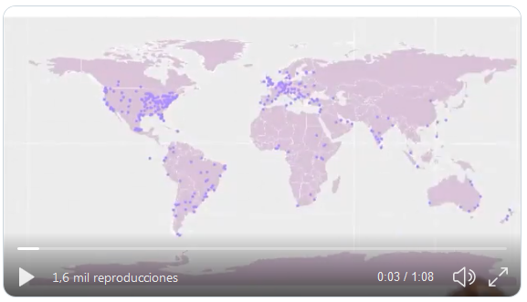
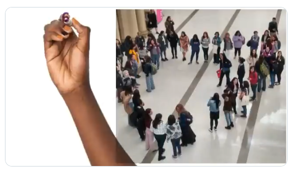

Pour clôturer l'année 2019 des R-Ladies, nous avons réalisé une vidéo, si vous ne l'avez pas encore vue, la voici :

<blockquote class="twitter-tweet"><p lang="en" dir="ltr">Bonne année à toutes les <a href="https://twitter.com/hashtag/rladies?src=hash&amp;ref_src=twsrc%5Etfw">#rladies</a> et alliées ! <br><br>Vidéo réalisée par <a href="https://twitter.com/yabellini?ref_src=twsrc%5Etfw">@yabellini</a> &amp ; <a href="https://twitter.com/_lacion_?ref_src=twsrc%5Etfw">@_lacion_</a> , voice <a href="https://twitter.com/AlejaBellini?ref_src=twsrc%5Etfw">@AlejaBellini</a> <a href="https://t.co/QRxuJxLugj">pic.twitter.com/QRxuJxLugj</a></p>&mdash ; R-Ladies Global (@RLadiesGlobal) <a href="https://twitter.com/RLadiesGlobal/status/1212451523655065605?ref_src=twsrc%5Etfw">1er janvier 2020</a></blockquote> <script async src="https://platform.twitter.com/widgets.js" charset="utf-8"></script>  

Vous avez aimé ?
Vous voulez savoir comment nous avons procédé ?
Nous vous donnons ici tous les détails :

## Quelle histoire allons-nous raconter ?

La première étape consiste à décider de l'histoire que la vidéo va raconter.
Un message de "fin d'année" comporte généralement trois parties :

1) ce que l'année a apporté,
2) remercier pour les réalisations de l'année, et
3) des vœux à ceux qui nous ont accompagnés lors de notre promenade autour du soleil.

L'histoire de R-Ladies devrait mettre en lumière les réalisations mondiales *avec des chiffres* (après tout, nous sommes des personnes qui se consacrent aux #rstats et les chiffres des R-Ladies sont merveilleux) et *pour remercier ceux qui nous ont accompagnées*.

## Création du scénario et de la matière première pour la vidéo

La deuxième étape consiste à assembler le scénario de la vidéo, qui comportera trois scènes.

### Première scène : la portée mondiale

Les chiffres des sections R-Ladies mondiales sont indiqués de manière à mettre en évidence la manière dont nous nous organisons.
Nous visualisons également ce qui a été fait et combien nous avons grandi en 2019.
Pour pouvoir exprimer cette idée, nous avons choisi des indicateurs concrets de nos activités :

- le nombre de sections,
- le nombre de pays,
- le nombre de membres, et
- le nombre total d'événements organisés au cours de l'année 2019.

Les trois premiers chiffres ont été extraits de la base de données [conseil communautaire R-Ladies](https://benubah.github.io/r-community-explorer/rladies.html).
Le nombre d'événements a été calculé à l'aide de la formule [meetupr](https://github.com/rladies/meetupr) développé par R-Ladies.

Pour suivre nos étapes, la première chose à faire est de charger les paquets nécessaires et de générer les variables et fonctions nécessaires :

```
# API KEY of Meetup
# The API keys is soon deprecated more info here: https://www.meetup.com/meetup_api/auth/
Sys.setenv(MEETUP_KEY = "your API Key") 

# Packages needed to work
library(meetupr)
library(purrr)
library(dplyr)
library(tidyr)
library(lubridate)

```

Nous devons maintenant récupérer tous les groupes de rencontre qui correspondent à R-Ladies :

```
# Getting all the R-Ladies groups
all_rladies_groups <- find_groups(text = "r-ladies")

# Cleaning the list
rladies_groups <- all_rladies_groups[grep(pattern = "rladies|r-ladies", 
                                          x = all_rladies_groups$name,
                                          ignore.case = TRUE), ]
```

Avec la liste des groupes, nous recherchons tous les événements réalisés par chacun de ces groupes et calculons le nombre d'événements :

```
# We get all the events that already took place.

eventos <- rladies_groups$urlname %>%
  map(purrr::slowly(safely(get_events)), event_status='past') %>% transpose()
  
# In eventos we have a list with all the event data: name, date,
# place, description and several more columns of data.
# At the moment the list has two elements: a list with the correct results
# and another with errors. It gives an error when there are no past events in the group.

# We are only interested in the information we had in results. So we keep that information
# The results list has one tibble per group with the events held for that group
# We will put together a single tibble with all the events together

# We create a logical vector with events where there is an error

eventos_con_datos <- eventos$result %>% 
  map_lgl(is_null)

# Filter the correct events with the previous logical vector and then bind all the tibbles
# for their rows in one tibble/list using the map_dfr function of the purrr package

eventos_todos_juntos <- eventos$result[!eventos_con_datos] %>% 
  map_dfr(~ .) 

# We then count the number of events held per year

eventos_todos_juntos %>%
  group_by(year(time)) %>%
  summarise(cantidad = n())

```

Avec toutes les données calculées, le texte de cette scène est le suivant :

*"R-Ladies 2019 en chiffres : Plus de 60 000 membres de 50 pays du monde entier, organisés en 182 chapitres qui ont organisé 858 événements."*

Pour illustrer cette partie du message, la carte du monde avec l'emplacement de tous les chapitres est une image puissante, que nous avons déjà utilisée dans d'autres campagnes.
Nous avons beaucoup aimé la [carte](https://github.com/rladiescolombo/R-Ladies_world_map) que [R-Ladies Colombo](https://rladiescolombo.netlify.com/)pour présenter leur chapitre, nous avons donc pris leur carte de base pour assembler la carte sur la vidéo.
Nous avons mis à jour les informations au 27/12/2019 et nous nous sommes assurés que tous les chapitres avaient une latitude et une longitude à cartographier.



Voici le code complet pour le faire :

```
library(ggplot2)
library(maptools)
library(tibble)
library(readxl)
library(readr)
data(wrld_simpl)

# This code generates the world map and is taken from the R-Ladies Colombo code
p <- ggplot() +
  geom_polygon(
    data = wrld_simpl,
    aes(x = long, y = lat, group = group), fill = "thistle", colour = "white"
  ) +
  coord_cartesian(xlim = c(-180, 180), ylim = c(-90, 90)) +
  scale_x_continuous(breaks = seq(-180, 180, 120)) +
  scale_y_continuous(breaks = seq(-90, 90, 100))

# R-Ladies Current Chapters: https://github.com/rladies/starter-kit/blob/master/Current-Chapters.csv
# I read the current R-Ladies chapters after downloading it from the web
Current_Chapters <- read_csv(here::here("Current-Chapters.csv"))

# We read a file with the cities of the chapters with the latitude and longitude data
LatLong <- read_excel(here::here("LatLong2019.xlsx")) 

# Join the chapter data with latitude and longitude data
Current_Chapters <- Current_Chapters %>% 
  left_join(LatLong, by = c("City", "State.Region", "Country")) %>%
  filter(!str_detect(Status, 'Retired.*'))

# We add the points of each chapter to the world map
p <- p +
  geom_point(
    data = Current_Chapters, aes(x = Longitude, y = Latitude), color = "mediumpurple1", size
    = 3
  ) 
```

### Scène deux : 100% de bénévolat

L'objectif est également de présenter *le nombre d'autres initiatives de R-Ladies* en plus des chapitres et des événements, de sorte que nous nous concentrons sur nos *médias de communication, notre répertoire d'experts, notre réseau d'évaluation et la production de matériel éducatif.*pour nos réunions, conférences, événements avec d'autres organisations, etc.
Nous soulignons l'effort du travail bénévole pour atteindre tous ces résultats.
Les [R-Ladies Global Team](https://rladies.org/about-us/team/) nous a fourni les chiffres relatifs à la [répertoire R-Ladies](https://rladies.org/directory/) et de l'annuaire [réseau d'évaluation](tinyurl.com/rladiesrevs).
Pour calculer le nombre de followers de nos comptes twitter, nous utilisons la fonction`rtweet` avec le code suivant :

```
# We load the necessary packages
library(dplyr)
library(lubridate)
library(stringr)
library(tidyr)
library(rtweet)

# Get all twitter users that use the the string RLadies
users <- search_users(q = 'RLadies',
                      n = 1000,
                      parse = TRUE)

# Then we must keep the unique users
rladies <- unique(users) %>%
  # The regular expression searches for a string containing the word RLadies or rladies, anywhere
  # in the string  
  filter(str_detect(screen_name, '[R-r][L-l](adies).*') & 
           # Filter users who meet the condition of the regular expression but are not accounts
           # related to R-Ladies
           !screen_name %in% c('RLadies', 'RLadies_LF', 'Junior_RLadies', 'QueensRLadies', 
                               'WomenRLadies', 'Rstn_RLadies13', 'RnRladies')) %>%
  # We keep these three variables that allow us to identify each account
  # with the number of followers each one has
  select(screen_name, location, followers_count)

# We calculate the total number of followers for all accounts
rladies %>% 
  summarise(sum(followers_count))

```

L'image sélectionnée pour cette partie de la vidéo a été prise en LatinR 2019.
Nous nous préparions pour la photo de groupe des R-Ladies et, sans nous en rendre compte, nous avons formé un cœur ! !!
(qui a été capturé par [TuQmano](https://twitter.com/TuQmano)l'œil et l'appareil photo de TuQmano).
L'image représente la croissance de R-Ladies, même au-delà de l'Amérique du Nord et de l'Europe, et le code qui nous pousse à travailler en équipe pour le bien-être de R-Ladies et de la communauté en général.



Le texte final de la scène est le suivant :

*Nous avons plus de 65 000 adeptes sur nos comptes Twitter, 940 experts dans le répertoire R-Ladies, 80 évaluateurs internationaux dans notre réseau d'évaluation et nous produisons plus de 600 documents avec du matériel pédagogique. Tout cela grâce à un travail 100 % bénévole*

### Scène trois : bons vœux !

Nous voulions ici souhaiter une bonne année à toutes les R-Ladies, ainsi qu'à tous les alliés qui nous ont accompagnées pendant l'année.
L'image sélectionnée est notre logo et l'adresse de notre site web.

Le texte de cette scène est le suivant :

*Bonne année à toutes les R-Ladies et à leurs alliés ! Plus d'informations sur rladies dot org*


### Langue

R-Ladies étant une communauté mondiale, la vidéo devait être en anglais, la langue parlée dans le monde entier.
Mais pourquoi pas aussi en espagnol ?
La communauté latino-américaine s'est beaucoup développée au cours de cette période et c'est en grande partie grâce aux efforts et au travail des R-Ladies dans cette région du monde.
C'est pourquoi nous avons décidé de produire la vidéo dans les deux langues afin de célébrer ce travail acharné.
[Laura Acion](https://twitter.com/_lacion_/) a été chargée de corriger et de traduire le texte de chaque scène.

### Texte, images ... audio ?

Une vidéo ne comportant que des lettres, des chiffres et des images laisserait de nombreuses personnes à l'écart de notre message, c'est pourquoi nous avons décidé d'enregistrer le message audio.
Pour cela, nous avons fait appel au génie de [Alejandra Bellini](https://twitter.com/AlejaBellini) qui a enregistré l'audio en espagnol et en anglais.
Elle l'a enregistré en utilisant WhatsApp avec un téléphone portable. [Zamzar](https://www.zamzar.com) pour transformer l'audio en MP3 et [Mp3cut](https://mp3cut.net/en/) pour couper l'audio dans les parties nécessaires pour pouvoir synchroniser l'audio avec le texte et les images vidéo.

## Troisième étape : l'édition ...

Avec ce plan en tête, il était temps de monter la vidéo.
Nous avons utilisé le logiciel Doodly, qui fournit la musique et les polices de caractères, pour les effets de dessin à la main.
La partie la plus laborieuse a été la synchronisation de l'audio avec le dessin des chiffres et des lettres.

Le résultat a été deux vidéos, l'une en espagnol et l'autre en anglais, où nous racontons en une minute ce que R-Ladies a fait en 2019.
Ce fut une tâche très amusante, avec de nombreux rires et tentatives, en particulier l'enregistrement de l'audio en anglais.

La vidéo finale a été envoyée à l'équipe mondiale pour être diffusée sur les réseaux sociaux le 31 décembre 2019.

Auteurs : Yanina Bellini Saibene, Alejandra Bellini y Laura Acion

[Version espagnole](/post/rladies_video_2019/index.es.html)


