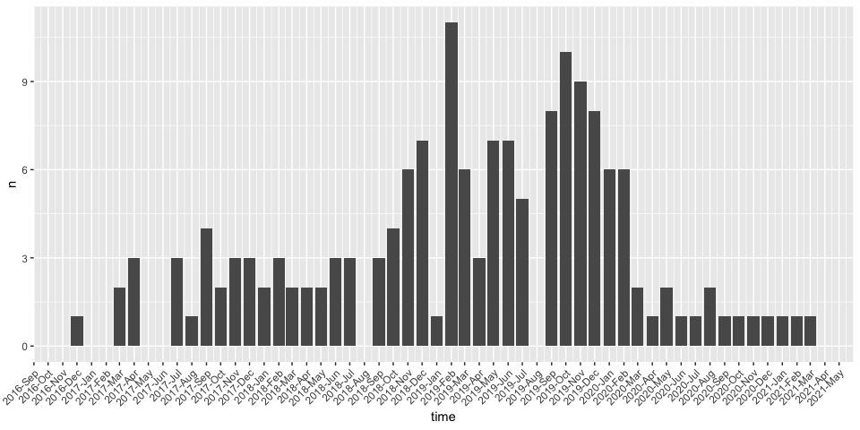

Nos sections ont annulé les réunions en personne en raison de la pandémie du virus corona.
Cependant, nous voulons que nos membres puissent rester en contact et continuer à partager leurs dernières découvertes et voyages liés au R.
Pour aider les organisateurs de nos sections à mettre en ligne leurs événements, nous avons décidé de leur fournir une infrastructure de vidéoconférence.

Notre réseau s'est étendu à plus de 160 sections dans le monde entier et nous nous demandions donc combien de salles de réunion nous allions avoir besoin.
Une seule suffirait-elle ou cela signifierait-il que nous aurions beaucoup de conflits d'horaires ?
Quelle belle occasion d'utiliser notre [{meetupr}](https://github.com/rladies/meetupr) et d'avoir une idée de la fréquence des événements qui se chevauchent dans le passé !

### Obtenir les données

```r
#devtools::install_github("rladies/meetupr")
library(meetupr)
library(tidyverse)
library(lubridate)
library(scales)
```

Tout d'abord, nous récupérons tous les groupes de rencontre R-Ladies afin d'obtenir tous leurs événements dans une deuxième étape.

```r
# get the R-Ladies chapters

groups <- meetupr::find_groups(text = "r-ladies") 

chapters <- groups %>% 
  filter(str_detect(tolower(name), "r-ladies"))
```

Nous voulons éviter de dépasser la limite de requêtes de l'API, nous utiliserons donc la fonction [solution](https://github.com/rladies/meetupr/issues/30) postée par Jesse Mostipak.

```r
# get the events for the chapters

slowly <- function(f, delay = 0.5) {
  function(...) {
    Sys.sleep(delay)
    f(...)
  }
}

events <- map(chapters$urlname,
              slowly(safely(meetupr::get_events)),
              event_status = c("past", "upcoming")) %>% 
  set_names(chapters$name)
```

L'utilisation de `safely()`signifie que notre mapping n'échoue pas complètement si l'obtention des événements pour l'un des chapitres échoue.
Il ne nous reste plus qu'à extraire les événements des chapitres pour lesquels nous avons réussi.

```r
all_events <- map_dfr(events, 
                      ~ if (is.null(.$error)) .$result else NULL, 
                      .id = "chapter")
```

### A quelle fréquence (par mois) 2 ou plusieurs événements de rencontre R-Ladies ont-ils lieu en même temps ?

La première chose que nous voulons savoir, c'est si deux événements ou plus se déroulant en même temps sont courants ou non.

Pour simplifier les choses, nous nous intéressons aux événements qui commencent en même temps et nous n'examinons pas pour l'instant les événements qui se chevauchent.
Cela inclut les événements passés et à venir.

```r
all_events %>% 
  count(time) %>% 
  filter(n > 1) %>% 
  mutate(time = floor_date(time, unit = "months")) %>% 
  count(time) %>% 
  ggplot() + 
  geom_col(aes(time, n)) +
  scale_x_datetime(breaks = scales::date_breaks("1 month"),
                   labels = scales::date_format("%Y-%b")) +
  theme(axis.text.x = element_text(angle = 45, hjust = 1)) 
```

<!-- -->

Il n'est donc pas rare que des événements R-Ladies se déroulent en parallèle, mais la question qui se pose maintenant est la suivante : combien d'événements se déroulent en même temps ?

### Combien d'événements se produisent généralement en même temps ?

```r
all_events %>% 
  count(time, name = "simultaneous_events") %>% 
  count(simultaneous_events) %>% 
  arrange(desc(simultaneous_events))
```

```
## # A tibble: 5 x 2
##   simultaneous_events     n
##                 <int> <int>
## 1                   9     1
## 2                   4     1
## 3                   3    16
## 4                   2   144
## 5                   1  1953
```

Une fois, nous avons eu 9 événements R-Ladies en même temps !
En regardant la date, on s'aperçoit qu'il s'agissait des rstudio::conf watch parties (29 janvier 2020) :

```r
all_events %>% 
  count(time, sort = TRUE) %>% 
  top_n(1) 
```

```
## Selecting by n
```

```
## # A tibble: 1 x 2
##   time                    n
##   <dttm>              <int>
## 1 2020-01-29 16:00:00     9
```

Plus de deux événements parallèles étant relativement rares, nous commençons par une salle de réunion virtuelle que nos sections peuvent réserver, en espérant que les conflits d'horaire pourront être évités.

Si vous êtes une organisatrice de R-Ladies et que vous souhaitez utiliser cette nouvelle infrastructure, veuillez rejoindre le canal #online\_meetups sur le Slack des organisateurs.
Vous y trouverez des instructions sur la manière de réserver une réunion et des conseils pour organiser des événements en ligne en toute sécurité.

### Prochains événements en ligne

Si vous souhaitez participer aux événements des chapitres R-Ladies du monde entier, les prochains événements sont les suivants

- 25 avril R-Ladies Mumbai : [[EN LIGNE] - Explorer le visuel 'Highcharts' dans R](https://www.meetup.com/rladies-mumbai/events/270006904/)
- 25 avril R-Ladies Tampa : [REPORTÉ : Flux et transformation des données ](https://www.meetup.com/rladies-tampa/events/270192107/)
- 25 avril R-Ladies La Paz : [Groupe d'étude - R pour Ciencia de Datos [Séance 4]](https://www.meetup.com/rladies-la-paz/events/270212766/)
- 28 avril R-Ladies Bucarest : [Communauté R-Ladies Bucarest #8 ](https://www.meetup.com/rladies-bucharest/events/270178279/)
- 28 avril R-Ladies Gainesville : [Mardi de l'ordre : Pratiquer la science des données en R](https://www.meetup.com/rladies-gainesville/events/268773535/)
- 28 avril R-Ladies Mid-Mo : [Code-RLadies April Lightning Talk \& Workshop - Virtual !](https://www.meetup.com/rladies-mid-mo/events/268698590/)
- 29 avril R-Ladies New York : [[Evénement en ligne] Panel R-Ladies : Tout sur les blogs](https://www.meetup.com/rladies-newyork/events/270210924/)
- 30 avril R-Ladies Miami : [Des outsiders aux gagnants](https://www.meetup.com/rladies-miami/events/270087598/)
- 05 mai R-Ladies Freiburg : [Mardi de l'ordre - Conseils et astuces](https://www.meetup.com/rladies-freiburg/events/270214676/)
- 06 mai R-Ladies Chicago : [Apprentissage et création d'une communauté dans le domaine de la science des données : Conférence Talks !](https://www.meetup.com/rladies-chicago/events/269909895/)

**Tous les événements de rencontre R-Ladies sont également listés à <https://www.meetup.com/pro/rladies/>.**


