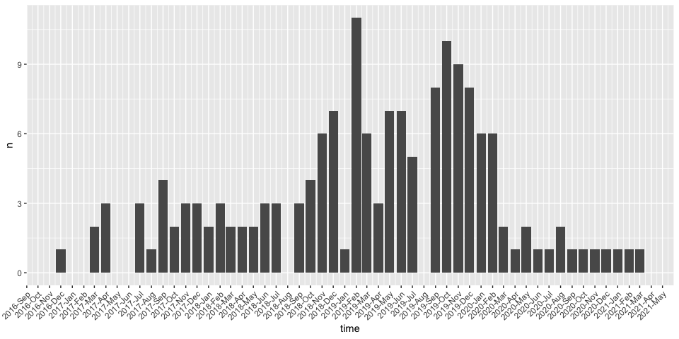

Os nossos capítulos cancelaram os encontros presenciais devido à pandemia do coronavírus.
No entanto, queremos que os nossos membros possam manter-se ligados e continuar a partilhar as suas últimas descobertas e viagens relacionadas com o R.
Para ajudar os organizadores dos nossos capítulos a colocar os seus eventos em linha, decidimos fornecer-lhes uma infraestrutura de videoconferência.

A nossa rede cresceu para mais de 160 secções em todo o mundo, pelo que nos perguntámos quantas salas de reuniões seriam necessárias.
Seria uma suficiente ou isso significaria que teríamos muitos conflitos de agenda?
Que óptima oportunidade para utilizar as nossas [{meetupr}](https://github.com/rladies/meetupr) e ter uma noção da frequência com que tivemos eventos sobrepostos no passado!

### Obter os dados

```r
#devtools::install_github("rladies/meetupr")
library(meetupr)
library(tidyverse)
library(lubridate)
library(scales)
```

Primeiro, obtemos todos os grupos de encontro de R-Ladies para que possamos obter todos os seus eventos numa segunda etapa.

```r
# get the R-Ladies chapters

groups <- meetupr::find_groups(text = "r-ladies") 

chapters <- groups %>% 
  filter(str_detect(tolower(name), "r-ladies"))
```

Queremos evitar exceder o limite de pedidos da API, pelo que utilizaremos a função [solução](https://github.com/rladies/meetupr/issues/30) publicada por Jesse Mostipak.

```r
# get the events for the chapters

slowly <- function(f, delay = 0.5) {
  function(...) {
    Sys.sleep(delay)
    f(...)
  }
}

events <- map(chapters$urlname,
              slowly(safely(meetupr::get_events)),
              event_status = c("past", "upcoming")) %>% 
  set_names(chapters$name)
```

A utilização de `safely()`significa que nosso mapeamento não falha completamente se a obtenção dos eventos para qualquer um dos capítulos falhar.
Agora só precisamos de extrair os eventos para os capítulos em que fomos bem sucedidos.

```r
all_events <- map_dfr(events, 
                      ~ if (is.null(.$error)) .$result else NULL, 
                      .id = "chapter")
```

### Com que frequência (por mês) se realizam 2 ou mais eventos de encontro do R-Ladies ao mesmo tempo?

A primeira coisa que queremos saber é se dois ou mais eventos que acontecem ao mesmo tempo são comuns ou não?

Para simplificar, estamos a analisar acontecimentos que começam ao mesmo tempo e, por enquanto, não estamos a analisar acontecimentos que se sobrepõem.
Isto inclui eventos passados e futuros.

```r
all_events %>% 
  count(time) %>% 
  filter(n > 1) %>% 
  mutate(time = floor_date(time, unit = "months")) %>% 
  count(time) %>% 
  ggplot() + 
  geom_col(aes(time, n)) +
  scale_x_datetime(breaks = scales::date_breaks("1 month"),
                   labels = scales::date_format("%Y-%b")) +
  theme(axis.text.x = element_text(angle = 45, hjust = 1)) 
```

<!-- -->

Portanto, os eventos paralelos do R-Ladies não são invulgares, mas agora a questão é: quantos eventos estão a acontecer ao mesmo tempo?

### Quantos eventos normalmente acontecem ao mesmo tempo?

```r
all_events %>% 
  count(time, name = "simultaneous_events") %>% 
  count(simultaneous_events) %>% 
  arrange(desc(simultaneous_events))
```

```
## # A tibble: 5 x 2
##   simultaneous_events     n
##                 <int> <int>
## 1                   9     1
## 2                   4     1
## 3                   3    16
## 4                   2   144
## 5                   1  1953
```

Uma vez tivemos 9 eventos R-Ladies a decorrer ao mesmo tempo!
Se olharmos para a data, verificamos que se tratava das watch parties rstudio::conf (29 de janeiro de 2020):

```r
all_events %>% 
  count(time, sort = TRUE) %>% 
  top_n(1) 
```

```
## Selecting by n
```

```
## # A tibble: 1 x 2
##   time                    n
##   <dttm>              <int>
## 1 2020-01-29 16:00:00     9
```

A realização de mais de dois eventos paralelos tem sido relativamente rara, pelo que estamos a começar com uma sala de reuniões virtual que os nossos capítulos podem reservar e esperamos que os conflitos de horários possam ser evitados.

Se é um organizador do R-Ladies e pretende utilizar esta nova infraestrutura, junte-se ao canal #online\_meetups no Slack dos organizadores.
Aí encontrará instruções sobre como marcar uma reunião e sugestões para organizar eventos em linha seguros.

### Próximos eventos em linha

Se gostaria de participar em eventos dos capítulos R-Ladies de todo o mundo, os próximos eventos são

- 25 de abril R-Ladies Mumbai: [[ONLINE] - Explorando o visual 'Highcharts' em R](https://www.meetup.com/rladies-mumbai/events/270006904/)
- 25 de abril R-Ladies Tampa: [REAGENDADO: Fluxo de trabalho e transformação de dados ](https://www.meetup.com/rladies-tampa/events/270192107/)
- 25 de abril R-Ladies La Paz: [Grupo de Estudo - R para Ciencia de Datos [Sessão 4]](https://www.meetup.com/rladies-la-paz/events/270212766/)
- 28 de abril R-Ladies Bucareste: [R-Ladies Bucareste Comunidade #8 ](https://www.meetup.com/rladies-bucharest/events/270178279/)
- 28 de abril R-Ladies Gainesville: [Terça-feira arrumada: Praticando ciência de dados em R](https://www.meetup.com/rladies-gainesville/events/268773535/)
- 28 de abril R-Ladies Mid-Mo: [Code-RLadies April Lightning Talk \& Workshop - Virtual!](https://www.meetup.com/rladies-mid-mo/events/268698590/)
- 29 de abril R-Ladies Nova Iorque: [[Evento online] Painel R-Ladies: Tudo sobre blogues](https://www.meetup.com/rladies-newyork/events/270210924/)
- 30 de abril R-Ladies Miami: [De azaradas a vencedoras](https://www.meetup.com/rladies-miami/events/270087598/)
- 05 de maio R-Ladies Freiburg: [Terça-feira de arrumação - Dicas e truques](https://www.meetup.com/rladies-freiburg/events/270214676/)
- 06 de maio R-Ladies Chicago: [Aprendizagem e construção de comunidade em ciência de dados: Palestras da Conferência!](https://www.meetup.com/rladies-chicago/events/269909895/)

**Todos os eventos R-Ladies meetup também estão listados em <https://www.meetup.com/pro/rladies/>.**


