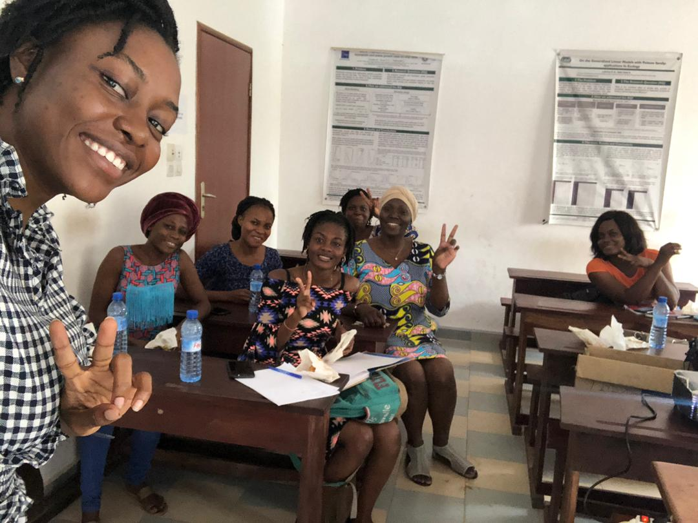

_Nous sommes très heureux de vous fournir cet article de blog dans différentes langues: Anglais, Français et Espagnol. Si vous souhaitez en savoir plus sur la manière de contribuer au blog de R-Ladies en général ou souhaitez faire de recommendations, veuillez nous contacter par e-mail à <christin@rladies.org>._

## Comment tout a commencé… ? 🤔

R-Ladies Cotonou est un groupe local de [R-Ladies Global](https://twitter.com/RLadiesGlobal) basé à Cotonou, au Bénin (Afrique de l’Ouest). À ce jour, nous avons 30 membres avec quatre femmes dans l’équipe organisatrice. L’idée de créer R-Ladies Cotonou est née sur Twitter ! Voici l’histoire !

{}

Ces tweets ont conduit à la création de R-Ladies Cotonou en Septembre 2017 ! Cela a principalement consisté à créer et configurer certaines des plateformes dont nous avions besoin : un e-mail et un compte Twitter ! [Benedicta Essuon](https://twitter.com/Bene_Essuon?s=20), une amie ghanéenne, qui était une étudiante dans mon pays, m’a aidé pendant ce processus.

## Les premières difficultés limitant l’expansion de notre groupe 😪

A sa création, R-Ladies Cotonou comptait deux membres, Benedicta et moi-même. Cependant, cette dernière est retournée dans son pays d’origine après avoir obtenu son diplôme et ce avant notre première rencontre. Elle était très triste de quitter le groupe mais elle a continué à beaucoup m’encourager à poursuivre le travail que nous avions commencé ensemble. Elle a continué à soutenir R-Ladies Cotonou.
À l’époque, je n’avais aucune expérience avec les communautés ou la gestion de groupes et je ne savais pas par où commencer. Néanmoins, j’ai eu la chance de bénéficier de mes échanges avec [Maëlle Salmon](https://twitter.com/ma_salmon) (membre de l’équipe globale de R-Ladies – R-Ladies Global team) pour aller de l’avant. J’ai également appris de ce que les autres groupes R-Ladies partageaient sur Twitter. Toutefois, je doutais beaucoup et je n’ai pas essayé de contacter l’équipe globale pour obtenir de l’aide.

_Ainsi, le premier problème à gérer était le recrutement de co-organisatrices._ J’ai organisé une petite réunion avec des femmes qui, selon moi, pourraient être intéressées par l’idée et heureusement, nous sommes devenues une équipe de quatre organisatrices. _Ensuite, le deuxième problème s’en est suivi : nous devions de recruter des membres._

Avant de pouvoir régler cette question, l’accès à Internet est devenu un problème majeur dans le pays. Des taxes ont été imposées et tout était assez cher. Nous avons arrêté de discuter du développement de notre groupe. La principale source de mes idées était les tweets d’autres groupes ! Que pouvais-je faire sans Twitter ? À l’époque, je n’utilisais pas beaucoup le Slack de R-Ladies pour les organisatrices. Il nous a fallu un certain temps pour nous habituer aux nouveaux forfaits Internet et lentement, je suis revenue sur Slack.

Environ un an et demi s’était écoulé depuis la création du groupe. Pas de rencontres, pas de membres. Début 2019, j’ai reçu un message de [Claudia Vitolo](https://twitter.com/clavitolo), co-fondatrice de R-Ladies Global, qui voulait savoir si notre groupe existait toujours. Cela m’a brisé le cœur de voir une si bonne initiative sur le point de disparaître. Je me sentais coupable et triste. Et le miracle s’est produit ! Claudia m’a proposé de trouver un mentor pour m’aider à développer notre groupe ! Dès que j’ai accepté l’offre, mon mentor s’est engagé dans la lutte pour activer R-Ladies Cotonou.

## Le programme de mentorat de R-Ladies à la rescousse! 💪

Mon mentor [Florencia D’Andrea](https://twitter.com/cantoflor_87), organisatrice de [R-Ladies Buenos Aires](https://twitter.com/RLadiesBA) et aussi ma « R-sister » (ou Sœur-en-R), comme nous nous sommes finalement baptisées, est apparue au bon moment et a beaucoup changé les choses, à commencer par mon doute de moi-même quant à l’organisation. Nous avons principalement travaillé à travers des discussions sur Slack. Elle m’a questionnée sur mes difficultés et nous avons étudié chacune d’elles pour trouver de nombreuses solutions.

Le programme de mentorat m’a donné l’occasion d’exprimer à haute voix mes difficultés en tant qu’organisatrice. Mon mentor a partagé sa propre expérience en matière d’organisation de son propre groupe. Je me sentais mieux en sachant que je n’étais pas la seule à me sentir parfois perdue ou dépassée. Progressivement, j’ai commencé à faire des suggestions par moi-même et elle m’a aidée à les rendre plus concrètes.

Avec plus de confiance, je suis retournée à l’organisation de R-Ladies Cotonou ! Avec les co-organisatrices, nous avons débuté par une ébauche claire de nos objectifs spécifiques, des critères d’admission, de la planification des rencontres et des plans de parrainage ou sponsoring. Des dépliants ont été conçus pour présenter brièvement R-Ladies Cotonou et partagés parmi nos contacts. Nous avons également créé un formulaire Google pour obtenir des informations de base sur nos nouveaux membres.

Notre premier meetup (rencontre) officiel a eu lieu en Juillet 2019 ! Les diapositives étaient attrayantes et détaillées (pleines d’émojis aussi) et la pâtisserie partagée était délicieuse. En gros, j’ai présenté R-Ladies (mission, objectifs, système, ressources…) à nos membres. Nous avons eu une bonne discussion spécifiquement sur la vie de notre groupe local. Voir l’enthousiasme et la motivation des membres présents à planifier les prochains rendez-vous m’a fait pleurer. (J’ai célébré avec mon mentor avec beaucoup d’émojis heureux et festifs). Quelques photos peuvent être trouvées [ici](https://twitter.com/RLadiesCtn/status/1155935587188166657) !

<figure>
<figcaption aria-hidden="true"><em>Les membres joyeux de R-Ladies Cotonou partageant des pâtisseries. Cette photo a été prise lors du premier meetup officiel où les membres ont appris tout ce qui est utile sur R-Ladies et surtout sur R-Ladies Cotonou.</em></figcaption>
</figure>

Le programme de mentorat de R-Ladies a été gratifiant pour mon groupe. Avec l’aide de mon mentor, j’ai pu trouver des solutions à long terme au problème d’Internet. Nous utilisons des e-mails et WhatsApp pour partager les documents et outils issus de nos rencontres et entrer en contact avec nos membres. Ces méthodes sont moins chères et les membres sont à l’aise avec ces moyens de communication. Cependant, nous encourageons toujours l’utilisation de Twitter et de Meetup.

De même, j’ai eu à appliquer différentes stratégies, inspirées de mon expérience de mentoring, pour impliquer les membres dans l’organisation et maintenir le groupe en vie. Bien que l’équipe d’organisation s’occupe de la plupart des tâches, nous avons demandé à des volontaires de nous aider dans des tâches spécifiques telles que la rédaction d’e-mails ou la conception de dépliants. Nos membres aiment vraiment acquérir de nouvelles compétences et nous avons des bénévoles pour chaque tâche. Cette stratégie est utile car elle rend le groupe indépendant des organisatrices principales. Elle aide les membres à voir ce qui se passe dans les coulisses avant la rencontre et à révéler leurs propres compétences en matière d’organisation.

L’une des questions les plus importantes que nous avons abordées avec ma R-sister était _Comment motiver les conférenciers_. Après la rencontre de Juillet, nous avons échoué dans nos tentatives de rencontre car les intervenants ont abandonné pour diverses raisons. J’ai compris les probables causes de cela et Florencia a partagé de nombreuses suggestions. J’ai choisi de promouvoir de courtes présentations pour commencer. Grâce à notre groupe WhatsApp, j’ai expliqué comment faire une courte présentation et assuré que je serais personnellement impliqué à 100%. Un volontaire s’est présenté et la deuxième rencontre a eu lieu en Février 2020.

Avant la deuxième rencontre, R-Ladies Cotonou a reçu du financement de niveau vecteur de R Consortium ! J’avais postulé à ce financement avec les encouragements et les rappels de Florencia. Elle m’a également expliqué comment rechercher du financement et comment cela pourrait être utile à un groupe local.

La deuxième rencontre s’est bien déroulée [(quelques photos ici)](https://twitter.com/RLadiesCtn/status/1227670069305651201). Pour encourager et motiver les potentielles présentatrices, j’ai demandé à la fin du tutoriel à la présentatrice, [Ruth Ouangbey](https://twitter.com/ruthouangbey2), de partager son expérience depuis le choix de son sujet jusqu’à la présentation ! Elle a partagé cela avec joie et des volontaires pour la prochaine rencontre se sont immédiatement manifestées. Pour agrémenter un peu, nous avons ajouté un événement supplémentaire surprise qui était un court entretien par [Shériftah Mama Chabi](https://twitter.com/masherycha1) sur le thème _Ladies in Science (Les femmes en Science)_. Elle a présenté la situation des femmes dans les sciences, discuté de l’égalité des genres et des défis rencontrés par les femmes scientifiques, et a terminé sa présentation en donnant un répertoire de liens utiles vers des opportunités et du financement.

<figure>
<figcaption aria-hidden="true">La deuxième conférencière, Ruth Ouangbey, nous présente une revue des méthodes les plus pratiques pour l’importation et l’exportation des données. Les membres suivent et prennent des notes.</figcaption>
</figure>

J’ai beaucoup appris de ce programme de mentorat et je crois que je partage les idées en donnant l’exemple dans le groupe. Je pense aussi que même si je devais me retirer de mon rôle d’organisatrice, le groupe serait en bonne santé et entre de bonnes mains. Je suis profondément et sincèrement reconnaissante envers Florencia, mon mentor qui s’est vraiment investie dans ce mentorat de par sa disponibilité tout au long du programme et de par son écoute très attentive à chacune de mes préoccupations. Merci à l’équipe globale de R-Ladies d’avoir créé ce programme et de m’avoir proposé d’en faire partie ! 💜

## Nous sommes en bonne santé ! 😉

Aujourd’hui, R-Ladies Cotonou est en bonne santé, surtout grâce au programme de mentorat ! Je le recommande à tout groupe local de R-Ladies qui a besoin d’aide pour mettre en place et organiser des rencontres, recruter des membres ou tout autre élément nécessaire à la vie du groupe.

> **_Ne vous inquiétez pas, il y a toujours un mentor de R-Ladies pour vous accompagner !_**

_Auteur: [Nadejda Sero](https://twitter.com/sbnadejda), organisatrice de [R-Ladies Cotonou](https://twitter.com/RLadiesCtn).
Traduction en Espagnol: Florencia D’Andrea, Relecture: Mine Dogucu and Divya Sernaami, Blog: Christin Zasada_
