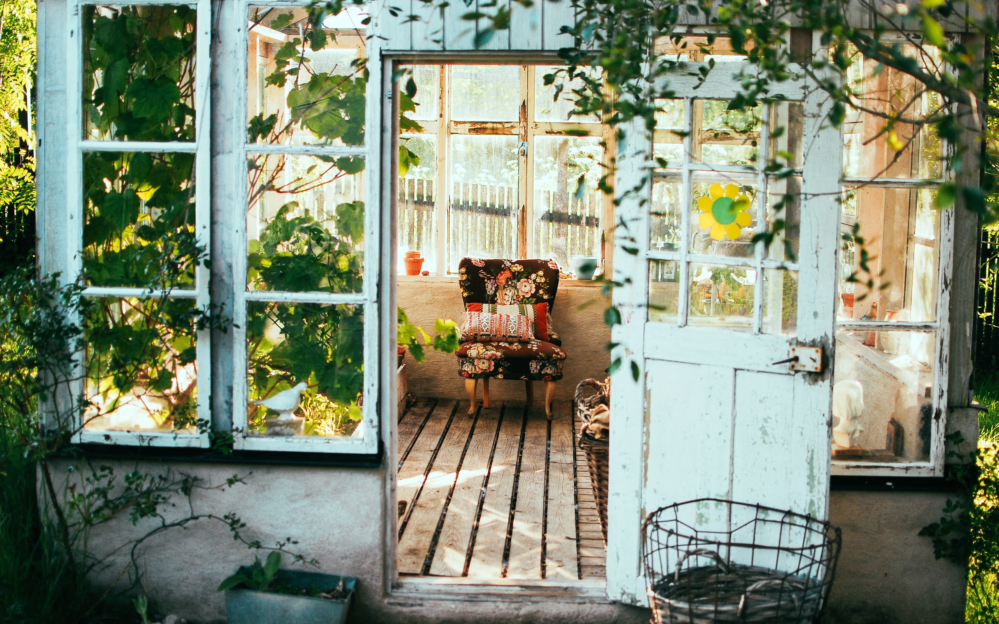
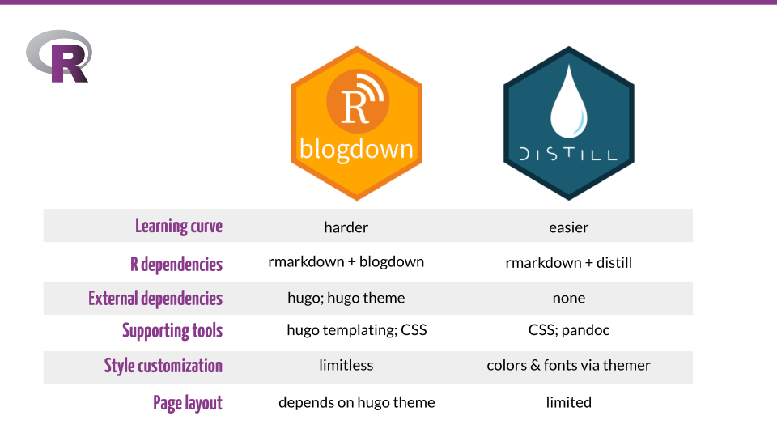

<link href="index.en_files/ggiraphjs/ggiraphjs.min.css" rel="stylesheet" />

Figure 1: Photo by Arno Smit on Unsplash (https://unsplash.com/photos/iI72r3gSwWY)

*This post was originally published on Shannon Pileggi’s <a href="https://www.pipinghotdata.com/posts/2021-09-23-curating-for-wearerladies-on-twitter/" target="_blank">personal blog</a>.*

# TL; DR

In February 2021 I tweeted to a daunting &gt;20k followers by curating for <a href="https://twitter.com/WeAreRLadies" target="_blank"><code>@WeAreLadies</code></a> on Twitter. This was great opportunity to share knowledge, interact with others, and learn something in return, ultimately cultivating new connections and collaborations. From preparation to fruition, I hope this post helps you confidently enroll as a curator!

*Added 2021-10-05:* For a broad overview, check out the poster presentation <a href="https://www.pipinghotdata.com/talks/2021-10-07-be-great-and-curate/" target="_blank">Be great and curate!</a> for the 2021 Women in Statistics and Data Science conference.

# About `@WeAreRLadies`

The `@WeAreRLadies` rotating Twitter curator exists to “encourage and maintain Twitter engagement within the R-Ladies community,” and to “spotlight female and minority genders” working with R. R-Ladies has a <a href="https://guide.rladies.org/rocur/about/" target="_blank">comprehensive guide</a> describing the program, procedures and protocols for the week, and tips for successful curation.

# Overcoming imposter syndrome

You may be hesitant to sign up as a curator due to imposter syndrome - I certainly was. I was on Twitter for three years before I gathered the courage. However, you do not need to know everything about R nor Twitter in order to be a successful `@WeAreRLadies` curator - that is impossible! In fact,

<blockquote class="twitter-tweet" data-width="550" data-lang="en" data-dnt="true" data-theme="light">
No matter where you are in your R learning journey 🌄 YOU are an important part of the <a href="https://twitter.com/hashtag/rstats?src=hash&amp;ref_src=twsrc%5Etfw">#rstats</a> community!🤗 <a href="https://t.co/ThBhjE3ZA2">pic.twitter.com/ThBhjE3ZA2</a>
&mdash; We are R-Ladies (@WeAreRLadies) <a href="https://twitter.com/WeAreRLadies/status/1361660625718571010?ref_src=twsrc%5Etfw">February 16, 2021</a></blockquote>

Every R user, new or experienced, has a valuable perspective to share. I was particularly impressed when <a href="https://twitter.com/daniebrant" target="_blank">Danielle Brantley</a> excellently curated in September 2020, after being an R user for one year! To help alleviate
general R imposter syndrome check out Catlin Hudon’s blog post on <a href="https://caitlinhudon.com/2018/01/19/imposter-syndrome-in-data-science/" target="_blank">imposter syndrome in data science</a>; to increase comfort with Twitter, try [Twitter for R Programmers](https://www.t4rstats.com/) by Oscar Baruffa and Veerle van Son.

My personal strategy for combating imposter syndrome is to prepare. For my curating week, my preparation involved reflecting on past curators and creating some content in advance. I hope this post helps you to prepare and motivates you to sign up. 😉

# Timeline

Here is my personal timeline to leading up to curation.

| Time before curation | Action taken                                     |
|:---------------------|:-------------------------------------------------|
| 3 years              | Became active on twitter                         |
| 3 months             | Signed up to curate                              |
| 3 weeks              | Notified manager; discussed work-related content |
| 2 weeks              | Researched R-Ladies fonts and colors             |
| 1 week               | Started drafting tweets                          |
| 1 day                | Fiddled with formats for code gifs               |

# Selecting a date

You can view the <a href="https://docs.google.com/spreadsheets/d/13NwIphQ6o-3YJUbHtbDRf4texfMOCvhIDNZgDZhHv7U/edit?usp=sharing" target="_blank">schedule</a> of upcoming curators to identify available dates; records of previous curators are also maintained here.

Being a curator will be time intensive, so be kind to yourself. Choose dates when you will have time to invest and a flexible work schedule. I chose Feb 15-20
because I hoped by then I would be recovered from an intense Q4 work cycle;
additionally, Feb 15 (President’s Day) was a company holiday. You may
want to select a date far enough in the future that allows you time to create
content.

Another consideration is to schedule your curation to coincide with dates that align with your interests. For example, are you passionate about Black History Month in February, LGBT Pride Month in June, or Universal Human Rights Month in December?
If so, take advantage of the `@WeAreRLadies` large platform as an opportunity to inform and educate others on issues that are important to you as they relate to the
R community. <a href="https://www.diversitybestpractices.com/2021-diversity-holidays" target="_blank">Diversity best practices</a> has a comprehensive list of calendar holidays and observances.

# Signing up

You sign up by <a href="https://forms.gle/4Z6EMbDzRyFQsB6C8" target="_blank">submitting a form</a> - give yourself at least 30 minutes to sign up as part of the
form includes filling out details that complete your <a href="https://twitter.com/WeAreRLadies/status/1361139211819180032" target="_blank">curating profile</a>.

There was a gap between when I filled out the form and when I was confirmed as a curator,
which I suspect was due to timings and holidays. Be kind, be patient - all organizing R-Ladies are volunteers.

# Notifying my manager

About three weeks before my curation, I started planning my curating efforts a bit more
seriously. I notified my manager that I was curating, and I discussed potential work-related content with her. One idea was approved and another was reasonably denied. This honest conversation facilitated new awareness about my passions - my manager was not aware of R-Ladies, and she was enthusiastic and supportive.

# Styling content

Additionally, I considered how to visually style content beyond text in a tweet. I asked on <a href="https://rladies-community-slack.herokuapp.com/" target="_blank">R-Ladies slack</a> about R-Ladies styles, and I was directed to the xaringan R-Ladies <a href="https://github.com/yihui/xaringan/tree/master/inst/rmarkdown/templates/xaringan/resources" target="_blank">css</a> and the R-Ladies <a href="https://guide.rladies.org/organization/tech/brand/" target="_blank">branding</a> guides. You are not required to use R-Ladies style and branding, but it was convenient for me.

I developed two visual layouts using the Google slide <a href="https://docs.google.com/presentation/d/1sriC2biLPYza_TtGiZkrNDsv3AMg6dvhqw2yit4wNnA/edit" target="_blank">template</a> from R-Ladies branding (see tweets for <a href="https://twitter.com/WeAreRLadies/status/1363144545677017089" target="_blank">blogdown vs distill</a> and <a href="https://twitter.com/WeAreRLadies/status/1362370580708790274" target="_blank">asking for help online</a>).

Figure 2: Comparison of blogdown vs distill styled using R-Ladies Google slide template.

I also created five R-Ladies styled code gifs with xaringan and flipbookr - methods and code are in this <a href="https://www.pipinghotdata.com/posts/2021-03-08-r-ladies-styled-code-gifs-with-xaringan-and-flipbookr/" target="_blank">blog post</a>. Here is an example code gif:

Figure 3: Example R-Ladies styled code gif.

# Drafting content

Leading up to my curation week, I regularly jotted down brief notes of content ideas.
The week before curation, I started fleshing out those ideas into actual tweets and wrote them down in a document. Not all of my ideas ended up in a draft,
and rarely did the draft get tweeted out exactly as I had written.

One challenge with drafting tweets in a document was being mindful of character limits
and anticipating where the breaks would be for threads. I started copying content into a send tweet window to preview and then pasting it back into my draft document. There is software that facilitates drafting tweets - for example, <a href="https://twitter.com/DaphnaHarel" target="_blank">Daphna Harel</a> recommended
<a href="https://getchirrapp.com/" target="_blank">getchirrapp.com</a> to me the week of my curation. I also kept <a href="https://emojipedia.org/" target="_blank">emojipedia</a> open all week
to easily copy and paste emojis into drafts.

Not all content was premeditated - I also tweeted in the moment. For example, the <a href="https://twitter.com/WeAreRLadies/status/1362016896116219904?s=20" target="_blank">W.E.B. Du Bois’</a> `#TidyTuesday` visualizations were incredible that week, or when I <a href="https://twitter.com/WeAreRLadies/status/1362509983368249346?s=20" target="_blank">realized</a> a new colleague wasn’t yet taking advantage of RStudio projects.

# Content inspiration

As I approached my curating week, I recalled previous `@WeAreRLadies` that were
memorable for me, my previous experience as an educator, and some reflection
questions to inspire content.

| Inspiration source                                                                                                                                                                                                                                                       | Example realization                                                                                                                     |
|--------------------------------------------------------------------------------------------------------------------------------------------------------------------------------------------------------------------------------------------------------------------------|-----------------------------------------------------------------------------------------------------------------------------------------|
| 1\. Rotating curator Mine Çetinkaya-Rundel (<a href="https://twitter.com/minebocek" target="_blank"><code>@minebocek</code></a>) tweets awesome <a href="https://twitter.com/WeAreRLadies/status/1064704918102163457" target="_blank">gifs</a>                           | <a href="https://twitter.com/WeAreRLadies/status/1361802517735178243" target="_blank">Gifs</a> for R code demos                         |
| 2\. Rotating curator Megan Stodel (<a href="https://twitter.com/MeganStodel" target="_blank"><code>@MeganStodel</code></a>) tweets a <a href="https://twitter.com/WeAreRLadies/status/1313177623128944645" target="_blank">project</a> inspired by curating              | An R project to <a href="https://twitter.com/WeAreRLadies/status/1361286341317779456" target="_blank">introduce myself</a> as a curator |
| 3\. Rotating curator Julia Piaskowski (<a href="https://twitter.com/SeedsAndBreeds" target="_blank"><code>@SeedsAndBreeds</code></a>) tweets a great technical thread on <a href="https://twitter.com/WeAreRLadies/status/1223790298024726528" target="_blank">ANOVA</a> | A thread on <a href="https://twitter.com/WeAreRLadies/status/1363144545677017089" target="_blank">blogging resources</a>                |
| 4\. Prior experience as an educator                                                                                                                                                                                                                                      | Starting discussion with a <a href="https://twitter.com/WeAreRLadies/status/1361332603274612739" target="_blank">question</a>           |
| 5\. What am I passionate about lately?                                                                                                                                                                                                                                   | <a href="https://twitter.com/WeAreRLadies/status/1363144545677017089" target="_blank">Blogging</a>                                      |
| 6\. What did I have to overcome to be where I am today?                                                                                                                                                                                                                  | Learning how to <a href="https://twitter.com/WeAreRLadies/status/1362370580708790274" target="_blank">ask for help online</a>           |
| 7\. What have colleagues or students asked me about?                                                                                                                                                                                                                     | What needs <a href="https://twitter.com/WeAreRLadies/status/1362114431090573315" target="_blank">updating</a> and when                  |
| 8\. What are some R functions or packages that have helped me recently?                                                                                                                                                                                                  | <a href="https://twitter.com/WeAreRLadies/status/1361418527870132226" target="_blank">sortable</a> package                              |
| 9\. What are R-Ladies voices I can amplify while I have this large platform?                                                                                                                                                                                             | <a href="https://twitter.com/WeAreRLadies/status/1362866281918128132" target="_blank">Quote tweeting questions</a>                      |

# Polls

Reminiscing about my days teaching in large lectures halls with students actively participating in polling questions through clickers, I planned three polls for the week. Polls on twitter are open for 24 hours and allow up to four response options. The approach was to launch the poll, collect responses, and then discuss. Here are the three polls that I launched during my curation, with follow up discussion:

Figure 4: Three polls and their follow-up discussion; hover over tiles to view tweets and click on tiles to go to links on Twitter.

# First and last tweets

The introduction and farewell tweets as a curator are important as this is when you actually tell people your name or personal twitter handle. To generate engagement, I aimed to create content-rich <a href="https://twitter.com/WeAreRLadies/status/1361286341317779456" target="_blank">first</a> and <a href="https://twitter.com/WeAreRLadies/status/1363286037846511616" target="_blank">last</a> tweets to give users more motivation to like or re-tweet, and I also connected the content with links to my blog so that users could easily learn more about me.

# TweetDeck

When you serve as a curator, you will be tweeting from <a href="https://tweetdeck.twitter.com/" target="_blank">TweetDeck</a>, and it is hard to separate curator experience from the technology. Tweeting from TweetDeck can be overwhelming compared to the standard Twitter interface.

Moreover, there were limitations to the platform that added challenges to curating, which included:

1.  There was no `+` enabled to easily create threads (I had to send a tweet and then comment on the tweet, and it was initially hard to ensure the thread appeared in correct order). Yes, I deleted many out of order tweets.

2.  Consequently, I could not draft and save threads in TweetDeck to send later.

3.  I could not send polls from the curator account on TweetDeck; polls were sent from my personal account and then re-tweeted from the curator account. Adding this context can help better frame polls.

4.  Depending on the content already in the send tweet interface, sometimes other options in TweetDeck would disappear, like the emoji, gifs, and upload image buttons. I kept <a href="https://emojipedia.org/" target="_blank">emojipedia</a> open to easily copy and paste emojis into my tweets, and it took trial and error to get everything I wanted in a single tweet.

5.  When uploading local content, you can add <a href="https://help.twitter.com/en/using-twitter/picture-descriptions" target="_blank">descriptions</a> to both gifs and images in the regular Twitter interface to create inclusive content for community members that use assistive reading technology; however, in TweetDeck, descriptions were enabled for images but not gifs.

6.  With TweetDeck, you can tweet from both your personal account and your curator account. You can set the options to default to the curator account, *but* there were still some instances where I still managed to inadvertently tweet from my personal account when I meant to tweet from the curator account. (I did delete the tweet and re-tweet from the correct account.)

I spent a lot of time my first couple of days as a curator getting used to TweetDeck, reaching out to other curators for tips, and researching alternative solutions and plug-ins that ultimately did not help. Twitter is targeting TweetDeck <a href="https://www.theverge.com/2021/3/9/22321991/twitter-tweetdeck-overhaul-redesign-product-changes" target="_blank">enhancements</a> later in 2021, so I don’t think it is worth documenting all of my methods and work-arounds. However, if you are serving as a curator and struggling with TweetDeck, please reach out - I am happy to share what ended up working for me. You can also prepare yourself by practicing tweeting from TweetDeck with your personal account prior to curating.

# What I would have done differently

It was a whirlwind week! Here a few things I would have done differently.

1.  Practice with TweetDeck in advance. Literally, force yourself to tweet from Tweetdeck at least a week before your curation. TweetDeck is very different than the standard Twitter interface, and it took me a few days to get used to it.

2.  Figure out how I wanted to style shared code in advance - my first couple of days would have gone smoother with this.

3.  Preface polls tweeted from my personal account with the context that they are for curator rotation.

4.  Prepare a tweet in honor of any holidays or significant events coinciding with your curation week. One regret that I do have from my curating week is failing to explicitly acknowledge Black History Month as I was tweeting in February. I wish had prepared at least one tweet or better amplified the voices of black members of the R community while I had the large platform.

# Fleeting fame

When curating, your tweets in the moment are highly visible. But what persists afterward is fairly anonymous as your tweets are not linked to your personal profile unless you tag yourself. In a weird way, it actually becomes a safe place to put yourself out there with
questions you might not have been comfortable asking from your own personal account. Take advantage of this fleeting fame not just to share your knowledge but also to ask your questions.

# Supporting your curators

Just because a Twitter account has &gt;20K followers, the likes, re-tweets, and comments don’t come automatically. You still have to earn engagement with your content. Many of the tweets I sent had little engagement, and that is okay. Supporting your curators by engaging with their tweets or sending notes of encouragement is *much* appreciated. I thank **everyone** who engaged with me during my curation, with a special shout out to Alison Hill who re-energized me mid-week with comments on the R-Ladies bloggers <a href="https://twitter.com/WeAreRLadies/status/1362021673239785473" target="_blank">thread</a>. I cannot emphasize this enough: every like, re-tweet, comment, and direct message helps!

In addition, if you have curated in the past, consider sending new curators a personal welcome message and an invitation to ask you any questions. Following my curation week, I offered camaraderie and tips to <a href="https://twitter.com/alehsegura13" target="_blank">Ale Segura</a>, and in return, she did the same for <a href="https://twitter.com/ShreyaLouis" target="_blank">Shreya Louis</a> following her.

# Reflection

Between prepared and ad-hoc content and discussions with followers, I tweeted a lot! (At least for me.) Here is a <a href="https://twitter.com/spcanelon/status/1363518469782843396" target="_blank">summary thread</a> of my tweets for the week. My tweets were not perfect, and that is okay. I messed up threads, had typos, and shared deprecated code, among other things. Check out my <a href="https://twitter.com/PipingHotData/status/1364183660744896513" target="_blank">blooper reel</a>[^1] for tweets that I bungled.

Serving as a curator was intimidating and time consuming, but I am very glad I did it. Many good things have happened as direct result of that week, including:

-   <a href="https://twitter.com/WeAreRLadies/status/1363144545677017089" target="_blank">discussing</a> comparisons between `{blogdown}` and `{distill}` with Alison Hill.

-   <a href="https://www.pipinghotdata.com/posts/2021-03-08-r-ladies-styled-code-gifs-with-xaringan-and-flipbookr/" target="_blank">collaborating</a> with Silvia Canelón to style code gifs.

-   engaging with new people on Twitter that I want to continue to engage with.

-   learning about valuable new-to-me packages, functions, and work flows.

-   being invited to <a href="https://www.pipinghotdata.com/talks/2021-04-22-growing-into-the-r-community/" target="_blank">speak for R-Ladies Miami</a>.

-   seeing my “Asking for help online” content re-used in Sharla Gelfand’s <a href="https://twitter.com/sharlagelfand/status/1365665149063987201" target="_blank">“make a reprex… please”</a> presentation.

-   co-developing a unit testing workshop with Gordon Shotwell for R-Ladies Philly.

During my curating week I tried to embody the tweets that I value: honest questions, thoughtful discussion, generous sharing, supportive community, and humorous exchanges. To borrow from Vicki Boykis in the rstudio::global(2021) <a href="https://rstudio.com/resources/rstudioglobal-2021/your-public-garden/" target="_blank">keynote</a>, I created my own public garden that cultivated new connections and collaborations. And now, I am more confident in continuing these practices from my personal Twitter account.

# Acknowledgements

Thank you to <a href="https://twitter.com/ma_salmon" target="_blank">Maëlle Salmon</a> and <a href="https://twitter.com/apreshill" target="_blank">Alison Hill</a> for encouraging me to write this - it might not have happened without you! Thank you also to Maëlle Salmon, <a href="https://twitter.com/alehsegura13" target="_blank">Ale Segura</a>, and <a href="https://twitter.com/ivelasq3" target="_blank">Isabella Velásquez</a> for your suggestions; I truly appreciate your sharp eyes and thoughtful feedback. 💜

[^1]: A blooper is an embarrassing mistake, often sports-related, and humorous in retrospect; a blooper reel is a compilation of multiple bloopers.
