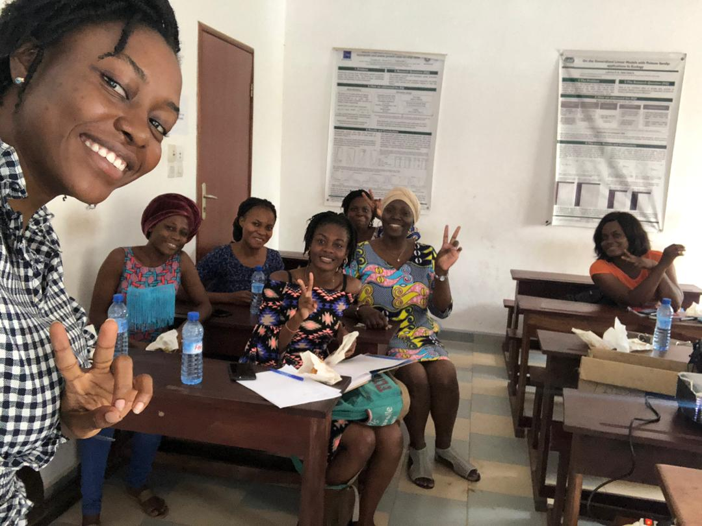

_We are very happy to provide you this blog article in different languages, English, French and Spanish. If you would like to know more about how to contribute to the R-Ladies Blog in general or would like to recommend anything, please reach out to us with an e-mail at <christin@rladies.org>._

## How it all started …? 🤔

R-Ladies Cotonou is a local chapter of [R-Ladies Global](https://twitter.com/RLadiesGlobal) located in Cotonou, Benin (West Africa). To date, we have 30 members with four women in the organizing team. The idea of creating R-Ladies Cotonou was born on Twitter! Here’s the story!

{}

These tweets led to the creation of R-Ladies Cotonou in September 2017! This mainly involved setting some of the platforms we needed: an e-mail and a Twitter account! [Benedicta Essuon](https://twitter.com/Bene_Essuon?s=20), a Ghanaian friend who was a scholar in my country helped me during that process.

## Early difficulties limiting our chapter expansion 😪

At its creation, R-Ladies Cotonou had two members, Benedicta and me. However, she went back to her home country after graduation before our first meetup. She was very sad about leaving the chapter but she kept encouraging me a lot to continue the work we started together. She continued to support R-Ladies Cotonou.
Back then, I did not have any experience with communities or managing groups and did not know where to start. However, I was lucky enough to benefit from my exchanges with [Maëlle Salmon](https://twitter.com/ma_salmon). I also learned from what the other chapters were sharing on Twitter. Still, I was doubting a lot and did not try to reach out the global team for help.

_So, the first issue was recruiting co-organizers._ I set up a small meeting with some women who I thought may be interested in the idea and fortunately we became a team of four organizers. _Now, the second issue followed: we had to recruit members._

Before we could work on that issue, Internet access became a major problem in the country. Taxes were imposed and everything was quite expensive. We stopped discussing about the chapter development. The main source of my ideas was the tweets of other chapters! What could I do without Twitter? At the time, I did not use the R-Ladies organizer’s Slack much. It took us some time to get used to the new internet plans and slowly I appeared back on Slack.

About a year and a half passed from the chapter’s creation. No meetups, no members. In early 2019, I received a message from [Claudia Vitolo](https://twitter.com/clavitolo), co-founder of R-Ladies Global, who wanted to know if our chapter still existed. It broke my heart to see such a good initiative about to disappear. I felt guilty and sad. And then a miracle happened! Claudia suggested me to get a mentor to help me with the chapter development! By the time I was done accepting the offer, my mentor joined the fight for R-Ladies Cotonou activation.

## R-Ladies Mentorship program at the rescue! 💪

My mentor [Florencia D’Andrea](https://twitter.com/cantoflor_87), organizer from [R-Ladies Buenos Aires](https://twitter.com/RLadiesBA) and also my “R-sister,” as we finally baptized ourselves, appeared at the right time and changed a lot, starting with my self-doubt about organizing. We mainly worked through discussions on Slack. She asked about my issues and we studied each of them coming up with many solutions.

The mentorship program gave me the floor to express my difficulties as an organizer out loud. My mentor shared her experience organizing her own chapter. I felt better knowing I was not alone in feeling lost or overwhelmed sometimes. Slowly, I started to come up with suggestions by myself and she helped me in making them more concrete.

More confidently, I went back to organizing R-Ladies Cotonou! With the co-organizers, we first started by setting up a clear draft of our specific objectives, criteria of admission, meetups planning and sponsorship plans. Flyers were designed to briefly introduce R-Ladies Cotonou and shared among our contacts. We also made a Google form to get basic information on our incoming members.

Our first official meetup happened in July 2019! The slides were nice and detailed (full of emojis too) and the pastry shared were delicious. Basically, I presented R-Ladies (mission, objectives, systems, and resources) to our members. We had a good discussion specifically on our chapter’s life. Seeing how motivated the members were about planning next meetups got me teary. (I celebrated with my mentor with a lot of happiness emojis). Some pics can be found [here](https://twitter.com/RLadiesCtn/status/1155935587188166657)!

<figure>
<figcaption aria-hidden="true">Happy members of R-Ladies Cotonou sharing some pastries. This picture was taken on the first official meetup where the members learned everything useful about R-Ladies and especially on R-Ladies Cotonou.</figcaption>
</figure>

The R-Ladies mentorship program has been rewarding for my chapter. With my mentor’s help, I was able to find ways around the internet issue for the long-term. We use emails and WhatsApp to share the meetup’s materials and get in touch with our members. These methods are cheaper and members are comfortable with them. However, we are still encouraging the use of Twitter and Meetup.

Moreover, I have been applying different strategies from my mentorship to get members involved in organization and keeping the chapter alive. Although the organizing team handles most of the tasks, we have been asking volunteers to help in specific tasks such as writing emails or designing flyers. They really enjoy learning new skills and we have volunteers for each task. This strategy is useful as it makes the chapter independent from the principal organizers. It helps members see how work is done behind the meetup and reveal their own skills at organizing.

One of the most important issues that we tackled with my R-sister was How to motivate speakers. After the meetup in July, we had failed attempts to meetup because the speakers gave up. I understood the feeling behind it and Florencia shared many suggestions. I chose to promote short talks to start with. Through our WhatsApp group, I explained how to make a short presentation and assured I would be personally involved 100%. A volunteer showed up and the second meetup happened in February 2020.

Before the second meetup, R-Ladies Cotonou received a Vector level Grant from the R Consortium! I had applied to that funding with the encouragement and reminders from Florencia. She also explained to me how to look for funding and how this could be useful to a chapter.

Our second meetup went smoothly (some visuals [here](https://twitter.com/RLadiesCtn/status/1227670069305651201). To encourage and motivate speakers, at the end of the tutorial, I asked the speaker, [Ruth Ouangbey](https://twitter.com/ruthouangbey2), to share her experience from choosing her topic to presenting! She enthusiastically shared that and we immediately got volunteers for the next meetup. To spice it up a bit, we added a surprise extra event which was a lightning talk by [Shériftah Mama Chabi](https://twitter.com/masherycha1) on the topic Ladies in Science. She presented the state of women in science, discussed gender equality and the challenges encountered by women scientists, and ended by giving a bunch of useful links to opportunities and funding.

<figure>
<figcaption aria-hidden="true">The second meetup speaker, Ruth Ouangbey, is taking us through a review of the most practical methods of importing and exporting datasets. The members are following and taking notes.</figcaption>
</figure>

I have learned a lot from this mentorship program and I believe I am spreading the ideas by setting an example in the chapter. I also think if I had to step down from my organizer’s role, the chapter would be fine and in good hands. I am deeply and sincerely grateful to Florencia, my mentor, who really invested herself in that mentorship by being available the whole time it lasted and really listening to any concerns. Thank you to the R-Ladies global team for coming up with this program and offering me to be a part of it! 💜

## We R in good health! 😉

Today, R-Ladies Cotonou is in good health, mostly because of the mentorship program! I recommend it to any chapter that needs help to set up, organize meetups, recruit members or anything else required for the chapter’s life.

> **_Never worry, there is always an R-Ladies mentor to walk with you!_**

_Author: [Nadejda Sero](https://twitter.com/sbnadejda), organizer of [R-Ladies Cotonou](https://twitter.com/RLadiesCtn).
Spanish translation: Florencia D’Andrea, Proofreading: Mine Dogucu and Divya Sernaami, Blog: Christin Zasada_
