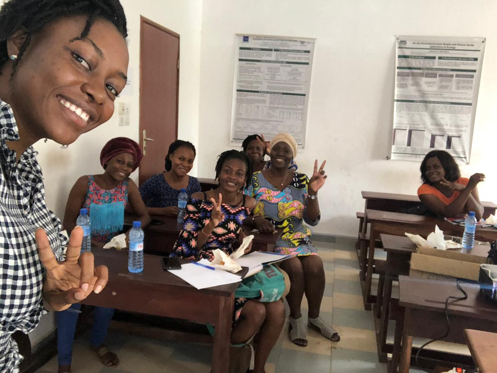
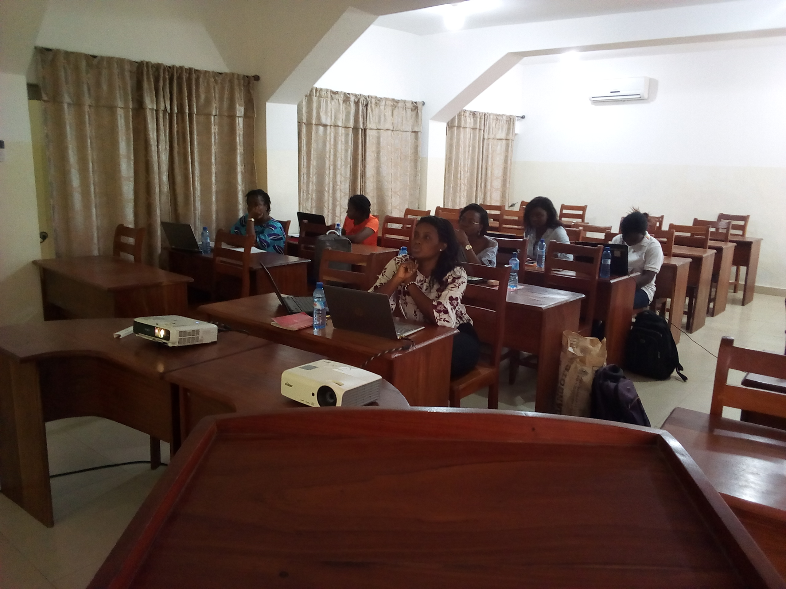

_Estamos felices de traerles este artículo en diferentes idiomas, Inglés, Francés y Español. Si deseas saber más sobre cómo contribuir al Blog de R-Ladies en general o tienes algún mensaje para el equipo, por favor contacta a <blog@rladies.org>._

## ¿Cómo comenzo todo?🤔

R-Ladies Cotonou es un capítulo de [R-Ladies Global](https://twitter.com/RLadiesGlobal) ubicado en Cotonou, Benin (África Oeste). Hasta el día de hoy consta de treinta miembros y cuatro mujeres en el equipo organizador. ¡La idea de crear R-Ladies Cotonou nació en Twitter! Aquí su historia:

{}

Estos tweets desencadenaron la apertura del capítulo en septiembre de 2017. Mayoritariamente comenzar a organizar el capítulo involucró configurar algunas plataformas: un email y una cuenta de Twitter. Benedicta Essuon, una amiga de Ghana que estudiaba en mi país me ayudó con este proceso.

## Las dificultades iniciales que limitaron la expansión de nuestro capítulo 😪

En sus inicios, R-Ladies Cotonou tenía dos miembros: Benedicta y yo. Sin embargo, ella volvió a su país de origen antes de la graduación y nuestro primer evento. Estuvo muy triste de dejar el capítulo pero siguió alentándome a que continue el trabajo que comenzamos juntas. Ella siguió apoyando a R-Ladies Cotonou en la distancia.
En aquel momento yo no poseía ninguna experiencia en el trabajo con comunidades o manejo de grupos y no sabía por dónde empezar. Tuve suerte de beneficiarme con algunos intercambios con [Maëlle Salmon](https://twitter.com/ma_salmon) (miembro del equipo de R-Ladies Global) que me ayudaron a seguir adelante. También aprendí de mirar lo que otros capítulos compartían por Twitter. Si bien aún dudaba bastante, no busqué más ayuda por parte del equipo global.

_El primer problema fue conseguir quienes co-organicen conmigo._ Preparé un pequeño evento invitando algunas mujeres que pensé que podrían encontrarse interesadas en la idea y afortunadamente pronto nos volvimos un equipo de cuatro organizadoras. _Ahora teníamos un segundo problema: conseguir miembros._

Antes de que pudieramos trabajar en ello, el acceso a internet se transformo un problema mayor en Benin. Se impusieron impuestos y todo era bastante caro. Dejamos de hablar sobre el desarrollo del capítulo. ¡La mayor fuente de mis ideas eran los tweets de otros capítulos! ¿Qué podía hacer sin Twitter? En ese momento, no usaba mucho el Slack de organizadoras de R-Ladies. Me llevo un tiempo acostumbrarme a los nuevos planes de internet y lentamente reaparecí en el Slack.

Cerca de un año y medio habia pasado desde la creación del capítulo. Sin eventos, sin participantes. A comienzos de 2019 recibo un mensaje de [Claudia Vitolo](https://twitter.com/clavitolo), co-fundadora de R-Ladies Global, que quería saber si nuestro capítulo todavía existía. Me rompió el corazón ver esta iniciativa tan buena estaba cerca de desaparecer. Me sentía culpable y triste. ¡Pero el milagro ocurrió! Claudia me sugirió que el programa de mentorías podría ayudarme con el desarrollo inicial del capítulo. Luego de aceptar la oferta, mi mentora se unió a los esfuerzos por salvar R-Ladies Cotonou.

# ¡El programa de mentorías de R-Ladies al rescate! 💪

Mi mentora [Florencia D’Andrea](https://twitter.com/cantoflor_87), co-organizadora de [R-Ladies Buenos Aires](https://twitter.com/RLadiesBA) y también mi “R-hermana,” como nos bautizamos, apareció en el momento justo y cambió muchas cosas, comenzando por mis dudas respecto a mis capacidades como organizadora. Principalmente trabajamos a través de mensajes directos en el Slack. Ella me preguntó sobre los incovenientes que tenía y estudiamos cada uno de ellos considerando varias soluciones posibles.

El programa de mentorías de R-Ladies me dió voz para poder expresar mis dificultades como organizadora. Mi mentora compartió conmigo su experiencia en la organización de su propio capítulo. Me sentí mejor sabiendo que no estaba sola si me sentía perdida o por momentos sobrepasada. Lentamente, comencé a llevar mis propias sugerencias y ella me ayudó a hacerlas más concretas.

¡Ya con más confianza, retomé la organización de R-Ladies Cotonou! Primero, junto con mis co-organizadoras, comenzamos un borrador con objetivos específicos, criterios de admisión, planeo de eventos y esponsoreo. Diseñamos volantes para presentar brevemente el capítulo entre nuestros contactos. También diseñamos un formulario para poder obtener información básica de nuestros miembros.

Nuestro primer meetup ocurrió oficialmente en julio de 2019. Las filminas fueron bonitas y detalladas (llenas de emojis también) y la comida fue deliciosa. Basicamente presenté R-Ladies (misión, objetivos, sistema, recursos) a quienes asistieron. Una buena parte de la charla fue específica sobre el nacimiento de nuestro capítulo. Ver la motivación de los asistentes al planear próximos eventos me emocionó (celebramos con mi mentora con un montón de emojis de felicidad). Algunas fotos del primer evento pueden encontrarse [aquí](https://twitter.com/RLadiesCtn/status/1155935587188166657).

<figure>
<figcaption aria-hidden="true">Asistentes a la primera reunión de R-Ladies Cotonou compartiendo algunas cosas dulces. Se tocaron temas útiles a saber sobre R-Ladies y especialmente sobre R-Ladies Cotonou.</figcaption>
</figure>

El programa de mentorías de R-Ladies ha sido beneficioso para mi capítulo. Con la ayuda de mi mentora pude encontrar formas de solucionar el problema de internet a largo plazo. Usamos emails y WhatsApp para compartir materiales para los eventos y ponernos en contacto entre los miembros. Estos métodos son baratos y la mayoría se siente cómoda con ellos. Sin embargo, aun aconsejamos el uso de Twitter y Meetup.

He estado aplicando diferentes estrategias para mantener a los miembros involucrados en la organización y mantener el capítulo activo. Si bien el equipo organizador maneja la mayor parte de las tareas, les hemos preguntado si les gustaría ofrecerse voluntariamente para tareas específicas como enviar mails o diseñar volantes. Por lo general les encanta descubrir nuevas capacidades y tenemos voluntarias para cada tarea. La estrategia es útil para hacer al capítulo independiente de sus organizadoras principales. De esta forma se ayuda a quienes forman parte a ver como se realiza el trabajo detrás de cada evento y descubren sus propias habilidades de organización.

Uno de los problemas más importantes que atacamos con mi “R-hermana” fue motivar a las oradoras. Luego del evento de julio, tuvimos algunos intentos fallidos ya que algunas de ellas desistieron. Entendí el sentimiento detras de estas bajas y Florencia compartió varias sugerencias. Para empezar, elegí promover charlas cortas. En nuestro grupo de WhatsApp expliqué como hacer una presentación corta y aseguré que estaría 100% personalmente comprometida. Finalmente, una voluntaria se ofreció y el segundo evento ocurrió en febrero de 2020.

¡Antes del segundo evento, R-Ladies Cotonou recibió un subsidio nivel vector de RConsortium! Apliqué a esos fondos gracias a el apoyo y los recordatorios de Florencia. Ella también me explicó como buscar fondos y como esto podría ser útil para el capítulo.

Nuestro segundo encuentro estuvo muy bueno; comparto algunas imagenes [aquí](https://twitter.com/RLadiesCtn/status/1227670069305651201). Para motivar y alentar futuras charlas, al final de la charla le propuse a la oradora, [Ruth Ouangbey](https://twitter.com/ruthouangbey2), que comparta su experiencia al momento de elegir un tema para presentar. Ella compartió su experiencia e inmediatamente se ofrecieron voluntarias para la próxima reunión. Para darle más sabor, agregamos un evento sorpresa extra, una charla relámpago de [Shériftah Mama Chabi](https://twitter.com/masherycha1) sobre el tema _“Mujeres en ciencia”_. Se presentó el el panorama de la mujer en la ciencia, se discutió sobre igualdad de género y los desafíos que enfrentan las mujeres científicas, y terminó dando varios de enlaces útiles a oportunidades y financiamiento.

<figure>
<figcaption aria-hidden="true">La segunda oradora del meetup, Ruth Ouangbey hace un recuento de métodos prácticos para importar y exportar datasets.</figcaption>
</figure>

He aprendido mucho del programa y estoy difundiendo algunas de ideas que obtuve de el poniendo como ejemplo mi capítulo. Creo a su vez que si tuviera que renunciar a mi rol de organizadora, el capítulo estaría bien y en buenas manos. Estoy profunda y sinceramente agradecida con Florencia, mi mentora, que realmente invirtió su tiempo para estar disponible mientras duró, escuchando cualquier preocupación. ¡Gracias al equipo de R-Ladies global por presentar este programa y ofrecerme ser parte de él! 💜

## ¡GozaR de buena salud! 😉

¡Hoy R-Ladies Cotonou goza de buena salud gracias al programa de mentorías! Se lo recomiendo a cualquier capítulo que necesite ayuda para organizar reuniones, encontrar nuevos miembros o cualquier otra cosa necesaria para la vida del capítulo.

> **_¡No te preocupes, siempre habrá una R-Lady que camine contigo!_**

_Autora: [Nadejda Sero](https://twitter.com/sbnadejda), organizadora de [R-Ladies Cotonou](https://twitter.com/RLadiesCtn).
Traducción al español: Florencia D’Andrea, Correcciones a la traducción al Inglés: Mine Dogucu and Divya Sernaami, Blog: Christin Zasada_
