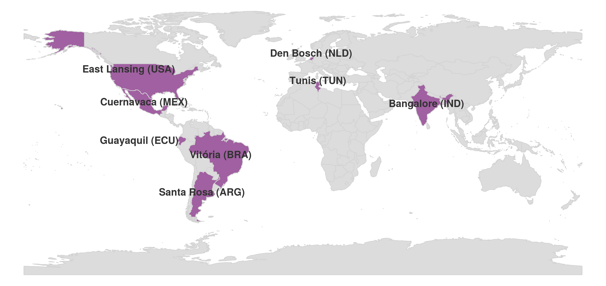

![Image promotionnelle pour une rencontre RLadies+ feat. user! le 28 avril à 20h UTC. La rencontre est associée à user! 2021 La Conférence R, qui aura lieu du 5 au 9 juillet 2021. L'événement est organisé par les chapitres RLadies+ de Vitória, Bangalore, East Lansing, Tunis, Guayaquil, Cuenavarca, Santa Rosa & Den Bosch et vise à apporter diverses voix à la conférence user!, invitant les participants à apprendre d'autres RLadies+ sur leurs expériences user!. L'image présente le logo RLadies (un hexagone rose stylisé contenant un "R" blanc et le mot "Ladies" en rose) à gauche et une illustration d'une marmotte souriante portant une écharpe colorée avec le logo "R" sur sa poitrine à droite. L'arrière-plan est d'un bleu uni.](banner.png)

In this post, you will see that we have used the R-Ladies logo with the colors of the rainbow and the trans flags. We have also added a + to the R-Ladies name.
As symbols and words matter a lot, we wanted to explicitly communicate, with the use of these symbols, the importance of diversity and inclusion to our community. We used them in this useR! to reinforce that we welcome diversity and put an effort into creating collectively a safe and friendly space.
This inclusively is innate in R-Ladies, and is a cornerstone of our organisation. The use of this logo and name in this meta-meetup was to more explicitly signal the values we already imbue as an organisation to those maybe less familiar with us.

## Who?

R-Ladies+ from Vitória, East Lansing, Den Bosch, Cuernavaca, Guayaquil, Bangalore, Santa Rosa, Tunis and useR-Ladies+ got together to co-organize a Meetup to encourage people to attend useR! 2021.

## Where?

## What?

We are R-Ladies+ from different continents, with different languages, accents, ethnicities, backgrounds, and experiences. However, we not only speak the same computational language, but we also agree that being part of R-Ladies+ has changed our lives. We firmly believe that the community has played a vital role in our personal development, learning experience, and teaching practice. Because of that, we wanted to share our experiences and invite people from different backgrounds to attend [useR! 2021 Global](https://https://user2021.r-project.org/) and engage with R-Ladies+ communities. Hence, we co-organized a Meetup with a line-up of incredible panelists.

The meetup took place in the afternoon/night of April 28th (and for some, the early morning of the 29th). We got together to hear from the amazing: **Jonelle Villar** (_R-Ladies Bergen_), **Haifa Ben Messaoud** (_R-Ladies Tunis_), **Adithi Upadhya** (_R-Ladies Bangalore_), **Zulemma Bazurto Blacio** (_R-Ladies Guayaquil_), **Beatriz Milz** (_R-Ladies São Paulo_), **Joselyn Chávez** (_R-Ladies Cuernavaca_), and **Janani Ravi** (_R-Ladies East Lansing_). Jonelle - with a Zoom photo background of the cake from the 20th R-Consortium anniversary - initiated the talks saying that the #rstats community today is moving in a promising direction that allows room for all voices. This is not something that we take lightly; the community is committed to actively promoting initiatives that include the diversity of all our voices. Twenty years ago, one couldn't have imagined a room full of such a diverse crowd as we have today. Haifa came next. She shared her journey creating the Tunis chapter and reinforced how being part of the R-Ladies+ community helped her believe in herself in a way she hadn't experienced before. Adithi, like Haifa, also described what it was like to create a new chapter from the beginning and how she ended being part of the useR! 2021 team. Adithi shared how useR! 2021 evolved from being held at a local venue to being a global virtual conference with volunteers representing almost every time zone.

Program content has been selected with care to assure quality and allow for a time zone-friendly schedule for all participants and their areas of interest. Zulemma represented not only a different voice, but also a different language: her speech was entirely in Spanish (which is one of the official languages of useR! 2021). One of the co-organizers of the Meetup, Andrea Sánchez-Tapia, provided a simultaneous translation in the Zoom chat. Zulemma shared her journey as a statistician and her delight when she discovered that her goal to democratize statistics learning was actually interwoven with the mission of R communities and R-Ladies. Zulemma has attended many global R conferences. She felt strongly that useR!, a conference organized by R users for R users, is a welcoming and empowering environment. Beatriz shared her experience being part of useR! 2019 after receiving a diversity scholarship. Beatriz's native language is Portuguese. In Portuguese the expression for a life-changing experience is called "divisor de águas" (watershed in English). Beatriz said that participating at useR! 2019 was such a life-changing experience, and today she is part of the communications team at useR! 2021. She hopes that useR! 2021 can be a life-changing experience for every person that is a member of an R community.

Joselyn shared her experience in her local chapter, Cuernavaca (Mexico). Joselyn illustrated with the Mexican experience how R-Ladies+ chapters are not isolated from each other. Mexican chapters actively interact with each other and are growing together as a community. Joselyn is part of the accessibility team at useR! 2021 and informed us how the conference is taking steps to provide an inclusive environment for everyone. Last but not least, Janani shared her experience founding the first R-Ladies chapter in Michigan (USA). Janani has been a much-appreciated voice in the useR program committee. We were pleased to hear how the conference is being planned by a talented group of people with diverse talents. The makeup of the useR! 2021 planning committee truly highlights the goal to represent a broad spectrum of R user experiences.

Being at the Meetup was inspiring on many levels. It was hard to say goodbye and we ended the meeting with anxious promises of "_See you soon at useR! 2021_". We said goodbye assured that our work to build local, regional, and global interactions amongst R communities can be a life-changing experience. We have been affected on an individual level, yet ultimately, we see the change in real-time in each of the #rstats communities we touch.

In the end, our message is simple and radical, and in the words of Jonelle Villar:

> My message for the people attending the useR! 2021 virtual conference: Diversity is our super-power! I have no doubt that the next cake to be prepared for the next R-Consortium anniversary will have plates and forks for all.

See you soon at useR!
¡Hasta luego!
Até logo!
À bientôt!

### Resources

- Welcome presentation made by Sara Mortara [here](https://saramortara.gitlab.io/rladies_user/#1)
- Beatriz Milz's presentation [here](https://beatrizmilz.github.io/slidesR/R-Ladies_and_useR_meetup/) and key points [here](https://github.com/rladies-eastlansing/2021-rladies_user/blob/main/speeches/beatriz_milz.md)
- Jonelle Villar's speech [here](https://github.com/rladies-eastlansing/2021-rladies_user/blob/main/speeches/jonelle_villar.md)
- Adithi Upadhya's speech [here](https://github.com/rladies-eastlansing/2021-rladies_user/blob/main/speeches/adithi_upadhya.md)
- Janani Ravi's [presentation](https://docs.google.com/presentation/d/17r3NdrySyJeqiVFpPkW1G1DEK6ZfLAmNFT1iHAl1t0s/preview)

2021-20-04: This post was edited to explicitly explain the use of the term 'R-Ladies+' in this specific context.
