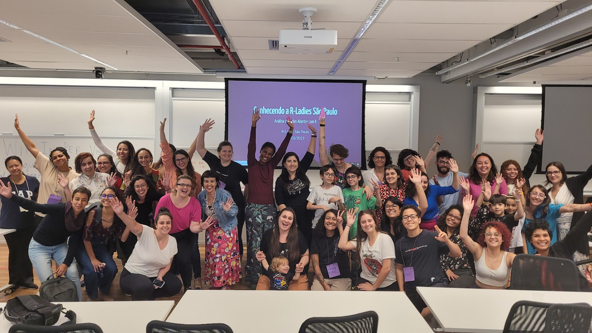
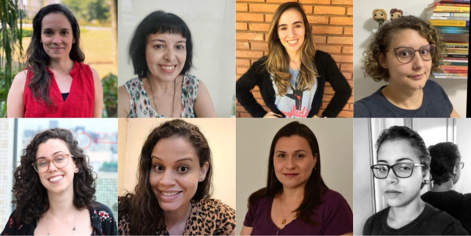

## Introduction

The [R-Ladies](https://www.rladies.org/) is a global organization that promotes gender diversity in the R community. [R-Ladies São Paulo](https://www.rladies-sp.org/) is proudly a chapter of R-Ladies Global, promoting gender diversity in the R community in São Paulo, Brazil.

In this post, our goal is to discuss diversity issues in the R-Ladies São Paulo community and the **actions that are being taken to increase diversity**.

> This post was written in April/2023. Since that time, **R-Ladies São Paulo received a grant from [R Consortium](https://www.r-consortium.org/all-projects/call-for-proposals#Rstats)**, which allowed the community to expand the actions to increase diversity.

To do so, two points are important to be discussed: what is intersectionality, and the Brazilian context.

## What is intersectionality?

The target audience of R-Ladies is gender minorities: cis women, trans women, trans men, non-binary people, and queer people. The main purpose of the community is to include these minority groups in the R community. However, for each of these groups, there are people who are part of other groups that may also suffer other oppressions arising from social markers of difference, such as race, sexual orientation, maternity, disabilities, age, etc. Therefore, the oppressions are not just based on a person's gender, but are interrelated and overlapping. This understanding is a concept called "intersectionality".

According to [Bridie Taylor (2019)](https://www.womankind.org.uk/intersectionality-101-what-is-it-and-why-is-it-important/):

> "Intersectionality is the acknowledgment that **everyone has their own unique experiences of discrimination and oppression** and we must consider everything and anything that can marginalize people -- gender, race, social class, sexual orientation, physical ability, etc."

Here is a simple example that can illustrate this concept: imagine a White cisgender woman and a Black cisgender woman. Both suffer gender oppression, but only the Black woman experiences racism. Now, consider a cisgender, Black, bisexual woman with atypical children. Even though the first and the last suffer gender oppression, there is no doubt that the last one always has longer and harder ways to reach the same positions.

Therefore, it is important to consider the issue of gender diversity, but not limit it to gender issues. It is also important to consider in the community's activities the intersections that the participants are included in, seeking improvement of diversity in several aspects.

## Brazilian context

For historical reasons, Brazil is a country that presents different racial compositions depending on the region. The city of São Paulo is located in the Southeast region, where 50.7% of the population declare themselves as White, 38.7% as "Pardo" in free translation "Brown", which in Brazil is equivalent to Black people of light skin, and 9.6% as "Black" what in Brazil is equivalent to Black people of dark skin ([based on IBGE - Continuous National Household Sample Survey, referent to 2021](https://educa.ibge.gov.br/jovens/conheca-o-brasil/populacao/18319-cor-ou-raca.html)[^1]). Considering that the Black population is composed of "Browns" and "Blacks", almost half of the population in the Southeast region is Black.

[^1]: IBGE: Brazilian Institute of Geography and Statistics. IBGE is a national bureau of statistics that conducts census and is responsible for the collection, storage, and dissemination of socioeconomic data on the Brazilian population, as well as the regulation of the Brazilian territory, including its biomes and physical and geographic aspects, and the relationship of society in its occupation.

Despite representing about half of the region's population, the Black population has been marginalized. They are still underrepresented in spaces of power, such as politics, higher education, decision-making positions in companies, etc.

 Source: [IBGE - Continuous National Household Sample Survey, 2021](https://educa.ibge.gov.br/jovens/conheca-o-brasil/populacao/18319-cor-ou-raca.html).

Another relevant issue to understand the Brazilian context and the results presented here is the high level of violence with LGBTQIA+ groups, especially transgender people. The results of the [Trans Murder Monitoring (TMM) study in 2022](https://transrespect.org/en/trans-murder-monitoring/tmm-resources/) can be seen in the map below: Brazil is the country with the highest absolute values of murders of transgender people since the beginning of the historical series obtained by the TMM.

 Source: [Trans Murder Monitoring (TMM) - 2022](https://transrespect.org/en/map/trans-murder-monitoring/?submap=tmm_2022)

The topic of work and financial income is also particularly sensitive for the trans population. According to the mapping of transgender people, in the city of São Paulo[^2] in 2020, approximately half of the people interviewed left home between the ages of 16 and 20, and of these, 30% were due to fights, and 17% were expelled from home. This early exit of their homes impacts trans population access to labor and income: 57% of the interviewees do not have any technical or specific training and 42% were not carrying out any paid activity during the interview period.

[^2]: The trans people mapping made by the city hall of São Paulo was one of the first in Brazil, but unfortunately, we still do not have this data for the whole country. Source: [Center for Contemporary Culture Studies, 2021](https://www.prefeitura.sp.gov.br/cidade/secretarias/upload/direitos_humanos/LGBT/AnexoB_Relatorio_Final_Mapeamento_Pessoas_Trans_Fase1.pdf).

These characteristics of the Brazilian population are important to consider when analyzing the diversity of participants in the community.

## Community Survey - 2020

In 2020, we applied an online survey to community members, with the aim of learning more about the composition of our community and how we could increase its diversity. The questionnaire was released in our online groups, such as Meetup and Telegram, and received 161 valid responses.

Below, we will highlight some points raised by the questionnaire responses, addressing topics such as gender diversity, racial diversity, the inclusion of mothers/fathers/caregivers, the inclusion of LGBTQIA+ people, food supply, and geographic access. These graphs are important to understand the composition of the community in 2020 and what actions we should take to increase diversity in underrepresented groups.

### Gender diversity

Regarding gender diversity, we can see a scenario of the predominance of women (cis or trans) in the community. A problem identified later was that the questions as they were made did not allow us to identify how many trans people were part of the community. Therefore, we do not have disaggregated data on transgender people in the community, and this specific question should be incorporated into future surveys.

### Racial Diversity

Regarding racial diversity in the community in 2020, it is important to highlight that 73.3% of the respondents identified themselves as White, despite the fact that this group represents about half of the population in this region of Brazil. This means that there is an underrepresentation of Black people in the R-Ladies São Paulo community, and we need to take serious actions for ethnic-racial inclusion.

It is also important to mention the [text written by the R-Ladies Global and R Forwards team about #BlackLivesMatter in 2020](https://www.rladies.org/news/2020-06-06-blm/). In this text, that was [translated into Portuguese by the R-Ladies São Paulo and that is on the community's blog](https://rladies-sp.org/posts/2020-06-rladies-global-blm/), R-Ladies Global committed to improving the way the organization supports Black, Indigenous, and other non-white groups:

> _"While the R-Ladies mission is focused on improving gender diversity within the R community, we also recognize both the struggle that Black people face, and the compound effect of intersectionality when a member identifies with multiple underrepresented groups. \[...\] We commit to making our community spaces places of not only safety for all our members, but of active work towards equity and justice."_ Source: [R-Ladies Global Blog](https://www.rladies.org/news/2020-06-06-blm/).

In the questionnaire, we left an open question so that people could make suggestions to increase ethnic-racial diversity in the community, and below are some suggestions received:

- Publicize R-Ladies in groups that address racial issues;

- Create quotas for the participation of Black people;

- Invite Black people to speak;

- Publish group statistics on this representation gap;

- Promote events focused on the theme of race;

- Hold events in peripheral regions;

- Promote events focused on Black people;

- Have Black people in the organization of the community.

### Inclusion of mothers/fathers/caregivers

In 2020, 13% of the respondents had children. Similar to what was done with race, an open question was left and some of the suggestions received for including more people with children were:

- Providing a space to leave children during events;

- Recording events so that mothers/fathers/caregivers can watch when it is more convenient;

- Conducting online broadcasts of events to promote the participation of people who cannot attend in person.

### Inclusion of LGBTQIA+

In 2020, 30% of respondents were part of the LGBTQIA+ community. Although there are no data on the percentage of the Brazilian population that is part of the LGBTQIA+ community, the results of this survey indicate that the community is on the right path regarding LGBTQIA+ population inclusion.

Among the suggestions offered by the community to increase the participation of LGBTQIA+, the issue of the community's name stands out. Some respondents pointed out that the name "R-Ladies" suggests that the group is only for women and discourages people from other groups from participating because it is not clear that they are welcome.

### Geographic Regions

The following map shows the Metropolitan Region of São Paulo (the largest polygon), and the City of São Paulo (divided by regions). Most of the people who participate in the event are from the West and South regions of the city. To increase the participation of people from the East and North regions of the city, it is interesting to hold events there.

## Actions taken to increase diversity

The questionnaire conducted in 2020, and the discussions established above, point to the need for a collective effort by the community to increase diversity.

In order to achieve that, some actions have been taken and will be briefly commented on below. In posts related to recent events, the activities were described in greater detail, for example:

- [Event: Open Data Analysis with R](https://rladies-sp.org/posts/2023-03-evento-open-data-day/english.html)

- [Event: Introduction to R Workshop](https://rladies-sp.org/posts/2023-01-evento-oficina-intro-R/)

### **Affirmative actions**

Seeking a greater diversity of participants in our events, we saved spots focusing on three groups (quotas):

- Black, Brown and Indigenous people

- mothers

- women and other gender minorities

The quotas are also advertised on the community's social networks (mainly Instagram), in order to make it clear that the presence of these groups is welcome and desired.

### **Space for children and babies**

GuGuDaDados (free translation GuguDadata) is a collaborative and experimental space that RLadies São Paulo proposes with the aim of keeping children entertained and cared for while their mothers/fathers/caretakers can participate in community activities. The space itself consists of a room next to the room where the R-Ladies' activities take place, on the same floor, so that all caregivers feel comfortable to leave their children there.

With financial support from other organizations, we hired a primary school teacher to promote recreational activities with the children in the GuGuDaDadosthroughout the activity. The organizers of R-Ladies also take toys, drawings, markers, games and temporary tattoos to entertain and amuse the children.

### **Potluck: Collaborative Coffee**

The collaborative coffee is set up with items purchased with the financial support of sponsor organizations, as well as with items brought by participants (a potluck). Thus, people can eat at any time during the event.

This coffee format (available all the time during the event) is very good for three reasons: (i) it is a great opportunity to meet and talk to people in the community; (ii) it welcomes participants who, due to health issues, cannot go many hours without eating; and (iii) it welcomes participants who, due to socio-economic conditions, cannot afford to have a meal during the lunch break.

Given the nature of the R-Ladies community, it is important to provide a minimum level of support to ensure that everyone has the opportunity to enjoy the event experience regardless of whether they have something to eat during the day. In addition, collaborative coffee is also a way to encourage integration among people!

### **Transportation and Meal Assistance**

To allow people with limited financial means to have access to and benefit from the events, an important action is providing transportation and meal assistance. Meal assistance is offered at in-person events that last a whole day. Transportation assistance is offered at all in-person events. A notable point is that many people who request transportation assistance are from cities outside the Metropolitan Region of São Paulo, which shows the potential for creating new R-Ladies chapters in these cities.

> **R-Ladies São Paulo received a grant from [R Consortium](https://www.r-consortium.org/all-projects/call-for-proposals#Rstats)**, which allowed the community to offer financial assistance at the events.

### **Working in pairs**

Not all the participants have a laptop to take to the activity. As we hope that everyone can participate regardless of financial condition, in publicizing, we encourage people to participate regardless of being able to bring a computer. So, in cases where someone goes without a laptop, we encourage people to form pairs and work together during the event. This has always worked and ends up stimulating greater proximity and solidarity between people.

### **Encourage carpooling**

The city of São Paulo is very large, and depending on where you need to go, it is common to take 2 hours (or more!) in public transport to move around. Therefore, urban mobility is one of the difficulties to take part of in a in-person event. To overcome this issue, we encourage participantsthat are driving, at the end of the event, to offer rides to people who live in nearby regions of the city. It is still necessary to improve this incentive to combine, in a safe way for all people, rides before the event (and not just at the end).

## **Next steps**

Based on the survey answers and the community experience over time, these are some of the next steps that we plan to do (or continue doing) in order to increase diversity in our community:

1.  Encourage greater participation of people who belong to any social minority through quotas, an internal stance of positive discrimination; including these people in the organization; inviting them to offer lectures/workshops; promoting visibility; and giving space for these individuals to bring their perspective, experience, and perception to the ongoing structuring of the R-Ladies São Paulo community.

2.  Search for partnerships in peripheral regions to be able to hold events in those areas, making it easier for people who live far from the city center to attend.

## **Current organizing team**

There are several people currently involved in the organization of the R-Ladies São Paulo community. It is important to mention that the community organizers belong to different minority groups (such as Black women, mothers, trans people, non-binary people, LGBTQIA+, neurodivergent people, and people over 40 years), and this is important to offer different perspectives and experiences. Furthermore, it is important to highlight that the participation in the organization is voluntary. Therefore, we list and thank the people who are involved in the various stages of organizing the community:

 

- [Ana Carolina Moreno](https://www.linkedin.com/in/anacarolinamoreno/)

- [Ana Paula Rocha](https://www.linkedin.com/in/aprocha/)

- [Angélica Custódio](https://www.linkedin.com/in/angelicacustodio/)

- [Beatriz Milz](https://beamilz.com/)

- [Fernanda Peres](https://www.linkedin.com/in/fernandafielperes/)

- [Geovana Lopes Batista](https://www.linkedin.com/in/geovanalopes/)

- [Haydee Svab](https://www.linkedin.com/in/hsvab/)

- [Ianní Muliterno](https://www.linkedin.com/in/iannimuliterno/)

- [Jean Gabriel Reis do Prado](https://www.linkedin.com/in/jeangprado/)

- [Luana Antunes Tolentino Souza](https://www.linkedin.com/in/luana-antunes-alexandre-aa572b48/)

- [Nathália Demétrio](https://www.linkedin.com/in/nathaliademetrio/)

- [Tatyane Paz Dominguez](https://www.linkedin.com/in/tatyane-paz-dominguez-264224213/)
