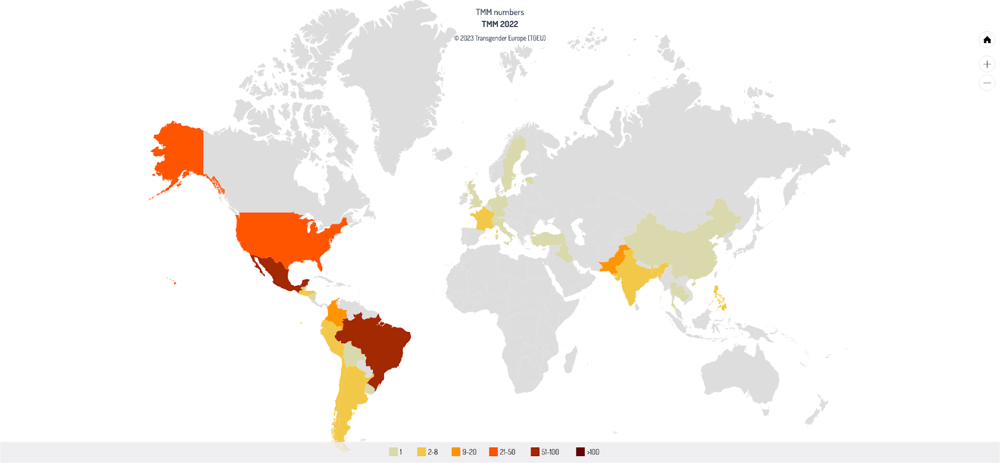
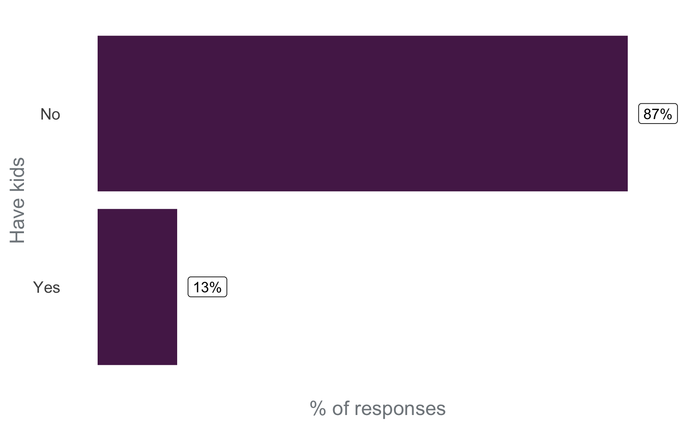
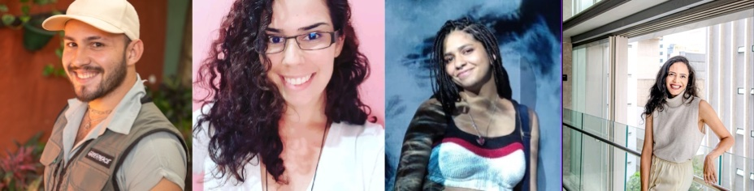

## Introducción

El sitio [R-Ladies](https://www.rladies.org/) es una organización mundial que promueve la diversidad de género en la comunidad R. [R-Ladies São Paulo](https://www.rladies-sp.org/) es orgullosamente un capítulo de R-Ladies Global, que promueve la diversidad de género en la comunidad R en São Paulo, Brasil.

En este post, nuestro objetivo es discutir temas de diversidad en la comunidad de R-Ladies São Paulo y la **acciones que se están tomando para aumentar la diversidad**.

> Este post fue escrito en abril/2023. Desde entonces, **R-Ladies São Paulo recibió una subvención de [Consorcio R](https://www.r-consortium.org/all-projects/call-for-proposals#Rstats)** que permitió a la comunidad ampliar las acciones para aumentar la diversidad.

Para ello, es importante discutir dos puntos: qué es la interseccionalidad y el contexto brasileño.

## ¿Qué es la interseccionalidad?

El público objetivo de R-Ladies son las minorías de género: mujeres cis, mujeres trans, hombres trans, personas no binarias y personas queer.
El objetivo principal de la comunidad es incluir a estos grupos minoritarios en la comunidad R.
Sin embargo, en cada uno de estos grupos hay personas que forman parte de otros colectivos que también pueden sufrir otras opresiones derivadas de marcadores sociales de diferencia, como la raza, la orientación sexual, la maternidad, las discapacidades, la edad, etc.
Por lo tanto, las opresiones no se basan únicamente en el género de una persona, sino que están interrelacionadas y se superponen.
Este concepto se denomina "interseccionalidad".

Según [Bridie Taylor (2019)](https://www.womankind.org.uk/intersectionality-101-what-is-it-and-why-is-it-important/):

> "La interseccionalidad es el reconocimiento de que **cada persona tiene sus propias experiencias de discriminación y opresión** y debemos tener en cuenta todo aquello que pueda marginar a las personas: género, raza, clase social, orientación sexual, capacidad física, etc.".

He aquí un ejemplo sencillo que puede ilustrar este concepto: imaginemos una mujer blanca cisgénero y una mujer negra cisgénero.
Ambas sufren opresión de género, pero sólo la mujer negra experimenta racismo.
Ahora, pensemos en una mujer cisgénero, negra y bisexual con hijos atípicos.
Aunque la primera y la última sufren opresión de género, no cabe duda de que la última siempre tiene caminos más largos y difíciles para llegar a las mismas posiciones.

Por lo tanto, es importante considerar la cuestión de la diversidad de género, pero no limitarla a las cuestiones de género.
También es importante considerar en las actividades de la comunidad las intersecciones en las que se incluyen los participantes, buscando la mejora de la diversidad en varios aspectos.

## Contexto brasileño

Por razones históricas, Brasil es un país que presenta diferentes composiciones raciales según la región.
La ciudad de São Paulo está situada en la región Sudeste, donde el 50,7% de la población se declara como blanca, el 38,7% como "Pardo" en traducción libre "Brown", lo que en Brasil equivale a negros de piel clara, y el 9,6% como "Black" lo que en Brasil equivale a negros de piel oscura ( [basado en IBGE - Encuesta Nacional Continua por Muestra de Domicilios, referencia a 2021](https://educa.ibge.gov.br/jovens/conheca-o-brasil/populacao/18319-cor-ou-raca.html) [^1] ).
Teniendo en cuenta que la población negra se compone de "marrones" y "negros", casi la mitad de la población de la región del Sureste es negra.

[^1]: IBGE: Instituto Brasileño de Geografía y Estadística.
IBGE es una oficina nacional de estadística que realiza censos y es responsable de la recopilación, almacenamiento y difusión de datos socioeconómicos sobre la población brasileña, así como la regulación del territorio brasileño, incluyendo sus biomas y aspectos físicos y geográficos, y la relación de la sociedad en su ocupación.

A pesar de representar cerca de la mitad de la población de la región, la población negra ha sido marginada.
Siguen estando infrarrepresentados en los espacios de poder, como la política, la enseñanza superior, los puestos de decisión en las empresas, etc.

 Fuente: [IBGE - Encuesta Nacional Continua por Muestra de Hogares, 2021](https://educa.ibge.gov.br/jovens/conheca-o-brasil/populacao/18319-cor-ou-raca.html).

Otra cuestión relevante para entender el contexto brasileño y los resultados aquí presentados es el alto nivel de violencia con los grupos LGBTQIA+, especialmente las personas transgénero.
Los resultados de la [estudio Trans Murder Monitoring (TMM) en 2022](https://transrespect.org/en/trans-murder-monitoring/tmm-resources/) pueden verse en el siguiente mapa: Brasil es el país con mayores valores absolutos de asesinatos de personas transexuales desde el inicio de la serie histórica obtenida por el TMM.

 Fuente: [Trans Murder Monitoring (TMM) - 2022](https://transrespect.org/en/map/trans-murder-monitoring/?submap=tmm_2022)

El tema del trabajo y los ingresos económicos también es especialmente delicado para la población trans.
 Según el mapeo de las personas transexuales, en la ciudad de São Paulo [^2] en 2020, aproximadamente la mitad de las personas entrevistadas abandonaron el hogar entre los 16 y los 20 años, y de ellas, el 30% fue debido a peleas, y el 17% fue expulsada del hogar.
Esta salida precoz de sus hogares impacta en el acceso de la población trans al trabajo y a la renta: El 57% de los entrevistados no tiene formación técnica o específica y el 42% no realizaba ninguna actividad remunerada durante el periodo de la entrevista.

[^2]: La cartografía de las personas trans realizada por el ayuntamiento de São Paulo fue una de las primeras de Brasil, pero lamentablemente aún no disponemos de estos datos para todo el país.
Fuente:
[Centro de Estudios de la Cultura Contemporánea, 2021](https://www.prefeitura.sp.gov.br/cidade/secretarias/upload/direitos_humanos/LGBT/AnexoB_Relatorio_Final_Mapeamento_Pessoas_Trans_Fase1.pdf).

Estas características de la población brasileña son importantes a la hora de analizar la diversidad de los participantes en la comunidad.

## Encuesta comunitaria - 2020

En 2020, aplicamos una encuesta en línea a los miembros de la comunidad, con el objetivo de conocer mejor la composición de nuestra comunidad y cómo podríamos aumentar su diversidad.
El cuestionario se difundió en nuestros grupos en línea, como Meetup y Telegram, y recibió 161 respuestas válidas.

A continuación, destacaremos algunos puntos planteados por las respuestas al cuestionario, abordando temas como la diversidad de género, la diversidad racial, la inclusión de madres/padres/cuidadores, la inclusión de personas LGBTQIA+, el suministro de alimentos y el acceso geográfico.
Estos gráficos son importantes para comprender la composición de la comunidad en 2020 y qué medidas debemos tomar para aumentar la diversidad en los grupos infrarrepresentados.

### Diversidad de género

En cuanto a la diversidad de género, podemos ver un escenario de predominio de mujeres (cis o trans) en la comunidad.
Un problema identificado posteriormente fue que las preguntas, tal y como estaban formuladas, no permitían identificar cuántas personas trans formaban parte de la comunidad.
Por lo tanto, no disponemos de datos desglosados sobre las personas transgénero en la comunidad, y esta pregunta específica debería incorporarse en futuras encuestas.

### Diversidad racial

En cuanto a la diversidad racial en la comunidad en 2020, es importante destacar que el 73,3% de los encuestados se identificaron como blancos, a pesar de que este grupo representa cerca de la mitad de la población en esta región de Brasil.
Esto significa que hay una subrepresentación de personas negras en la comunidad de R-Ladies São Paulo, y necesitamos tomar acciones serias para la inclusión étnico-racial.

También es importante mencionar la [texto escrito por el equipo de R-Ladies Global y R Forwards sobre #BlackLivesMatter en 2020](https://www.rladies.org/news/2020-06-06-blm/).
En este texto, que fue [traducido al portugués por las R-Ladies São Paulo y que está en el blog de la comunidad](https://rladies-sp.org/posts/2020-06-rladies-global-blm/) R-Ladies Global se comprometió a mejorar la forma en que la organización apoya a los grupos negros, indígenas y otros grupos no blancos:

> *"Aunque la misión de R-Ladies se centra en mejorar la diversidad de género dentro de la comunidad R, también reconocemos tanto la lucha a la que se enfrentan los negros como el efecto compuesto de la interseccionalidad cuando un miembro se identifica con múltiples grupos infrarrepresentados. [...] Nos comprometemos a hacer de nuestros espacios comunitarios lugares no sólo de seguridad para todos nuestros miembros, sino de trabajo activo hacia la equidad y la justicia."* Fuente: [R-Ladies Global Blog](https://www.rladies.org/news/2020-06-06-blm/).

En el cuestionario, dejamos una pregunta abierta para que la gente pudiera hacer sugerencias para aumentar la diversidad étnico-racial en la comunidad, y a continuación figuran algunas sugerencias recibidas:

- Dar a conocer R-Ladies en grupos que traten temas raciales;

- Crear cuotas de participación de negros;

- Invitar a los negros a tomar la palabra;

- Publicar estadísticas de grupo sobre esta brecha de representación;

- Promover actos centrados en el tema de la raza;

- Celebrar actos en las regiones periféricas;

- Promover actos centrados en la población negra;

- Contar con personas negras en la organización de la comunidad.

### Inclusión de madres/padres/cuidadores.

En 2020, el 13% de los encuestados tenían hijos.
De forma similar a lo que se hizo con la raza, se dejó una pregunta abierta y algunas de las sugerencias recibidas para incluir a más personas con hijos fueron:

- Proporcionar un espacio para dejar a los niños durante los eventos;

- Grabar los actos para que las madres, padres o cuidadores puedan verlos cuando les resulte más cómodo;

- Realizar retransmisiones en línea de los actos para fomentar la participación de las personas que no pueden asistir en persona.

### Inclusión de LGBTQIA+

En 2020, el 30% de los encuestados formaban parte de la comunidad LGBTQIA+.
Aunque no hay datos sobre el porcentaje de la población brasileña que forma parte de la comunidad LGBTQIA+, los resultados de esta encuesta indican que la comunidad está en el camino correcto en cuanto a la inclusión de la población LGBTQIA+.

Entre las sugerencias ofrecidas por la comunidad para aumentar la participación de LGBTQIA+, se destaca la cuestión del nombre de la comunidad.
Algunos encuestados señalaron que el nombre "R-Ladies" sugiere que el grupo es sólo para mujeres y desanima a personas de otros grupos a participar porque no queda claro que son bienvenidas.

### Regiones geográficas

El siguiente mapa muestra la Región Metropolitana de São Paulo (el polígono más grande), y la Ciudad de São Paulo (dividida por regiones).
La mayoría de las personas que participan en el evento son de las regiones Oeste y Sur de la ciudad.
Para aumentar la participación de personas de las regiones Este y Norte de la ciudad, es interesante realizar eventos allí.

## Medidas adoptadas para aumentar la diversidad

El cuestionario realizado en 2020 y los debates establecidos anteriormente apuntan a la necesidad de un esfuerzo colectivo por parte de la comunidad para aumentar la diversidad.

Para lograrlo, se han emprendido algunas acciones que se comentarán brevemente a continuación.
En posts relacionados con acontecimientos recientes, se describen las actividades con mayor detalle, por ejemplo:

- [Evento: Análisis de datos abiertos con R](https://rladies-sp.org/posts/2023-03-evento-open-data-day/english.html)

- [Evento: Taller de introducción a R](https://rladies-sp.org/posts/2023-01-evento-oficina-intro-R/)

### **Acciones afirmativas**

En busca de una mayor diversidad de participantes en nuestros actos, guardamos plazas centrándonos en tres grupos (cuotas):

- Negros, marrones e indígenas

- madres

- mujeres y otras minorías de género

Las cuotas también se anuncian en las redes sociales de la comunidad (principalmente Instagram), para dejar claro que la presencia de estos grupos es bienvenida y deseada.

### **Espacio para niños y bebés**

GuGuDaDados (traducción libre GuguDadata) es un espacio colaborativo y experimental que RLadies São Paulo propone con el objetivo de mantener a los niños entretenidos y cuidados mientras sus madres/padres/cuidadores pueden participar en actividades comunitarias.
El espacio en sí consiste en una sala contigua a la sala donde tienen lugar las actividades de R-Ladies, en la misma planta, para que todos los cuidadores se sientan cómodos dejando allí a sus hijos.

Con el apoyo financiero de otras organizaciones, contratamos a un profesor de primaria para que promoviera actividades recreativas con los niños de la GuGuDaDadosdurante toda la actividad.
Los organizadores de R-Ladies también llevan juguetes, dibujos, rotuladores, juegos y tatuajes temporales para entretener y divertir a los niños.

### **Potluck: Café Colaborativo**

El café colaborativo se prepara con artículos adquiridos con el apoyo financiero de organizaciones patrocinadoras, así como con artículos aportados por los participantes (un potluck).
Así, la gente puede comer en cualquier momento del evento.

Este formato de café (disponible todo el tiempo durante el evento) es muy bueno por tres razones: (i) es una gran oportunidad para conocer y hablar con gente de la comunidad; (ii) acoge a participantes que, por cuestiones de salud, no pueden pasar muchas horas sin comer; y (iii) acoge a participantes que, por condiciones socioeconómicas, no pueden permitirse una comida durante la pausa del almuerzo.

Dada la naturaleza de la comunidad de R-Ladies, es importante proporcionar un nivel mínimo de apoyo para garantizar que todos tengan la oportunidad de disfrutar de la experiencia del evento, independientemente de si tienen algo que comer durante el día.
Además, ¡el café colaborativo es también una forma de fomentar la integración entre las personas!

### **Asistencia para transporte y comidas**

Para que las personas con medios económicos limitados puedan acceder a los actos y beneficiarse de ellos, una medida importante es proporcionar ayuda para el transporte y las comidas.
La asistencia para comidas se ofrece en eventos presenciales que duran un día entero.
La ayuda al transporte se ofrece en todos los actos presenciales.
Cabe destacar que muchas de las personas que solicitan ayuda para el transporte proceden de ciudades situadas fuera de la Región Metropolitana de São Paulo, lo que demuestra el potencial de crear nuevas filiales de R-Ladies en esas ciudades.

> **R-Ladies São Paulo recibió una subvención de [Consorcio R](https://www.r-consortium.org/all-projects/call-for-proposals#Rstats)** que permitió a la comunidad ofrecer ayuda financiera en los eventos.

### **Trabajo en parejas**

No todos los participantes disponen de un ordenador portátil para llevar a la actividad.
Como esperamos que todo el mundo pueda participar independientemente de su situación económica, en la publicidad animamos a la gente a participar independientemente de que puedan traer un ordenador.
Así, en los casos en que alguien vaya sin portátil, animamos a la gente a formar parejas y trabajar juntos durante el evento.
Esto siempre ha funcionado y acaba estimulando una mayor proximidad y solidaridad entre las personas.

### **Fomentar el uso compartido del coche**

La ciudad de São Paulo es muy grande y, dependiendo de adónde tenga que ir, es habitual tardar 2 horas (¡o más!) en transporte público para desplazarse.
Por lo tanto, la movilidad urbana es una de las dificultades para participar en un evento presencial.
Para superar este problema, animamos a los participantes que vayan en coche a que, al final del evento, ofrezcan viajes a personas que vivan en regiones cercanas de la ciudad.
Aún es necesario mejorar este incentivo para combinar, de forma segura para todas las personas, los viajes antes del evento (y no sólo al final).

## **Próximos pasos**

Basándonos en las respuestas de la encuesta y en la experiencia de la comunidad a lo largo del tiempo, estos son algunos de los próximos pasos que pensamos dar (o seguir dando) para aumentar la diversidad en nuestra comunidad:

1. Incentivar una mayor participación de personas que pertenezcan a cualquier minoría social a través de cuotas, una postura interna de discriminación positiva; incluir a estas personas en la organización; invitarlas a ofrecer charlas/talleres; promover la visibilidad; y dar espacio para que estas personas aporten su perspectiva, experiencia y percepción a la estructuración continua de la comunidad R-Ladies São Paulo.

2. Buscar asociaciones en regiones periféricas para poder realizar eventos en esas áreas, facilitando la asistencia de personas que viven lejos del centro de la ciudad.

## **Equipo organizador actual**

Actualmente hay varias personas involucradas en la organización de la comunidad R-Ladies São Paulo.
Es importante mencionar que los organizadores de la comunidad pertenecen a diferentes grupos minoritarios (como mujeres negras, madres, personas trans, personas no binarias, LGBTQIA+, personas neurodivergentes y personas mayores de 40 años), y esto es importante para ofrecer diferentes perspectivas y experiencias.
Además, es importante destacar que la participación en la organización es voluntaria.
Por lo tanto, enumeramos y agradecemos a las personas que participan en las distintas etapas de la organización de la comunidad:

 

- [Ana Carolina Moreno](https://www.linkedin.com/in/anacarolinamoreno/)

- [Ana Paula Rocha](https://www.linkedin.com/in/aprocha/)

- [Angélica Custódio](https://www.linkedin.com/in/angelicacustodio/)

- [Beatriz Milz](https://beamilz.com/)

- [Fernanda Peres](https://www.linkedin.com/in/fernandafielperes/)

- [Geovana Lopes Batista](https://www.linkedin.com/in/geovanalopes/)

- [Haydee Svab](https://www.linkedin.com/in/hsvab/)

- [Ianní Muliterno](https://www.linkedin.com/in/iannimuliterno/)

- [Jean Gabriel Reis do Prado](https://www.linkedin.com/in/jeangprado/)

- [Luana Antunes Tolentino Souza](https://www.linkedin.com/in/luana-antunes-alexandre-aa572b48/)

- [Nathália Demétrio](https://www.linkedin.com/in/nathaliademetrio/)

- [Tatyane Paz Domínguez](https://www.linkedin.com/in/tatyane-paz-dominguez-264224213/)

