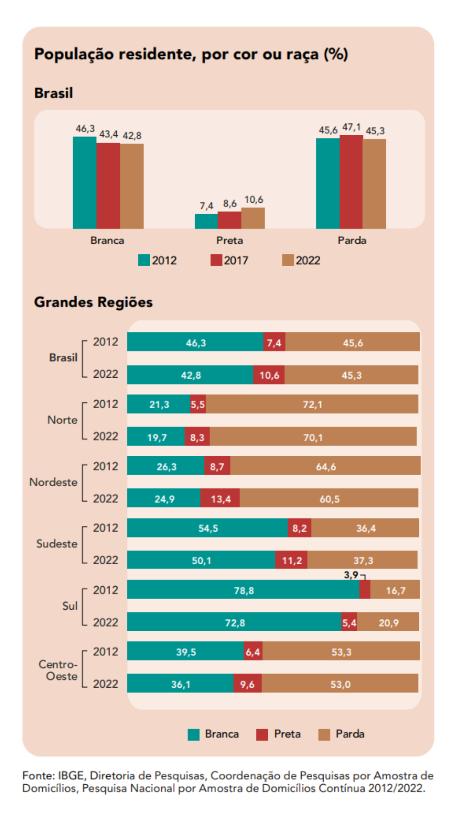
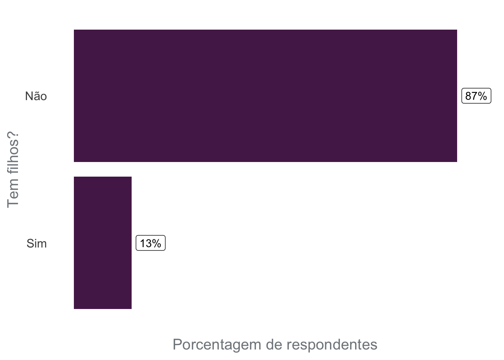
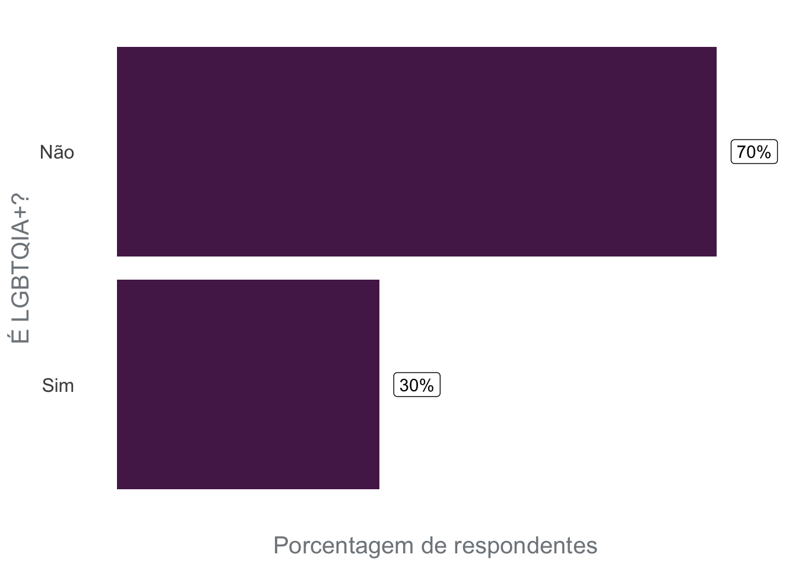
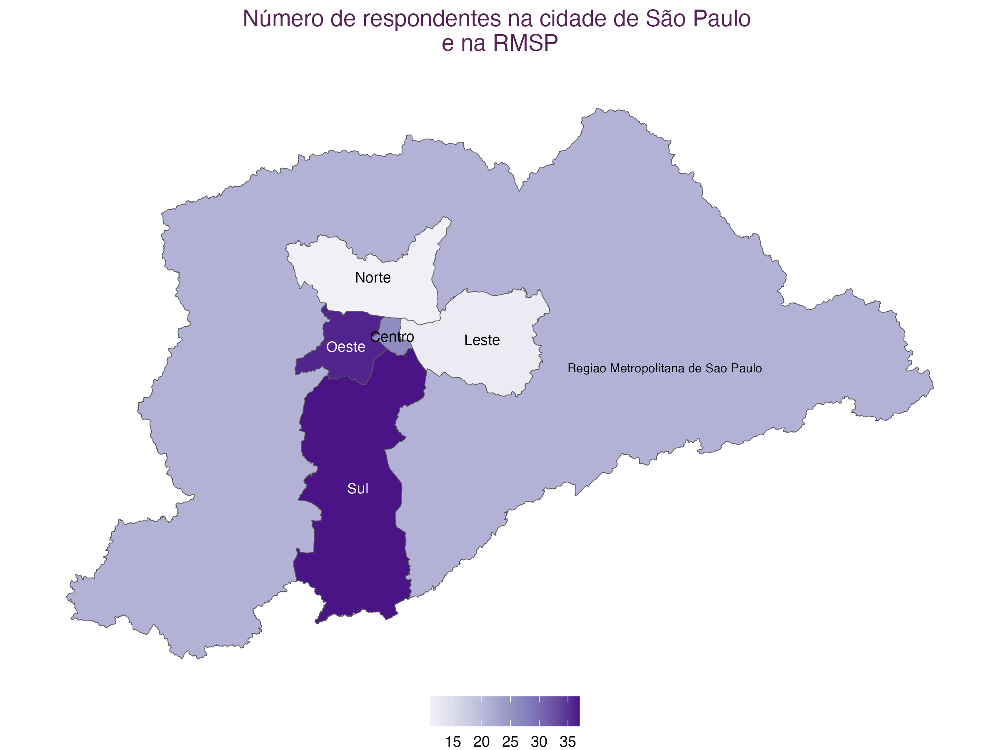
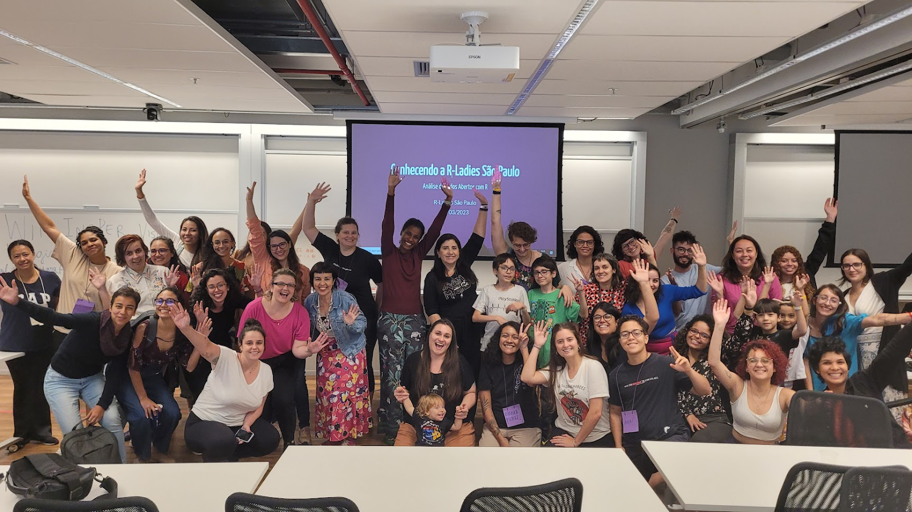
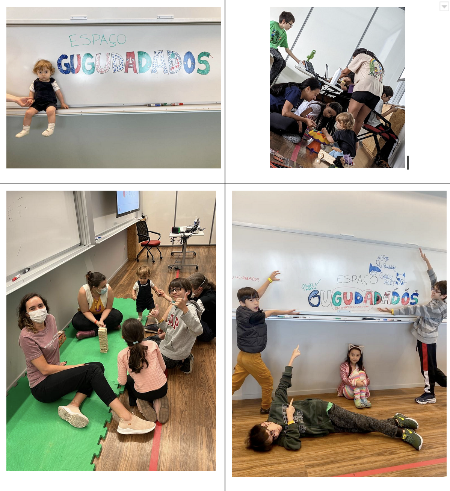
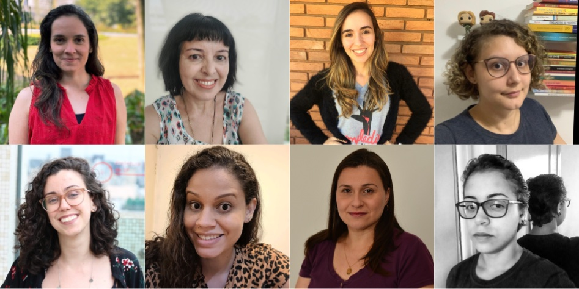

## Introdução

A [R-Ladies](https://www.rladies.org/) é uma organização global cuja missão é promover a diversidade de gênero na comunidade R. A [R-Ladies São Paulo](https://www.rladies-sp.org/), orgulhosamente, é um capítulo da R-Ladies Global, promovendo a diversidade de gênero na comunidade de R em São Paulo, no Brasil.

Neste post, o nosso objetivo é discutir questões de diversidade atualmente na comunidade R-Ladies São Paulo, e as **ações que têm sido feitas para ampliar a diversidade**.

> Este post foi escrito em abril de 2023. Desde então, **R-Ladies São Paulo recebeu um auxílio do [R Consortium](https://www.r-consortium.org/all-projects/call-for-proposals#Rstats)**, o que permitiu à comunidade ampliar as ações para aumentar a diversidade.

Para isso, dois pontos são importantes de serem discutidos: o conceito de interseccionalidade e questões relacionadas ao contexto brasileiro.

## O que é Interseccionalidade?

O público-alvo da R-Ladies são minorias de gênero, portanto: mulheres cis, mulheres trans, homens trans, pessoas não binárias e pessoas queer. O objetivo da comunidade é incluir esses grupos minoritários na comunidade de R. Porém, para cada um desses grupos de minorias de gêneros, existem pessoas que fazem parte de outros grupos que também podem sofrer outros tipos de exclusões e opressões, como: cor e raça, orientação sexual, maternidade, deficiências, idade, entre outros. Portanto, as opressões não são apenas baseadas no gênero da pessoa, e sim se relacionam e se sobrepõem. Esse entendimento é um conceito chamado "interseccionalidade":

Segundo [Bridie Taylor (2019)](https://www.womankind.org.uk/intersectionality-101-what-is-it-and-why-is-it-important/):

> "Interseccionalidade é o reconhecimento de que **cada pessoa tem suas próprias experiências únicas de discriminação e opressão**, e devemos considerar tudo e qualquer coisa que possa marginalizar as pessoas - gênero, raça, classe social, orientação sexual, habilidade física, etc."

Aqui está um exemplo simples que pode ilustrar esse conceito: imagine uma mulher cisgênero branca e uma mulher cisgênero negra. Ambas sofrem opressão de gênero, mas somente a mulher negra sofre o racismo. Agora, considere uma mulher cisgênero, negra, bissexual, com filhos atípicos. Mesmo que a primeira e a última sofram opressão de gênero, não há dúvida de que a última sempre tem caminhos mais longos e difíceis para alcançar as mesmas posições.

Portanto, é importante considerar a questão da diversidade de gênero, mas não se limitar às questões de gênero. É importante considerar também nas atividades da comunidade as intersecções que as pessoas participantes estão incluídas, para buscar ampliar a diversidade em diversos aspectos.

## Contexto brasileiro

Por questões históricas, o Brasil apresenta uma composição racial diferente dependendo da região do país. A cidade de São Paulo está localizada na região Sudeste, onde 50,7% da população se auto-declara como branca, 38,7% como parda e 9,6% como preta (segundo dados da [Pesquisa Nacional por Amostra de Domicílios Contínua (PNAD Contínua) do IBGE](https://educa.ibge.gov.br/jovens/conheca-o-brasil/populacao/18319-cor-ou-raca.html), referente à 2021[^1]). Considerando que a população negra é composta por pessoas pretas e pardas, quase metade da população na região Sudeste é negra.

[^1]: IBGE: Instituto Brasileiro de Geografia e Estatística. O IBGE é um órgão de estatísticas nacionais que realiza censos e é responsável pela coleta, armazenamento e disseminação de dados socioeconômicos sobre a população brasileira.

Apesar de representarem cerca de metade da população da região, a população negra foi marginalizada, e segue sub-representada em espaços de poder, como na política, no ensino superior, em posições de liderança nas empresas entre outros.

Fonte: [IBGE - PNAD Contínua, 2021](https://educa.ibge.gov.br/jovens/conheca-o-brasil/populacao/18319-cor-ou-raca.html).

Outra constatação relevante para entender o contexto brasileiro e os resultados apresentados neste texto é a informação de que o Brasil é um país violento com pessoas LGBTQIA+ e principalmente pessoas trans.

Os resultados do [estudo de Monitoramento de Assassinatos Trans (TMM) em 2022](https://transrespect.org/en/trans-murder-monitoring/tmm-resources/) podem ser vistos no mapa abaixo: o Brasil é o país com os maiores valores absolutos de assassinatos de pessoas transgêneras desde o início da série histórica obtida pelo TMM.

 Fonte: [Trans Murder Monitoring (TMM) - 2022](https://transrespect.org/en/map/trans-murder-monitoring/?submap=tmm_2022)

O tópico de trabalho e renda também é particularmente delicado para a população trans. Segundo o mapeamento de pessoas trans no município de São Paulo realizado em 2020[^2], aproximadamente metade das pessoas entrevistadas saiu de casa entre 16 e 20 anos e destes, 30% por conta de brigas e 17% por conta de expulsão. Essa saída precoce impacta o acesso dessa população aos meios de gerar renda, considerando que 57% dos entrevistados não possui formação técnica ou específica e 42% não estava realizando nenhuma atividade remunerada no período da entrevista.

[^2]: O mapeamento de pessoas trans do município de São Paulo foi um dos primeiros do Brasil, ou seja, ainda não há dados para o contexto nacional. Fonte: [Centro de estudo de cultura contemporânea, 2021](https://www.prefeitura.sp.gov.br/cidade/secretarias/upload/direitos_humanos/LGBT/AnexoB_Relatorio_Final_Mapeamento_Pessoas_Trans_Fase1.pdf).

Essas características da população brasileira são importantes para considerar na análise da diversidade das pessoas da comunidade.

## Pesquisa - 2020

Em 2020, realizamos um questionário online com as pessoas participantes da comunidade, com o objetivo de saber mais sobre a composição da comunidade, e como podemos ampliar a diversidade. O questionário foi divulgado nos nossos grupos, como Meetup e o Telegram, e obteve 161 respostas válidas.

Abaixo, destacamos alguns pontos levantados ao analisar as respostas do questionário, tratando dos temas: diversidade de gênero, diversidade racial, inclusão de mães/pais/pessoas cuidadoras, inclusão de pessoas LGBTQIA+, alimentação e acesso geográfico. Esses gráficos são importantes para entender a composição da comunidade em 2020 e que ações precisamos fazer para ampliar a diversidade em grupos menos representados.

### Diversidade de gênero

Em relação à diversidade de gênero, as respostas obtidas no questionário apontam a predominância de mulheres (cis ou trans). Um problema identificado posteriormente na estruturação do questionário é: as perguntas não permitiam identificar quantas pessoas trans faziam parte da comunidade. Portanto, não temos dados sobre quantas pessoas trans participavam da comunidade. Essa pergunta deverá ser incorporada em um questionário futuro.

### Diversidade racial

Em relação à diversidade racial na comunidade em 2020, é importante destacar que 73,3% das pessoas se auto-declaravam brancas, apesar da população branca nessa região do Brasil representar cerca de metade da população. Ou seja, temos uma sub-representação de pessoas negras na comunidade R-Ladies São Paulo e necessitamos agir com seriedade para promover inclusão étnico-racial.

É importante também citar o texto escrito pela equipe da [R-Ladies Global e a R Forwards sobre o #VidasNegrasImportam](https://www.rladies.org/news/2020-06-06-blm/), em 2020. Na ocasião, o texto foi [traduzido para português pela comunidade R-Ladies São Paulo e está disponível no blog da comunidade](https://rladies-sp.org/posts/2020-06-rladies-global-blm/). Neste texto, a R-Ladies Global se comprometeu a melhorar a forma como a organização apoia pessoas negras, indígenas e de outros grupos não-brancos:

> _"Como a missão da R-Ladies é focada em melhorar a diversidade de gênero na comunidade R, também reconhecemos a luta que as pessoas negras enfrentam e o efeito composto interseccional quando uma pessoa integrante se identifica com vários grupos sub-representados. [...] Nos comprometemos a tornar os espaços da nossa comunidade lugares que ofereçam não apenas segurança para todas as pessoas que a integram, mas também um trabalho ativo em prol da equidade e da justiça."_ Fonte: [R-Ladies Global Blog](https://www.rladies.org/news/2020-06-06-blm/).

No questionário, deixamos uma pergunta em formato aberto para que as pessoas pudessem oferecer sugestões para ampliar a diversidade étnico-racial na comunidade, e abaixo estão algumas sugestões oferecidas:

- Divulgar a R-Ladies em grupos que abordam a questão racial;

- Criar cotas para participação de pessoas negras;

- Convidar pessoas negras para palestrar;

- Divulgar estatísticas do grupo sobre essa lacuna de representatividade;

- Promover eventos focados com a temática de raça;

- Realizar eventos em regiões periféricas;

- Promover eventos focados para pessoas negras;

- Ter pessoas negras participantes na organização da comunidade.

### Inclusão de mães/pais/pessoas cuidadoras

Em 2020, 13% das pessoas respondentes apontaram que possuem filhos. Para incluir mais pessoas com filhos, algumas sugestões oferecidas por meio do questionário foram:

- Disponibilizarum espaço para deixar as crianças durante os eventos;

- Realizar a gravação dos eventos para que as mães/pais/pessoas cuidadoras possam assistir quando for mais cômodo;

- Realizar a transmissão online dos eventos para promover a participação de pessoas que não podem participar pessoalmente.

### Inclusão de pessoas LGBTQIA+

Em 2020, 30% das pessoas respondentes apontaram que fazem parte da comunidade LGBTQIA+. Apesar de não existirem dados sobre a porcentagem da população brasileira que faz parte da comunidade LGBTQIA+, os resultados desse questionário apontam que a comunidade está no caminho certo em termos de inclusão da população LGBTQIA+.

Dentre as sugestões oferecidas pela comunidade no formulário, com o objetivo de ampliar a participação de pessoas LGBTQIA+, destaca-se a questão do nome da comunidade. Algumas pessoas respondentes apontaram que o nome R-Ladies sugere que o grupo é apenas para mulheres, e desestimula pessoas de outros grupos a participarem por não ficar claro que são bem vindas.

### Regiões geográficas

O mapa a seguir apresenta a Região Metropolitana de São Paulo (o maior polígono), e o município de São Paulo (separado por regiões). A maioria das pessoas que participam do evento são das regiões Oeste e Sul da cidade. Para ampliar a participação de pessoas das regiões Leste e Norte, é interessante realizar eventos nessas regiões.

## Ações realizadas para aumentar a diversidade

O levantamento realizado em 2020 e as discussões estabelecidas acima, apontam a necessidade de um esforço coletivo da comunidade em busca da ampliação da diversidade.

Para isso, algumas ações têm sido realizadas e serão brevemente comentadas a seguir. Em textos referentes à eventos recentes, as atividades foram descritas com maior detalhe, por exemplo:

- [Evento: Análise de dados abertos com R](https://rladies-sp.org/posts/2023-03-evento-open-data-day/)

- [Evento: Oficina de Introdução ao R](https://rladies-sp.org/posts/2023-01-evento-oficina-intro-R/)

### **Política de ações afirmativas**

Para buscar ampliar a diversidade na participação nos evento, reservamos as vagas pensando em três grupos:

- pessoas negras, pardas e indígenas

- mães

- mulheres e outras minorias de gênero

As vagas reservadas são também divulgadas nas redes sociais da comunidade (principalmente Instagram), para assim deixar claro que a presença desses grupos é bem vinda.

### **Espaço GugudaDados**

O GuGuDaDados é um espaço colaborativo e experimental que as RLadies São Paulo propõem com o objetivo de deixar as crianças entretidas e cuidadas enquanto as pessoas responsáveis podem participar deatividades da comunidade com tranquilidade.

Com o apoio financeiro de outras organizações, buscamos contratar uma professora recreadora para acompanhar as crianças no espaço Gugudadados (uma sala ao lado da sala das atividades dos adultos, no mesmo andar) durante todo o evento.

As organizadoras da R-Ladies também levam brinquedos, desenhos, canetinhas, jogos e tatuagens temporárias para entreter e divertir as crianças.

### **Café colaborativo**

O café colaborativo é montado com itens comprados com o apoio financeiro de outras organizações e também comitens trazidos por participantes. Assim, as pessoas podem se alimentar em qualquer momento do evento.

Esse formato de café (disponível ao longo detodo do evento) é muito bom por 3 motivos: (i) é um ótimo momento para conhecer e conversar com pessoas da comunidade; (ii) acolhe participantes que por questões de saúde não podem permanecer muitas horas sem comer e (iii) acolhe participantes que por condição socioeconômica não têm como fazer uma refeição no intervalo do almoço.

Dada a natureza do grupo R-Ladies, é um quesito importante prover um acolhimento mínimo necessário para que todas as pessoas tenham condições de usufruir da experiência do evento independente de ter o que comer ao longo do dia, além de que o café colaborativo também é uma forma de incentivar a integração entre as pessoas!

### **Auxílio transporte e alimentação**

Para permitir que pessoas com pouca condição financeira tenham acesso e aproveitamento dos eventos, uma ação importante é o oferecimento de auxílio transporte e alimentação. O auxílio alimentação é oferecido em eventos presenciais que duram um dia inteiro. O auxílio transporte é oferecido em todos os eventos presenciais. Um ponto em destaque é que muitas pessoas que solicitam auxílio transporte são de cidades do interior (fora da Região Metropolitana de São Paulo), o que mostra o potencial de criação de novos capítulos da R-Ladies nessas cidades.

> **R-Ladies São Paulo recebeu um auxílio da [R Consortium](https://www.r-consortium.org/all-projects/call-for-proposals#Rstats)**, o que permitiu à comunidade oferecer auxílio financeiro nos eventos.

### **Trabalho em duplas**

Nem todas as pessoas participantes possuem um notebook para levar para a atividade. Nós esperamos que todas as pessoas possam participar independente da condição financeira. Portanto, na divulgação, incentivamos que as pessoas participem independente de poder levar um computador. Assim, nos casos onde isso acontece, incentivamos que as pessoas formem duplas e trabalhem juntas durante o evento. Isso sempre funcionou e acaba estimulando uma maior proximidade e solidariedade entre as pessoas.

### **Incentivo à caronas**

A cidade de São Paulo é muito grande, e dependendo de onde você precisa ir, é comum demorar 2 horas (ou mais!) em transporte público para se deslocar. Portanto, uma das dificuldades de se participar em um evento presencial é a mobilidade. Para amenizar essa dificuldade, incentivamos que as pessoas, ao final do evento, ofereçam caronas caso estejam de carro para as pessoas que moram em regiões próximas na cidade.
Ainda é necessário aprimorar este incentivo para combinar, de forma segura, caronas também na ida ao evento (e não apenas no final).

## **Ações necessárias**

Baseado no questionário de 2020 e na experiência da comunidade ao longo do tempo, percebe-se como necessidade as seguintes melhorias na dinâmica da organização:

1. Estimular a aproximação e participação de pessoas que constituem alguma minoria social por meio de cotas, uma postura interna de discriminação positiva; incluir essas pessoas na organização; convidar para oferecer palestras/workshops; promover visibilidade e ceder espaço para que essas pessoas tragam seu olhar, experiência e percepção para a contínua estruturação da comunidade R-ladies.

2. Buscar parcerias em regiões periféricas para conseguir realizar eventos nessas regiões, facilitando o acesso de pessoas que moram longe dos bairros centrais da cidade.

## **Equipe de organização atual**

Existem várias pessoas envolvidas na organização atualmente na comunidade R-Ladies São Paulo. É importante citar que estão envolvidas pessoas pertencentes a diferentes grupos minoritários (como mulheres negras, mães, pessoas trans, pessoas não-binárias, pessoas LGBTQIA+, pessoas neurodivergentes e pessoas com mais de 40 anos), e isso é necessário para oferecer diferentes visões e experiências.
Além disso, cabe destacar que a participação da organização é feita de forma voluntária.Portanto, aqui listamos e agradecemos as pessoas que atualmente participam das diversas etapas de organização da comunidade:

- [Ana Carolina Moreno](https://www.linkedin.com/in/anacarolinamoreno/)

- [Ana Paula Rocha](https://www.linkedin.com/in/aprocha/)

- [Angélica Custódio](https://www.linkedin.com/in/angelicacustodio/)

- [Beatriz Milz](https://beamilz.com/)

- [Fernanda Peres](https://www.linkedin.com/in/fernandafielperes/)

- [Geovana Lopes Batista](https://www.linkedin.com/in/geovanalopes/)

- [Haydee Svab](https://www.linkedin.com/in/hsvab/)

- [Ianní Muliterno](https://www.linkedin.com/in/iannimuliterno/)

- [Jean Gabriel Reis do Prado](https://www.linkedin.com/in/jeangprado/)

- [Luana Antunes Tolentino Souza](https://www.linkedin.com/in/luana-antunes-alexandre-aa572b48/)

- [Nathália Demétrio](https://www.linkedin.com/in/nathaliademetrio/)

- [Tatyane Paz Dominguez](https://www.linkedin.com/in/tatyane-paz-dominguez-264224213/)
