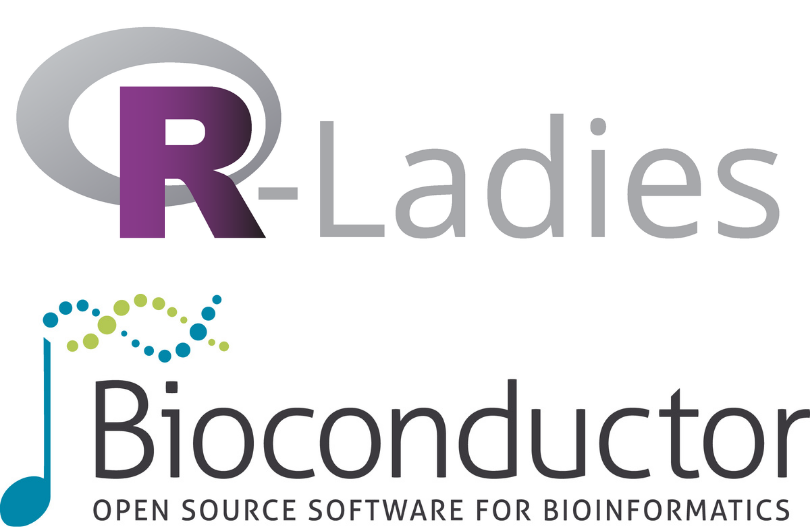

We are excited to share a new collaboration between R-Ladies and Bioconductor, two global communities committed to building diverse developer communities around the world.

[R-Ladies](http://rladies.org) is a worldwide organization whose mission is to promote gender diversity in the R community.
R-Ladies Global started in 2016 and has expanded to more than 200 chapters across 60+ countries worldwide, with 100K+ members.
R-Ladies chapters work alongside other like-minded communities at local, regional, and global levels.

[Bioconductor](https://www.bioconductor.org/) develops, supports, and disseminates free open-source software that facilitates rigorous and reproducible analysis of data from current and emerging biological assays.
The organization is dedicated to building a diverse, collaborative, and welcoming community of developers and data scientists.
To this end, they have periodically elected [scientific](https://bioconductor.org/about/scientific-advisory-board/), [technical](https://bioconductor.org/about/technical-advisory-board/), and [community](https://bioconductor.org/about/community-advisory-board/) advisory boards committed to the technical and community aspects of Bioconductor.

We are excited to begin a new initiative that aims to connect R-Ladies members who are also Bioconductor users or developers.
This effort is designed as a key step towards bringing together passionate individuals committed to expanding diversity in the computational biology and bioinformatics developer space.
This coincidence of interest between members of both communities has already manifested in several R-Ladies chapters organizing events related to Bioinformatics and several R-Ladies members being part of the Bioconductor community.

This announcement formalizes this spontaneous collaboration between the two communities.
Here are a few concrete ways in which we want to get the ball rolling:

- Share and promote events of mutual interest.
- Jointly host events about bioinformatics/computational biology with local R-Ladies Chapters, benefiting both parties.
- Promote R-Ladies local watch parties of live-casted or pre-recorded events and professional networking events for Bioconductor conferences (using content from BioC: BioC North America, BioCAsia, EuroBioC).
- Highlight Bioconductor speakers at R + computational biology R-Ladies events across chapters; similarly, highlight R-Ladies, who are interested in computational biology and developing Bioconductor packages, at BioC events.
- Have a new idea for collaboration between R-Ladies and Bioconductor that you don't see here? Please reach out to us!

**Get Involved**

Excited to join us in this initiative?
Here's how you can get started:

- Learn more about and partake in our joint initiative at the [Bioconductor Working Group page](https://workinggroups.bioconductor.org/currently-active-working-groups-committees.html#r-ladies-and-bioc): this group is for Bioconductor members to learn about R-Ladies and how to get in contact with the community.
- Join #rladies channel in [Bioconductor Slack](https://slack.bioconductor.org/) to stay updated and connect with the community.
- Join the [R-Ladies Community Slack](https://guide.rladies.org/comm/slack/) to engage with the global R community (open to women and other gender minorities).

We recently kicked off this journey with local networking in R-Ladies chapters worldwide (e.g., [Aurora, Colorado](https://www.meetup.com/rladies-aurora/events/302185687/)) and an R-Ladies meetup in Michigan during BioC 2024, co-hosted with [R-Ladies East Lansing](https://www.meetup.com/rladies-east-lansing/events/302185529/) (Michigan)!

We're looking forward to building something great together.
Let us know what you think, share your ideas, or just say hi!

