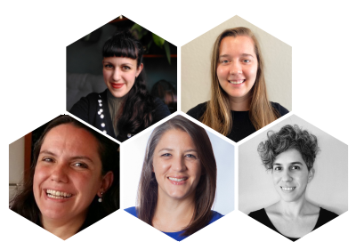

R-Ladies a commencé par une rencontre en 2012 et est devenue une organisation mondiale en 2016.
Depuis sa création, l'organisation R-Ladies Global repose à 100 % sur le bénévolat de personnes et de sections dans le monde entier.
L'organisation est construite sur des couches de soutien - [l'équipe dirigeante mondiale, l'équipe mondiale élargie](/about-us/team/) les organisateurs des sections locales et les membres de la communauté - qui donnent tous de leur temps et de leurs efforts pour soutenir la mission de promotion de la diversité des genres dans la communauté R.

Erin LeDell (États-Unis), Claudia Vitolo (Italie) et Hannah Frick (Angleterre), qui font partie de l'équipe dirigeante depuis la création de l'organisation mondiale en 2016, se retirent maintenant.
Au cours des six dernières années, les R-Ladies ont connu une croissance considérable en termes de membres de la communauté et de portée dans le monde entier.
Plus récemment, les R-Ladies ont survécu et prospéré pendant la pandémie en s'orientant vers des réunions en ligne, ce qui a permis le partage des connaissances et l'engagement de la communauté au sein des chapitres et entre les chapitres.
Nous sommes éternellement reconnaissantes à Erin, Claudia et Hannah pour leurs conseils avisés, soutenus par les nombreux bénévoles à tous les niveaux de l'organisation.

Nous sommes extrêmement heureux d'annoncer le passage du flambeau à la nouvelle équipe de direction mondiale : Athanasia Monika Mowinckel (Norvège), Yanina Bellini Saibene (Argentine), Shannon Pileggi (États-Unis), Riva Quiroga (Chili) et Averi Giudicessi (États-Unis).
Nous sommes reconnaissants à Yanina et à Saranjeet Kaur Bhogal (Inde), ainsi qu'à l'équipe dirigeante sortante, pour le travail accompli afin d'assurer une transition en douceur.
Nous sommes attachées à la mission de R-Ladies Global qui consiste à encourager, inspirer et responsabiliser les personnes appartenant à des minorités sexuelles dans la communauté R, et nous sommes honorées de servir l'organisation mondiale à ce titre.
Nous nous engageons également à rester fidèles aux promesses faites par l'équipe dirigeante sortante et à perpétuer leur héritage au mieux de nos capacités.

<small>Nouvelle direction de R-Ladies global (de haut en bas à gauche) Athanasia Monika Mowinckel, Averi Giudicessi, Yanina Bellini Saibene, SHannon Pileggi, Riva Quiroga</small>

Erin LeDell, Claudia Vitolo, Hannah Frick, Athanasia Monika Mowinckel, Yanina Bellini Saibene, Shannon Pileggi, Riva Quiroga et Averi Giudicessi.

