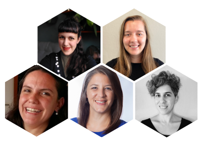

A R-Ladies começou por ser um encontro em 2012 e tornou-se uma organização global em 2016.
Desde o início, a organização R-Ladies Global tem sido gerida com 100% de esforço voluntário de indivíduos e capítulos em todo o mundo.
A organização é construída sobre camadas de apoio - [a equipa de liderança global, a equipa global mais alargada](/about-us/team/) organizadores de capítulos locais e membros da comunidade - todos doam o seu tempo e esforço para sustentar a missão de promover a diversidade de género na comunidade R.

Tendo feito parte da equipa de liderança desde o início da organização global em 2016, Erin LeDell (Estados Unidos), Claudia Vitolo (Itália) e Hannah Frick (Inglaterra) estão agora a deixar o cargo.
Nos últimos seis anos, o R-Ladies experimentou um tremendo crescimento em membros da comunidade e alcance em todo o mundo.
Nos anos mais recentes, o R-Ladies sobreviveu e prosperou durante a pandemia, passando a participar em encontros online, o que permitiu a partilha de conhecimentos e o envolvimento da comunidade dentro e entre capítulos.
Estamos eternamente gratas a Erin, Claudia e Hannah pela sua orientação atenciosa, apoiada pelos muitos voluntários a todos os níveis da organização.

É com enorme entusiasmo que anunciamos a passagem do testemunho à nova Equipa de Liderança Global: Athanasia Monika Mowinckel (Noruega), Yanina Bellini Saibene (Argentina), Shannon Pileggi (Estados Unidos), Riva Quiroga (Chile) e Averi Giudicessi (Estados Unidos).
Estamos gratos à Yanina e à Saranjeet Kaur Bhogal (Índia), bem como à equipa de liderança que partiu, pelo seu trabalho para assegurar uma transição suave.
Estamos empenhadas na missão do R-Ladies Global de encorajar, inspirar e capacitar as pessoas de géneros minoritários na comunidade R e sentimo-nos honradas por servir a organização global nesta capacidade.
Estamos também empenhadas em manter-nos fiéis às promessas feitas pela equipa de liderança que partiu e em continuar o seu legado da melhor forma possível.

<small>Nova liderança do R-Ladies global (a partir do canto superior esquerdo) Athanasia Monika Mowinckel, Averi Giudicessi, Yanina Bellini Saibene, SHannon Pileggi, Riva Quiroga</small>

Erin LeDell, Claudia Vitolo, Hannah Frick, Athanasia Monika Mowinckel, Yanina Bellini Saibene, Shannon Pileggi, Riva Quiroga e Averi Giudicessi

