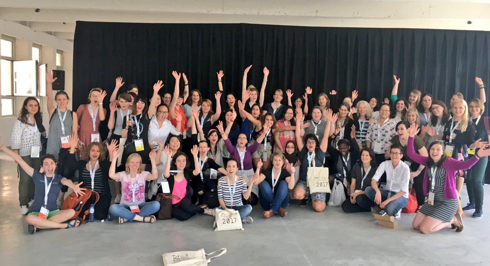

Estamos encantados de anunciar el lanzamiento de nuestro nuevo sitio web R-Ladies.

Ha sido un largo viaje, con muchas personas involucradas, y estamos felices de poder finalmente compartir con ustedes este nuevo sitio y algunos nuevos contenidos.

<-más

El Equipo de Liderazgo y Global de R-Ladies quiere expresar nuestra más sincera gratitud a Mo por su increíble trabajo en el desarrollo del nuevo sitio web de R-Ladies.
Mo dedicó muchas horas de trabajo duro e invisible para lograr este importante hito.

Su experiencia técnica ha sido fundamental para llevar este proyecto a buen puerto.
Ha puesto mucho cuidado en crear una interfaz profesional y bonita, pero también en crear flujos de trabajo de actualización sostenibles para humanos y máquinas.
El nuevo sitio web supone una mejora significativa con respecto al anterior, y estamos seguros de que mejorará nuestra capacidad para conectar con nuestra comunidad de R-Ladies de todo el mundo y prestarles servicio.

¡Muchas gracias, Mo!

***

Había algunas cuestiones clave que queríamos resolver con nuestra página web, que no podíamos mantener fácilmente con el sitio Wordpress que teníamos en marcha:

- Sitio web multilingüe: Esto no es lo más fácil de mantener con Wordpress
- Directorio muy lento: La base de datos era demasiado lenta y pesada, el tiempo de carga de las páginas era horrible
- Integrar el blog en el sitio web: El blog era un sitio Blogdown mantenido a través de Github y Netlify
- Mantenimiento y colaboración más fáciles a largo plazo: Wordpress requeriría crear un usuario para cada persona que quisiera contribuir al sitio
  - Cambiar a algo alojado en GitHub facilitaría la ayuda y colaboración de la comunidad.

## Historia

El trabajo ya comenzó en 2019, con Bea Hernández, Daloha Rodríguez-Molina y Maëlle Salmon.
El trabajo inicial consistió en hacer un [blogdown](https://bookdown.org/yihui/blogdown/) que utiliza [Hugo](https://gohugo.io/) y la integración de R markdown.
Era un lugar natural para empezar a portar nuestro sitio Wordpress en algo más común de usar en nuestra comunidad.
Además, el sitio de Wordpress requería cada vez más mantenimiento, y en particular nuestro sitio de [directorio R-Ladies](https://www.rladies.org/directory/) era tan lento que recibíamos informes de personas que no lo utilizaban porque el tiempo de carga de la página era muy largo.

En 2020, yo (Athanasia Mowinckel) me incorporé al equipo del sitio web, inicialmente para mantener el sitio Wordpress mientras se construía el nuevo sitio Hugo.
Al poco tiempo, también empecé a trabajar en el sitio de blogdown.

A mediados de 2020 decidimos que la página web estaba mejor servida como sitio Hugo puro, no como blogdown.
En ese momento, se debió a algunas características de Hugo que no existían en Blogdown (todavía) y que queríamos utilizar para el sitio web.
Se trataba de configuraciones para sitios web multilingües que realmente queríamos aprovechar.
Llegados a este punto, me di cuenta de que quería que toda la columna vertebral de Hugo funcionase para R-Ladies, y eso significaría crear nuestro propio tema personalizado, en lugar de algo prefabricado.

Entonces llegó Covid, y todos [sentimos el estrés de ese período](https://www.rladies.org/news/2020-11-23-reduced-service-note/).
El desarrollo fue lento y las cosas se alargaron.
Afortunadamente, la dirección se puso en contacto conmigo y me preguntó si necesitaba ayuda para colocar las últimas piezas, y que podíamos reservar un poco de presupuesto para contratar ayuda para las piezas de javascript con las que estaba teniendo problemas.

Nos [anunciamos](https://rladies.org/news/2022-03-28-request-for-proposal-javascript-development/) la necesidad, y contratamos [Ben Ubah](https://github.com/benubah)para ayudarme a conseguir las últimas piezas cruciales en su lugar.
Por fin estábamos a punto de terminar.

## ¡Lanzamiento y nuevas funciones!

Ya hemos estrenado el nuevo sitio web y estamos encantados con su funcionamiento.
El tema se adapta bien a nosotros, y el contenido es mucho más fácil de manejar ahora que podemos colaborar a través de GitHub.
También ha hecho posible integrar el sitio web con algunas otras canalizaciones automáticas, ¡lo que nos permite disponer de un par de funciones nuevas respecto al sitio web anterior!

- [Página de eventos](https://www.rladies.org/activities/events/) con un calendario de eventos de R-Ladies: Estos se obtienen diariamente de meetup a través de su API
- [Página del directorio](https://www.rladies.org/directory/) que es realmente rápido!: Actualizado y mantenido en otro repositorio privado con integración Airtable
- [Blog](https://www.rladies.org/blog/) donde son bienvenidas las contribuciones y los mensajes cruzados: Nos encantaría que nuestra comunidad reviviera el blog y lo utilizara para mostrar sus habilidades y las cosas divertidas que hacen con R.
- [Página de noticias](https://www.rladies.org/news/) donde el equipo de R-Ladies Global puede anunciar avisos importantes sobre la gobernanza global de nuestra comunidad.

Y mucho más.

## Trabajos futuros y petición de ayuda a la comunidad

Todavía hay algunas cosas en las que estamos trabajando en segundo plano, que esperamos mejoren la experiencia de nuestro sitio web, y también cumplan obligaciones que hemos prometido anteriormente.
Tenemos un [wiki del sitio web](https://github.com/rladies/rladies.github.io/wiki) con más información sobre la configuración del sitio web y cómo se puede contribuir a él.

### Página web multilingüe

Hemos configurado el sitio web para que sea multilingüe, y tenemos algunos contenidos de desarrollo para francés, español y portugués.
Sin embargo, aún queda un largo camino por recorrer antes de llegar a un punto en el que estos idiomas estén lo suficientemente bien traducidos y se haya traducido suficiente contenido, para que el idioma se publique en el sitio web de producción.
Además, suponemos que una vez que empecemos a tener más contenido traducido, veremos áreas en las que el código necesita ser corregido para un soporte multilingüe adecuado.

Esperamos que con la ayuda de la comunidad podamos hacer un esfuerzo para cubrir los principales idiomas utilizados por nuestra comunidad.
El wiki del sitio web tiene su propia sección para [contribuir a las traducciones del sitio](https://github.com/rladies/rladies.github.io/wiki/Adding-a-new-language).
Es probable que haya que mejorarla para que sea más explícita en cuanto a las necesidades, pero esperamos que sirva de guía de partida.

### Mejoras en el directorio

#### Actualización de entradas

El directorio ha sido portado desde Wordpress con algunas secuencias de comandos bastante elaborados y hacky para obtener el contenido de trabajo para nuestro nuevo sitio web.
Esto significa, que para muchas de las entradas, el contenido se ve extraño y fuera de lugar en el nuevo sitio web.
La mejor manera de actualizar su propia entrada en el directorio, es localizar su entrada y rellenar el formulario [formulario](https://airtable.com/shr54Z3BqfRJqypZ7) para actualizar el directorio.
¡Así podremos crear un directorio mejor y más unificado para todos!

#### Mejor búsqueda / filtrado

Actualmente, utilizamos una búsqueda difusa para el directorio.
Aunque esto ayuda un poco, puede dar resultados extraños y puede ser difícil encontrar exactamente lo que buscas.

Estamos trabajando para mejorar las funciones de búsqueda y filtrado del directorio, y si tiene alguna sugerencia sobre cómo le gustaría buscar en él, podemos ayudarle. [valoramos su aportación](https://github.com/rladies/rladies.github.io/issues).

### Añadir nuevas páginas

Hay bastantes páginas en las que estamos deseando empezar a trabajar, para poder ofrecer la mejor información disponible a nuestra comunidad y a los financiadores.
Prometimos ciertos recursos en nuestro [BML](https://rladies.org/news/2020-06-06-blm/) y somos muy conscientes de que aún no lo hemos cumplido.
Además, sabemos que nuestros financiadores quieren periódicamente resúmenes de nuestras actividades, y queremos hacer una página dedicada a este tipo de información.

Si hay páginas que cree que deberían existir [háganoslo saber](https://github.com/rladies/rladies.github.io/issues) y estudiaremos sus propuestas.

## Reflexiones finales del principal promotor

Para mí ha sido un viaje increíble trabajar en este sitio web.
He aprendido mucho y estoy encantado de que por fin vea la luz.
Estoy deseando que siga desarrollándose, y dentro de poco anunciaremos que necesitamos nuevos miembros para el equipo del sitio web, que me ayuden con las traducciones, a revitalizar el blog y a ocuparme del mantenimiento general del nuevo sitio.

