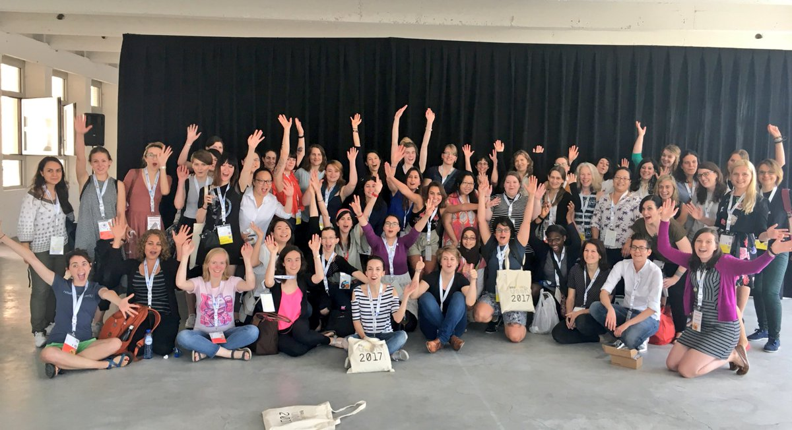

Nous sommes ravis d'annoncer la mise en ligne de notre nouveau site web R-Ladies !

Ce fut un long voyage, avec de nombreuses personnes impliquées, et nous sommes heureux de pouvoir enfin partager avec vous ce nouveau site et son nouveau contenu.

<!--more-->

La direction et l'équipe mondiale des R-Ladies tiennent à exprimer leur sincère gratitude à Mo pour son incroyable travail de développement du nouveau site web des R-Ladies.
Mo a consacré de nombreuses heures de travail acharné et invisible à la réalisation de cette étape importante.

Son expertise technique a été déterminante dans la réalisation de ce projet.
Elle a consacré beaucoup d'attention à la création d'une interface professionnelle et esthétique, mais aussi à la création de flux de travail de mise à jour durables pour les humains et les machines.
Le nouveau site web est une amélioration significative par rapport au précédent, et nous sommes sûrs qu'il améliorera notre capacité à nous connecter avec et à servir notre communauté de R-Ladies dans le monde entier.

Merci beaucoup, Mo !

***

Nous voulions résoudre certains problèmes clés concernant notre page web, que nous ne pouvions pas facilement gérer avec le site Wordpress que nous avions :

- Site web multilingue : Ce n'est pas le plus facile à gérer avec Wordpress.
- Répertoire très lent : La base de données était tout simplement trop lente et trop lourde, le temps de chargement des pages était horrible.
- Intégrer le blog dans le site web : Le blog était un site Blogdown maintenu par Github et Netlify.
- Faciliter la maintenance et la collaboration à long terme : Wordpress aurait nécessité la création d'un utilisateur pour chaque personne souhaitant contribuer au site.
  - Le passage à un site hébergé sur GitHub faciliterait l'aide et la collaboration de la communauté.

## L'histoire

Le travail a déjà commencé en 2019, avec Bea Hernandez, Daloha Rodríguez-Molina et Maëlle Salmon.
Le travail initial a consisté à réaliser un [blogdown](https://bookdown.org/yihui/blogdown/) qui utilise la technologie [Hugo](https://gohugo.io/) et l'intégration de R markdown.
C'était un endroit naturel pour commencer à porter notre site Wordpress vers quelque chose de plus commun à utiliser dans notre communauté.
En outre, le site Wordpress nécessitait de plus en plus de maintenance, et en particulier notre site [répertoire R-Ladies](https://www.rladies.org/directory/) était si lent que nous recevions des rapports de personnes qui ne l'utilisaient pas en raison du temps de chargement de la page !

En 2020, je (Athanasia Mowinckel) ai été intégrée à l'équipe du site web, initialement pour maintenir le site Wordpress pendant que le nouveau site Hugo était en cours de construction.
Peu de temps après, j'ai également commencé à travailler sur le site blogdown.

Au milieu de l'année 2020, nous avons décidé que la page web était mieux servie en tant que site Hugo pur, et non en tant que blogdown.
À ce moment-là, c'était dû au fait que certaines fonctionnalités d'Hugo n'existaient pas (encore) dans Blogdown et que nous voulions les utiliser pour le site web.
Il s'agissait de paramètres pour les sites web multilingues dont nous voulions vraiment tirer parti.
A ce stade, j'ai réalisé que j'étais très investi dans la mise en place de l'ossature Hugo pour R-Ladies, et que cela signifiait créer notre propre thème personnalisé, plutôt que quelque chose de préfabriqué.

Puis Covid est arrivé, et nous avons tous [avons tous ressenti le stress de cette période](https://www.rladies.org/news/2020-11-23-reduced-service-note/).
Le développement était lent et les choses traînaient en longueur.
Heureusement, la direction m'a contacté et m'a demandé si j'avais besoin d'aide pour mettre en place les derniers éléments, et si nous pouvions mettre de côté un petit budget pour embaucher de l'aide pour les éléments javascript avec lesquels je me débattais.

Nous avons [avons annoncé](https://rladies.org/news/2022-03-28-request-for-proposal-javascript-development/) le besoin, et nous avons embauché [Ben Ubah](https://github.com/benubah)pour m'aider à mettre en place les dernières pièces cruciales.
Enfin, nous étions sur le point d'achever le projet !

## Version et nouvelles fonctionnalités !

Nous avons lancé le nouveau site web et nous sommes ravis de son fonctionnement jusqu'à présent !
Le thème nous convient parfaitement et le contenu est beaucoup plus facile à gérer maintenant que nous pouvons collaborer via GitHub.
Il a également été possible d'intégrer le site web à certains autres pipelines automatiques, ce qui nous permet d'avoir quelques nouvelles fonctionnalités sur le site web par rapport à avant !

- [Page des événements](https://www.rladies.org/activities/events/) avec un calendrier des événements R-Ladies : Ceux-ci sont récupérés quotidiennement de meetup via leur API.
- [Page de l'annuaire](https://www.rladies.org/directory/) qui est en fait rapide ! Mise à jour et maintenance dans un autre dépôt privé avec intégration d'Airtable
- [Blog](https://www.rladies.org/blog/) où nous accueillons volontiers les contributions et les messages croisés : Nous aimerions voir le blog revivre et être utilisé par notre communauté pour montrer leurs compétences et les choses amusantes qu'ils font avec R !
- [Page d'actualités](https://www.rladies.org/news/) où l'équipe de R-Ladies Global peut annoncer des avis importants sur la gouvernance globale de notre communauté.

Et bien d'autres choses encore !

## Travaux futurs et appel à l'aide de la communauté

Nous travaillons encore sur certaines choses en arrière-plan, qui, nous l'espérons, amélioreront l'expérience de notre site web et rempliront les obligations que nous avons promises précédemment.
Nous avons un [wiki du site web](https://github.com/rladies/rladies.github.io/wiki) avec plus d'informations sur la mise en place du site web, et sur la façon dont les gens peuvent contribuer au site.

### Page web multilingue

Nous avons configuré le site web de manière à ce qu'il soit multilingue et nous avons développé du contenu pour le français, l'espagnol et le portugais.
Mais il reste encore un long chemin à parcourir avant que ces langues soient suffisamment bien traduites et que suffisamment de contenu ait été traduit pour que la langue soit publiée sur le site web de production.
Nous supposons également qu'une fois que nous aurons commencé à traduire davantage de contenu, nous verrons les domaines où le code doit être corrigé pour assurer une prise en charge multilingue adéquate.

Nous espérons qu'avec l'aide de la communauté, nous pourrons nous efforcer de couvrir les principales langues utilisées par notre communauté.
Le wiki du site a sa propre section pour [contribuer à la traduction des langues du site](https://github.com/rladies/rladies.github.io/wiki/Adding-a-new-language).
Il est probable qu'il faille le retravailler pour qu'il soit plus explicite sur les besoins, mais nous espérons qu'il constitue un guide de départ.

### Améliorations de l'annuaire

#### Mise à jour des entrées

L'annuaire a été transféré de Wordpress avec des scripts plutôt élaborés et difficiles à mettre en place pour que le contenu fonctionne sur notre nouveau site web.
Cela signifie que pour un grand nombre d'entrées, le contenu est bizarre et n'a pas sa place sur le nouveau site web.
La meilleure façon de mettre à jour votre propre entrée dans l'annuaire est de la localiser et de remplir le formulaire de mise à jour. [formulaire](https://airtable.com/shr54Z3BqfRJqypZ7) pour la mise à jour de l'annuaire.
De cette façon, nous pourrons créer un annuaire meilleur et plus unifié pour tous !

#### Meilleure recherche / filtrage

Actuellement, nous utilisons une recherche floue pour l'annuaire.
Bien que cela soit utile, cela peut donner des résultats bizarres et il peut être difficile de trouver exactement ce que l'on cherche.

Nous travaillons à l'amélioration des fonctions de recherche et de filtrage de l'annuaire et si vous avez des suggestions sur la manière dont vous aimeriez effectuer des recherches, nous vous en remercions. [votre contribution nous est précieuse.](https://github.com/rladies/rladies.github.io/issues).

### Ajouter de nouvelles pages

Nous avons hâte de commencer à travailler sur certaines pages afin de fournir les meilleures informations possibles à notre communauté et aux bailleurs de fonds.
Nous avons promis certaines ressources dans notre [BML](https://rladies.org/news/2020-06-06-blm/) et nous sommes tout à fait conscients que nous n'avons pas encore rempli cette promesse.
Par ailleurs, nous savons que nos bailleurs de fonds veulent régulièrement des résumés de nos activités, et nous voulons créer une page dédiée à ce type d'informations.

S'il y a des pages qui, selon vous, devraient exister, [n'hésitez pas à nous le faire savoir](https://github.com/rladies/rladies.github.io/issues) et nous étudierons vos propositions.

## Dernières réflexions du développeur principal

Travailler sur ce site web a été pour moi une expérience extraordinaire.
J'ai beaucoup appris et je suis ravi de le voir enfin "en ligne".
J'attends avec impatience la poursuite du développement, et nous annoncerons bientôt que nous avons besoin de nouveaux membres pour l'équipe du site web, afin de m'aider dans les efforts de traduction, de revitaliser le blog et de prendre en charge la maintenance générale du nouveau site web.

