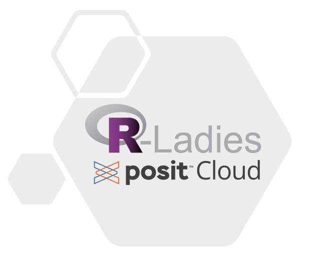

# TL; DR

R-Ladies now has a Posit Cloud account available for R-Ladies meet-ups.

# Overview of Posit Cloud

[Posit Cloud](https://posit.cloud/) is an online platform from Posit that allows
users to work on data science projects without requiring software installation on
personal computers. This is a particularly attractive option for R-Ladies workshops
as creators of a Posit Cloud space can ensure all workshop attendees are using the
same version of both R and R packages, as well as create a directory with files to work from.

# Partnership

We are thrilled to share that Posit has partnered with R-Ladies to offer a
Posit Cloud account free of charge for R-Ladies meet-ups.

# How to request access

Please follow the [Posit Cloud section of the
R-Ladies guide](https://guide.rladies.org/organization/tech/accounts/#posit-cloud) to request access.

# Considerations

Posit Cloud could be a wonderful addition to your R-Ladies meet-ups! Posit Cloud
would be best suited for workshop style meet-ups where participants are encouraged
to actively submit code or do exercises.

Use of Posit Cloud requires both administrators of the Posit Cloud space and
workshop participants to have a Posit Cloud account. This may require
a bit of extra time to get started as users may need to create an account.

There are limits to the computing capacity of the Posit Cloud account. We haven't
tested the boundaries, but be aware that computationally heavy workshops could
possibly have slow performance.
