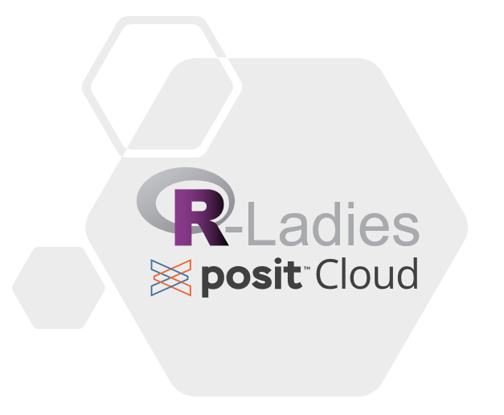

# TL ; DR

R-Ladies a maintenant un compte Posit Cloud disponible pour les réunions R-Ladies.

# Aperçu de Posit Cloud

[Posit Cloud](https://posit.cloud/) est une plateforme en ligne de Posit qui permet aux utilisateurs de travailler sur des projets de science des données sans nécessiter l'installation d'un logiciel sur leur ordinateur personnel.
Il s'agit d'une option particulièrement intéressante pour les ateliers R-Ladies, car les créateurs d'un espace Posit Cloud peuvent s'assurer que tous les participants à l'atelier utilisent la même version de R et des packages R, et créer un répertoire avec des fichiers à partir desquels travailler.

# Partenariat

Nous sommes ravis de vous annoncer que Posit s'est associé à R-Ladies pour offrir un compte Posit Cloud gratuit pour les rencontres R-Ladies.

# Comment demander l'accès

Veuillez suivre le [section Posit Cloud de la
guide R-Ladies](https://guide.rladies.org/organization/tech/accounts/#posit-cloud) pour demander l'accès.

# Considérations

Posit Cloud pourrait être un excellent complément à vos réunions R-Ladies !
Posit Cloud conviendrait mieux aux réunions de type atelier où les participantes sont encouragées à soumettre activement du code ou à faire des exercices.

L'utilisation de Posit Cloud nécessite que les administrateurs de l'espace Posit Cloud et les participants à l'atelier aient un compte Posit Cloud.
Cela peut nécessiter un peu plus de temps pour démarrer, car les utilisateurs doivent créer un compte.

La capacité de calcul du compte Posit Cloud est limitée.
Nous n'avons pas testé les limites, mais sachez que les ateliers lourds en calcul pourraient avoir des performances lentes.
