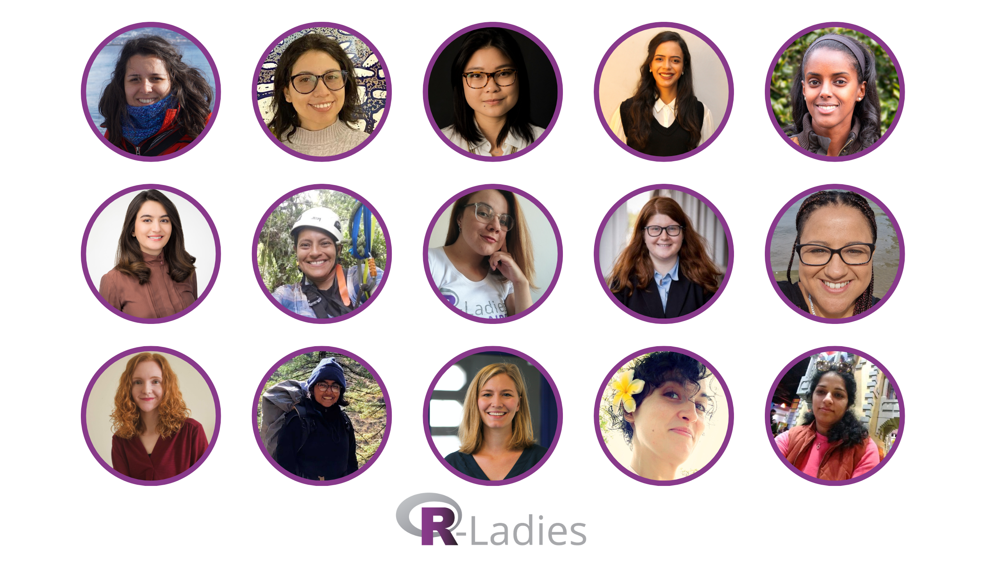
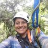
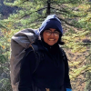

<!---
lien vers le ppt qui contient cette image sur le compte google de rladies
https://docs.google.com/presentation/d/1ZnCmaO_gBSKSbtx_1tTicQSxnTJZaYGc/edit#slide=id.p1
-->

# Vue d'ensemble

En 2023, nous [annoncé des ouvertures](https://rladies.org/news/2023-04-11-global-team-recruiting/) pour des rôles au sein de l'équipe mondiale R-Ladies qui soutiennent les efforts organisationnels et facilitent la croissance de la communauté R-Ladies.
Nous sommes ravies d'accueillir 15 nouveaux membres au sein de l'équipe mondiale R-Ladies.
R-Ladies est une organisation 100 % bénévole et nous sommes très reconnaissantes envers celles qui nous soutiennent en consacrant leur temps et leurs efforts à la défense de nos objectifs. [mission](https://rladies.org/about-us/mission/).

# Les nouveaux membres

| | | |
| | ------------------------- | ------------------ |
|  | Glenda Mendieta | Traduction |
|  | Nicola Rennie | Campagnes |
|  | Code de conduite - Sara Acevedo - Code de conduite - Sara Acevedo
|  | Hebah Bukhari | Communauté Slack |
|  | Priyanka Gagneja - Communauté Slack - Communauté Slack - Communauté Slack - Communauté Slack - Communauté Slack - Communauté Slack - Communauté Slack - Communauté Slack
|  | Renata Hirota | Blog
|  | Virginia A. García Alonso - Mentorat - Blogs
|  | Mentorat pour les jeunes - Nic Crane - Meetup Pro
|  | Alyssa Columbus - Onboarding des chapitres - Alyssa Columbus - Onboarding des chapitres - Alyssa Columbus - Onboarding des chapitres
|  | Luana Atunes | Révision des résumés
|  | Sayantika Banik - Résumé de l'étude de cas
|  | Cosima Meyer | Site web |
|  | Andrea Gómez Vargas - Site web - Site web - Site web - Site web - Site web - Site web - Site web - Site web - Site web - Site web
|  | Leena El Seed | Liaison avec la conférence
|  | Daniela Vázquez | Médias sociaux

# Besoins en matière d'onboarding

Entre 2020 et 2023, le nombre de membres de l'organisation mondiale R-Ladies a augmenté alors que la disponibilité des bénévoles est restée limitée.
À la fin de cette période, plusieurs membres de l'équipe mondiale ont pris leur retraite.
Nous leur sommes redevables des efforts qu'ils ont déployés pour aider l'organisation à prospérer et nous leur sommes reconnaissants du temps qu'ils ont passé au sein de l'équipe mondiale.

Au fur et à mesure du changement de bénévoles, de nouvelles équipes et structures d'équipe ont été identifiées afin de répartir la charge de travail et d'assurer la couverture des rôles lorsque les bénévoles ne sont pas disponibles.
Les nouveaux membres de l'équipe mondiale sont essentiels pour soutenir et développer notre communauté.

# Processus d'intégration

Grâce à ces nouveaux membres extraordinaires, nous avons également pu mettre au point un nouveau système d'intégration pour l'équipe mondiale.
En utilisant les actions et les problèmes GitHub, nous espérons que le processus d'intégration sera plus rationnel à l'avenir.
Bien que les nouveaux membres actuels aient fait l'expérience de ce système à ses débuts, nous espérons que le processus sera plus fluide pour les futurs membres.

# Ce que l'avenir nous réserve

Nous sommes impatients de voir ce que l'avenir réserve à R-Ladies avec ces nouveaux membres de l'équipe mondiale.
L'arrivée de nouvelles personnes, avec des idées et des perspectives nouvelles, nous aidera à continuer à grandir et à nous améliorer en tant qu'organisation.
Nous nous réjouissons de travailler avec ces nouveaux membres et nous espérons que vous vous joindrez à nous pour leur souhaiter la bienvenue au sein de l'équipe mondiale !

Vous pouvez consulter une vue d'ensemble de l'équipe mondiale à l'adresse suivante [À propos -> Rencontrer l'équipe mondiale](/about-us/global-team/).

