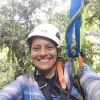
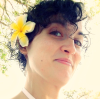

<!---
ligação para o ppt que contém esta imagem na conta google de rladies
https://docs.google.com/presentation/d/1ZnCmaO_gBSKSbtx_1tTicQSxnTJZaYGc/edit#slide=id.p1
-->

# Visão geral

Em 2023 [anunciámos aberturas](https://rladies.org/news/2023-04-11-global-team-recruiting/) para funções na Equipe Global R-Ladies que apoiam os esforços organizacionais e facilitam o crescimento da comunidade R-Ladies.
Temos o prazer de dar as boas-vindas a 15 novos membros da Equipa Global da R-Ladies.
A R-Ladies é 100% voluntária, e estamos muito gratos àqueles que nos apoiam com seu tempo e esforço para defender nossa [missão](https://rladies.org/about-us/mission/).

# Novos membros

| | | |
| | ------------------------- | ------------------ |
|  | Glenda Mendieta | Tradução |
|  | Nicola Rennie | Campanhas |
|  | Sara Acevedo | Código de Conduta |
|  | Hebah Bukhari | Comunidade Slack |
|  | Priyanka Gagneja | Comunidade do Slack |
|  | Renata Hirota | Blogue |
|  Virginia A. García Alonso | Mentoring | Mentoria |
|  | Nic Crane | Meetup Pro |
|  | Alyssa Columbus | Integração do Capítulo |
|  | Luana Atunes | Revisão de resumos |
|  | Sayantika Banik | Resenha do Resumo |
|  | Cosima Meyer | Website |
|  | Andrea Gómez Vargas | Sítio Web |
|  | Leena El Seed | Ligação à Conferência |
|  | Daniela Vázquez | Redes Sociais |

# Necessidades de integração

Entre 2020 e 2023, o número de membros da organização global R-Ladies aumentou, mas a disponibilidade de voluntários permaneceu limitada.
No final deste período, vários membros da equipa global reformaram-se.
Estamos gratos pelos seus esforços que ajudaram a organização a prosperar e agradecemos o tempo que passaram na equipa global.

Com a mudança de voluntários, foram identificadas novas equipas e estruturas de equipa para distribuir a carga de trabalho e para cobrir as funções nos períodos em que os voluntários não estão disponíveis.
Os novos membros da equipa global são vitais para ajudar a apoiar e fazer crescer a nossa comunidade.

# Processo de integração

Com estes fantásticos novos membros, conseguimos também desenvolver um novo sistema de integração para a equipa global.
Ao utilizar as acções e questões do GitHub, esperamos que o processo de integração seja mais simplificado no futuro.
Embora os actuais novos membros tenham experimentado este sistema na sua fase inicial, esperamos que seja um processo mais simples para os futuros membros.

# O que o futuro nos reserva

Estamos entusiasmados por ver o que o futuro reserva às R-Ladies com estes novos membros da Equipa Global.
Ter novas pessoas, com novas ideias e perspectivas, ajudar-nos-á a continuar a crescer e a melhorar como organização.
Estamos ansiosas por trabalhar com estes novos membros e esperamos que se junte a nós para lhes dar as boas-vindas à Equipa Global!

Pode ver uma visão geral de toda a equipa global em [Acerca de -> Conheça a Equipa Global](/about-us/global-team/).

