<!---
link to ppt that contains this image on rladies google account
https://docs.google.com/presentation/d/1ZnCmaO_gBSKSbtx_1tTicQSxnTJZaYGc/edit#slide=id.p1
-->

# Overview

In 2023 we [announced openings](/news/2023-04-11-global-team-recruiting/) for roles on the R-Ladies Global Team that support organizational efforts and facilitate the growth of the R-Ladies community.
We are delighted to welcome 15 new members to the R-Ladies Global Team.
R-Ladies is 100% volunteer-driven, and we are very grateful to those who
support us with their time and effort to champion our [mission](/about-us/mission/).

# New members

|                                     |                           |                    |
| ----------------------------------- | ------------------------- | ------------------ |
| 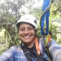        | Glenda Mendieta           | Translation        |
|           | Nicola Rennie             | Campaigns          |
| 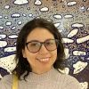           | Sara Acevedo              | Code of Conduct    |
|           | Hebah Bukhari             | Community Slack    |
|        | Priyanka Gagneja          | Community Slack    |
| 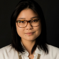          | Renata Hirota             | Blog               |
| 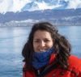 | Virginia A. García Alonso | Mentoring          |
| 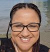              | Nic Crane                 | Meetup Pro         |
| 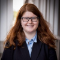        | Alyssa Columbus           | Chapter Onboarding |
| 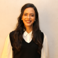           | Luana Atunes              | Abstract Review    |
| 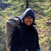        | Sayantika Banik           | Abstract Review    |
| 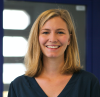           | Cosima Meyer              | Website            |
| 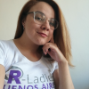    | Andrea Gómez Vargas       | Website            |
|           | Leena El Seed             | Conference Liaison |
| 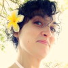        | Daniela Vázquez           | Social Media       |

# Onboarding needs

Between 2020-2023, membership in the R-Ladies global organization increased
while the availability of volunteers remained limited. At the conclusion of this
time period several global team members retired. We are indebted for their
efforts that helped the organization thrive and grateful for their time spent
on the global team.

As the shift in volunteers occurred, new teams and team structures were identified
to distribute the workload as well as to provide coverage of roles for times when
volunteers are unavailable. The new members of the global team are vital to
help support and grow our community.

# Onboarding process

With these amazing new members, we have also been able to develop
a new onboarding system for the global team. By using GitHub actions
and issues, we hope that the onboarding process will be more streamlined
in the future. While the current new members did experience this system in its infancy,
we hope that it will be a smoother process for future members.

# What the future holds

We are excited to see what the future holds for R-Ladies with these new
members of the Global Team. Having new people, with fresh ideas and
perspectives, will help us to continue to grow and improve as an organization.
We are looking forward to working with these new members, and we hope
that you will join us in welcoming them to the Global Team!

You can see an overview of the entire global team at [About -> Meet the Global Team](/about-us/global-team/).
