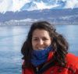
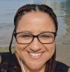
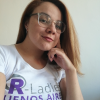

<!---
link to ppt that contains this image on rladies google account
https://docs.google.com/presentation/d/1ZnCmaO_gBSKSbtx_1tTicQSxnTJZaYGc/edit#slide=id.p1
-->

# Visión general

En 2023 [anunciamos aperturas](https://rladies.org/news/2023-04-11-global-team-recruiting/) para puestos en el Equipo Global de R-Ladies que apoyan los esfuerzos organizativos y facilitan el crecimiento de la comunidad de R-Ladies.
Nos complace dar la bienvenida a 15 nuevos miembros del R-Ladies Global Team.
R-Ladies está impulsada al 100% por voluntarios, y estamos muy agradecidos a quienes nos apoyan con su tiempo y esfuerzo para defender nuestra causa. [misión](https://rladies.org/about-us/mission/).

# Nuevos miembros

| | | |
| | ------------------------- | ------------------ |
|  | Glenda Mendieta | Traducción |
|  | Nicola Rennie Campañas
|  | Sara Acevedo Código de conducta
|  | Hebah Bukhari | Comunidad Slack |
|  | Priyanka Gagneja (Community Slack)
|  | Renata Hirota | Blog |
|  | Virginia A. García Alonso | Mentoría |
|  | Nic Crane | Meetup Pro |
|  | Alyssa Columbus | Chapter Onboarding |
|  | Luana Atunes Revisión de resúmenes
|  | Sayantika Banik Reseña del resumen
|  | Cosima Meyer | Sitio web |
|  | Andrea Gómez Vargas Sitio web
|  | Leena El Seed Enlace con la Conferencia
|  | Daniela Vázquez | Medios Sociales |

# Necesidades de integración

Entre 2020 y 2023, el número de miembros de la organización mundial R-Ladies aumentó, mientras que la disponibilidad de voluntarios siguió siendo limitada.
Al final de este periodo, varios miembros del equipo mundial se jubilaron.
Estamos en deuda por sus esfuerzos que ayudaron a la organización a prosperar y agradecidos por el tiempo que pasaron en el equipo global.

A medida que se producía el cambio de voluntarios, se identificaron nuevos equipos y estructuras de equipo para distribuir la carga de trabajo, así como para cubrir las funciones en los momentos en que los voluntarios no estuvieran disponibles.
Los nuevos miembros del equipo global son vitales para ayudar a apoyar y hacer crecer nuestra comunidad.

# Proceso de incorporación

Con estos increíbles nuevos miembros, también hemos podido desarrollar un nuevo sistema de incorporación para el equipo global.
Mediante el uso de acciones y problemas de GitHub, esperamos que el proceso de incorporación sea más ágil en el futuro.
Aunque los nuevos miembros actuales experimentaron este sistema en su infancia, esperamos que sea un proceso más fluido para los futuros miembros.

# Lo que nos depara el futuro

Estamos impacientes por ver lo que depara el futuro a R-Ladies con estos nuevos miembros del Equipo Global.
Tener gente nueva, con ideas y perspectivas frescas, nos ayudará a seguir creciendo y mejorando como organización.
Estamos deseando trabajar con estos nuevos miembros y esperamos que se unan a nosotros para darles la bienvenida al Equipo Global.

Puede ver una descripción general de todo el equipo mundial en [Acerca de -> Conozca al equipo mundial](/about-us/global-team/).
