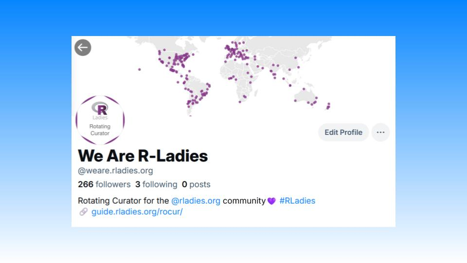

We are absolutely thrilled to announce the R-Ladies Rotating Curation (RoCur) Bluesky account [bsky.app/profile/weare.rladies.org](https://bsky.app/profile/weare.rladies.org) is now live! Each week, a new member of the R-Ladies community will take over the account to talk about all things R. This will be a fantastic opportunity for individuals who identify as a minority gender in the R community to amplify their voices and connect with others in the greater data science community.

## History

Some of you might recall the RoCur account on Twitter. The program ran for about five years, giving over 100 curators the chance to take over the account and share their stories. While the Twitter account is no longer active, the archive of posts can still be viewed [here](https://rladies.org/tweet-archive/wearerladies/).

## How You Can Help

We are excited to revive the RoCur program on Bluesky, picking up where we left off. You can help us build back the community stronger than ever by signing up to be a curator or nominating someone to be a curator!

## Become a Curator

*Are you interested in becoming a curator?* Curating is a great way to share and learn new R techniques, build your social media presence, develop your science communication skills, and connect with a supportive community. We welcome curators of all experiences levels and professional backgrounds. Curation may be conducted in any language; posts are not restricted to English!

Sign up to be a curator on the [\@weare.rladies.org Curator Sign Up Form](https://airtable.com/appjkZZgtF0iEWFjx/pagqsAma1WmUYxa9j/form). We are currently looking for curators until the middle of 2025, and we will open up more spots as the year progresses.

## Nominate Someone

*Do you know someone who would be a great curator?* Perhaps a colleague, someone from your local R-Ladies chapter, or a user you can't get enough of on Bluesky! You can help us identify fantastic curators by nominating them. Submit your nominations on the [\@weare.rladies.org Curator Nomination Form](https://airtable.com/appFIBzsk2AxWlGMt/pagfezjuCxohikOOa/form). You can nominate as many people as you would like, so do not hesitate to share this opportunity.

## Got Questions?

You can visit the [R-Ladies RoCur Guide](https://guide.rladies.org/rocur/about/) to learn more about the initiative. If you have any questions, feel free to reach out to the RoCur admins at [weare\@rladies.org](mailto:weare@rladies.org) or send a message on the **#rocur** channel on the [R-Ladies Community Slack](https://rladies.org/form/community-slack/).
