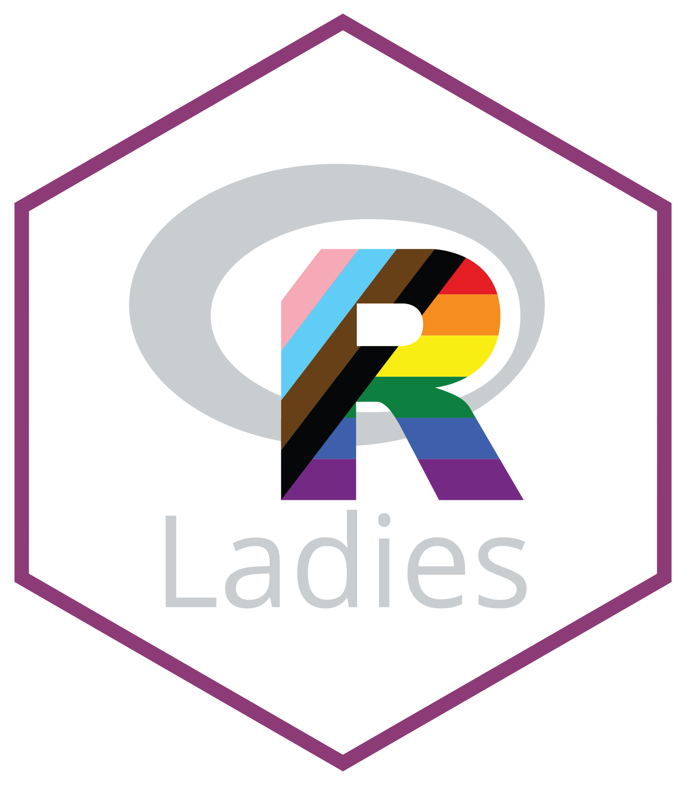

## Background

The [mission of R-Ladies](https://rladies.org/about-us/mission/) is to promote gender diversity in the R community.
The organization aims to support all minority genders, including but not limited to cis/trans women, trans men, non-binary, genderqueer, and agender individuals. 
The organization received feedback that not all minority genders identify with the name "R-Ladies". 
In April of 2024, we, the R-Ladies Global Leadership Team, opened the [“Re-branding from R-Ladies to R-Ladies+” GitHub issue](https://github.com/rladies/community/issues/10) to address the organization’s need to be more explicit about our mission to serve underrepresented gender minorities beyond cis-women while preserving the established identity of our organization and also recognizing global variation in the ability to safely do so.

## Initial Proposal

In an effort to be more inclusive, the Leadership Team solicited community feedback via a GitHub issue on the proposed rebranding from "R-Ladies" to "R-Ladies+". 
The plus symbol was intended to encompass minority genders that do not relate to the term "R-Ladies". 
The GitHub issue encouraged discussion on the pros and cons of such a change, and also welcomed alternative names for consideration.

## Discussion

The GitHub issue remained open from April to November, 2024, allowing community members to participate in a structured timeline. 
Moderators from the R-Ladies global community facilitated the discussion to ensure it remained productive, inclusive, and in accordance with our code of conduct. 
The discussion centered on how the term "Ladies" does not resonate with many individuals the organization aims to serve. 
While "R-Ladies+" served as the primary proposal, the community also suggested other names to better reflect the organization's inclusive mission.
While there was strong consensus on the need for greater inclusivity, members proposed different approaches to achieve this goal. 
Suggestions ranged from updating the visual identity to revising communication strategies and changing the organization's name, all aimed at better representing the community's values.

## Decision

The Leadership Team unanimously agreed that renaming the organization, updating our visual branding, and improving social infrastructure was essential to align with our core values. 
The Leadership Team deliberated between (1) R-Ladies+ or (2) a complete name change. 
It was unanimously decided to move forward with the proposal to rebrand as R-Ladies+. 
Reasons against a complete name change included:

1. There was no consensus from the GitHub member discussion on a single alternative name. 
In addition, many of the proposed names were not readily understood by non-native English speakers. 
As a global organization, a meaningful name across all language contexts is essential.

2. Prior to 2022, there was a large following of the R Community on X (formerly Twitter) which facilitated communication and awareness of R-Ladies activities. 
However, the current social media landscape is fractured among entities such as LinkedIn, Mastodon, Bluesky, Facebook, Instagram, and others. 
A complete name change could cause confusion regarding who we are as an organization.

3. R-Ladies operates in a decentralized manner such that individual chapters have autonomy over their own web presence. 
There would be a risk that chapters could persist under both the R-Ladies name and the new suggested name, creating confusion about the identity of the organization.

4, All who serve this organization are volunteers with limited capacity, including the leadership team, the broader global team, and local chapter leaders. 
A complete name change would require time consuming communications and administrative work for the 200+ existing chapters which would make it difficult to establish a timeline for full name change in the absence of hiring paid services for assistance. 

The rationale in favor of R-Ladies+ includes signaling broader inclusivity while maintaining its well-recognized brand identity. 
In addition to adding "+" in R-Ladies+ to encompass all minority genders, we will create a new visual profile that signals gender inclusivity more clearly, and we hope this will more clearly communicate a brand that aligns with our mission.
While changing from R-Ladies to R-Ladies+ does require administrative work from both the global and local chapter leaders, it could be achieved on independent timelines that accommodate the volunteers' capacity without creating irreconcilable confusion about the identity of the organization.

## Next steps

The global organization will work to develop a new branding package, including a new logo, slide templates, and other imagery, by soliciting the services of a graphic designer ([see Call For Proposal](https://rladies.org/news/rebranding-cfp/)). 
This rebranding effort intends to signal that R-Ladies+ is an organization inclusive of all gender minorities beyond cis-women while preserving its established identity and global recognition. 
This material will also provide all chapter organizers with elements to communicate R-Ladies+ mission and values clearly and align with the global organization, saving them time and effort that can be used in the management of their chapters. 

Upon receipt of the rebranding package, we will also work towards improved social infrastructure via website updates and chapter support that are essential to create the community we aim to serve. 

## Global landscape

As a global organization, we empower local chapter organizers to make decisions to best support their chapter. 
For more discussion on this, see the [posit::conf(2024) talk Balancing Global Infrastructure and Local Autonomy: Lessons from R-Ladies Global](https://www.youtube.com/watch?feature=shared&v=Baoa9Yr6TaM). 
We will encourage local chapter organizers to adopt the new name and visual identity of the organization if the chapter organizer perceives it is safe to do so; we anticipate that chapters located in countries that criminalize LGBTQ+ rights would choose not to adopt the rebranding logo in order to keep their community members safe. 
When the new branding package is available, we will provide more detailed guidance to chapters. 

## Organizational Structure and U.S. Political Landscape

R-Ladies is a 501(c)(3) non-profit organization registered in the state of California in the United States of America. 
The non-profit designation allows us to benefit from tax exemptions on donations as well as free or reduced prices for services that are crucial for our technical infrastructure. 

In recent weeks, the US president has issued abhorrent executive orders against DEI efforts and trans rights at the federal level. 
Our organization does not receive any federal funding, so we are not immediately financially impacted. 
And as of now, we do not perceive a risk of losing our non-profit status.

We believe it is more important now than ever to proceed with rebranding to R-Ladies+ to align our mission with our brand in an effort to create a welcoming and encouraging R community.
Our mission is more important than our non-profit status; if we were to lose it, we would work to identify other means to sustain the organization.
