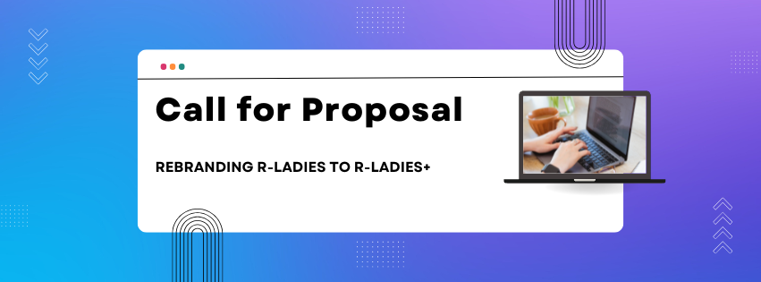

## TL;DR

The R-Ladies global organization is rebranding from R-Ladies to R-Ladies+ in an effort to align our brand with our mission to serve all minority genders in the R community.
We are seeking services to create a new visual profile and brand book for R-Ladies+.

## Call For Proposal (CFP)

R-Ladies invites you to prepare a proposal to accomplish the above task that includes timeline, cost, and deliverables.
The following CFP includes a background of our organization and describes the purpose of the redesign, its desired functionality, and specific requests relating to the proposal.
We understand that details may be subject to change upon vendor recommendation.
In your proposal, please feel free to suggest alternatives where noted.

## Company Background

R-Ladies is a worldwide organisation whose mission is to promote gender diversity in the R community.
The R community suffers from an underrepresentation of minority genders (including but not limited to cis/trans women, trans men, non-binary, genderqueer, agender) in every role and area of participation, whether as leaders, package developers, conference speakers, conference participants, educators, or users (see recent stats).
As a diversity initiative, the mission of R-Ladies is to achieve proportionate representation by encouraging, inspiring, and empowering people of genders currently underrepresented in the R community.
R-Ladies' primary focus, therefore, is on supporting minority gender R enthusiasts to achieve their programming potential, by building a collaborative global network of R leaders, mentors, learners, and developers to facilitate individual and collective progress worldwide.
Please see the news post [R-Ladies is rebranding to R-Ladies+](https://rladies.org/news/rebranding-rladies/) for more details on this specific initiative.

## Goals

We are seeking a completely new brand book to accompany the new R-Ladies+ name.
We envision this involves:

- Brand manual

- Logo redesign

- Google slides template (specifications should be transferable to a quarto template)

- Canva or otherwise infographic template for meetup events

- WeAreLadies infographic template

- Visual imagery of diverse gender minorities for the website or slides

- Certificates \& letterhead

- Social media post templates (BlueSky, Mastodon, LinkedIn, Instagram)

- YouTube templates.

Along with instructions for use and guidelines for chapters on how to adapt logos and other materials for their needs.

## Timeline

| Item                         | Date                   | 
| ---------------------------- | ---------------------- |
| Proposal Submission Deadline | April 15, 2025         | 
| Internal review of proposals | April 16 - May 7, 2025 | 
| Project kickoff              | by June 1, 2025        | 

## Budget

We ask prospective contractors to provide a preliminary budget for their proposal.
This can be provided as hourly rates with estimated amounts of hours to complete the project.
We understand that estimated hours to completion might diverge somewhat from proposal estimates.

## Evaluation criteria

The following will also count positively to any application

- Minority representation (particularly gender and ethnicity)

- History of working with minority communities

- Experience with branding used to convey allyship with trans and other gender minor communities

- Member of the R community

## Submission Instructions

Please submit your proposal via the [R-Ladies Call For Proposal - Rebranding form](https://airtable.com/apphrsts5IruOEGJo/pagmZISNXBiAfDfpC/form).

If you have questions regarding the submission or RFP itself, please send an email to [leadership@rladies.org](mailto:leadership@rladies.org) with "CFP: rebranding" in the subject field.

Thank you!

