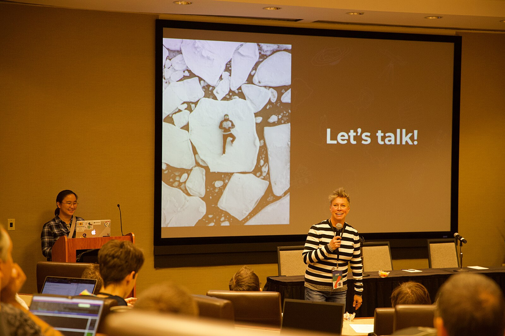

Sabemos lo difícil que puede ser dar el primer paso para hablar en público y presentar un resumen para una conferencia.

Por eso estamos encantados de anunciar el **relanzamiento del sistema de revisión de resúmenes de R-Ladies** ¡!

Nuestro sistema pone en contacto a aspirantes a ponentes con revisores que les proporcionan comentarios y orientación, ayudándoles a perfeccionar sus resúmenes y solicitudes de becas.

**Pie de foto:** Foto de la Conferencia Técnica Wikimedia 2019 por [Darenwelsh](#) tiene licencia bajo [CC BY-SA 4.0](https://creativecommons.org/licenses/by-sa/4.0/). Tomada el 12 de noviembre de 2019.

## Qué hace el sistema de revisión de resúmenes?

Voluntarios con experiencia en hablar en público, redactar resúmenes y presentarlos a conferencias revisarán su trabajo y le ofrecerán orientación constructiva.

Tanto si se trata de tu primer resumen para una conferencia como de una solicitud de beca, estamos aquí para ayudarte a brillar.

## ¿Quién puede beneficiarse?

Este servicio está abierto a cualquier persona de la comunidad de R-Ladies que se disponga a presentarse:

- Resúmenes de conferencias: Para conferencias como posit::conf, EARL, UseR!, JSM, etc.
- Solicitudes de becas: Para oportunidades de asistencia a conferencias y eventos.

## Cómo funciona

Envíe una solicitud: Rellene nuestro formulario en <https://airtable.com/appJadVolZxoDGSIK/pagkXaAIuPged83dn/form> con detalles sobre su resumen o solicitud y el tipo de respuesta que desea.

Asignación del revisor: Le asignaremos un revisor en función de sus necesidades y preferencias.

Recibir comentarios: Recibirá comentarios útiles para perfeccionar su presentación.

Así de fácil.

**Consejo profesional: Envíe su solicitud al menos tres semanas antes de la fecha límite de la conferencia para disponer de tiempo suficiente para su revisión.**

## Nosotros también necesitamos revisores

¿Tiene experiencia en hablar en público, redactar resúmenes o hacer revisiones?
Considere la posibilidad de unirse a nuestro increíble equipo de revisores.
El voluntariado es una forma flexible y gratificante de apoyar nuestra misión y devolver algo a la comunidad.
Inscríbete [aquí](https://airtable.com/appJadVolZxoDGSIK/pag4bpfeGIATQFefk/form).
