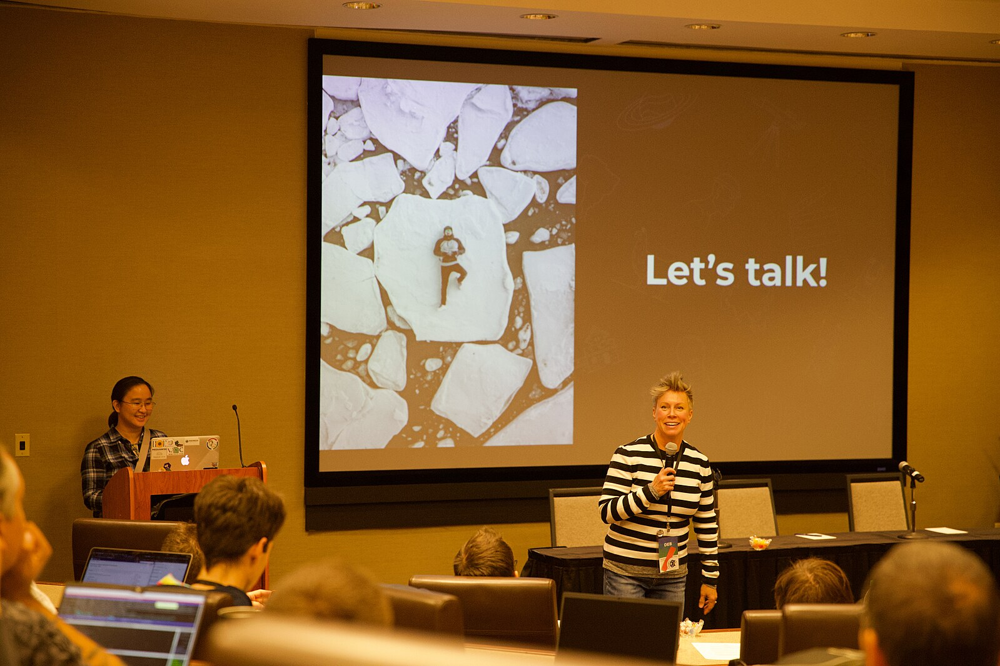

Nous savons à quel point il peut être difficile de faire le premier pas vers la prise de parole en public et de soumettre un résumé pour une conférence.

C'est pourquoi nous sommes ravis d'annoncer le lancement de l'initiative **la relance du système d'évaluation des résumés R-Ladies**!

Notre système met en relation les oratrices en herbe avec des évaluateurs qui leur fournissent des commentaires et des conseils, les aidant ainsi à affiner leurs résumés et leurs demandes de bourses.

**Légende :** Photo de la conférence technique Wikimedia 2019 par [Darenwelsh](#) est sous licence [CC BY-SA 4.0](https://creativecommons.org/licenses/by-sa/4.0/). Prise le 12 novembre 2019.

## Que fait le système d'examen des résumés ?

Des bénévoles expérimentés dans la prise de parole en public, la rédaction de résumés et les soumissions à des conférences examineront votre travail et vous donneront des conseils constructifs.

Qu'il s'agisse de votre premier résumé de conférence ou d'une demande de bourse, nous sommes là pour vous aider à briller.

## Qui peut en bénéficier ?

Ce service est ouvert à tous les membres de la communauté R-Ladies qui s'apprêtent à déposer une candidature :

- Des résumés de conférence : Pour des conférences comme posit::conf, EARL, UseR !, JSM, et d'autres.
- Demandes de bourses : Pour les possibilités de soutien à la participation à des conférences et à des événements.

## Comment ça marche

Soumettre une demande : Remplissez notre formulaire à l'adresse suivante <https://airtable.com/appJadVolZxoDGSIK/pagkXaAIuPged83dn/form> en précisant les détails de votre résumé ou de votre application et le type de commentaires que vous souhaitez recevoir.

Affectation d'un évaluateur : Nous vous assignerons un évaluateur en fonction de vos besoins et de vos préférences.

Recevoir des commentaires : Vous recevrez des commentaires utiles pour affiner votre soumission.

C'est aussi simple que cela !

**Conseil de pro : Soumettez votre demande au moins trois semaines avant la date limite de la conférence afin de disposer de suffisamment de temps pour l'examiner et la réviser.**

## Nous avons aussi besoin de réviseurs !

Avez-vous de l'expérience en matière d'art oratoire, de rédaction de résumés ou d'évaluation ?
Pensez à rejoindre notre formidable équipe de réviseurs !
Le bénévolat est un moyen souple et gratifiant de soutenir notre mission et de rendre service à la communauté.
S'inscrire [ici](https://airtable.com/appJadVolZxoDGSIK/pag4bpfeGIATQFefk/form).
