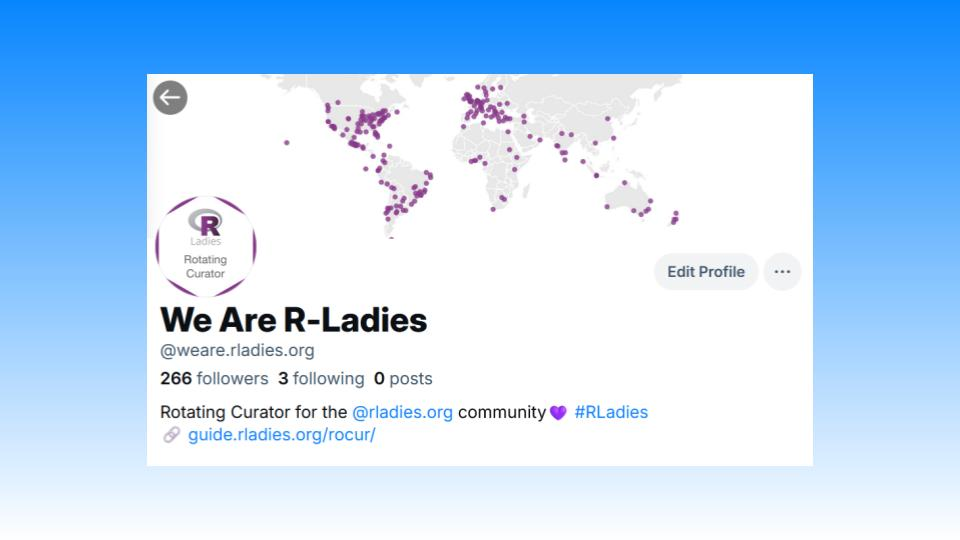

Estamos encantados de anunciar la cuenta de R-Ladies Rotating Curation (RoCur) en Bluesky. [bsky.app/profile/weare.rladies.org](https://bsky.app/profile/weare.rladies.org)ya está activa.
Cada semana, un nuevo miembro de la comunidad R-Ladies se hará cargo de la cuenta para hablar de todo lo relacionado con R.
Esta será una oportunidad fantástica para las personas que se identifican como una minoría de género en la comunidad R para amplificar sus voces y conectarse con otros en la gran comunidad de la ciencia de datos.

## Historia

Algunos de ustedes recordarán la cuenta RoCur en Twitter.
El programa funcionó durante unos cinco años, dando a más de 100 comisarios la oportunidad de hacerse cargo de la cuenta y compartir sus historias.
Aunque la cuenta de Twitter ya no está activa, el archivo de publicaciones aún puede consultarse. [en](https://rladies.org/tweet-archive/wearerladies/).

## Cómo ayudar

Estamos encantados de revivir el programa RoCur en Bluesky, retomándolo donde lo dejamos.
Puedes ayudarnos a reconstruir la comunidad con más fuerza que nunca inscribiéndote como conservador o nominando a alguien para que lo sea.

## Conviértete en conservador

\*El comisariado es una forma estupenda de compartir y aprender nuevas técnicas de R, aumentar tu presencia en las redes sociales, desarrollar tus habilidades de comunicación científica y conectar con una comunidad que te apoya.
Damos la bienvenida a conservadores de todos los niveles de experiencia y perfiles profesionales.
La curaduría puede realizarse en cualquier idioma; ¡las publicaciones no están restringidas al inglés!

Inscríbase como conservador en [@weare.rladies.org Formulario de inscripción para conservadores](https://airtable.com/appjkZZgtF0iEWFjx/pagqsAma1WmUYxa9j/form).
Actualmente buscamos comisarios hasta mediados de 2025, y abriremos más plazas a medida que avance el año.

## Nomine a alguien

\*Tal vez un colega, alguien de tu sección local de R-Ladies o un usuario que no te cansas de ver en Bluesky.
Puedes ayudarnos a identificar a fantásticos conservadores nominándolos.
Envíe sus nominaciones a [@weare.rladies.org Formulario de nominación de conservadores](https://airtable.com/appFIBzsk2AxWlGMt/pagfezjuCxohikOOa/form).
Puede nominar a tantas personas como desee, así que no dude en compartir esta oportunidad.

## ¿Tiene alguna pregunta?

Puede visitar la [Guía RoCur de R-Ladies](https://guide.rladies.org/rocur/about/)para saber más sobre la iniciativa.
Si tiene alguna pregunta, no dude en ponerse en contacto con los administradores de RoCur en [weare@rladies.org](mailto:weare@rladies.org) o envíe un mensaje a **\#rocur** en el canal [Slack de la Comunidad de R-Ladies](https://rladies.org/form/community-slack/).
