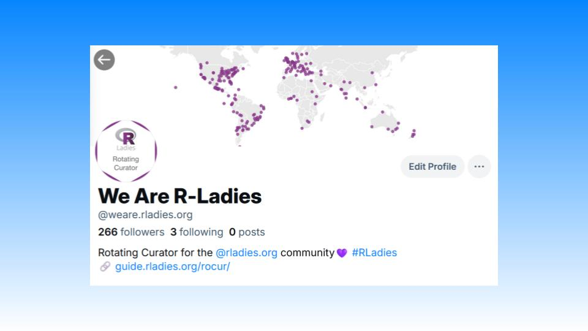

É com grande entusiasmo que anunciamos a conta Bluesky da Curadoria Rotativa R-Ladies (RoCur) [bsky.app/profile/weare.rladies.org](https://bsky.app/profile/weare.rladies.org)já está ativa!
Todas as semanas, um novo membro da comunidade R-Ladies assumirá o controlo da conta para falar sobre tudo o que diz respeito ao R.
Esta será uma oportunidade fantástica para as pessoas que se identificam como um género minoritário na comunidade R amplificarem as suas vozes e ligarem-se a outras pessoas na grande comunidade de ciência de dados.

## História

Alguns de vós devem lembrar-se da conta RoCur no Twitter.
O programa decorreu durante cerca de cinco anos, dando a mais de 100 curadores a oportunidade de assumir a conta e partilhar as suas histórias.
Embora a conta do Twitter já não esteja ativa, o arquivo de mensagens ainda pode ser [visualizado](https://rladies.org/tweet-archive/wearerladies/).

## Como pode ajudar

Estamos entusiasmados por reavivar o programa RoCur na Bluesky, retomando-o onde o deixámos.
Podes ajudar-nos a reconstruir a comunidade mais forte do que nunca, inscrevendo-te como curador ou nomeando alguém para ser curador!

## Tornar-se um curador

\*Está interessado em tornar-se curador?
\*A curadoria é uma excelente forma de partilhar e aprender novas técnicas de R, de construir a sua presença nas redes sociais, de desenvolver as suas capacidades de comunicação científica e de se ligar a uma comunidade que o apoia.
Damos as boas-vindas a curadores de todos os níveis de experiência e antecedentes profissionais.
A curadoria pode ser efectuada em qualquer língua; as mensagens não estão limitadas ao inglês!

Inscreva-se para ser um curador na [@weare.rladies.org Formulário de inscrição de curador](https://airtable.com/appjkZZgtF0iEWFjx/pagqsAma1WmUYxa9j/form).
Estamos atualmente à procura de curadores até meados de 2025 e abriremos mais vagas à medida que o ano avança.

## Nomear alguém

\*Conheces alguém que seria um ótimo curador?
\*Talvez um colega, alguém da sua secção local de R-Ladies ou um utilizador que não se farta de ver no Bluesky!
Pode ajudar-nos a identificar curadores fantásticos nomeando-os.
Submete as tuas nomeações na página [ Formulário de nomeação de curadores @weare.rladies.org](https://airtable.com/appFIBzsk2AxWlGMt/pagfezjuCxohikOOa/form).
Pode nomear tantas pessoas quantas desejar, por isso não hesite em partilhar esta oportunidade.

## Tem perguntas?

Pode visitar o [Guia R-Ladies RoCur](https://guide.rladies.org/rocur/about/)para saber mais sobre a iniciativa.
Se tiver alguma dúvida, não hesite em contactar os administradores do RoCur em [weare@rladies.org](mailto:weare@rladies.org) ou enviar uma mensagem no sítio **\#rocur** no canal [Slack da Comunidade R-Ladies](https://rladies.org/form/community-slack/).
