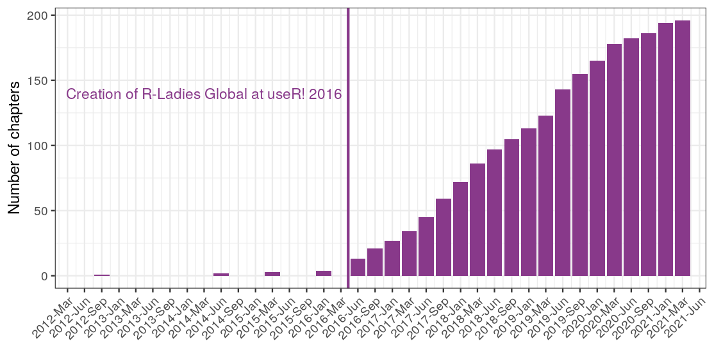

We are excited to announce that R-Ladies Global turns five this month! It’s been an incredible journey. 
Do you want to know how it all started? You can read about our history [here](https://rladies.org/about-us/history/). 
With this post we would like to celebrate our achievements and tell you why we are so proud of our amazing community!  

Little did we know five years ago that a community of only four chapters would inspire so many around the world. 
And here we are, counting over 200 chapters in 2021! 
The graph below shows the growth of new chapters over time.

#### Where Are We Now

After five years, R-Ladies Global is supporting ~200 chapters in cities worldwide, and continuing to grow. 
In March 2020 when the global Covid-19 pandemic began, R-Ladies quickly pivoted to online events and a new phase of increased interconnectivity began. 
With all the events now online, it has become easy to join events all over the world instead of being limited to events in your local chapters. 
We also started a [YouTube channel](https://www.youtube.com/channel/UCDgj5-mFohWZ5irWSFMFcng) where you can find many videos of our online meetups since the pandemic started.
However, the pandemic has taken a toll on our community, with many of our members personally affected. 
R-Ladies Global, the non-profit, also shifted into a [“Reduced Service Mode”](https://blog.rladies.org/post/2020-11-23-reduced-service-note/), so we can limit the workload on our volunteers while still supporting basic services to keep our chapters running (e.g. setting up new chapters & hosting events online).
We look forward to hosting in-person events in the future, however, we aim to keep our events as accessible as possible and will encourage chapters to keep an online component moving forward. 

You can join a chapter on [meetup.com](https://www.meetup.com/pro/rladies/) - and if you are interested in starting a chapter, please check out our [guide](https://guide.rladies.org/)!

